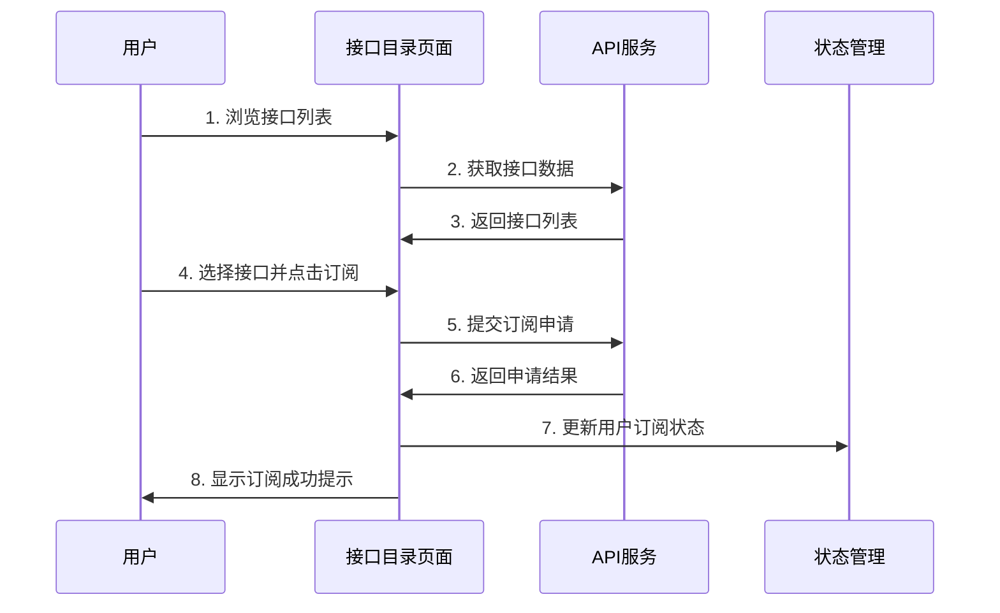
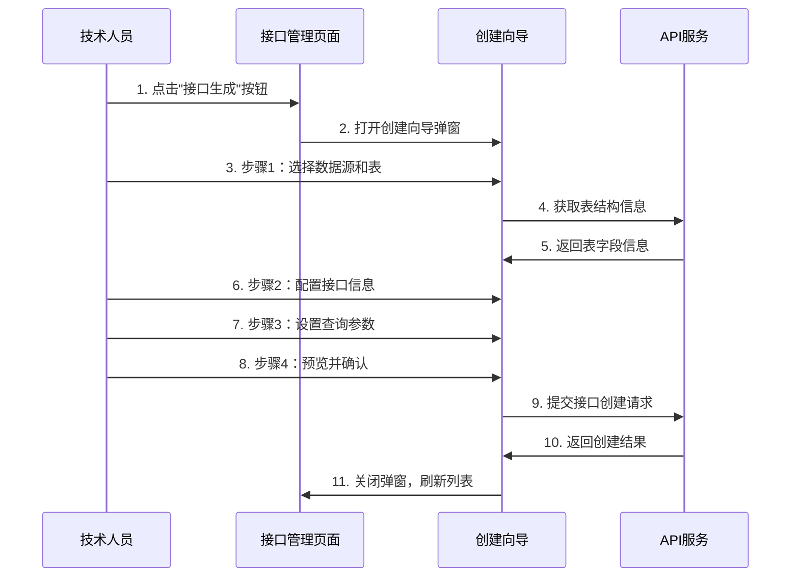

# 电力交易中心接口服务平台前端开发文档 v1.0

## 版本信息

| 版本号  | 发布日期       | 更新内容            | 维护人员 |
| ---- | ---------- | --------------- | ---- |
| v1.0 | 2024-01-15 | 初始版本，包含核心前端功能实现 | 前端团队 |

---

## 1. 前端技术架构

### 1.1 技术栈

- **框架**: Vue.js 3.x + Composition API
- **路由**: Vue Router 4.x
- **状态管理**: Pinia (替代 Vuex)
- **UI组件库**: Element Plus
- **构建工具**: Vite
- **样式预处理**: SCSS
- **HTTP客户端**: Axios
- **类型检查**: TypeScript

### 1.2 项目结构

```
src/
├── api/                    # API接口定义
│   ├── approval.ts         # 审批相关接口
│   ├── interface.ts        # 接口管理相关接口
│   ├── statistics.ts       # 统计数据接口
│   ├── system.ts          # 系统管理接口
│   └── user.ts            # 用户相关接口
├── assets/                 # 静态资源
│   ├── styles/            # 样式文件
│   │   ├── components.css  # 组件样式
│   │   ├── reset.css      # 重置样式
│   │   ├── utilities.css  # 工具类样式
│   │   └── variables.css  # CSS变量
│   ├── base.css           # 基础样式
│   ├── main.css           # 主样式文件
│   └── logo.svg           # Logo图标
├── components/             # 公共组件
│   ├── system/            # 系统管理组件
│   │   ├── DatasourceManagement.vue
│   │   ├── OperationLog.vue
│   │   ├── RoleManagement.vue
│   │   ├── SystemConfig.vue
│   │   ├── SystemMonitor.vue
│   │   └── UserManagement.vue
│   ├── CategoryManagement.vue      # 分类管理
│   ├── InterfaceCreationWizard.vue # 接口创建向导
│   ├── InterfaceDetail.vue         # 接口详情
│   ├── InterfaceEditDialog.vue     # 接口编辑对话框
│   ├── InterfaceStats.vue          # 接口统计
│   └── InterfaceTestDialog.vue     # 接口测试对话框
├── router/                 # 路由配置
│   └── index.ts
├── stores/                 # 状态管理
│   ├── counter.ts         # 计数器状态
│   └── user.ts            # 用户状态
├── utils/                  # 工具函数
│   └── request.ts         # HTTP请求封装
├── views/                  # 页面组件
│   ├── ApplicationApproval.vue     # 申请审批页面
│   ├── DataStatistics.vue         # 数据统计页面
│   ├── InterfaceCatalog.vue        # 接口目录页面
│   ├── InterfaceDetail.vue         # 接口详情页面
│   ├── InterfaceManagement.vue     # 接口管理页面
│   ├── Login.vue                   # 登录页面
│   ├── Register.vue                # 注册页面
│   ├── SystemManagement.vue        # 系统管理页面
│   ├── UserCenter.vue              # 用户中心页面
│   ├── 403.vue                     # 403错误页面
│   └── 404.vue                     # 404错误页面
├── App.vue                 # 根组件
└── main.ts                 # 入口文件
```

## 2. 页面设计方案

### 2.1 整体布局设计

**主布局结构**：
- 顶部导航栏：Logo + 主导航菜单 + 用户信息
- 侧边栏：二级导航菜单（可折叠）
- 主内容区：页面内容展示
- 底部：版权信息

**响应式设计**：
- 桌面端：>=1200px，完整布局
- 平板端：768px-1199px，侧边栏自动折叠
- 移动端：<768px，侧边栏隐藏，顶部导航简化

### 2.2 核心页面设计

#### 2.2.1 接口目录页面 (InterfaceCatalog.vue)

**布局结构**：
```
┌─────────────────────────────────────────────────────────┐
│ 顶部搜索栏 + 批量操作按钮                                      │
├─────────────┬───────────────────────────────────────────┤
│             │ 接口列表区域                                  │
│ 左侧分类树    │ ┌─────────────────────────────────────────┐ │
│             │ │ 接口卡片1 [订阅按钮]                        │ │
│ - 日前现货    │ ├─────────────────────────────────────────┤ │
│ - 预测       │ │ 接口卡片2 [订阅按钮]                        │ │
│ - 辅助服务    │ ├─────────────────────────────────────────┤ │
│ - 电网运行    │ │ 接口卡片3 [订阅按钮]                        │ │
│             │ └─────────────────────────────────────────┘ │
│             │ 分页组件                                      │
└─────────────┴───────────────────────────────────────────┘
```

**组件结构**：
```vue
<template>
  <div class="interface-catalog">
    <!-- 顶部操作区 -->
    <div class="catalog-header">
      <el-input 
        v-model="searchKeyword" 
        placeholder="搜索接口名称或描述"
        class="search-input">
        <template #prefix>
          <el-icon><Search /></el-icon>
        </template>
      </el-input>
      
      <div class="batch-actions">
        <el-button 
          type="primary" 
          :disabled="selectedInterfaces.length === 0"
          @click="handleBatchSubscribe">
          批量订阅 ({{selectedInterfaces.length}})
        </el-button>
        <el-button @click="clearSelection">清空选择</el-button>
      </div>
    </div>
    
    <div class="catalog-content">
      <!-- 左侧分类树 -->
      <div class="category-sidebar">
        <el-tree
          :data="categoryTree"
          :props="treeProps"
          node-key="id"
          :current-node-key="currentCategoryId"
          @node-click="handleCategoryClick"
          class="category-tree">
          <template #default="{ node, data }">
            <span class="category-node">
              <span 
                class="category-color" 
                :style="{ backgroundColor: data.color }"></span>
              <span class="category-name">{{ data.name }}</span>
              <span class="category-count">({{ data.count }})</span>
            </span>
          </template>
        </el-tree>
      </div>
      
      <!-- 右侧接口列表 -->
      <div class="interface-list">
        <div class="list-header">
          <span class="result-count">共 {{ totalCount }} 个接口</span>
          <el-select v-model="sortBy" placeholder="排序方式">
            <el-option label="创建时间" value="create_time" />
            <el-option label="接口名称" value="name" />
            <el-option label="调用次数" value="call_count" />
          </el-select>
        </div>
        
        <div class="interface-cards">
          <div 
            v-for="interface in interfaceList" 
            :key="interface.id"
            class="interface-card"
            :class="{ selected: selectedInterfaces.includes(interface.id) }">
            
            <div class="card-header">
              <el-checkbox 
                :model-value="selectedInterfaces.includes(interface.id)"
                @change="handleInterfaceSelect(interface.id, $event)" />
              <span class="interface-name">{{ interface.name }}</span>
              <el-tag 
                :color="getCategoryColor(interface.categoryId)"
                size="small">
                {{ getCategoryName(interface.categoryId) }}
              </el-tag>
            </div>
            
            <div class="card-content">
              <p class="interface-description">{{ interface.description }}</p>
              <div class="interface-meta">
                <span class="meta-item">
                  <el-icon><Clock /></el-icon>
                  {{ formatDate(interface.createTime) }}
                </span>
                <span class="meta-item">
                  <el-icon><View /></el-icon>
                  {{ interface.callCount }} 次调用
                </span>
              </div>
            </div>
            
            <div class="card-actions">
              <el-button size="small" @click="viewInterfaceDetail(interface.id)">
                查看详情
              </el-button>
              <el-button 
                type="primary" 
                size="small"
                :disabled="interface.subscribed"
                @click="subscribeInterface(interface.id)">
                {{ interface.subscribed ? '已订阅' : '订阅' }}
              </el-button>
            </div>
          </div>
        </div>
        
        <!-- 分页 -->
        <el-pagination
          v-model:current-page="currentPage"
          v-model:page-size="pageSize"
          :total="totalCount"
          :page-sizes="[10, 20, 50, 100]"
          layout="total, sizes, prev, pager, next, jumper"
          @size-change="handleSizeChange"
          @current-change="handleCurrentChange" />
      </div>
    </div>
  </div>
</template>
```

#### 2.2.2 接口管理页面 (InterfaceManagement.vue)

**布局结构**：
```
┌─────────────────────────────────────────────────────────┐
│ 顶部操作区：[接口生成] [批量上架] [批量下架]                      │
├─────────────────────────────────────────────────────────┤
│ 筛选条件：状态筛选 + 分类筛选 + 搜索框                          │
├─────────────────────────────────────────────────────────┤
│ 接口列表表格                                               │
│ ┌─────┬──────┬──────┬──────┬──────┬──────┬──────┐        │
│ │选择 │接口名称│状态   │分类   │创建人 │创建时间│操作   │        │
│ ├─────┼──────┼──────┼──────┼──────┼──────┼──────┤        │
│ │ □   │API-1 │已上架 │日前现货│张三   │2024-01│编辑/下架│        │
│ │ □   │API-2 │未上架 │预测   │李四   │2024-01│编辑/上架│        │
│ └─────┴──────┴──────┴──────┴──────┴──────┴──────┘        │
├─────────────────────────────────────────────────────────┤
│ 分页组件                                                  │
└─────────────────────────────────────────────────────────┘
```

**权限控制逻辑**：
```typescript
// 权限控制 Composable
export function usePermissions() {
  const userStore = useUserStore()
  
  const hasPermission = (permission: string): boolean => {
    const userRole = userStore.user?.role
    
    const permissions = {
      'interface.create': ['tech', 'admin'],
      'interface.publish': ['settlement', 'admin'],
      'interface.unpublish': ['settlement', 'admin'],
      'interface.edit': ['tech', 'settlement', 'admin'],
      'interface.delete': ['admin'],
      'application.approve': ['settlement', 'admin']
    }
    
    return permissions[permission]?.includes(userRole) || false
  }
  
  return {
    hasPermission
  }
}
```

#### 2.2.3 接口创建向导 (InterfaceCreationWizard.vue)

**步骤式设计**：
```
步骤1: 数据源选择
┌─────────────────────────────────────────────────────────┐
│ 选择数据源：[下拉选择] [测试连接]                              │
│ 选择数据表：[表格展示可用表] [预览表结构]                       │
└─────────────────────────────────────────────────────────┘

步骤2: 接口配置
┌─────────────────────────────────────────────────────────┐
│ 接口名称：[输入框]                                          │
│ 接口路径：[输入框] (自动生成)                                │
│ 接口描述：[文本域]                                          │
│ 分类选择：[下拉选择]                                        │
│ 请求方法：[单选] GET/POST                                  │
└─────────────────────────────────────────────────────────┘

步骤3: 参数设置
┌─────────────────────────────────────────────────────────┐
│ 查询参数配置：                                             │
│ [+ 添加参数] [参数名] [参数类型] [是否必需] [默认值] [删除]      │
│ 响应格式预览：[JSON格式展示]                                │
└─────────────────────────────────────────────────────────┘

步骤4: 预览确认
┌─────────────────────────────────────────────────────────┐
│ 接口信息汇总展示                                           │
│ SQL预览                                                  │
│ [测试接口] [确认创建] [返回修改]                             │
└─────────────────────────────────────────────────────────┘
```

### 2.3 组件交互逻辑

#### 2.3.1 接口订阅流程



#### 2.3.2 接口生成流程



## 3. UI设计规范

### 3.1 设计风格

**整体风格**：现代简约、专业商务

**色彩规范**：
- 主色调：#1890ff (蓝色)
- 辅助色：#52c41a (绿色)、#faad14 (橙色)、#f5222d (红色)
- 中性色：#000000、#262626、#595959、#8c8c8c、#bfbfbf、#d9d9d9、#f0f0f0、#fafafa、#ffffff

**字体规范**：
- 主字体：-apple-system, BlinkMacSystemFont, 'Segoe UI', Roboto, 'Helvetica Neue', Arial, sans-serif
- 代码字体：'SFMono-Regular', Consolas, 'Liberation Mono', Menlo, Courier, monospace

**字号规范**：
- 标题：24px (h1)、20px (h2)、16px (h3)、14px (h4)
- 正文：14px (常规)、12px (辅助信息)
- 按钮：14px (大按钮)、12px (小按钮)

### 3.2 组件样式规范

**按钮样式**：
```scss
// 主要按钮
.el-button--primary {
  background-color: #1890ff;
  border-color: #1890ff;
  border-radius: 6px;
  
  &:hover {
    background-color: #40a9ff;
    border-color: #40a9ff;
  }
}

// 成功按钮
.el-button--success {
  background-color: #52c41a;
  border-color: #52c41a;
}

// 警告按钮
.el-button--warning {
  background-color: #faad14;
  border-color: #faad14;
}

// 危险按钮
.el-button--danger {
  background-color: #f5222d;
  border-color: #f5222d;
}
```

**卡片样式**：
```scss
.interface-card {
  border: 1px solid #d9d9d9;
  border-radius: 8px;
  padding: 16px;
  margin-bottom: 16px;
  background: #ffffff;
  transition: all 0.3s;
  
  &:hover {
    border-color: #1890ff;
    box-shadow: 0 2px 8px rgba(0, 0, 0, 0.1);
  }
  
  &.selected {
    border-color: #1890ff;
    background-color: #f6ffed;
  }
}
```

**表格样式**：
```scss
.el-table {
  .el-table__header {
    background-color: #fafafa;
    
    th {
      background-color: #fafafa;
      color: #262626;
      font-weight: 600;
    }
  }
  
  .el-table__row {
    &:hover {
      background-color: #f5f5f5;
    }
  }
}
```

### 3.3 状态标识规范

**接口状态标签**：
```typescript
const statusConfig = {
  unpublished: {
    label: '未上架',
    type: 'info',
    color: '#8c8c8c'
  },
  published: {
    label: '已上架',
    type: 'success',
    color: '#52c41a'
  },
  offline: {
    label: '已下架',
    type: 'warning',
    color: '#faad14'
  }
}
```

**申请状态标签**：
```typescript
const applicationStatusConfig = {
  pending: {
    label: '待审批',
    type: 'warning',
    color: '#faad14'
  },
  approved: {
    label: '已通过',
    type: 'success',
    color: '#52c41a'
  },
  rejected: {
    label: '已拒绝',
    type: 'danger',
    color: '#f5222d'
  }
}
```

## 4. 前端部署配置

### 4.1 开发环境配置

**环境变量配置** (`.env.development`)：
```bash
# 开发环境配置
VITE_APP_TITLE=电力交易中心接口服务平台
VITE_APP_ENV=development
VITE_APP_BASE_API=http://localhost:8080
VITE_APP_UPLOAD_URL=http://localhost:8080/upload

# 接口服务地址
VITE_APP_INTERFACE_SERVICE=http://localhost:8087
VITE_APP_USER_SERVICE=http://localhost:8086
VITE_APP_APPROVAL_SERVICE=http://localhost:8088

# 开发工具配置
VITE_APP_MOCK=false
VITE_APP_DEBUG=true
```

**Vite配置** (`vite.config.ts`)：
```typescript
import { defineConfig } from 'vite'
import vue from '@vitejs/plugin-vue'
import { resolve } from 'path'

export default defineConfig({
  plugins: [vue()],
  resolve: {
    alias: {
      '@': resolve(__dirname, 'src')
    }
  },
  server: {
    port: 5173,
    host: '0.0.0.0',
    proxy: {
      '/api': {
        target: 'http://localhost:8080',
        changeOrigin: true,
        rewrite: (path) => path.replace(/^\/api/, '')
      }
    }
  },
  build: {
    outDir: 'dist',
    assetsDir: 'assets',
    sourcemap: false,
    rollupOptions: {
      output: {
        chunkFileNames: 'js/[name]-[hash].js',
        entryFileNames: 'js/[name]-[hash].js',
        assetFileNames: '[ext]/[name]-[hash].[ext]'
      }
    }
  }
})
```

### 4.2 生产环境配置

**环境变量配置** (`.env.production`)：
```bash
# 生产环境配置
VITE_APP_TITLE=电力交易中心接口服务平台
VITE_APP_ENV=production
VITE_APP_BASE_API=https://api.powertrading.com
VITE_APP_UPLOAD_URL=https://api.powertrading.com/upload

# 接口服务地址
VITE_APP_INTERFACE_SERVICE=https://api.powertrading.com/interface-service
VITE_APP_USER_SERVICE=https://api.powertrading.com/user-service
VITE_APP_APPROVAL_SERVICE=https://api.powertrading.com/approval-service

# 生产环境配置
VITE_APP_MOCK=false
VITE_APP_DEBUG=false
```

**Nginx配置**：
```nginx
server {
    listen 80;
    server_name interface-platform.powertrading.com;
    root /var/www/interface-platform/dist;
    index index.html;
    
    # 静态资源缓存
    location ~* \.(js|css|png|jpg|jpeg|gif|ico|svg)$ {
        expires 1y;
        add_header Cache-Control "public, immutable";
    }
    
    # API代理
    location /api/ {
        proxy_pass http://localhost:8080/;
        proxy_set_header Host $host;
        proxy_set_header X-Real-IP $remote_addr;
        proxy_set_header X-Forwarded-For $proxy_add_x_forwarded_for;
        proxy_set_header X-Forwarded-Proto $scheme;
    }
    
    # SPA路由支持
    location / {
        try_files $uri $uri/ /index.html;
    }
    
    # 安全头设置
    add_header X-Frame-Options DENY;
    add_header X-Content-Type-Options nosniff;
    add_header X-XSS-Protection "1; mode=block";
}
```

### 4.3 构建部署流程

**构建脚本** (`package.json`)：
```json
{
  "scripts": {
    "dev": "vite",
    "build": "vue-tsc --noEmit && vite build",
    "build:dev": "vue-tsc --noEmit && vite build --mode development",
    "build:prod": "vue-tsc --noEmit && vite build --mode production",
    "preview": "vite preview",
    "lint": "eslint src --ext .vue,.js,.jsx,.cjs,.mjs,.ts,.tsx,.cts,.mts --fix",
    "type-check": "vue-tsc --noEmit"
  }
}
```

**Docker部署配置**：
```dockerfile
# 构建阶段
FROM node:18-alpine as build-stage
WORKDIR /app
COPY package*.json ./
RUN npm ci --only=production
COPY . .
RUN npm run build:prod

# 生产阶段
FROM nginx:alpine as production-stage
COPY --from=build-stage /app/dist /usr/share/nginx/html
COPY nginx.conf /etc/nginx/conf.d/default.conf
EXPOSE 80
CMD ["nginx", "-g", "daemon off;"]
```

## 5. 开发规范

### 5.1 代码规范

**Vue组件规范**：
```vue
<template>
  <!-- 模板内容 -->
</template>

<script setup lang="ts">
// 导入顺序：Vue相关 -> 第三方库 -> 本地组件 -> 工具函数
import { ref, reactive, computed, onMounted } from 'vue'
import { ElMessage } from 'element-plus'
import SomeComponent from '@/components/SomeComponent.vue'
import { someApi } from '@/api/some'

// 接口定义
interface FormData {
  name: string
  description: string
}

// 响应式数据
const formData = reactive<FormData>({
  name: '',
  description: ''
})

// 计算属性
const isFormValid = computed(() => {
  return formData.name.trim() !== '' && formData.description.trim() !== ''
})

// 方法定义
const handleSubmit = async () => {
  try {
    await someApi(formData)
    ElMessage.success('操作成功')
  } catch (error) {
    ElMessage.error('操作失败')
  }
}

// 生命周期
onMounted(() => {
  // 初始化逻辑
})
</script>

<style scoped lang="scss">
// 样式定义
</style>
```

**TypeScript类型定义**：
```typescript
// types/interface.ts
export interface InterfaceInfo {
  id: string
  name: string
  path: string
  description: string
  categoryId: string
  status: 'unpublished' | 'published' | 'offline'
  createTime: string
  updateTime: string
}

export interface InterfaceListParams {
  page: number
  size: number
  keyword?: string
  categoryId?: string
  status?: string
}

export interface ApiResponse<T> {
  success: boolean
  data: T
  message: string
  errorCode?: string
}
```

### 5.2 性能优化

**组件懒加载**：
```typescript
// router/index.ts
const routes = [
  {
    path: '/interface/catalog',
    name: 'InterfaceCatalog',
    component: () => import('@/views/InterfaceCatalog.vue')
  },
  {
    path: '/interface/management',
    name: 'InterfaceManagement',
    component: () => import('@/views/InterfaceManagement.vue')
  }
]
```

**图片懒加载**：
```vue
<template>
  
</template>
```

**虚拟滚动**：
```vue
<template>
  <el-virtual-list
    :data="largeDataList"
    :height="400"
    :item-size="50"
    v-slot="{ item, index }">
    <div class="list-item">{{ item.name }}</div>
  </el-virtual-list>
</template>
```

### 5.3 错误处理

**全局错误处理**：
```typescript
// main.ts
app.config.errorHandler = (err, vm, info) => {
  console.error('Vue Error:', err, info)
  // 发送错误报告到监控系统
}

// HTTP错误处理
axios.interceptors.response.use(
  response => response,
  error => {
    if (error.response?.status === 401) {
      // 未授权，跳转登录
      router.push('/login')
    } else if (error.response?.status === 403) {
      // 无权限，显示403页面
      router.push('/403')
    } else {
      ElMessage.error(error.message || '网络错误')
    }
    return Promise.reject(error)
  }
)
```

**组件错误边界**：
```vue
<template>
  <div v-if="hasError" class="error-boundary">
    <h3>组件加载失败</h3>
    <p>{{ errorMessage }}</p>
    <el-button @click="retry">重试</el-button>
  </div>
  <slot v-else />
</template>

<script setup lang="ts">
import { ref, onErrorCaptured } from 'vue'

const hasError = ref(false)
const errorMessage = ref('')

onErrorCaptured((error) => {
  hasError.value = true
  errorMessage.value = error.message
  return false
})

const retry = () => {
  hasError.value = false
  errorMessage.value = ''
}
</script>
```

---

## 总结

本文档详细描述了电力交易中心接口服务平台的前端开发规范、页面设计方案、组件架构和部署配置。开发团队应严格按照本文档进行前端开发工作，确保代码质量和用户体验的一致性。

文档将随着项目发展持续更新，请开发人员及时关注版本变更。