# 电力交易中心接口服务平台技术架构文档 v1.0

## 版本信息

| 版本号  | 发布日期       | 更新内容                  | 维护人员 |
| ---- | ---------- | --------------------- | ---- |
| v1.0 | 2024-01-15 | 初始技术架构设计，对应PRD v1.0功能 | 技术团队 |

## 版本对应关系

**技术架构 v1.0 对应 PRD v1.0**：

* ✅ 接口目录浏览与订阅技术实现

* ✅ 接口生成与管理技术架构

* ✅ 订阅申请审批技术流程

* ✅ 用户中心技术实现

* 🚫 接口监控技术架构（v2.0实现）

* 🚫 日志审计技术方案（v2.0实现）

* 🚫 计费管理技术方案（暂不实现）

***

## 1. 架构设计

### 1.1 整体架构图

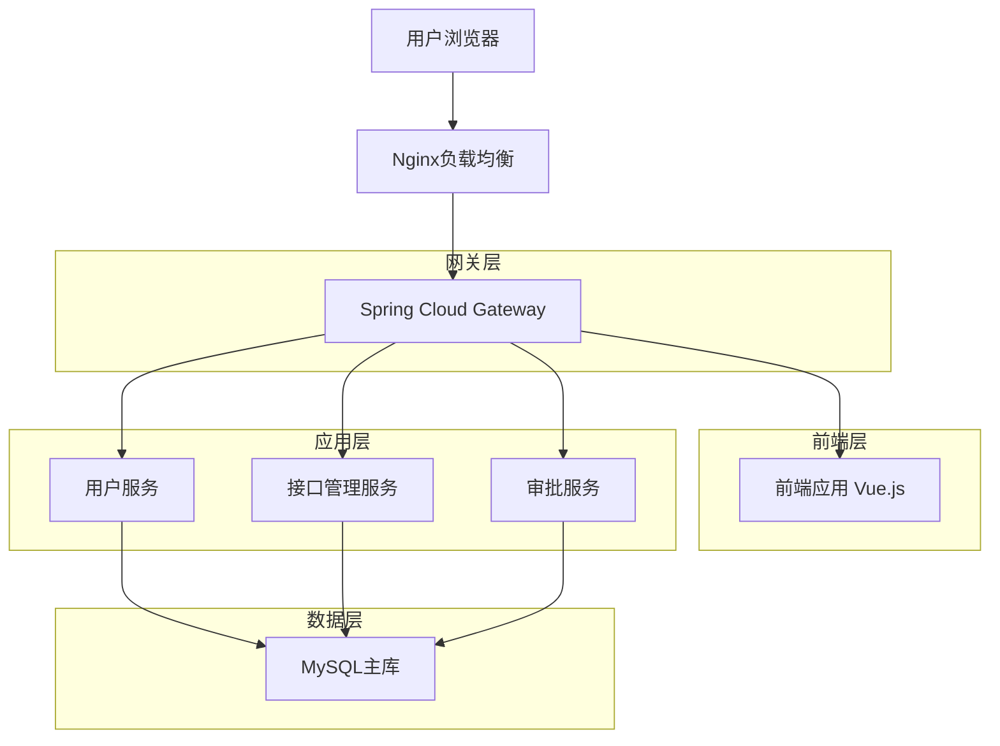
```mermaid
graph TD
    A[用户浏览器] --> B[Nginx负载均衡]
    B --> C[Spring Cloud Gateway]
    C --> D[前端应用 Vue.js]
    C --> E[用户服务]
    C --> F[接口管理服务]
    C --> G[审批服务]
    
    E --> J[MySQL主库]
    F --> J
    G --> J
    
    subgraph "前端层"
        D
    end
    
    subgraph "网关层"
        C
    end
    
    subgraph "应用层"
        E
        F
        G
    end
    
    subgraph "数据层"
        J
    end
```

### 1.2 架构特点

* **微服务架构**：采用Spring Cloud微服务架构，服务间通过HTTP REST API通信

* **前后端分离**：Vue.js前端 + Spring Boot后端，通过RESTful API交互

* **统一网关**：Spring Cloud Gateway作为统一入口，处理路由、认证、限流

* **读写分离**：MySQL主从架构，读写分离提升数据库性能

## 2. 技术栈说明

### 2.1 前端技术栈

* **框架**：Vue.js 3.x + Vue Router + Vuex

* **UI组件库**：Element Plus

* **构建工具**：Vite

* **样式**：SCSS + CSS3

* **HTTP客户端**：Axios

#### 2.1.1 前端权限控制实现

**组件级权限控制**：

```javascript
// 接口管理页面组件权限控制
<template>
  <div class="interface-management">
    <!-- 顶部操作区 - 三个按钮水平排列 -->
    <div class="operation-bar">
      <!-- 接口生成按钮 - 仅技术部可见 -->
      <el-button 
        v-if="hasPermission('tech')" 
        type="primary" 
        @click="handleCreateInterface">
        接口生成
      </el-button>
      
      <!-- 上架按钮 - 仅结算部可见 -->
      <el-button 
        v-if="hasPermission('settlement')" 
        type="success" 
        @click="handlePublishInterface">
        上架
      </el-button>
      
      <!-- 下架按钮 - 仅结算部可见 -->
      <el-button 
        v-if="hasPermission('settlement')" 
        type="warning" 
        @click="handleUnpublishInterface">
        下架
      </el-button>
    </div>
    
    <!-- 接口列表 -->
    <interface-list />
    
    <!-- 接口生成弹窗 -->
    <interface-creation-dialog 
      v-model="showCreationDialog"
      @success="handleCreationSuccess" />
  </div>
</template>

<script>
export default {
  data() {
    return {
      showCreationDialog: false
    }
  },
  methods: {
    // 权限检查方法
    hasPermission(role) {
      const userRole = this.$store.getters.userRole;
      return userRole === role || userRole === 'admin';
    },
    
    // 打开接口生成弹窗
    handleCreateInterface() {
      this.showCreationDialog = true;
    },
    
    // 接口生成成功回调
    handleCreationSuccess() {
      this.showCreationDialog = false;
      this.$message.success('接口生成成功，当前状态：未上架');
      this.refreshInterfaceList();
    }
  }
}
</script>
```

#### 2.1.2 接口生成弹窗组件设计

**组件结构**：

```javascript
// InterfaceCreationDialog.vue
<template>
  <el-dialog
    title="接口生成向导"
    v-model="visible"
    width="800px"
    :close-on-click-modal="false"
    :close-on-press-escape="false">
    
    <!-- 步骤导航条 -->
    <el-steps :active="currentStep" align-center class="step-nav">
      <el-step title="数据源选择" :status="getStepStatus(0)" />
      <el-step title="接口配置" :status="getStepStatus(1)" />
      <el-step title="参数设置" :status="getStepStatus(2)" />
      <el-step title="预览确认" :status="getStepStatus(3)" />
    </el-steps>
    
    <!-- 步骤内容区 -->
    <div class="step-content" v-loading="loading">
      <!-- 步骤1：数据源选择 -->
      <data-source-selection 
        v-if="currentStep === 0"
        v-model="formData.dataSource"
        @next="nextStep" />
      
      <!-- 步骤2：接口配置 -->
      <interface-configuration 
        v-if="currentStep === 1"
        v-model="formData.config"
        :data-source="formData.dataSource"
        @next="nextStep"
        @prev="prevStep" />
      
      <!-- 步骤3：参数设置 -->
      <parameter-settings 
        v-if="currentStep === 2"
        v-model="formData.parameters"
        @next="nextStep"
        @prev="prevStep" />
      
      <!-- 步骤4：预览确认 -->
      <preview-confirmation 
        v-if="currentStep === 3"
        :form-data="formData"
        @confirm="handleConfirm"
        @prev="prevStep" />
    </div>
    
    <!-- 底部操作栏 -->
    <template #footer>
      <div class="dialog-footer">
        <el-button @click="handleCancel">取消</el-button>
        <el-button 
          v-if="currentStep > 0" 
          @click="prevStep">上一步</el-button>
        <el-button 
          v-if="currentStep < 3" 
          type="primary" 
          @click="nextStep"
          :disabled="!canNextStep">下一步</el-button>
        <el-button 
          v-if="currentStep === 3" 
          type="primary" 
          @click="handleConfirm"
          :loading="submitting">生成接口</el-button>
      </div>
    </template>
  </el-dialog>
</template>

<script>
export default {
  name: 'InterfaceCreationDialog',
  props: {
    modelValue: Boolean
  },
  emits: ['update:modelValue', 'success'],
  data() {
    return {
      currentStep: 0,
      loading: false,
      submitting: false,
      formData: {
        dataSource: null,
        config: {},
        parameters: []
      }
    }
  },
  computed: {
    visible: {
      get() { return this.modelValue },
      set(val) { this.$emit('update:modelValue', val) }
    },
    canNextStep() {
      // 根据当前步骤验证是否可以进入下一步
      switch(this.currentStep) {
        case 0: return this.formData.dataSource?.table;
        case 1: return this.formData.config?.name && this.formData.config?.description;
        case 2: return true;
        default: return false;
      }
    }
  },
  methods: {
    getStepStatus(step) {
      if (step < this.currentStep) return 'finish';
      if (step === this.currentStep) return 'process';
      return 'wait';
    },
    
    nextStep() {
      if (this.currentStep < 3) {
        this.currentStep++;
      }
    },
    
    prevStep() {
      if (this.currentStep > 0) {
        this.currentStep--;
      }
    },
    
    async handleConfirm() {
      this.submitting = true;
      try {
        await this.createInterface();
        this.$emit('success');
      } catch (error) {
        this.$message.error('接口生成失败：' + error.message);
      } finally {
        this.submitting = false;
      }
    },
    
    async createInterface() {
      const response = await this.$api.interfaces.create({
        dataSource: this.formData.dataSource,
        config: this.formData.config,
        parameters: this.formData.parameters
      });
      return response.data;
    },
    
    handleCancel() {
      this.visible = false;
      this.resetForm();
    },
    
    resetForm() {
      this.currentStep = 0;
      this.formData = {
        dataSource: null,
        config: {},
        parameters: []
      };
    }
  }
}
</script>
```

**路由守卫权限控制**：

```javascript
// router/index.js
router.beforeEach((to, from, next) => {
  const userRole = store.getters.userRole;
  const requiredRole = to.meta.role;
  
  if (requiredRole && !checkPermission(userRole, requiredRole)) {
    next('/403'); // 无权限页面
  } else {
    next();
  }
});

function checkPermission(userRole, requiredRole) {
  const roleHierarchy = {
    'admin': ['admin', 'settlement', 'tech', 'consumer'],
    'settlement': ['settlement'],
    'tech': ['tech'],
    'consumer': ['consumer']
  };
  
  return roleHierarchy[userRole]?.includes(requiredRole);
}
```

### 2.2 后端技术栈

* **框架**：Spring Boot 2.7.x + Spring Cloud 2021.x

* **网关**：Spring Cloud Gateway

* **服务注册**：Nacos

* **配置中心**：Nacos Config

* **数据库**：MySQL 8.0（主从架构）

* **数据库连接池**：HikariCP连接池

* **ORM框架**：MyBatis Plus

* **安全框架**：Spring Security + JWT

### 2.3 运维技术栈

* **容器化**：Docker + Docker Compose

* **监控**：Prometheus + Grafana

* **日志**：ELK Stack（Elasticsearch + Logstash + Kibana）

* **负载均衡**：Nginx

## 3. 路由定义

### 3.1 前端路由

| 路由路径                  | 组件名称                | 功能描述  | 权限要求    |
| --------------------- | ------------------- | ----- | ------- |
| /                     | Dashboard           | 首页仪表板 | 已登录     |
| /login                | Login               | 用户登录  | 无       |
| /interface/catalog    | InterfaceCatalog    | 接口目录  | 所有用户    |
| /interface/management | InterfaceManagement | 接口管理  | 技术部/结算部 |
| /interface/detail/:id | InterfaceDetail     | 接口详情  | 所有用户    |
| /application/approval | ApplicationApproval | 申请审批  | 结算部     |
| /user/center          | UserCenter          | 用户中心  | 所有用户    |

### 3.2 后端API路由

| 服务名称              | 路由前缀                 | 功能描述   |
| ----------------- | -------------------- | ------ |
| user-service      | /api/v1/users        | 用户管理服务 |
| interface-service | /api/v1/interfaces   | 接口管理服务 |
| approval-service  | /api/v1/applications | 审批服务   |
| gateway-service   | /api/v1/gateway      | 网关管理服务 |

## 4. 核心业务技术时序图

### 4.1 用户登录认证时序图

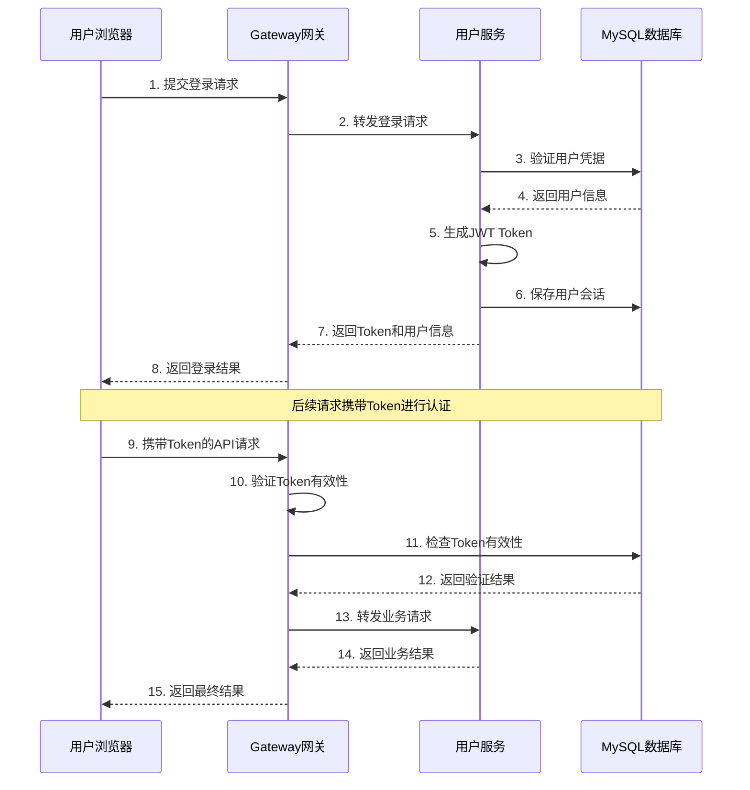
```mermaid
sequenceDiagram
    participant U as 用户浏览器
    participant G as Gateway网关
    participant US as 用户服务
    participant DB as MySQL数据库
    
    U->>G: 1. 提交登录请求
    G->>US: 2. 转发登录请求
    US->>DB: 3. 验证用户凭据
    DB-->>US: 4. 返回用户信息
    US->>US: 5. 生成JWT Token
    US->>DB: 6. 保存用户会话
    US-->>G: 7. 返回Token和用户信息
    G-->>U: 8. 返回登录结果
    
    Note over U,DB: 后续请求携带Token进行认证
    U->>G: 9. 携带Token的API请求
    G->>G: 10. 验证Token有效性
    G->>DB: 11. 检查Token有效性
    DB-->>G: 12. 返回验证结果
    G->>US: 13. 转发业务请求
    US-->>G: 14. 返回业务结果
    G-->>U: 15. 返回最终结果
```

### 4.2 统一接口配置规范实现

#### 4.2.1 接口路径规范化

**路径生成规则**：

```java
@Service
public class InterfacePathGenerator {
    
    private static final String PATH_PREFIX = "/px-phzhb-external-share/dataproduct/";
    
    public String generateInterfacePath(String interfaceName, String businessType) {
        // 根据接口名称和业务类型生成标准路径
        String pathSuffix = generatePathSuffix(interfaceName, businessType);
        return PATH_PREFIX + pathSuffix;
    }
    
    private String generatePathSuffix(String interfaceName, String businessType) {
        // 示例："电网关键断面约束情况" -> "queryKeySectionConstraints"
        // 示例："必开必停机组名单" -> "queryMustOpenOffNameAndCapacity"
        return convertToApiPath(interfaceName);
    }
}
```

#### 4.2.2 标准参数模板

**参数配置模板**：

```java
@Component
public class StandardParameterTemplate {
    
    public List<ParameterDefinition> getStandardParameters() {
        return Arrays.asList(
            ParameterDefinition.builder()
                .paramName("dataTime")
                .paramType("string")
                .description("查询日期，格式：YYYY-MM-DD")
                .required(true)
                .validationRule("date:YYYY-MM-DD,max:yesterday")
                .example("2022-03-17")
                .build(),
            ParameterDefinition.builder()
                .paramName("appId")
                .paramType("string")
                .description("应用ID，用户身份标识")
                .required(true)
                .validationRule("string,length:15-20")
                .example("KzoHypQZH4-F6qM63L")
                .build()
        );
    }
}
```

### 4.3 接口生成完整时序图

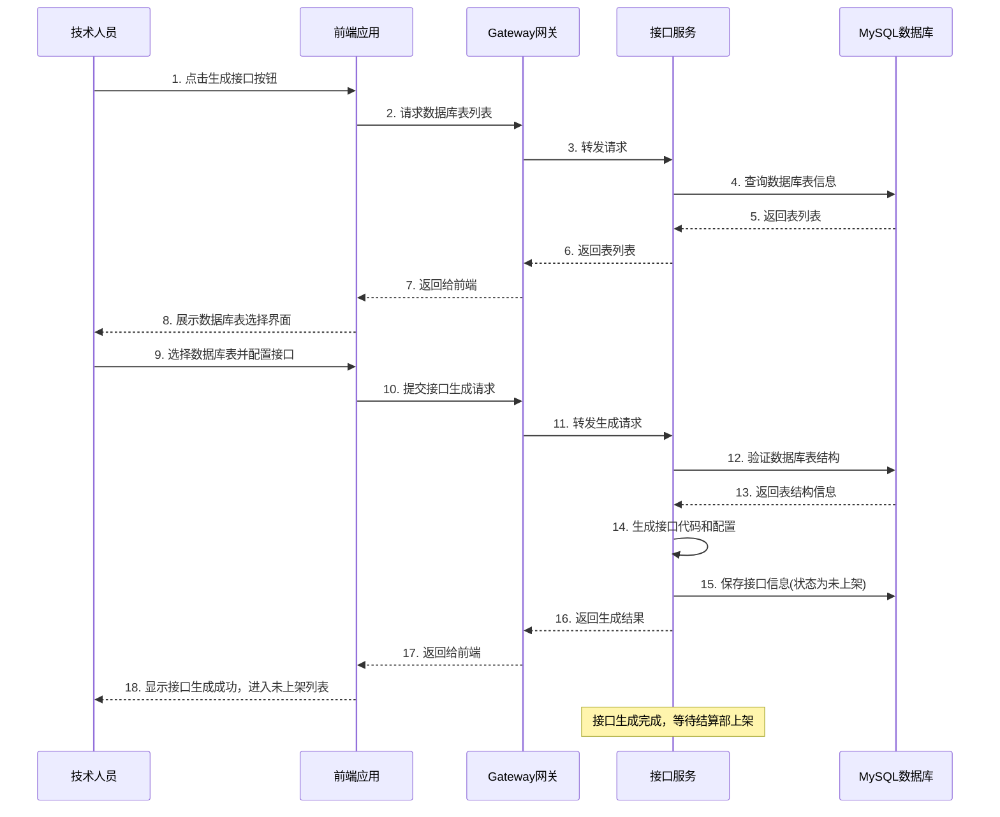
```mermaid
sequenceDiagram
    participant U as 技术人员
    participant F as 前端应用
    participant G as Gateway网关
    participant IS as 接口服务
    participant DB as MySQL数据库
    
    U->>F: 1. 点击生成接口按钮
    F->>G: 2. 请求数据库表列表
    G->>IS: 3. 转发请求
    IS->>DB: 4. 查询数据库表信息
    DB-->>IS: 5. 返回表列表
    IS-->>G: 6. 返回表列表
    G-->>F: 7. 返回给前端
    F-->>U: 8. 展示数据库表选择界面
    
    U->>F: 9. 选择数据库表并配置接口
    F->>G: 10. 提交接口生成请求
    G->>IS: 11. 转发生成请求
    IS->>DB: 12. 验证数据库表结构
    DB-->>IS: 13. 返回表结构信息
    IS->>IS: 14. 生成接口代码和配置
    IS->>DB: 15. 保存接口信息(状态为未上架)
    IS-->>G: 16. 返回生成结果
    G-->>F: 17. 返回给前端
    F-->>U: 18. 显示接口生成成功，进入未上架列表
    
    Note over IS: 接口生成完成，等待结算部上架
```

### 4.4 接口上架操作时序图

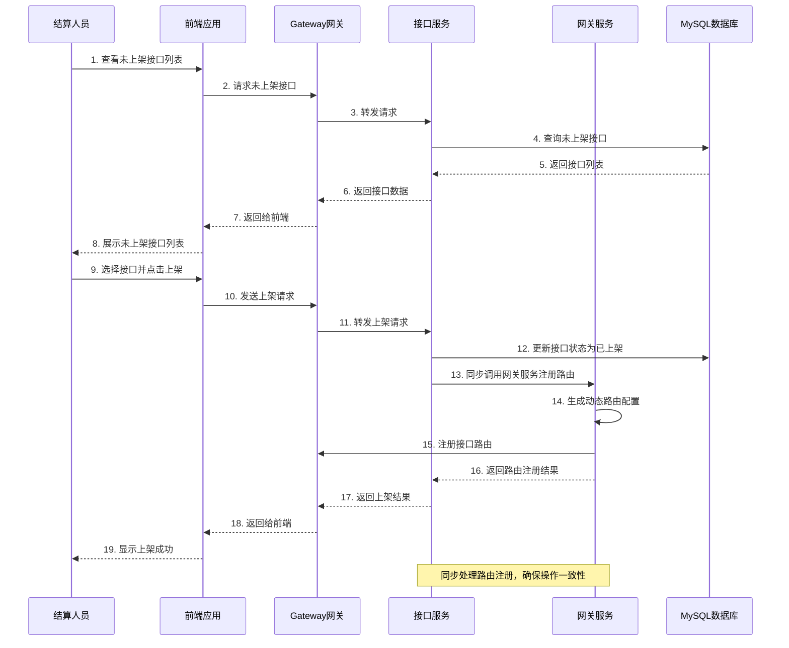
```mermaid
sequenceDiagram
    participant B as 结算人员
    participant F as 前端应用
    participant G as Gateway网关
    participant IS as 接口服务
    participant GS as 网关服务
    participant DB as MySQL数据库
    
    B->>F: 1. 查看未上架接口列表
    F->>G: 2. 请求未上架接口
    G->>IS: 3. 转发请求
    IS->>DB: 4. 查询未上架接口
    DB-->>IS: 5. 返回接口列表
    IS-->>G: 6. 返回接口数据
    G-->>F: 7. 返回给前端
    F-->>B: 8. 展示未上架接口列表
    
    B->>F: 9. 选择接口并点击上架
    F->>G: 10. 发送上架请求
    G->>IS: 11. 转发上架请求
    IS->>DB: 12. 更新接口状态为已上架
    IS->>GS: 13. 同步调用网关服务注册路由
    GS->>GS: 14. 生成动态路由配置
    GS->>G: 15. 注册接口路由
    GS-->>IS: 16. 返回路由注册结果
    IS-->>G: 17. 返回上架结果
    G-->>F: 18. 返回给前端
    F-->>B: 19. 显示上架成功
    
    Note over IS,GS: 同步处理路由注册，确保操作一致性
```

### 4.5 订阅申请审批时序图

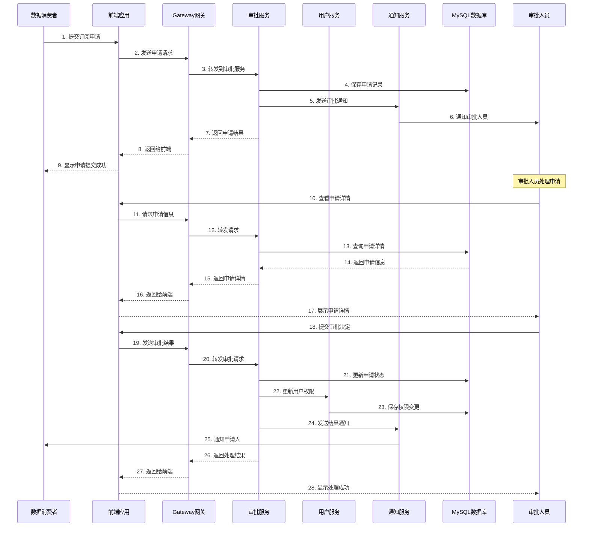
```mermaid
sequenceDiagram
    participant C as 数据消费者
    participant F as 前端应用
    participant G as Gateway网关
    participant AS as 审批服务
    participant US as 用户服务
    participant NS as 通知服务
    participant DB as MySQL数据库
    participant A as 审批人员
    
    C->>F: 1. 提交订阅申请
    F->>G: 2. 发送申请请求
    G->>AS: 3. 转发到审批服务
    AS->>DB: 4. 保存申请记录
    AS->>NS: 5. 发送审批通知
    NS->>A: 6. 通知审批人员
    AS-->>G: 7. 返回申请结果
    G-->>F: 8. 返回给前端
    F-->>C: 9. 显示申请提交成功
    
    Note over A: 审批人员处理申请
    A->>F: 10. 查看申请详情
    F->>G: 11. 请求申请信息
    G->>AS: 12. 转发请求
    AS->>DB: 13. 查询申请详情
    DB-->>AS: 14. 返回申请信息
    AS-->>G: 15. 返回申请详情
    G-->>F: 16. 返回给前端
    F-->>A: 17. 展示申请详情
    
    A->>F: 18. 提交审批决定
    F->>G: 19. 发送审批结果
    G->>AS: 20. 转发审批请求
    AS->>DB: 21. 更新申请状态
    AS->>US: 22. 更新用户权限
    US->>DB: 23. 保存权限变更
    AS->>NS: 24. 发送结果通知
    NS->>C: 25. 通知申请人
    AS-->>G: 26. 返回处理结果
    G-->>F: 27. 返回给前端
    F-->>A: 28. 显示处理成功
```

### 4.6 API调用认证时序图（appId验证）

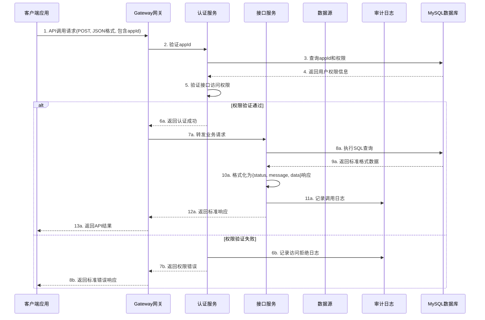
```mermaid
sequenceDiagram
    participant C as 客户端应用
    participant G as Gateway网关
    participant AS as 认证服务
    participant IS as 接口服务
    participant DS as 数据源
    participant AL as 审计日志
    participant DB as MySQL数据库
    
    C->>G: 1. API调用请求(POST, JSON格式, 包含appId)
    G->>AS: 2. 验证appId
    AS->>DB: 3. 查询appId和权限
    DB-->>AS: 4. 返回用户权限信息
    
    AS->>AS: 5. 验证接口访问权限
    alt 权限验证通过
        AS-->>G: 6a. 返回认证成功
        G->>IS: 7a. 转发业务请求
        IS->>DB: 8a. 执行SQL查询
        DB-->>IS: 9a. 返回标准格式数据
        IS->>IS: 10a. 格式化为{status, message, data}响应
        IS->>AL: 11a. 记录调用日志
        IS-->>G: 12a. 返回标准响应
        G-->>C: 13a. 返回API结果
    else 权限验证失败
        AS->>AL: 6b. 记录访问拒绝日志
        AS-->>G: 7b. 返回权限错误
        G-->>C: 8b. 返回标准错误响应
    end
```

### 4.7 原API调用认证时序图

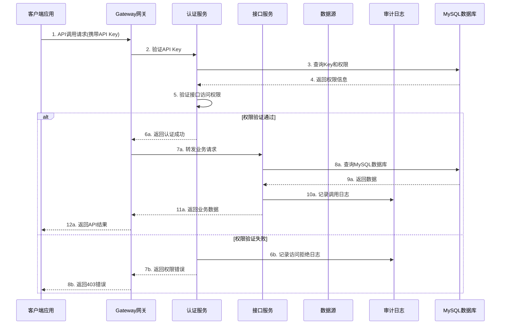
```mermaid
sequenceDiagram
    participant C as 客户端应用
    participant G as Gateway网关
    participant AS as 认证服务
    participant IS as 接口服务
    participant DS as 数据源
    participant AL as 审计日志
    participant DB as MySQL数据库
    
    C->>G: 1. API调用请求(携带API Key)
    G->>AS: 2. 验证API Key
    AS->>DB: 3. 查询Key和权限
    DB-->>AS: 4. 返回权限信息
    
    AS->>AS: 5. 验证接口访问权限
    alt 权限验证通过
        AS-->>G: 6a. 返回认证成功
        G->>IS: 7a. 转发业务请求
        IS->>DB: 8a. 查询MySQL数据库
    DB-->>IS: 9a. 返回数据
        IS->>AL: 10a. 记录调用日志
        IS-->>G: 11a. 返回业务数据
        G-->>C: 12a. 返回API结果
    else 权限验证失败
        AS->>AL: 6b. 记录访问拒绝日志
        AS-->>G: 7b. 返回权限错误
        G-->>C: 8b. 返回403错误
    end
```

## 5. 网关与路由维护策略

### 5.1 Spring Cloud Gateway动态路由架构

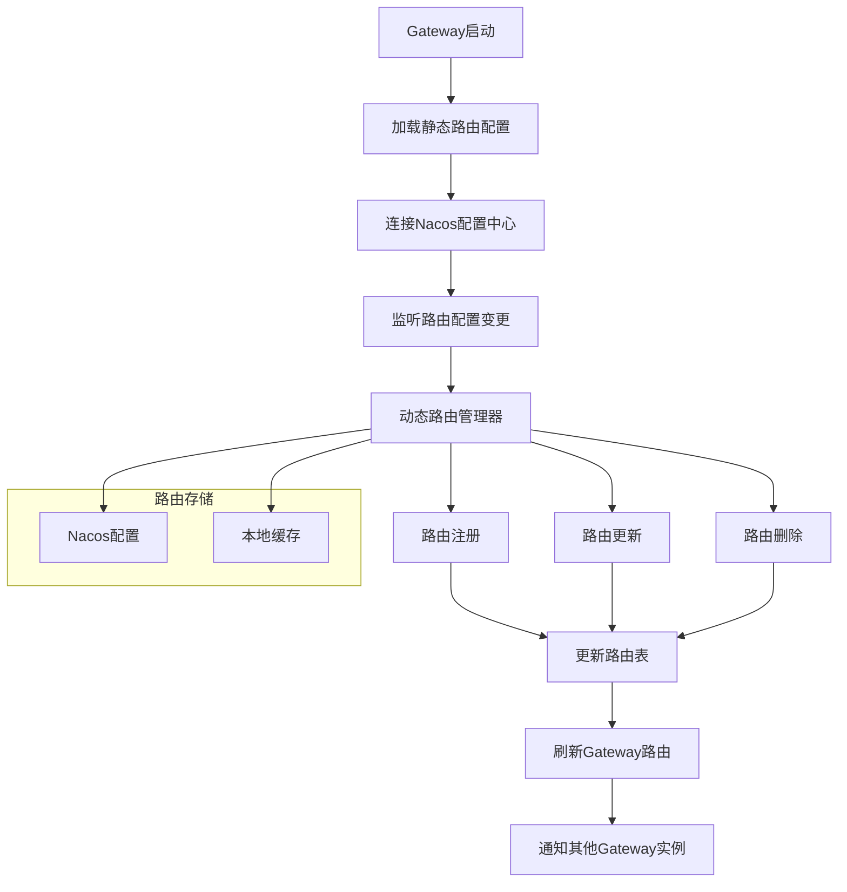
```mermaid
graph TD
    A[Gateway启动] --> B[加载静态路由配置]
    B --> C[连接Nacos配置中心]
    C --> D[监听路由配置变更]
    D --> E[动态路由管理器]
    
    E --> F[路由注册]
    E --> G[路由更新]
    E --> H[路由删除]
    
    F --> I[更新路由表]
    G --> I
    H --> I
    
    I --> J[刷新Gateway路由]
    J --> K[通知其他Gateway实例]
    
    subgraph "路由存储"
        L[Nacos配置]
        N[本地缓存]
    end
    
    E --> L
    E --> N
```

### 5.2 动态路由配置规范

#### 5.2.1 路由配置格式

```yaml
# 接口路由配置示例
spring:
  cloud:
    gateway:
      routes:
        - id: interface-route-{interfaceId}
          uri: lb://interface-service
          predicates:
            - Path=/api/data/{interfaceId}/**
          filters:
            - name: RequestRateLimiter
              args:
                redis-rate-limiter.replenishRate: 100
                redis-rate-limiter.burstCapacity: 200
            - name: AuthFilter
              args:
                required-permissions: interface:read
          metadata:
            interface-id: "{interfaceId}"
            created-by: "system"
            created-time: "2024-01-15T10:30:00Z"
```

#### 5.2.2 路由管理API

```java
@RestController
@RequestMapping("/api/v1/gateway/routes")
public class RouteController {
    
    @PostMapping
    public ResponseEntity<String> addRoute(@RequestBody RouteDefinition route) {
        // 添加动态路由
        routeService.addRoute(route);
        return ResponseEntity.ok("Route added successfully");
    }
    
    @PutMapping("/{routeId}")
    public ResponseEntity<String> updateRoute(
        @PathVariable String routeId, 
        @RequestBody RouteDefinition route) {
        // 更新路由配置
        routeService.updateRoute(routeId, route);
        return ResponseEntity.ok("Route updated successfully");
    }
    
    @DeleteMapping("/{routeId}")
    public ResponseEntity<String> deleteRoute(@PathVariable String routeId) {
        // 删除路由
        routeService.deleteRoute(routeId);
        return ResponseEntity.ok("Route deleted successfully");
    }
}
```

### 5.3 路由热更新机制

#### 5.3.1 配置变更监听

```java
@Component
public class RouteConfigListener {
    
    @NacosConfigListener(dataId = "gateway-routes", groupId = "DEFAULT_GROUP")
    public void onRouteConfigChange(String configInfo) {
        try {
            // 解析新的路由配置
            List<RouteDefinition> newRoutes = parseRouteConfig(configInfo);
            
            // 更新路由表
            routeDefinitionRepository.save(newRoutes);
            
            // 刷新Gateway路由
            applicationEventPublisher.publishEvent(new RefreshRoutesEvent(this));
            
            log.info("Route configuration updated successfully");
        } catch (Exception e) {
            log.error("Failed to update route configuration", e);
        }
    }
}
```

#### 5.3.2 灰度发布策略

```java
@Service
public class GrayReleaseService {
    
    public void enableGrayRelease(String interfaceId, String version, int percentage) {
        // 创建灰度路由规则
        RouteDefinition grayRoute = RouteDefinition.builder()
            .id("gray-" + interfaceId + "-" + version)
            .uri("lb://interface-service-" + version)
            .predicate(predicateDefinition -> {
                predicateDefinition.setName("Path");
                predicateDefinition.addArg("pattern", "/api/data/" + interfaceId + "/**");
            })
            .filter(filterDefinition -> {
                filterDefinition.setName("GrayReleaseFilter");
                filterDefinition.addArg("percentage", String.valueOf(percentage));
            })
            .build();
            
        // 注册灰度路由
        routeDefinitionRepository.save(grayRoute);
        
        // 发布路由刷新事件
        applicationEventPublisher.publishEvent(new RefreshRoutesEvent(this));
    }
}
```

### 5.4 路由监控与告警

#### 5.4.1 路由健康检查

```java
@Component
@Scheduled(fixedRate = 30000) // 每30秒检查一次
public class RouteHealthChecker {
    
    public void checkRouteHealth() {
        List<RouteDefinition> routes = routeDefinitionRepository.getRouteDefinitions();
        
        for (RouteDefinition route : routes) {
            try {
                // 检查路由目标服务健康状态
                boolean isHealthy = checkServiceHealth(route.getUri());
                
                if (!isHealthy) {
                    // 发送告警
                    alertService.sendAlert(
                        "Route Health Check Failed", 
                        "Route " + route.getId() + " target service is unhealthy"
                    );
                    
                    // 可选：自动禁用不健康的路由
                    // routeService.disableRoute(route.getId());
                }
            } catch (Exception e) {
                log.error("Health check failed for route: " + route.getId(), e);
            }
        }
    }
}
```

## 6. 数据模型设计

### 6.1 表级模型 - ER图

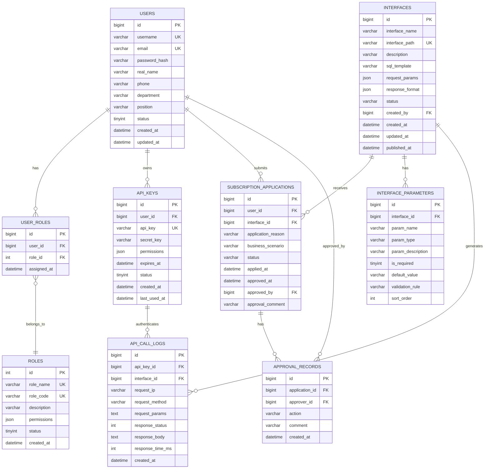
```mermaid
erDiagram
    USERS ||--o{ USER_ROLES : has
    USER_ROLES }o--|| ROLES : belongs_to
    USERS ||--o{ API_KEYS : owns
    USERS ||--o{ SUBSCRIPTION_APPLICATIONS : submits
    
    INTERFACES ||--o{ SUBSCRIPTION_APPLICATIONS : receives

    INTERFACES ||--o{ INTERFACE_PARAMETERS : has
    INTERFACES ||--o{ API_CALL_LOGS : generates
    
    SUBSCRIPTION_APPLICATIONS ||--o{ APPROVAL_RECORDS : has
    APPROVAL_RECORDS }o--|| USERS : approved_by
    
    API_KEYS ||--o{ API_CALL_LOGS : authenticates
    
    USERS {
        bigint id PK
        varchar username UK
        varchar email UK
        varchar password_hash
        varchar real_name
        varchar phone
        varchar department
        varchar position
        tinyint status
        datetime created_at
        datetime updated_at
    }
    
    ROLES {
        int id PK
        varchar role_name UK
        varchar role_code UK
        varchar description
        json permissions
        tinyint status
        datetime created_at
    }
    
    USER_ROLES {
        bigint id PK
        bigint user_id FK
        int role_id FK
        datetime assigned_at
    }
    
    API_KEYS {
        bigint id PK
        bigint user_id FK
        varchar api_key UK
        varchar secret_key
        json permissions
        datetime expires_at
        tinyint status
        datetime created_at
        datetime last_used_at
    }
    

    
    INTERFACES {
        bigint id PK
        varchar interface_name
        varchar interface_path UK
        varchar description

        varchar sql_template
        json request_params
        json response_format
        varchar status
        bigint created_by FK
        datetime created_at
        datetime updated_at
        datetime published_at
    }
    
    INTERFACE_PARAMETERS {
        bigint id PK
        bigint interface_id FK
        varchar param_name
        varchar param_type
        varchar param_description
        tinyint is_required
        varchar default_value
        varchar validation_rule
        int sort_order
    }
    
    SUBSCRIPTION_APPLICATIONS {
        bigint id PK
        bigint user_id FK
        bigint interface_id FK
        varchar application_reason
        varchar business_scenario
        varchar status
        datetime applied_at
        datetime approved_at
        bigint approved_by FK
        varchar approval_comment
    }
    
    APPROVAL_RECORDS {
        bigint id PK
        bigint application_id FK
        bigint approver_id FK
        varchar action
        varchar comment
        datetime created_at
    }
    
    API_CALL_LOGS {
        bigint id PK
        bigint api_key_id FK
        bigint interface_id FK
        varchar request_ip
        varchar request_method
        text request_params
        int response_status
        text response_body
        int response_time_ms
        datetime created_at
    }
    

```

### 6.2 表职责说明

| 表名          | 职责描述     | 核心业务            |
| ----------- | -------- | --------------- |
| users       | 用户基础信息管理 | 存储用户账号、个人信息、状态等 |
| roles       | 角色权限定义   | 定义系统角色和对应权限     |
| user\_roles | 用户角色关联   | 管理用户与角色的多对多关系   |
| api\_keys   | API密钥管理  | 统一API密钥生成、权限控制  |

\| interfaces                 | 接口定义管理   | 存储接口元数据、SQL模板等  |
\| interface\_parameters      | 接口参数定义   | 定义接口请求参数规范      |
\| subscription\_applications | 订阅申请管理   | 处理用户接口订阅申请流程    |
\| approval\_records          | 审批记录     | 记录审批过程和历史       |
\| api\_call\_logs            | API调用日志  | 记录所有API调用详情     |

### 6.3 MySQL数据库连接配置

#### 6.3.1 数据库连接配置

**生产环境配置**：

```yaml
spring:
  datasource:
    type: com.zaxxer.hikari.HikariDataSource
    driver-class-name: com.mysql.cj.jdbc.Driver
    url: jdbc:mysql://mysql-master:3306/power_trading?useUnicode=true&characterEncoding=utf8&serverTimezone=Asia/Shanghai&useSSL=true
    username: ${DB_USERNAME:power_user}
    password: ${DB_PASSWORD:power_password}
    hikari:
      maximum-pool-size: 20
      minimum-idle: 5
      connection-timeout: 30000
      idle-timeout: 600000
      max-lifetime: 1800000
      connection-test-query: SELECT 1
      pool-name: PowerTradingHikariCP
      
  # 读写分离配置
  datasource:
    master:
      url: jdbc:mysql://mysql-master:3306/power_trading
      username: ${DB_MASTER_USERNAME:power_user}
      password: ${DB_MASTER_PASSWORD:power_password}
    slave:
      url: jdbc:mysql://mysql-slave:3306/power_trading
      username: ${DB_SLAVE_USERNAME:power_readonly}
      password: ${DB_SLAVE_PASSWORD:readonly_password}
```

#### 6.3.2 接口数据访问方式

**统一数据访问**：

* 所有接口均基于现有MySQL数据库中的业务表

* 通过SQL模板动态生成查询语句

* 支持参数化查询，确保数据安全

* 统一使用HikariCP连接池管理数据库连接

**数据表访问规范**：

* 接口生成时直接选择MySQL数据库中的业务表

* 支持多表关联查询和复杂业务逻辑

* 自动生成标准化的RESTful API接口

* 统一的数据格式和错误处理机制

### 6.4 字段级数据字典

#### 6.4.1 敏感数据分级标准

| 敏感级别  | 级别描述      | 数据类型示例        | 脱敏策略 |
| ----- | --------- | ------------- | ---- |
| L1-公开 | 可公开访问的数据  | 用户名、接口名称、公开描述 | 无需脱敏 |
| L2-内部 | 内部使用的业务数据 | 部门信息、接口配置     | 部分脱敏 |
| L3-敏感 | 个人敏感信息    | 手机号、邮箱、真实姓名   | 中间脱敏 |
| L4-机密 | 高度机密数据    | 密码、密钥、数据库连接   | 完全加密 |

#### 6.3.2 核心表字段字典

**users表字段详情**：

| 字段名            | 数据类型     | 长度  | 是否必填 | 敏感级别  | 脱敏规则    | 字段描述            |
| -------------- | -------- | --- | ---- | ----- | ------- | --------------- |
| id             | bigint   | -   | 是    | L1-公开 | 无       | 用户唯一标识          |
| username       | varchar  | 50  | 是    | L2-内部 | 无       | 用户登录名           |
| email          | varchar  | 100 | 是    | L3-敏感 | 中间4位\*号 | 用户邮箱地址          |
| password\_hash | varchar  | 255 | 是    | L4-机密 | 完全隐藏    | 密码哈希值           |
| real\_name     | varchar  | 50  | 是    | L3-敏感 | 姓氏+\*号  | 用户真实姓名          |
| phone          | varchar  | 20  | 否    | L3-敏感 | 中间4位\*号 | 手机号码            |
| department     | varchar  | 100 | 否    | L2-内部 | 无       | 所属部门            |
| position       | varchar  | 100 | 否    | L2-内部 | 无       | 职位信息            |
| status         | tinyint  | -   | 是    | L1-公开 | 无       | 用户状态(0:禁用,1:启用) |
| created\_at    | datetime | -   | 是    | L1-公开 | 无       | 创建时间            |
| updated\_at    | datetime | -   | 是    | L1-公开 | 无       | 更新时间            |

**interfaces表字段详情**：

| 字段名              | 数据类型     | 长度  | 是否必填 | 敏感级别  | 脱敏规则  | 字段描述    |
| ---------------- | -------- | --- | ---- | ----- | ----- | ------- |
| id               | bigint   | -   | 是    | L1-公开 | 无     | 接口唯一标识  |
| interface\_name  | varchar  | 200 | 是    | L1-公开 | 无     | 接口名称    |
| interface\_path  | varchar  | 500 | 是    | L2-内部 | 无     | 接口访问路径  |
| description      | text     | -   | 否    | L1-公开 | 无     | 接口描述信息  |
| data\_source\_id | int      | -   | 是    | L2-内部 | 无     | 关联数据源ID |
| sql\_template    | text     | -   | 是    | L3-敏感 | 关键字脱敏 | SQL查询模板 |
| request\_params  | json     | -   | 否    | L2-内部 | 无     | 请求参数定义  |
| response\_format | json     | -   | 否    | L2-内部 | 无     | 响应格式定义  |
| status           | varchar  | 20  | 是    | L1-公开 | 无     | 接口状态    |
| created\_by      | bigint   | -   | 是    | L2-内部 | 无     | 创建人ID   |
| created\_at      | datetime | -   | 是    | L1-公开 | 无     | 创建时间    |
| updated\_at      | datetime | -   | 是    | L1-公开 | 无     | 更新时间    |
| published\_at    | datetime | -   | 否    | L1-公开 | 无     | 发布时间    |

**api\_keys表字段详情**：

| 字段名            | 数据类型     | 长度  | 是否必填 | 敏感级别  | 脱敏规则           | 字段描述    |
| -------------- | -------- | --- | ---- | ----- | -------------- | ------- |
| id             | bigint   | -   | 是    | L1-公开 | 无              | 密钥记录ID  |
| user\_id       | bigint   | -   | 是    | L2-内部 | 无              | 关联用户ID  |
| api\_key       | varchar  | 64  | 是    | L4-机密 | 前4位+\*\*\*+后4位 | API访问密钥 |
| secret\_key    | varchar  | 128 | 是    | L4-机密 | 完全隐藏           | 密钥签名秘钥  |
| permissions    | json     | -   | 否    | L2-内部 | 无              | 权限范围定义  |
| expires\_at    | datetime | -   | 否    | L2-内部 | 无              | 过期时间    |
| status         | tinyint  | -   | 是    | L1-公开 | 无              | 密钥状态    |
| created\_at    | datetime | -   | 是    | L1-公开 | 无              | 创建时间    |
| last\_used\_at | datetime | -   | 否    | L2-内部 | 无              | 最后使用时间  |

#### 6.3.3 脱敏实现策略

```java
@Component
public class DataMaskingService {
    
    /**
     * 手机号脱敏：138****5678
     */
    public String maskPhone(String phone) {
        if (StringUtils.isEmpty(phone) || phone.length() < 7) {
            return phone;
        }
        return phone.substring(0, 3) + "****" + phone.substring(phone.length() - 4);
    }
    
    /**
     * 邮箱脱敏：abc****@example.com
     */
    public String maskEmail(String email) {
        if (StringUtils.isEmpty(email) || !email.contains("@")) {
            return email;
        }
        String[] parts = email.split("@");
        String username = parts[0];
        if (username.length() <= 3) {
            return email;
        }
        return username.substring(0, 3) + "****@" + parts[1];
    }
    
    /**
     * 姓名脱敏：张**
     */
    public String maskName(String name) {
        if (StringUtils.isEmpty(name) || name.length() < 2) {
            return name;
        }
        return name.substring(0, 1) + "*".repeat(name.length() - 1);
    }
    
    /**
     * API密钥脱敏：abcd****wxyz
     */
    public String maskApiKey(String apiKey) {
        if (StringUtils.isEmpty(apiKey) || apiKey.length() < 8) {
            return "****";
        }
        return apiKey.substring(0, 4) + "****" + apiKey.substring(apiKey.length() - 4);
    }
}
```

## 7. 功能模块详细调用设计

### 7.1 接口目录浏览调用链路

#### 7.1.1 前端→网关→后端→数据库调用流程

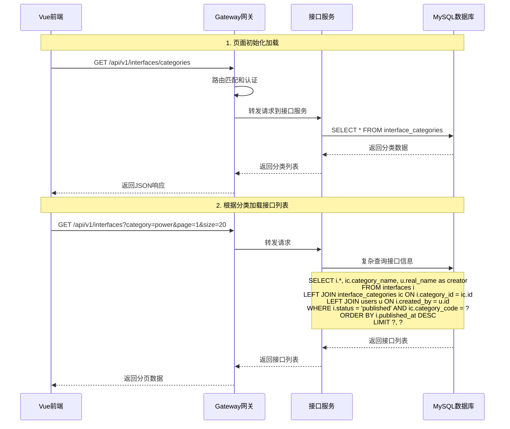
```mermaid
sequenceDiagram
    participant F as Vue前端
    participant G as Gateway网关
    participant IS as 接口服务
    participant DB as MySQL数据库
    
    Note over F,DB: 1. 页面初始化加载
    F->>G: GET /api/v1/interfaces/categories
    G->>G: 路由匹配和认证
    G->>IS: 转发请求到接口服务
    IS->>DB: SELECT * FROM interface_categories
    DB-->>IS: 返回分类数据
    IS-->>G: 返回分类列表
    G-->>F: 返回JSON响应
    
    Note over F,DB: 2. 根据分类加载接口列表
    F->>G: GET /api/v1/interfaces?category=power&page=1&size=20
    G->>IS: 转发请求
    IS->>DB: 复杂查询接口信息
    Note over IS,DB: SELECT i.*, ic.category_name, u.real_name as creator<br/>FROM interfaces i<br/>LEFT JOIN interface_categories ic ON i.category_id = ic.id<br/>LEFT JOIN users u ON i.created_by = u.id<br/>WHERE i.status = 'published' AND ic.category_code = ?<br/>ORDER BY i.published_at DESC<br/>LIMIT ?, ?
    DB-->>IS: 返回接口列表
    IS-->>G: 返回接口列表
    G-->>F: 返回分页数据
```

#### 7.1.2 数据处理逻辑

**前端数据处理**：

```javascript
// InterfaceCatalog.vue
export default {
  data() {
    return {
      categories: [],
      interfaces: [],
      loading: false,
      pagination: {
        current: 1,
        pageSize: 20,
        total: 0
      }
    }
  },
  
  async mounted() {
    await this.loadCategories()
    await this.loadInterfaces()
  },
  
  methods: {
    async loadCategories() {
      try {
        const response = await this.$http.get('/api/v1/interfaces/categories')
        this.categories = response.data.data
      } catch (error) {
        this.$message.error('加载分类失败')
      }
    },
    
    async loadInterfaces(category = '', page = 1) {
      this.loading = true
      try {
        const params = {
          category,
          page,
          size: this.pagination.pageSize
        }
        const response = await this.$http.get('/api/v1/interfaces', { params })
        this.interfaces = response.data.data.records
        this.pagination.total = response.data.data.total
      } catch (error) {
        this.$message.error('加载接口列表失败')
      } finally {
        this.loading = false
      }
    }
  }
}
```

**后端业务逻辑**：

```java
@RestController
@RequestMapping("/api/v1/interfaces")
public class InterfaceController {
    
    @Autowired
    private InterfaceService interfaceService;
    
    @GetMapping("/categories")
    public ResponseEntity<ApiResponse<List<CategoryVO>>> getCategories() {
        List<CategoryVO> categories = interfaceService.getCategories();
        return ResponseEntity.ok(ApiResponse.success(categories));
    }
    
    @GetMapping
    public ResponseEntity<ApiResponse<PageResult<InterfaceVO>>> getInterfaces(
            @RequestParam(required = false) String category,
            @RequestParam(defaultValue = "1") int page,
            @RequestParam(defaultValue = "20") int size) {
        
        PageRequest pageRequest = PageRequest.of(page - 1, size);
        PageResult<InterfaceVO> result = interfaceService.getInterfaces(category, pageRequest);
        return ResponseEntity.ok(ApiResponse.success(result));
    }
}

@Service
public class InterfaceService {
    
    @Autowired
    private InterfaceMapper interfaceMapper;
    
    public List<CategoryVO> getCategories() {
        return interfaceMapper.selectCategories();
    }
    
    public PageResult<InterfaceVO> getInterfaces(String category, PageRequest pageRequest) {
        // 构建查询条件 - 仅查询已上架状态的接口
        QueryWrapper<Interface> queryWrapper = new QueryWrapper<>();
        queryWrapper.eq("status", "published"); // 只查询已上架的接口
        if (StringUtils.isNotBlank(category)) {
            queryWrapper.eq("category_code", category);
        }
        queryWrapper.orderByDesc("published_at"); // 按上架时间排序
        
        // 分页查询
        Page<Interface> page = new Page<>(pageRequest.getPageNumber() + 1, pageRequest.getPageSize());
        Page<Interface> result = interfaceMapper.selectPage(page, queryWrapper);
        
        // 转换为VO
        List<InterfaceVO> voList = result.getRecords().stream()
            .map(this::convertToVO)
            .collect(Collectors.toList());
            
        return new PageResult<>(voList, result.getTotal(), result.getCurrent(), result.getSize());
    }
    
    /**
     * 接口管理页面查询 - 可查询所有状态的接口
     */
    public PageResult<InterfaceVO> getInterfacesForManagement(String status, String category, PageRequest pageRequest) {
        QueryWrapper<Interface> queryWrapper = new QueryWrapper<>();
        if (StringUtils.isNotBlank(status)) {
            queryWrapper.eq("status", status);
        }
        if (StringUtils.isNotBlank(category)) {
            queryWrapper.eq("category_code", category);
        }
        queryWrapper.orderByDesc("created_at");
        
        Page<Interface> page = new Page<>(pageRequest.getPageNumber() + 1, pageRequest.getPageSize());
        Page<Interface> result = interfaceMapper.selectPage(page, queryWrapper);
        
        List<InterfaceVO> voList = result.getRecords().stream()
            .map(this::convertToVO)
            .collect(Collectors.toList());
            
        return new PageResult<>(voList, result.getTotal(), result.getCurrent(), result.getSize());
    }
}
```

### 7.2 接口生成调用链路

#### 7.2.1 完整调用流程

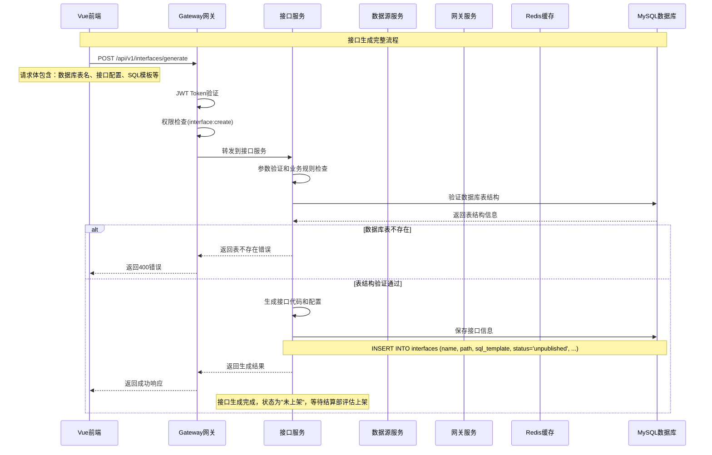
```mermaid
sequenceDiagram
    participant F as Vue前端
    participant G as Gateway网关
    participant IS as 接口服务
    participant DS as 数据源服务
    participant GS as 网关服务
    participant R as Redis缓存
    participant DB as MySQL数据库
    
    Note over F,DB: 接口生成完整流程
    
    F->>G: POST /api/v1/interfaces/generate
    Note over F: 请求体包含：数据库表名、接口配置、SQL模板等
    
    G->>G: JWT Token验证
    G->>G: 权限检查(interface:create)
    G->>IS: 转发到接口服务
    
    IS->>IS: 参数验证和业务规则检查
    IS->>DB: 验证数据库表结构
    DB-->>IS: 返回表结构信息
    
    alt 数据库表不存在
        IS-->>G: 返回表不存在错误
        G-->>F: 返回400错误
    else 表结构验证通过
        IS->>IS: 生成接口代码和配置
        IS->>DB: 保存接口信息
        Note over IS,DB: INSERT INTO interfaces (name, path, sql_template, status='unpublished', ...)
        
        IS-->>G: 返回生成结果
        G-->>F: 返回成功响应
        
        Note over IS: 接口生成完成，状态为"未上架"，等待结算部评估上架
    end
```

#### 7.2.2 接口生成核心代码

**前端接口生成组件**：

```javascript
// InterfaceGenerateDialog.vue
export default {
  data() {
    return {
      currentStep: 1,
      formData: {
        dataSourceId: null,
        interfaceName: '',
        interfacePath: '',
        description: '',
        sqlTemplate: '',
        parameters: []
      }
    }
  },
  
  methods: {
    async submitGenerate() {
      try {
        this.loading = true
        const response = await this.$http.post('/api/v1/interfaces/generate', this.formData)
        
        this.$message.success('接口生成成功')
        this.$emit('generated', response.data.data)
        this.closeDialog()
      } catch (error) {
        this.$message.error(error.response?.data?.message || '接口生成失败')
      } finally {
        this.loading = false
      }
    }
  }
}
```

**后端接口生成服务**：

```java
@Service
@Transactional
public class InterfaceGenerateService {
    
    @Autowired
    private InterfaceMapper interfaceMapper;
    
    @Autowired
    private DatabaseTableService databaseTableService;
    
    @Autowired
    private GatewayRouteService gatewayRouteService;
    
    public InterfaceVO generateInterface(InterfaceGenerateRequest request) {
        // 1. 验证数据库表结构
        if (!validateDatabaseTable(request.getTableName())) {
            throw new BusinessException("数据库表不存在或无访问权限");
        }
        
        // 2. 验证SQL模板
        validateSqlTemplate(request.getSqlTemplate());
        
        // 3. 生成接口路径
        String interfacePath = generateInterfacePath(request.getInterfaceName());
        
        // 4. 创建接口记录
        Interface interfaceEntity = new Interface();
        interfaceEntity.setInterfaceName(request.getInterfaceName());
        interfaceEntity.setInterfacePath(interfacePath);
        interfaceEntity.setDescription(request.getDescription());
        interfaceEntity.setSqlTemplate(request.getSqlTemplate());
        interfaceEntity.setStatus("unpublished"); // 生成后状态为未上架
        interfaceEntity.setCreatedBy(getCurrentUserId());
        interfaceEntity.setCreatedAt(LocalDateTime.now());
        
        interfaceMapper.insert(interfaceEntity);
        
        // 5. 保存接口参数
        saveInterfaceParameters(interfaceEntity.getId(), request.getParameters());
        
        return convertToVO(interfaceEntity);
    }
    
    private void validateSqlTemplate(String sqlTemplate) {
        // SQL注入检查
        if (containsDangerousKeywords(sqlTemplate)) {
            throw new BusinessException("SQL模板包含危险关键字");
        }
        
        // SQL语法检查
        try {
            JSqlParser.parse(sqlTemplate);
        } catch (Exception e) {
            throw new BusinessException("SQL模板语法错误: " + e.getMessage());
        }
    }
}
```

### 7.3 订阅申请审批调用链路

#### 7.3.1 申请提交流程

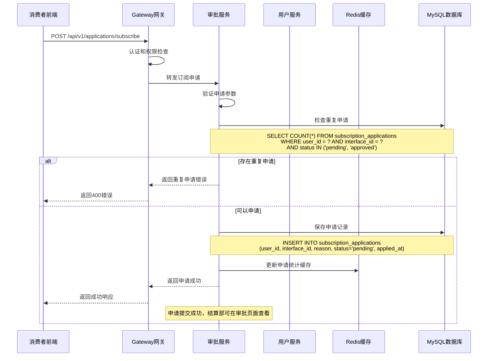
```mermaid
sequenceDiagram
    participant C as 消费者前端
    participant G as Gateway网关
    participant AS as 审批服务
    participant US as 用户服务
    participant R as Redis缓存
    participant DB as MySQL数据库
    
    C->>G: POST /api/v1/applications/subscribe
    G->>G: 认证和权限检查
    G->>AS: 转发订阅申请
    
    AS->>AS: 验证申请参数
    AS->>DB: 检查重复申请
    Note over AS,DB: SELECT COUNT(*) FROM subscription_applications<br/>WHERE user_id = ? AND interface_id = ?<br/>AND status IN ('pending', 'approved')
    
    alt 存在重复申请
        AS-->>G: 返回重复申请错误
        G-->>C: 返回400错误
    else 可以申请
        AS->>DB: 保存申请记录
        Note over AS,DB: INSERT INTO subscription_applications<br/>(user_id, interface_id, reason, status='pending', applied_at)
        
        AS->>R: 更新申请统计缓存
        
        AS-->>G: 返回申请成功
        G-->>C: 返回成功响应
        
        Note over AS: 申请提交成功，结算部可在审批页面查看
    end
```

#### 7.3.2 一级审批处理流程

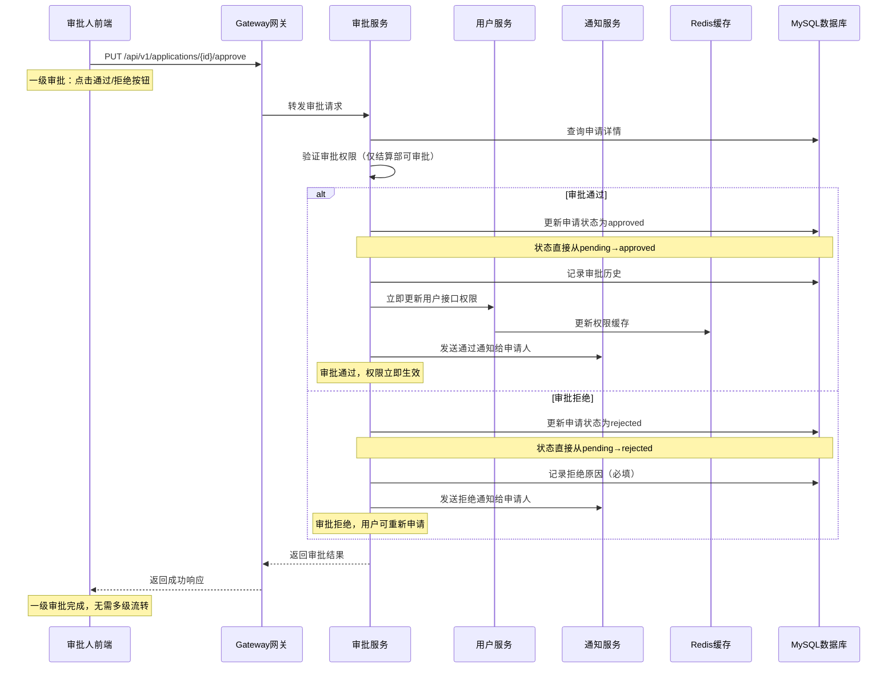
```mermaid
sequenceDiagram
    participant A as 审批人前端
    participant G as Gateway网关
    participant AS as 审批服务
    participant US as 用户服务
    participant NS as 通知服务
    participant R as Redis缓存
    participant DB as MySQL数据库
    
    A->>G: PUT /api/v1/applications/{id}/approve
    Note over A: 一级审批：点击通过/拒绝按钮
    G->>AS: 转发审批请求
    
    AS->>DB: 查询申请详情
    AS->>AS: 验证审批权限（仅结算部可审批）
    
    alt 审批通过
        AS->>DB: 更新申请状态为approved
        Note over AS,DB: 状态直接从pending→approved
        AS->>DB: 记录审批历史
        AS->>US: 立即更新用户接口权限
        US->>R: 更新权限缓存
        AS->>NS: 发送通过通知给申请人
        Note over AS: 审批通过，权限立即生效
    else 审批拒绝
        AS->>DB: 更新申请状态为rejected
        Note over AS,DB: 状态直接从pending→rejected
        AS->>DB: 记录拒绝原因（必填）
        AS->>NS: 发送拒绝通知给申请人
        Note over AS: 审批拒绝，用户可重新申请
    end
    
    AS-->>G: 返回审批结果
    G-->>A: 返回成功响应
    Note over A: 一级审批完成，无需多级流转
```

### 7.4 API调用认证调用链路

#### 7.4.1 API调用完整流程

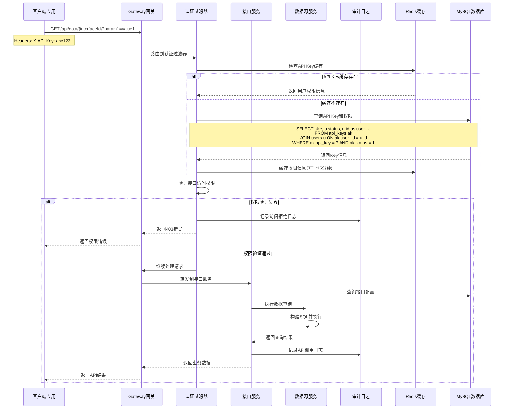
```mermaid
sequenceDiagram
    participant Client as 客户端应用
    participant G as Gateway网关
    participant AF as 认证过滤器
    participant IS as 接口服务
    participant DS as 数据源服务
    participant AL as 审计日志
    participant R as Redis缓存
    participant DB as MySQL数据库
    
    Client->>G: GET /api/data/{interfaceId}?param1=value1
    Note over Client: Headers: X-API-Key: abc123...
    
    G->>AF: 路由到认证过滤器
    AF->>R: 检查API Key缓存
    
    alt API Key缓存存在
        R-->>AF: 返回用户权限信息
    else 缓存不存在
        AF->>DB: 查询API Key和权限
        Note over AF,DB: SELECT ak.*, u.status, u.id as user_id<br/>FROM api_keys ak<br/>JOIN users u ON ak.user_id = u.id<br/>WHERE ak.api_key = ? AND ak.status = 1
        DB-->>AF: 返回Key信息
        AF->>R: 缓存权限信息(TTL:15分钟)
    end
    
    AF->>AF: 验证接口访问权限
    alt 权限验证失败
        AF->>AL: 记录访问拒绝日志
        AF-->>G: 返回403错误
        G-->>Client: 返回权限错误
    else 权限验证通过
        AF->>G: 继续处理请求
        G->>IS: 转发到接口服务
        
        IS->>DB: 查询接口配置
        IS->>DS: 执行数据查询
        DS->>DS: 构建SQL并执行
        DS-->>IS: 返回查询结果
        
        IS->>AL: 记录API调用日志
        IS-->>G: 返回业务数据
        G-->>Client: 返回API结果
    end
```

#### 7.4.2 认证过滤器实现

```java
@Component
public class ApiKeyAuthenticationFilter implements GlobalFilter, Ordered {
    
    @Autowired
    private RedisTemplate<String, Object> redisTemplate;
    
    @Autowired
    private ApiKeyService apiKeyService;
    
    @Override
    public Mono<Void> filter(ServerWebExchange exchange, GatewayFilterChain chain) {
        ServerHttpRequest request = exchange.getRequest();
        
        // 检查是否需要API Key认证
        if (!requiresApiKeyAuth(request.getPath().value())) {
            return chain.filter(exchange);
        }
        
        // 提取API Key
        String apiKey = extractApiKey(request);
        if (StringUtils.isEmpty(apiKey)) {
            return handleAuthError(exchange, "Missing API Key");
        }
        
        // 验证API Key
        return validateApiKey(apiKey)
            .flatMap(userInfo -> {
                // 检查接口权限
                String interfaceId = extractInterfaceId(request.getPath().value());
                if (!hasInterfacePermission(userInfo, interfaceId)) {
                    return handleAuthError(exchange, "Insufficient permissions");
                }
                
                // 添加用户信息到请求头
                ServerHttpRequest mutatedRequest = request.mutate()
                    .header("X-User-Id", userInfo.getUserId().toString())
                    .header("X-User-Role", userInfo.getRole())
                    .build();
                    
                return chain.filter(exchange.mutate().request(mutatedRequest).build());
            })
            .onErrorResume(throwable -> {
                log.error("API Key validation failed", throwable);
                return handleAuthError(exchange, "Invalid API Key");
            });
    }
    
    private Mono<UserInfo> validateApiKey(String apiKey) {
        // 先检查缓存
        String cacheKey = "api_key:" + apiKey;
        UserInfo cachedUserInfo = (UserInfo) redisTemplate.opsForValue().get(cacheKey);
        
        if (cachedUserInfo != null) {
            return Mono.just(cachedUserInfo);
        }
        
        // 缓存未命中，查询数据库
        return apiKeyService.validateApiKey(apiKey)
            .doOnNext(userInfo -> {
                // 缓存用户信息
                redisTemplate.opsForValue().set(cacheKey, userInfo, Duration.ofMinutes(15));
            });
    }
}
```

## 8. API接口标准化定义

### 8.1 接口设计规范

#### 8.1.1 统一响应格式

**标准响应结构**：

```json
{
  "code": 200,
  "message": "success",
  "data": {},
  "timestamp": "2024-01-15T10:30:00Z",
  "requestId": "uuid-string"
}
```

**响应字段说明**：

* `code`: 业务状态码，200表示成功

* `message`: 响应消息，成功时为"success"

* `data`: 业务数据，可以是对象、数组或基本类型

* `timestamp`: 响应时间戳，ISO 8601格式

* `requestId`: 请求唯一标识，用于链路追踪

#### 8.1.2 统一错误码定义

**系统级错误码（1000-1999）**：

* 1000: 系统内部错误

* 1001: 参数校验失败

* 1002: 数据格式错误

* 1003: 请求超时

* 1004: 服务不可用

**认证授权错误码（2000-2999）**：

* 2000: 未登录

* 2001: 登录失败

* 2002: Token无效

* 2003: Token过期

* 2004: 权限不足

* 2005: 账号被锁定

* 2006: 账号未激活

**业务逻辑错误码（3000-3999）**：

* 3000: 用户不存在

* 3001: 用户已存在

* 3002: 密码错误

* 3003: 验证码错误

* 3004: 操作频繁

**接口管理错误码（4000-4999）**：

* 4000: 接口不存在

* 4001: 接口名称重复

* 4002: 接口路径冲突

* 4003: 数据源连接失败

* 4004: 表结构获取失败

* 4005: 接口生成失败

* 4006: 接口状态不允许操作

**订阅审批错误码（5000-5999）**：

* 5000: 申请不存在

* 5001: 重复申请

* 5002: 申请已处理

* 5003: 审批权限不足

* 5004: 申请理由为空

#### 8.1.3 参数校验规范

**通用校验规则**：

* 必填参数不能为空

* 字符串长度限制

* 数字范围限制

* 日期格式校验

* 邮箱格式校验

* 手机号格式校验

**校验失败响应示例**：

```json
{
  "code": 1001,
  "message": "参数校验失败",
  "data": {
    "errors": [
      {
        "field": "username",
        "message": "用户名长度必须在2-50个字符之间"
      },
      {
        "field": "email",
        "message": "邮箱格式不正确"
      }
    ]
  },
  "timestamp": "2024-01-15T10:30:00Z",
  "requestId": "req-12345"
}
```

### 8.2 用户认证相关API

#### 8.2.1 用户登录

```
POST /api/v1/auth/login
```

**功能描述**：用户账号密码登录

**请求头**：

```
Content-Type: application/json
```

**请求参数**：

| 参数名      | 参数类型   | 是否必填 | 长度限制  | 描述             | 校验规则     |
| -------- | ------ | ---- | ----- | -------------- | -------- |
| username | string | 是    | 2-100 | 用户名（手机号或邮箱）    | 手机号或邮箱格式 |
| password | string | 是    | 8-20  | 密码             | 非空字符串    |
| captcha  | string | 否    | 4     | 验证码（连续失败3次后必需） | 4位数字     |

**请求示例**：

```json
{
  "username": "13800138000",
  "password": "Password123!",
  "captcha": "1234"
}
```

**响应参数**：

| 参数名                       | 参数类型    | 描述      |
| ------------------------- | ------- | ------- |
| code                      | integer | 响应码     |
| message                   | string  | 响应消息    |
| data                      | object  | 响应数据    |
| data.token                | string  | JWT访问令牌 |
| data.userInfo             | object  | 用户信息    |
| data.userInfo.id          | integer | 用户ID    |
| data.userInfo.username    | string  | 用户名     |
| data.userInfo.realName    | string  | 真实姓名    |
| data.userInfo.role        | string  | 用户角色    |
| data.userInfo.permissions | array   | 权限列表    |

**成功响应示例**：

```json
{
  "code": 200,
  "message": "登录成功",
  "data": {
    "token": "eyJhbGciOiJIUzI1NiIsInR5cCI6IkpXVCJ9...",
    "refreshToken": "refresh_token_string",
    "expiresIn": 86400,
    "userInfo": {
      "id": 1001,
      "username": "zhangsan",
      "realName": "张三",
      "email": "zhangsan@example.com",
      "phone": "13800138000",
      "department": "技术部",
      "position": "高级工程师",
      "role": "tech",
      "roleCode": "TECH",
      "permissions": [
        "interface:read",
        "interface:create",
        "interface:update",
        "interface:test"
      ],
      "appId": "app_1001_20240115",
      "status": 1,
      "lastLoginTime": "2024-01-15T10:30:00Z"
    }
  },
  "timestamp": "2024-01-15T10:30:00Z",
  "requestId": "req-login-12345"
}
```

**失败响应示例**：

```json
{
  "code": 2001,
  "message": "登录失败",
  "data": {
    "reason": "密码错误",
    "remainingAttempts": 2,
    "lockTime": null
  },
  "timestamp": "2024-01-15T10:30:00Z",
  "requestId": "req-login-12345"
}
```

**业务规则**：

* 连续5次密码错误锁定账号30分钟

* 连续3次失败后需要输入验证码

* Token有效期24小时

* 只有"已审核"状态用户可登录

* 同一账号同时只能有一个有效Token

**错误码说明**：

* 2001: 用户名或密码错误

* 2005: 账号被锁定

* 2006: 账号未激活

* 3003: 验证码错误

* 1001: 参数校验失败

#### 8.1.2 用户登出

```
POST /api/v1/auth/logout
```

**请求头**：

| 参数名           | 参数类型   | 是否必填 | 描述             |
| ------------- | ------ | ---- | -------------- |
| Authorization | string | 是    | Bearer {token} |

**响应示例**：

```json
{
  "code": 200,
  "message": "登出成功",
  "data": null,
  "timestamp": "2024-01-15T10:35:00Z"
}
```

### 8.2 接口管理相关API

#### 8.2.1 获取接口列表

```
GET /api/v1/interfaces
```

**查询参数**：

| 参数名      | 参数类型    | 是否必填 | 描述                                              |
| -------- | ------- | ---- | ----------------------------------------------- |
| category | string  | 否    | 接口分类                                            |
| status   | string  | 否    | 接口状态(unpublished:未上架/published:已上架/offline:已下架) |
| keyword  | string  | 否    | 搜索关键词                                           |
| page     | integer | 否    | 页码，默认1                                          |
| size     | integer | 否    | 每页大小，默认20                                       |

**响应参数**：

| 参数名          | 参数类型    | 描述   |
| ------------ | ------- | ---- |
| code         | integer | 响应码  |
| message      | string  | 响应消息 |
| data         | object  | 分页数据 |
| data.records | array   | 接口列表 |
| data.total   | integer | 总记录数 |
| data.current | integer | 当前页码 |
| data.size    | integer | 每页大小 |

#### 8.2.2 生成接口

```
POST /api/v1/interfaces/generate
```

**请求参数**：

| 参数名           | 参数类型    | 是否必填 | 描述      |
| ------------- | ------- | ---- | ------- |
| dataSourceId  | integer | 是    | 数据源ID   |
| interfaceName | string  | 是    | 接口名称    |
| interfacePath | string  | 是    | 接口路径    |
| description   | string  | 否    | 接口描述    |
| sqlTemplate   | string  | 是    | SQL查询模板 |
| parameters    | array   | 否    | 参数定义    |

**请求示例**：

```json
{
  "dataSourceId": 1,
  "interfaceName": "电力负荷数据查询",
  "interfacePath": "/power/load",
  "description": "查询指定时间范围的电力负荷数据",
  "sqlTemplate": "SELECT * FROM power_load WHERE date_time BETWEEN #{startTime} AND #{endTime}",
  "parameters": [
    {
      "paramName": "startTime",
      "paramType": "datetime",
      "isRequired": true,
      "description": "开始时间"
    },
    {
      "paramName": "endTime",
      "paramType": "datetime",
      "isRequired": true,
      "description": "结束时间"
    }
  ]
}
```

#### 8.2.3 批量接口操作

```
POST /api/v1/interfaces/batch-operation
```

**请求参数**：

| 参数名          | 参数类型   | 是否必填 | 描述                           |
| ------------ | ------ | ---- | ---------------------------- |
| interfaceIds | array  | 是    | 接口ID列表                       |
| operation    | string | 是    | 操作类型(publish/offline/reject) |
| reason       | string | 否    | 操作原因                         |

**请求示例**：

```json
{
  "interfaceIds": [1, 2, 3, 4, 5],
  "operation": "publish",
  "reason": "批量上架电力交易相关接口"
}
```

**响应参数**：

| 参数名        | 参数类型    | 描述                     |
| ---------- | ------- | ---------------------- |
| taskId     | string  | 批量操作任务ID               |
| totalCount | integer | 总操作数量                  |
| status     | string  | 任务状态(completed/failed) |

#### 8.2.4 批量操作状态查询

```
GET /api/v1/interfaces/batch-operation/{taskId}
```

**路径参数**：

| 参数名    | 参数类型   | 是否必填 | 描述   |
| ------ | ------ | ---- | ---- |
| taskId | string | 是    | 任务ID |

**响应参数**：

| 参数名      | 参数类型   | 描述                             |
| -------- | ------ | ------------------------------ |
| taskId   | string | 任务ID                           |
| status   | string | 任务状态(running/completed/failed) |
| progress | object | 进度信息                           |
| results  | array  | 操作结果列表                         |

**响应示例**：

```json
{
  "code": 200,
  "message": "success",
  "data": {
    "taskId": "batch_20240115_001",
    "status": "completed",
    "progress": {
      "total": 5,
      "success": 4,
      "failed": 1,
      "percentage": 100
    },
    "results": [
      {
        "interfaceId": 1,
        "status": "success",
        "message": "接口上架成功"
      },
      {
        "interfaceId": 2,
        "status": "failed",
        "message": "接口状态不符合上架条件"
      }
    ]
  }
}
```

**说明**：批量操作采用同步处理方式，直接返回所有操作结果，无需异步查询任务状态。

#### 8.2.5 重试失败的批量操作

```
POST /api/v1/interfaces/batch-operation/{taskId}/retry
```

**路径参数**：

| 参数名    | 参数类型   | 是否必填 | 描述   |
| ------ | ------ | ---- | ---- |
| taskId | string | 是    | 任务ID |

**请求参数**：

| 参数名          | 参数类型  | 是否必填 | 描述        |
| ------------ | ----- | ---- | --------- |
| interfaceIds | array | 否    | 指定重试的接口ID |

#### 8.2.6 接口状态变更

```
PUT /api/v1/interfaces/{id}/status
```

**路径参数**：

| 参数名 | 参数类型    | 是否必填 | 描述   |
| --- | ------- | ---- | ---- |
| id  | integer | 是    | 接口ID |

**请求参数**：

| 参数名    | 参数类型   | 是否必填 | 描述                                              |
| ------ | ------ | ---- | ----------------------------------------------- |
| status | string | 是    | 接口状态(unpublished:未上架/published:已上架/offline:已下架) |
| reason | string | 否    | 状态变更原因                                          |

**请求示例**：

```json
{
  "status": "published",
  "reason": "接口评估通过，正式上架"
}
```

**响应示例**：

```json
{
  "code": 200,
  "message": "接口状态更新成功",
  "data": {
    "interfaceId": 1001,
    "oldStatus": "unpublished",
    "newStatus": "published",
    "updatedAt": "2024-01-15T10:30:00Z"
  }
}
```

### 8.3 订阅申请相关API

#### 8.3.1 提交订阅申请

```
POST /api/v1/applications/subscribe
```

**请求参数**：

| 参数名               | 参数类型    | 是否必填 | 描述   |
| ----------------- | ------- | ---- | ---- |
| interfaceId       | integer | 是    | 接口ID |
| applicationReason | string  | 是    | 申请理由 |
| businessScenario  | string  | 是    | 业务场景 |

#### 8.3.2 一级审批申请

```
PUT /api/v1/applications/{id}/approve
```

**功能描述**：一级审批处理订阅申请，支持通过或拒绝操作

**路径参数**：

| 参数名 | 参数类型    | 是否必填 | 描述   |
| --- | ------- | ---- | ---- |
| id  | integer | 是    | 申请ID |

**请求参数**：

| 参数名     | 参数类型   | 是否必填 | 描述                   | 校验规则    |
| ------- | ------ | ---- | -------------------- | ------- |
| action  | string | 是    | 审批动作(approve/reject) | 枚举值限制   |
| comment | string | 否    | 审批意见（拒绝时建议填写）        | 最大500字符 |

**请求示例**：

```json
{
  "action": "approve",
  "comment": "申请理由充分，业务场景明确，同意订阅"
}
```

**成功响应示例**：

```json
{
  "code": 200,
  "message": "审批成功",
  "data": {
    "applicationId": 12345,
    "status": "approved",
    "approvedAt": "2024-01-15T10:30:00Z",
    "approvedBy": 1001,
    "comment": "申请理由充分，业务场景明确，同意订阅"
  },
  "timestamp": "2024-01-15T10:30:00Z",
  "requestId": "req-approve-12345"
}
```

**业务规则**：

* 只有结算部角色用户可以执行审批操作

* 申请状态必须为pending才能审批

* 审批后状态立即生效：approved（通过）或rejected（拒绝）

* 审批通过后自动为用户开通接口访问权限

* 审批结果会发送通知给申请用户

* 拒绝申请时建议填写审批意见

**错误码说明**：

* 5000: 申请不存在

* 5002: 申请已处理

* 5003: 审批权限不足

* 2004: 权限不足

### 8.4 数据接口调用API

**说明**：系统不再提供通知管理功能，接口状态变更通过页面实时展示，无需系统通知。

#### 8.4.1 通用数据接口

```
GET /api/data/{interfaceId}
```

**请求头**：

| 参数名       | 参数类型   | 是否必填 | 描述      |
| --------- | ------ | ---- | ------- |
| X-API-Key | string | 是    | API访问密钥 |

**路径参数**：

| 参数名         | 参数类型   | 是否必填 | 描述   |
| ----------- | ------ | ---- | ---- |
| interfaceId | string | 是    | 接口标识 |

**查询参数**：根据具体接口定义的参数

**响应格式**：

```json
{
  "code": 200,
  "message": "success",
  "data": {
    "records": [...],
    "total": 100,
    "page": 1,
    "size": 20
  },
  "timestamp": "2024-01-15T10:30:00Z"
}
```

## 9. 数据库设计细化

### 9.1 数据库架构设计

#### 9.1.1 数据库分层架构

**主从复制架构**：

```
主库（Master）：
- 处理所有写操作（INSERT、UPDATE、DELETE）
- 实时数据一致性保证
- 事务完整性控制

从库（Slave）：
- 处理所有读操作（SELECT）
- 数据延迟：< 100ms
- 读写分离负载均衡

备份策略：
- 全量备份：每日凌晨2点
- 增量备份：每4小时一次
- binlog保留：7天
- 备份验证：每周一次恢复测试
```

**数据库连接池配置**：

```yaml
# HikariCP连接池配置
hikari:
  maximum-pool-size: 20          # 最大连接数
  minimum-idle: 5                # 最小空闲连接数
  connection-timeout: 30000      # 连接超时时间(ms)
  idle-timeout: 600000           # 空闲超时时间(ms)
  max-lifetime: 1800000          # 连接最大生命周期(ms)
  leak-detection-threshold: 60000 # 连接泄漏检测阈值(ms)
```

#### 9.1.2 数据库性能优化

**查询优化策略**：

```sql
-- 1. 索引优化原则
-- 主键索引：每个表必须有主键
-- 唯一索引：唯一性约束字段
-- 复合索引：多字段查询条件
-- 覆盖索引：减少回表查询

-- 2. 分页查询优化
-- 避免使用OFFSET大偏移量
-- 使用游标分页（基于ID）
SELECT * FROM interfaces 
WHERE id > ? 
ORDER BY id ASC 
LIMIT 20;

-- 3. 统计查询优化
-- 使用预计算统计表
-- 定时更新统计数据
CREATE TABLE interface_statistics (
    date DATE PRIMARY KEY,
    total_interfaces INT,
    published_interfaces INT,
    total_calls BIGINT,
    avg_response_time DECIMAL(10,2)
);
```

**缓存策略设计**：

```
一级缓存（应用层）：
- 接口配置信息：30分钟
- 用户权限信息：15分钟
- 分类标签数据：60分钟

二级缓存（Redis）：
- 热点接口数据：2小时
- 用户会话信息：24小时
- 统计汇总数据：6小时

缓存更新策略：
- 写入时更新（Write-Through）
- 延迟双删（Delayed Double Delete）
- 缓存预热（Cache Warming）
```

### 9.2 核心表结构设计

#### 9.2.1 用户管理表设计

**users表（用户基础信息）**：

```sql
CREATE TABLE users (
    id BIGINT PRIMARY KEY AUTO_INCREMENT COMMENT '用户ID',
    username VARCHAR(50) NOT NULL UNIQUE COMMENT '用户名',
    email VARCHAR(100) NOT NULL UNIQUE COMMENT '邮箱地址',
    password_hash VARCHAR(255) NOT NULL COMMENT '密码哈希值',
    salt VARCHAR(32) NOT NULL COMMENT '密码盐值',
    real_name VARCHAR(50) NOT NULL COMMENT '真实姓名',
    phone VARCHAR(20) COMMENT '手机号码',
    department VARCHAR(100) COMMENT '所属部门',
    position VARCHAR(100) COMMENT '职位信息',
    avatar_url VARCHAR(255) COMMENT '头像URL',
    last_login_at DATETIME COMMENT '最后登录时间',
    last_login_ip VARCHAR(45) COMMENT '最后登录IP',
    login_count INT DEFAULT 0 COMMENT '登录次数',
    status TINYINT DEFAULT 1 COMMENT '用户状态(0:禁用,1:启用,2:锁定)',
    created_at DATETIME DEFAULT CURRENT_TIMESTAMP COMMENT '创建时间',
    updated_at DATETIME DEFAULT CURRENT_TIMESTAMP ON UPDATE CURRENT_TIMESTAMP COMMENT '更新时间',
    
    -- 索引设计
    INDEX idx_username (username),
    INDEX idx_email (email),
    INDEX idx_phone (phone),
    INDEX idx_department (department),
    INDEX idx_status (status),
    INDEX idx_created_at (created_at),
    INDEX idx_last_login (last_login_at)
) ENGINE=InnoDB DEFAULT CHARSET=utf8mb4 COLLATE=utf8mb4_unicode_ci COMMENT='用户基础信息表';
```

**字段约束说明**：

```
业务约束：
- username: 3-50字符，字母数字下划线，不能纯数字
- email: 标准邮箱格式，必须唯一
- password_hash: BCrypt加密，强度12
- real_name: 2-50字符，中英文均可
- phone: 11位手机号或固话格式
- department: 预定义部门列表验证

数据完整性：
- 用户名和邮箱全局唯一
- 密码哈希值不能为空
- 状态值限制：0,1,2
- 创建时间自动设置
```

**user\_roles表（用户角色关联）**：

```sql
CREATE TABLE user_roles (
    id BIGINT PRIMARY KEY AUTO_INCREMENT COMMENT 'ID',
    user_id BIGINT NOT NULL COMMENT '用户ID',
    role_code VARCHAR(50) NOT NULL COMMENT '角色代码',
    granted_by BIGINT COMMENT '授权人ID',
    granted_at DATETIME DEFAULT CURRENT_TIMESTAMP COMMENT '授权时间',
    expires_at DATETIME COMMENT '过期时间',
    status TINYINT DEFAULT 1 COMMENT '状态(0:禁用,1:启用)',
    
    FOREIGN KEY (user_id) REFERENCES users(id) ON DELETE CASCADE,
    FOREIGN KEY (granted_by) REFERENCES users(id) ON DELETE SET NULL,
    UNIQUE KEY uk_user_role (user_id, role_code),
    INDEX idx_role_code (role_code),
    INDEX idx_granted_at (granted_at)
) ENGINE=InnoDB DEFAULT CHARSET=utf8mb4 COMMENT='用户角色关联表';
```

#### 9.2.2 接口管理表设计

**interfaces表（接口基础信息）**：

```sql
CREATE TABLE interfaces (
    id BIGINT PRIMARY KEY AUTO_INCREMENT COMMENT '接口ID',
    name VARCHAR(100) NOT NULL COMMENT '接口名称',
    description TEXT COMMENT '接口描述',
    path VARCHAR(200) NOT NULL UNIQUE COMMENT '接口路径',
    method VARCHAR(10) DEFAULT 'GET' COMMENT 'HTTP方法',
    category_id INT COMMENT '分类ID',
    data_source VARCHAR(100) NOT NULL COMMENT '数据源标识',
    table_name VARCHAR(100) NOT NULL COMMENT '数据表名',
    sql_template TEXT NOT NULL COMMENT 'SQL模板',
    response_format JSON COMMENT '响应格式定义',
    parameters JSON COMMENT '参数定义',
    rate_limit INT DEFAULT 1000 COMMENT '频率限制(次/小时)',
    timeout_seconds INT DEFAULT 30 COMMENT '超时时间(秒)',
    cache_ttl INT DEFAULT 300 COMMENT '缓存时间(秒)',
    status VARCHAR(20) DEFAULT 'unpublished' COMMENT '状态(unpublished,published,offline)',
    version VARCHAR(10) DEFAULT '1.0' COMMENT '版本号',
    created_by BIGINT NOT NULL COMMENT '创建人ID',
    published_by BIGINT COMMENT '发布人ID',
    call_count BIGINT DEFAULT 0 COMMENT '调用次数',
    last_called_at DATETIME COMMENT '最后调用时间',
    created_at DATETIME DEFAULT CURRENT_TIMESTAMP COMMENT '创建时间',
    updated_at DATETIME DEFAULT CURRENT_TIMESTAMP ON UPDATE CURRENT_TIMESTAMP COMMENT '更新时间',
    published_at DATETIME COMMENT '发布时间',
    
    FOREIGN KEY (created_by) REFERENCES users(id),
    FOREIGN KEY (published_by) REFERENCES users(id),
    FOREIGN KEY (category_id) REFERENCES interface_categories(id),
    
    -- 复合索引优化
    INDEX idx_status_category (status, category_id),
    INDEX idx_created_by_status (created_by, status),
    INDEX idx_published_at (published_at DESC),
    INDEX idx_call_count (call_count DESC),
    INDEX idx_data_source_table (data_source, table_name),
    
    -- 单字段索引
    INDEX idx_name (name),
    INDEX idx_path (path),
    INDEX idx_status (status),
    INDEX idx_created_at (created_at)
) ENGINE=InnoDB DEFAULT CHARSET=utf8mb4 COMMENT='接口基础信息表';
```

**interface\_parameters表（接口参数定义）**：

```sql
CREATE TABLE interface_parameters (
    id BIGINT PRIMARY KEY AUTO_INCREMENT COMMENT '参数ID',
    interface_id BIGINT NOT NULL COMMENT '接口ID',
    param_name VARCHAR(50) NOT NULL COMMENT '参数名称',
    param_type VARCHAR(20) NOT NULL COMMENT '参数类型',
    is_required TINYINT DEFAULT 0 COMMENT '是否必需(0:否,1:是)',
    default_value VARCHAR(255) COMMENT '默认值',
    description TEXT COMMENT '参数描述',
    validation_rule JSON COMMENT '验证规则',
    sort_order INT DEFAULT 0 COMMENT '排序',
    
    FOREIGN KEY (interface_id) REFERENCES interfaces(id) ON DELETE CASCADE,
    UNIQUE KEY uk_interface_param (interface_id, param_name),
    INDEX idx_interface_id (interface_id),
    INDEX idx_param_type (param_type)
) ENGINE=InnoDB DEFAULT CHARSET=utf8mb4 COMMENT='接口参数定义表';
```

**validation\_rule字段JSON结构**：

```json
{
  "type": "string",           // 数据类型
  "minLength": 1,             // 最小长度
  "maxLength": 50,            // 最大长度
  "pattern": "^[a-zA-Z0-9]+$", // 正则表达式
  "enum": ["value1", "value2"], // 枚举值
  "min": 0,                   // 最小值（数字类型）
  "max": 100,                 // 最大值（数字类型）
  "format": "date"            // 格式类型
}
```

#### 9.2.3 订阅审批表设计

**subscription\_applications表（订阅申请）**：

```sql
CREATE TABLE subscription_applications (
    id BIGINT PRIMARY KEY AUTO_INCREMENT COMMENT '申请ID',
    user_id BIGINT NOT NULL COMMENT '申请用户ID',
    interface_id BIGINT NOT NULL COMMENT '接口ID',
    application_reason TEXT NOT NULL COMMENT '申请理由',
    business_scenario TEXT COMMENT '业务场景描述',
    expected_calls_per_day INT COMMENT '预计每日调用量',
    contact_info JSON COMMENT '联系方式',
    status VARCHAR(20) DEFAULT 'pending' COMMENT '申请状态',
    priority TINYINT DEFAULT 2 COMMENT '优先级(1:高,2:中,3:低)',
    applied_at DATETIME DEFAULT CURRENT_TIMESTAMP COMMENT '申请时间',
    approved_at DATETIME COMMENT '审批时间',
    approved_by BIGINT COMMENT '审批人ID',
    approval_comment TEXT COMMENT '审批意见',
    rejected_reason TEXT COMMENT '拒绝原因',
    
    FOREIGN KEY (user_id) REFERENCES users(id),
    FOREIGN KEY (interface_id) REFERENCES interfaces(id),
    FOREIGN KEY (approved_by) REFERENCES users(id),
    
    -- 防重复申请
    UNIQUE KEY uk_user_interface_pending (user_id, interface_id, status),
    
    INDEX idx_user_id (user_id),
    INDEX idx_interface_id (interface_id),
    INDEX idx_status (status),
    INDEX idx_applied_at (applied_at DESC),
    INDEX idx_approved_by (approved_by)
) ENGINE=InnoDB DEFAULT CHARSET=utf8mb4 COMMENT='订阅申请表';
```

**approval\_history表（审批历史）**：

```sql
CREATE TABLE approval_history (
    id BIGINT PRIMARY KEY AUTO_INCREMENT COMMENT '历史ID',
    application_id BIGINT NOT NULL COMMENT '申请ID',
    approver_id BIGINT NOT NULL COMMENT '审批人ID',
    action VARCHAR(20) NOT NULL COMMENT '操作动作',
    comment TEXT COMMENT '审批意见',
    previous_status VARCHAR(20) COMMENT '变更前状态',
    new_status VARCHAR(20) COMMENT '变更后状态',
    created_at DATETIME DEFAULT CURRENT_TIMESTAMP COMMENT '操作时间',
    
    FOREIGN KEY (application_id) REFERENCES subscription_applications(id) ON DELETE CASCADE,
    FOREIGN KEY (approver_id) REFERENCES users(id),
    
    INDEX idx_application_id (application_id),
    INDEX idx_approver_id (approver_id),
    INDEX idx_created_at (created_at DESC)
) ENGINE=InnoDB DEFAULT CHARSET=utf8mb4 COMMENT='审批历史记录表';
```

### 9.3 索引设计策略

#### 9.3.1 索引设计原则

**主键索引设计**：

```sql
-- 所有表使用BIGINT自增主键
-- 优势：
-- 1. 插入性能好（顺序插入）
-- 2. 存储空间小
-- 3. 支持大数据量
-- 4. 便于分库分表

ALTER TABLE interfaces AUTO_INCREMENT = 1000000; -- 设置起始值
```

**复合索引设计**：

```sql
-- 1. 查询频率高的字段组合
CREATE INDEX idx_status_category_published ON interfaces (status, category_id, published_at DESC);

-- 2. 覆盖索引减少回表
CREATE INDEX idx_user_interface_status ON subscription_applications (user_id, interface_id, status, applied_at);

-- 3. 前缀索引优化长字段
CREATE INDEX idx_name_prefix ON interfaces (name(20));

-- 4. 函数索引（MySQL 8.0+）
CREATE INDEX idx_created_date ON interfaces ((DATE(created_at)));
```

**索引监控和优化**：

```sql
-- 1. 查看索引使用情况
SELECT 
    TABLE_SCHEMA,
    TABLE_NAME,
    INDEX_NAME,
    CARDINALITY,
    SUB_PART,
    NULLABLE
FROM information_schema.STATISTICS 
WHERE TABLE_SCHEMA = 'power_trading'
ORDER BY TABLE_NAME, SEQ_IN_INDEX;

-- 2. 分析慢查询
SELECT 
    query_time,
    lock_time,
    rows_sent,
    rows_examined,
    sql_text
FROM mysql.slow_log 
WHERE start_time >= DATE_SUB(NOW(), INTERVAL 1 DAY)
ORDER BY query_time DESC
LIMIT 10;

-- 3. 检查未使用的索引
SELECT 
    s.TABLE_SCHEMA,
    s.TABLE_NAME,
    s.INDEX_NAME
FROM information_schema.STATISTICS s
LEFT JOIN performance_schema.table_io_waits_summary_by_index_usage t
    ON s.TABLE_SCHEMA = t.OBJECT_SCHEMA
    AND s.TABLE_NAME = t.OBJECT_NAME
    AND s.INDEX_NAME = t.INDEX_NAME
WHERE t.INDEX_NAME IS NULL
    AND s.TABLE_SCHEMA = 'power_trading'
    AND s.INDEX_NAME != 'PRIMARY';
```

#### 9.3.2 分区表设计

**日志表分区策略**：

```sql
-- 操作日志表按月分区
CREATE TABLE operation_logs (
    id BIGINT AUTO_INCREMENT,
    user_id BIGINT NOT NULL,
    operation_type VARCHAR(50) NOT NULL,
    operation_desc TEXT,
    request_data JSON,
    response_data JSON,
    ip_address VARCHAR(45),
    user_agent TEXT,
    created_at DATETIME NOT NULL,
    
    PRIMARY KEY (id, created_at),
    INDEX idx_user_id (user_id),
    INDEX idx_operation_type (operation_type),
    INDEX idx_created_at (created_at)
) ENGINE=InnoDB
PARTITION BY RANGE (YEAR(created_at) * 100 + MONTH(created_at)) (
    PARTITION p202401 VALUES LESS THAN (202402),
    PARTITION p202402 VALUES LESS THAN (202403),
    PARTITION p202403 VALUES LESS THAN (202404),
    PARTITION p202404 VALUES LESS THAN (202405),
    PARTITION p202405 VALUES LESS THAN (202406),
    PARTITION p202406 VALUES LESS THAN (202407),
    PARTITION p202407 VALUES LESS THAN (202408),
    PARTITION p202408 VALUES LESS THAN (202409),
    PARTITION p202409 VALUES LESS THAN (202410),
    PARTITION p202410 VALUES LESS THAN (202411),
    PARTITION p202411 VALUES LESS THAN (202412),
    PARTITION p202412 VALUES LESS THAN (202501),
    PARTITION p_future VALUES LESS THAN MAXVALUE
);

-- 自动分区管理存储过程
DELIMITER //
CREATE PROCEDURE CreateMonthlyPartition()
BEGIN
    DECLARE next_month_partition VARCHAR(20);
    DECLARE next_month_value INT;
    
    SET next_month_value = (YEAR(DATE_ADD(NOW(), INTERVAL 2 MONTH)) * 100 + MONTH(DATE_ADD(NOW(), INTERVAL 2 MONTH)));
    SET next_month_partition = CONCAT('p', next_month_value);
    
    SET @sql = CONCAT('ALTER TABLE operation_logs ADD PARTITION (PARTITION ', next_month_partition, ' VALUES LESS THAN (', next_month_value + 1, '))');
    
    PREPARE stmt FROM @sql;
    EXECUTE stmt;
    DEALLOCATE PREPARE stmt;
END //
DELIMITER ;

-- 定时任务：每月1号创建下个月分区
CREATE EVENT create_monthly_partition
ON SCHEDULE EVERY 1 MONTH
STARTS '2024-01-01 00:00:00'
DO CALL CreateMonthlyPartition();
```

### 9.4 源端数据表结构设计

#### 9.4.1 源端数据表概述

接口平台的数据来源主要来自电力交易系统的源端数据表，这些表存储了电力调度、交易、设备状态等核心业务数据。源端数据表按业务功能可分为以下几个主要类别：

**数据表分类**：

```
电力交易源端数据表分类：
├── 设备检修计划类
│   ├── mos_pub_repair_plan（检修计划表）
│   └── 相关设备状态表
├── 机组运行状态类
│   ├── mos_pub_must_onoff（机组必开必停状态表）
│   └── mos_pub_unit_power（机组出力表）
├── 竞价交易数据类
│   ├── mos_pub_bid_sys_stat（竞价系统统计表）
│   └── 相关交易结果表
├── 联络线计划类
│   ├── mos_pub_tie_plan（联络线送受电计划表）
│   └── 相关电网数据表
├── 安全约束类
│   ├── mos_pub_scs_res_dev（安全约束结果设备表）
│   ├── mos_pub_scs_res_dev_time_type（安全约束结果设备时间类型表）
│   └── 相关约束条件表
└── 固定计划类
    ├── mos_pub_fixed_plan（固定计划表）
    └── 相关计划数据表
```

#### 9.4.2 核心源端数据表结构

**mos\_pub\_repair\_plan（设备检修计划表）**：

```sql
CREATE TABLE `mos_pub_repair_plan` (
  `ST_ID` decimal(20,0) DEFAULT NULL COMMENT '电厂调度ID',
  `ST_NAME` varchar(64) COLLATE utf8mb4_german2_ci DEFAULT NULL COMMENT '电厂调度名称',
  `DEVICE_ID` decimal(20,0) NOT NULL COMMENT '设备ID',
  `DEV_NAME` varchar(64) COLLATE utf8mb4_german2_ci DEFAULT NULL COMMENT '设备调度名称',
  `DATA_TIME` timestamp NOT NULL DEFAULT CURRENT_TIMESTAMP COMMENT '机修日期',
  `CASE_TYPE` decimal(20,0) NOT NULL COMMENT '案例类型，220：日前；200：实时',
  `EXT_TYPE` decimal(20,0) NOT NULL COMMENT '发布类型，1：预发布；2：终发布；3：出清结果发布',
  `REPAIR_ID` varchar(64) CHARACTER SET gbk DEFAULT NULL COMMENT '检修ID',
  `device_type` varchar(64) COLLATE utf8mb4_german2_ci DEFAULT NULL COMMENT '设备类型，机组、刀闸、开关等',
  `status` decimal(20,0) DEFAULT NULL COMMENT '设备状态，0：退出运行；1：投入运行',
  `type` varchar(64) COLLATE utf8mb4_german2_ci DEFAULT NULL COMMENT '状态类型，大修、小修、试验、调停等',
  `reason` varchar(64) COLLATE utf8mb4_german2_ci DEFAULT NULL COMMENT '状态变更原因',
  `effective` timestamp NOT NULL COMMENT '停用或启用计划开始时间',
  `termination` timestamp NULL DEFAULT NULL COMMENT '停用或启用计划结束时间',
  `fact_effective_time` timestamp NULL DEFAULT NULL COMMENT '停用或启用实际开始时间',
  `fact_termination_time` timestamp NULL DEFAULT NULL COMMENT '停用或启用实际结束时间',
  `div_id` decimal(20,0) DEFAULT NULL COMMENT '所属区域',
  `remark` varchar(64) COLLATE utf8mb4_german2_ci DEFAULT NULL COMMENT '备注',
  `UPDATE_TIME` timestamp NULL DEFAULT CURRENT_TIMESTAMP COMMENT '更新时间',
  PRIMARY KEY (`DEVICE_ID`,`DATA_TIME`,`CASE_TYPE`,`EXT_TYPE`,`effective`),
  KEY `ind_mpRP_uptime` (`UPDATE_TIME`),
  KEY `index_query` (`DATA_TIME`,`EXT_TYPE`,`CASE_TYPE`,`DEV_NAME`,`ST_NAME`)
) ENGINE=InnoDB DEFAULT CHARSET=utf8mb4 COLLATE=utf8mb4_german2_ci 
COMMENT='调度-交易检修计划-（省内-信息发布）';
```

**业务含义**：

* 存储电力设备的检修计划信息

* 支持日前和实时两种案例类型

* 记录设备的计划检修时间和实际检修时间

* 用于电力调度和交易决策的重要数据源

**mos\_pub\_must\_onoff（机组必开必停状态表）**：

```sql
CREATE TABLE `mos_pub_must_onoff` (
  `phyunit_id` decimal(20,0) NOT NULL COMMENT '机组调度ID',
  `phyunit_name` varchar(64) CHARACTER SET utf8mb4 DEFAULT NULL COMMENT '机组调度名称',
  `case_type` decimal(20,0) NOT NULL COMMENT '案例类型，220：日前；200：实时',
  `DATA_TIME` timestamp NOT NULL DEFAULT CURRENT_TIMESTAMP ON UPDATE CURRENT_TIMESTAMP COMMENT '日期',
  `EXT_TYPE` decimal(20,0) NOT NULL COMMENT '发布类型，1：预发布；2：终发布；3：出清结果发布',
  `DISPLAY_TYPE` decimal(5,0) DEFAULT NULL COMMENT '数据展示类型，1：96；2：288',
  -- 288个时间点的状态字段（每5分钟一个点）
  `status1` decimal(22,6) DEFAULT NULL COMMENT '机组状态(0:05),0:参与优化；1：停机；2：开机',
  `status2` decimal(22,6) DEFAULT NULL COMMENT '机组状态(0:10)',
  -- ... 省略中间状态字段 ...
  `status288` decimal(22,6) DEFAULT NULL COMMENT '机组状态(24:00)',
  `remark` varchar(64) COLLATE utf8mb4_german2_ci DEFAULT NULL COMMENT '备注',
  `UPDATE_TIME` timestamp NULL DEFAULT CURRENT_TIMESTAMP COMMENT '更新时间',
  `PARTICIPANT_ID` decimal(20,0) DEFAULT NULL COMMENT '电厂ID',
  `CON_TYPE` decimal(10,0) DEFAULT NULL COMMENT '控制类型(1是电网原因，2是电厂原因，3是供热)',
  PRIMARY KEY (`phyunit_id`,`case_type`,`DATA_TIME`,`EXT_TYPE`),
  KEY `ind_mpmo_uptime` (`UPDATE_TIME`),
  KEY `index_query` (`DATA_TIME`,`phyunit_name`,`EXT_TYPE`,`case_type`)
) ENGINE=InnoDB DEFAULT CHARSET=utf8mb4 COLLATE=utf8mb4_german2_ci 
COMMENT='调度-交易发电机组必开必停状态（省内-信息发布）';
```

**业务含义**：

* 存储发电机组的必开必停状态信息

* 按5分钟间隔记录全天288个时间点的状态

* 支持96点（15分钟间隔）和288点（5分钟间隔）两种展示类型

* 用于电力调度优化和机组运行管理

**mos\_pub\_bid\_sys\_stat（竞价系统统计表）**：

```sql
CREATE TABLE `mos_pub_bid_sys_stat` (
  `AREA_ID` varchar(20) NOT NULL COMMENT '区域ID',
  `DATA_TIME` timestamp NOT NULL DEFAULT CURRENT_TIMESTAMP ON UPDATE CURRENT_TIMESTAMP COMMENT '数据时间',
  `CASE_TYPE` decimal(10,0) NOT NULL COMMENT '案例类型',
  `DATA_TYPE` decimal(10,0) NOT NULL COMMENT '数据类型',
  `DATA_NAME` varchar(128) DEFAULT NULL COMMENT '数据名称',
  `UNIT_TYPE` decimal(10,0) NOT NULL COMMENT '单位类型',
  `NAME` varchar(20) DEFAULT NULL COMMENT '名称',
  `EXT_TYPE` decimal(10,0) DEFAULT NULL COMMENT '发布类型',
  -- 96个时间点的数值字段（每15分钟一个点）
  `VALUE1` decimal(22,6) DEFAULT NULL COMMENT '数值(0:15)',
  `VALUE2` decimal(22,6) DEFAULT NULL COMMENT '数值(0:30)',
  -- ... 省略中间数值字段 ...
  `VALUE96` decimal(22,6) DEFAULT NULL COMMENT '数值(24:00)',
  PRIMARY KEY (`AREA_ID`,`DATA_TIME`,`CASE_TYPE`,`DATA_TYPE`,`UNIT_TYPE`)
) ENGINE=InnoDB DEFAULT CHARSET=utf8mb4 COLLATE=utf8mb4_german2_ci 
COMMENT='调度-交易竞价系统统计数据';
```

**业务含义**：

* 存储电力交易竞价系统的统计数据

* 按15分钟间隔记录全天96个时间点的数值

* 支持多种数据类型和单位类型

* 用于电力市场分析和交易决策

**mos\_pub\_scs\_res\_dev（安全约束结果设备表）**：

```sql
CREATE TABLE `mos_pub_scs_res_dev` (
  `KEYID` decimal(20,0) NOT NULL COMMENT '关键ID',
  `DATA_TIME` timestamp NOT NULL DEFAULT CURRENT_TIMESTAMP COMMENT '数据时间',
  `CASE_TYPE` decimal(10,0) NOT NULL COMMENT '案例类型',
  `EXT_TYPE` decimal(20,0) DEFAULT NULL COMMENT '发布类型',
  `DEV` decimal(20,0) DEFAULT NULL COMMENT '设备ID',
  `DEV_DESC` varchar(64) DEFAULT NULL COMMENT '设备描述',
  `DEV_TYPE` decimal(10,0) DEFAULT NULL COMMENT '设备类型',
  `B_NORMALNUM` decimal(10,0) DEFAULT NULL COMMENT '正常时段数',
  `B_OVERNUM` decimal(10,0) DEFAULT NULL COMMENT '越限时段数',
  `B_ALARMNUM` decimal(10,0) DEFAULT NULL COMMENT '告警时段数',
  `B_NORMALPER` decimal(22,6) DEFAULT NULL COMMENT '正常时段比例',
  `B_OVERPER` decimal(22,6) DEFAULT NULL COMMENT '越限时段比例',
  `B_ALARMPER` decimal(22,6) DEFAULT NULL COMMENT '告警时段比例',
  `B_OVER_MAX_T` timestamp NULL DEFAULT NULL COMMENT '最大越限时间',
  `B_OVER_MAX` decimal(22,6) DEFAULT NULL COMMENT '最大越限值',
  `B_OVER_RATEMAX_T` timestamp NULL DEFAULT NULL COMMENT '最大越限率时间',
  `B_OVER_RATEMAX` decimal(22,6) DEFAULT NULL COMMENT '最大越限率',
  `DEVLIMIT` decimal(22,6) DEFAULT NULL COMMENT '设备限值',
  `UPDATE_TIME` timestamp NULL DEFAULT CURRENT_TIMESTAMP COMMENT '更新时间',
  PRIMARY KEY (`KEYID`,`DATA_TIME`,`CASE_TYPE`)
) ENGINE=InnoDB DEFAULT CHARSET=gbk 
COMMENT='调度-交易越限情况统计（省内出清结果）';
```

**业务含义**：

* 存储电力设备的安全约束结果和越限统计信息

* 记录设备在不同时段的运行状态（正常、越限、告警）

* 提供越限分析的关键数据，包括越限时段数、比例、最大值等

* 用于电力系统安全运行监控和风险评估

**mos\_pub\_scs\_res\_dev\_time\_type（安全约束结果设备时间类型表）**：

```sql
CREATE TABLE `mos_pub_scs_res_dev_time_type` (
  `ID` decimal(20,0) NOT NULL COMMENT '设备ID',
  `NAME` varchar(128) COLLATE utf8mb4_german2_ci DEFAULT NULL COMMENT '设备名称',
  `DATA_TIME` timestamp NOT NULL DEFAULT CURRENT_TIMESTAMP ON UPDATE CURRENT_TIMESTAMP COMMENT '数据时间',
  `CASE_TYPE` decimal(20,0) NOT NULL COMMENT '案例类型',
  `EXT_TYPE` decimal(20,0) NOT NULL COMMENT '发布类型',
  `LIMIT_VALUE` decimal(22,6) DEFAULT NULL COMMENT '限制值',
  `REVERSE_LIMIT` decimal(22,6) DEFAULT NULL COMMENT '反向限制值',
  -- 288个时间点的功率值字段（每5分钟一个点）
  `P1` decimal(22,6) DEFAULT NULL COMMENT '功率值(0:05)',
  `P2` decimal(22,6) DEFAULT NULL COMMENT '功率值(0:10)',
  -- ... 省略中间功率字段 ...
  `P288` decimal(22,6) DEFAULT NULL COMMENT '功率值(24:00)',
  `UPDATE_TIME` timestamp NULL DEFAULT NULL COMMENT '更新时间',
  PRIMARY KEY (`ID`,`CASE_TYPE`,`DATA_TIME`,`EXT_TYPE`)
) ENGINE=InnoDB DEFAULT CHARSET=utf8mb4 COLLATE=utf8mb4_german2_ci 
COMMENT='调度-交易安全约束结果设备时间类型表';
```

**业务含义**：

* 存储设备在各个时间点的功率值和约束限制信息

* 按5分钟间隔记录全天288个时间点的功率数据

* 包含正向和反向功率限制值，用于安全约束检查

* 为电力调度优化提供详细的时序约束数据

**mos\_pub\_fixed\_plan（固定计划表）**：

```sql
CREATE TABLE `mos_pub_fixed_plan` (
  `ID` decimal(20,0) NOT NULL COMMENT '计划ID',
  `NAME` varchar(256) CHARACTER SET gbk DEFAULT NULL COMMENT '计划名称',
  `DATA_TIME` timestamp NOT NULL DEFAULT CURRENT_TIMESTAMP COMMENT '数据时间',
  `EXT_TYPE` decimal(20,0) NOT NULL COMMENT '发布类型，1：预发布；2：终发布；3：出清结果发布',
  `CASE_TYPE` decimal(20,0) NOT NULL COMMENT '案例类型，默认220',
  `DATA_TYPE` decimal(20,0) DEFAULT NULL COMMENT '数据类型',
  `DISPLAY_TYPE` decimal(20,0) DEFAULT NULL COMMENT '显示类型',
  -- 96个时间点的计划值字段（每15分钟一个点）
  `P1` decimal(26,6) DEFAULT NULL COMMENT '计划值(0:15)',
  `P2` decimal(26,6) DEFAULT NULL COMMENT '计划值(0:30)',
  -- ... 省略中间计划字段 ...
  `P96` decimal(26,6) DEFAULT NULL COMMENT '计划值(24:00)',
  PRIMARY KEY (`ID`,`EXT_TYPE`,`DATA_TIME`,`CASE_TYPE`)
) ENGINE=InnoDB DEFAULT CHARSET=gbk 
COMMENT='调度-交易固定计划表';
```

**业务含义**：

* 存储电力系统的固定发电计划数据

* 按15分钟间隔记录全天96个时间点的计划值

* 支持预发布、终发布、出清结果发布等多种发布类型

* 为电力调度和市场交易提供基础计划数据

#### 9.4.3 数据表设计特点

**时间序列数据设计**：

```
时间点字段设计模式：
- 采用P1-P288或status1-status288、VALUE1-VALUE96命名规范
- 每个字段对应特定时间点（5分钟或15分钟间隔）
- 支持灵活的时间粒度查询
- 便于电力调度的时序分析

优势：
✓ 查询性能好（避免JOIN操作）
✓ 数据结构清晰（时间点明确）
✓ 存储效率高（减少行数）

考虑：
- 字段数量较多（96-288个时间点）
- 需要应用层处理时间点映射
- 扩展新时间粒度需要表结构变更
```

**复合主键设计**：

```sql
-- 典型的复合主键模式
PRIMARY KEY (`DEVICE_ID`,`DATA_TIME`,`CASE_TYPE`,`EXT_TYPE`,`effective`)
PRIMARY KEY (`phyunit_id`,`case_type`,`DATA_TIME`,`EXT_TYPE`)
PRIMARY KEY (`AREA_ID`,`DATA_TIME`,`CASE_TYPE`,`DATA_TYPE`,`UNIT_TYPE`)

-- 设计原则：
-- 1. 业务唯一性保证
-- 2. 查询性能优化
-- 3. 数据分区支持
-- 4. 历史数据管理
```

**索引优化策略**：

```sql
-- 更新时间索引（数据同步）
KEY `ind_mpRP_uptime` (`UPDATE_TIME`)
KEY `ind_mpmo_uptime` (`UPDATE_TIME`)

-- 业务查询索引（多字段组合）
KEY `index_query` (`DATA_TIME`,`EXT_TYPE`,`CASE_TYPE`,`DEV_NAME`,`ST_NAME`)
KEY `index_query` (`DATA_TIME`,`phyunit_name`,`EXT_TYPE`,`case_type`)

-- 索引设计考虑：
-- 1. 数据同步场景的时间范围查询
-- 2. 业务查询的多维度过滤
-- 3. 分页查询的性能优化
```

#### 9.4.4 源端数据与接口平台的集成

**数据访问模式**：

```yaml
# 数据源配置
data_sources:
  power_trading_db:
    type: mysql
    host: ${POWER_DB_HOST}
    port: 3306
    database: power_trading
    username: ${POWER_DB_USER}
    password: ${POWER_DB_PASSWORD}
    connection_pool:
      max_connections: 20
      min_connections: 5
      connection_timeout: 30s
    read_only: true  # 源端数据只读访问
    tables:
      - mos_pub_repair_plan
      - mos_pub_must_onoff
      - mos_pub_bid_sys_stat
      - mos_pub_tie_plan
      - mos_pub_scs_res_dev
      - mos_pub_fixed_plan
```

**接口生成映射**：

```json
{
  "interface_templates": [
    {
      "source_table": "mos_pub_repair_plan",
      "interface_name": "设备检修计划查询",
      "interface_path": "/api/v1/repair-plan",
      "description": "查询电力设备检修计划信息",
      "query_template": "SELECT ST_NAME, DEV_NAME, device_type, status, effective, termination FROM mos_pub_repair_plan WHERE DATA_TIME >= #{startTime} AND DATA_TIME <= #{endTime} AND CASE_TYPE = #{caseType}",
      "parameters": [
        {"name": "startTime", "type": "datetime", "required": true, "description": "查询开始时间"},
        {"name": "endTime", "type": "datetime", "required": true, "description": "查询结束时间"},
        {"name": "caseType", "type": "integer", "required": false, "default": 220, "description": "案例类型，220：日前；200：实时"}
      ],
      "response_fields": [
        {"field": "ST_NAME", "alias": "电厂名称", "type": "string"},
        {"field": "DEV_NAME", "alias": "设备名称", "type": "string"},
        {"field": "device_type", "alias": "设备类型", "type": "string"},
        {"field": "status", "alias": "设备状态", "type": "integer"},
        {"field": "effective", "alias": "计划开始时间", "type": "datetime"},
        {"field": "termination", "alias": "计划结束时间", "type": "datetime"}
      ]
    },
    {
      "source_table": "mos_pub_must_onoff",
      "interface_name": "机组必开必停状态查询",
      "interface_path": "/api/v1/unit-onoff-status",
      "description": "查询发电机组必开必停状态信息",
      "query_template": "SELECT phyunit_name, status1, status2, status3, status4, status5 FROM mos_pub_must_onoff WHERE DATA_TIME = #{dataTime} AND case_type = #{caseType}",
      "parameters": [
        {"name": "dataTime", "type": "datetime", "required": true, "description": "数据日期"},
        {"name": "caseType", "type": "integer", "required": false, "default": 220, "description": "案例类型"}
      ],
      "response_fields": [
        {"field": "phyunit_name", "alias": "机组名称", "type": "string"},
        {"field": "status1", "alias": "状态(0:05)", "type": "decimal"},
        {"field": "status2", "alias": "状态(0:10)", "type": "decimal"},
        {"field": "status3", "alias": "状态(0:15)", "type": "decimal"},
        {"field": "status4", "alias": "状态(0:20)", "type": "decimal"},
        {"field": "status5", "alias": "状态(0:25)", "type": "decimal"}
      ]
    }
  ]
}
```

**数据同步策略**：

```yaml
# 数据同步配置
sync_config:
  sync_mode: incremental  # 增量同步
  sync_interval: 5m       # 同步间隔5分钟
  batch_size: 1000        # 批处理大小
  
  # 同步任务配置
  sync_tasks:
    - table: mos_pub_repair_plan
      sync_field: UPDATE_TIME
      retention_days: 90
    - table: mos_pub_must_onoff
      sync_field: UPDATE_TIME
      retention_days: 30
    - table: mos_pub_bid_sys_stat
      sync_field: DATA_TIME
      retention_days: 365
    - table: mos_pub_scs_res_dev
      sync_field: UPDATE_TIME
      retention_days: 180
    - table: mos_pub_scs_res_dev_time_type
      sync_field: UPDATE_TIME
      retention_days: 180
    - table: mos_pub_fixed_plan
      sync_field: DATA_TIME
      retention_days: 365
```

#### 9.4.5 数据流转架构

**整体数据流转图**：

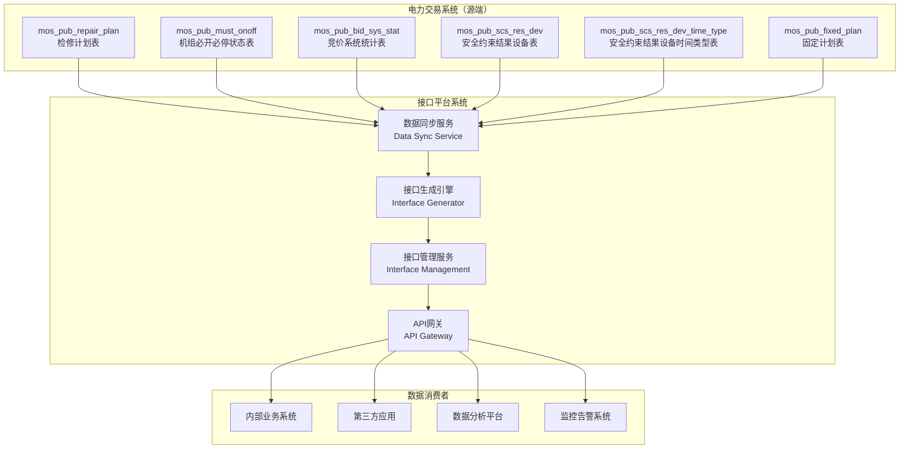
```mermaid
graph TB
    subgraph "电力交易系统（源端）"
        A1[mos_pub_repair_plan<br/>检修计划表]
        A2[mos_pub_must_onoff<br/>机组必开必停状态表]
        A3[mos_pub_bid_sys_stat<br/>竞价系统统计表]
        A4[mos_pub_scs_res_dev<br/>安全约束结果设备表]
        A5[mos_pub_scs_res_dev_time_type<br/>安全约束结果设备时间类型表]
        A6[mos_pub_fixed_plan<br/>固定计划表]
    end

    subgraph "接口平台系统"
        B1[数据同步服务<br/>Data Sync Service]
        B2[接口生成引擎<br/>Interface Generator]
        B3[接口管理服务<br/>Interface Management]
        B4[API网关<br/>API Gateway]
    end

    subgraph "数据消费者"
        C1[内部业务系统]
        C2[第三方应用]
        C3[数据分析平台]
        C4[监控告警系统]
    end

    A1 --> B1
    A2 --> B1
    A3 --> B1
    A4 --> B1
    A5 --> B1
    A6 --> B1

    B1 --> B2
    B2 --> B3
    B3 --> B4

    B4 --> C1
    B4 --> C2
    B4 --> C3
    B4 --> C4
```

**数据流转详细说明**：

```
1. 数据采集层（源端系统）：
   ├── 电力调度系统产生实时运行数据
   ├── 交易系统生成市场交易数据
   ├── 安全约束系统输出约束分析结果
   └── 计划系统发布各类发电计划

2. 数据同步层（接口平台）：
   ├── 增量数据同步（基于UPDATE_TIME/DATA_TIME）
   ├── 数据质量检查和清洗
   ├── 数据格式标准化处理
   └── 异常数据监控和告警

3. 接口生成层（接口平台）：
   ├── 基于源端表结构自动生成接口
   ├── SQL模板化和参数化处理
   ├── 接口文档自动生成
   └── 接口版本管理和发布

4. 接口服务层（接口平台）：
   ├── 统一API网关入口
   ├── 认证授权和权限控制
   ├── 请求限流和熔断保护
   └── 监控日志和性能统计

5. 数据消费层（外部系统）：
   ├── 标准化REST API调用
   ├── 实时数据查询和分析
   ├── 历史数据统计和报表
   └── 业务系统集成和应用
```

**关键数据流转场景**：

```yaml
# 场景1：设备检修计划查询
scenario_1:
  name: "设备检修计划查询"
  source_table: "mos_pub_repair_plan"
  data_flow:
    - step: "调度系统更新检修计划"
      action: "INSERT/UPDATE mos_pub_repair_plan"
      trigger: "UPDATE_TIME字段更新"
    - step: "数据同步服务检测变更"
      action: "增量同步到接口平台"
      interval: "5分钟"
    - step: "接口平台提供查询服务"
      action: "通过/api/v1/repair-plan接口查询"
      parameters: ["startTime", "endTime", "caseType"]
    - step: "业务系统调用接口"
      action: "获取检修计划数据用于调度决策"
      format: "JSON格式响应"

# 场景2：机组状态实时监控
scenario_2:
  name: "机组状态实时监控"
  source_table: "mos_pub_must_onoff"
  data_flow:
    - step: "交易系统发布机组状态"
      action: "UPDATE mos_pub_must_onoff"
      frequency: "每5分钟288个时间点"
    - step: "实时数据同步"
      action: "准实时同步状态数据"
      delay: "<1分钟"
    - step: "状态监控接口调用"
      action: "通过/api/v1/unit-onoff-status查询"
      usage: "监控系统实时展示"
    - step: "告警系统集成"
      action: "异常状态触发告警"
      threshold: "基于status值判断"

# 场景3：市场数据分析
scenario_3:
  name: "电力市场数据分析"
  source_table: "mos_pub_bid_sys_stat"
  data_flow:
    - step: "竞价系统生成统计数据"
      action: "INSERT mos_pub_bid_sys_stat"
      granularity: "96个15分钟时间点"
    - step: "历史数据积累"
      action: "按日期维度存储"
      retention: "365天"
    - step: "分析接口提供服务"
      action: "支持时间范围和维度查询"
      analytics: "趋势分析、对比分析"
    - step: "报表系统数据展示"
      action: "生成市场分析报表"
      visualization: "图表、趋势线、热力图"
```

**数据质量保障机制**：

```
数据完整性检查：
├── 主键唯一性验证
├── 必填字段非空检查
├── 数据类型格式验证
└── 业务逻辑一致性校验

数据时效性保障：
├── 实时监控UPDATE_TIME字段
├── 数据延迟告警机制
├── 同步失败重试策略
└── 数据补偿和修复机制

数据安全性控制：
├── 源端数据只读访问
├── 敏感数据脱敏处理
├── 访问权限精细化控制
└── 操作审计日志记录
```

### 9.5 数据字典完整定义

#### 9.4.1 枚举值字典

**用户状态枚举**：

```sql
CREATE TABLE enum_user_status (
    code TINYINT PRIMARY KEY COMMENT '状态码',
    name VARCHAR(20) NOT NULL COMMENT '状态名称',
    description VARCHAR(100) COMMENT '状态描述',
    color VARCHAR(10) COMMENT '显示颜色'
) COMMENT='用户状态枚举';

INSERT INTO enum_user_status VALUES
(0, '禁用', '用户被管理员禁用，无法登录系统', '#ff4d4f'),
(1, '启用', '用户正常状态，可以正常使用系统', '#52c41a'),
(2, '锁定', '用户因异常操作被临时锁定', '#faad14');
```

**接口状态枚举**：

```sql
CREATE TABLE enum_interface_status (
    code VARCHAR(20) PRIMARY KEY COMMENT '状态码',
    name VARCHAR(20) NOT NULL COMMENT '状态名称',
    description VARCHAR(100) COMMENT '状态描述',
    color VARCHAR(10) COMMENT '显示颜色',
    allow_call TINYINT DEFAULT 0 COMMENT '是否允许调用'
) COMMENT='接口状态枚举';

INSERT INTO enum_interface_status VALUES
('unpublished', '未上架', '接口已生成但未发布，不可调用', '#d9d9d9', 0),
('published', '已上架', '接口已发布，可以正常调用', '#52c41a', 1),
('offline', '已下架', '接口被下架，暂停调用', '#ff4d4f', 0),
('deprecated', '已废弃', '接口版本过期，建议升级', '#faad14', 0);
```

**申请状态枚举**：

```sql
CREATE TABLE enum_application_status (
    code VARCHAR(20) PRIMARY KEY COMMENT '状态码',
    name VARCHAR(20) NOT NULL COMMENT '状态名称',
    description VARCHAR(100) COMMENT '状态描述',
    color VARCHAR(10) COMMENT '显示颜色',
    is_final TINYINT DEFAULT 0 COMMENT '是否最终状态'
) COMMENT='申请状态枚举';

INSERT INTO enum_application_status VALUES
('pending', '待审批', '申请已提交，等待审批人处理', '#1890ff', 0),
('approved', '已通过', '申请审批通过，用户获得接口权限', '#52c41a', 1),
('rejected', '已拒绝', '申请被拒绝，用户未获得权限', '#ff4d4f', 1),
('cancelled', '已取消', '用户主动取消申请', '#d9d9d9', 1);
```

#### 9.4.2 数据类型字典

**参数类型定义**：

```sql
CREATE TABLE param_type_definitions (
    type_code VARCHAR(20) PRIMARY KEY COMMENT '类型代码',
    type_name VARCHAR(50) NOT NULL COMMENT '类型名称',
    java_type VARCHAR(50) COMMENT 'Java类型',
    mysql_type VARCHAR(50) COMMENT 'MySQL类型',
    validation_pattern VARCHAR(255) COMMENT '验证正则',
    default_validation JSON COMMENT '默认验证规则',
    example_value VARCHAR(100) COMMENT '示例值'
) COMMENT='参数类型定义表';

INSERT INTO param_type_definitions VALUES
('string', '字符串', 'String', 'VARCHAR', '^.{0,255}$', '{"maxLength": 255}', 'example_string'),
('integer', '整数', 'Integer', 'INT', '^-?\\d+$', '{"min": -2147483648, "max": 2147483647}', '123'),
('long', '长整数', 'Long', 'BIGINT', '^-?\\d+$', '{"min": -9223372036854775808, "max": 9223372036854775807}', '1234567890'),
('decimal', '小数', 'BigDecimal', 'DECIMAL', '^-?\\d+(\\.\\d+)?$', '{"precision": 10, "scale": 2}', '123.45'),
('boolean', '布尔值', 'Boolean', 'TINYINT', '^(true|false|0|1)$', '{}', 'true'),
('date', '日期', 'LocalDate', 'DATE', '^\\d{4}-\\d{2}-\\d{2}$', '{"format": "yyyy-MM-dd"}', '2024-01-15'),
('datetime', '日期时间', 'LocalDateTime', 'DATETIME', '^\\d{4}-\\d{2}-\\d{2} \\d{2}:\\d{2}:\\d{2}$', '{"format": "yyyy-MM-dd HH:mm:ss"}', '2024-01-15 10:30:00'),
('json', 'JSON对象', 'Object', 'JSON', '^\\{.*\\}$', '{}', '{"key": "value"}');
```

#### 9.4.3 业务规则字典

**业务约束规则表**：

```sql
CREATE TABLE business_rules (
    id INT PRIMARY KEY AUTO_INCREMENT COMMENT '规则ID',
    rule_code VARCHAR(50) NOT NULL UNIQUE COMMENT '规则代码',
    rule_name VARCHAR(100) NOT NULL COMMENT '规则名称',
    rule_type VARCHAR(20) NOT NULL COMMENT '规则类型',
    target_table VARCHAR(50) COMMENT '目标表',
    target_field VARCHAR(50) COMMENT '目标字段',
    rule_expression TEXT NOT NULL COMMENT '规则表达式',
    error_message VARCHAR(255) COMMENT '错误提示信息',
    is_active TINYINT DEFAULT 1 COMMENT '是否启用',
    priority INT DEFAULT 0 COMMENT '优先级',
    created_at DATETIME DEFAULT CURRENT_TIMESTAMP COMMENT '创建时间'
) COMMENT='业务规则定义表';

INSERT INTO business_rules VALUES
(1, 'username_format', '用户名格式检查', 'validation', 'users', 'username', '^[a-zA-Z][a-zA-Z0-9_]{2,49}$', '用户名必须以字母开头，3-50字符，只能包含字母数字下划线', 1, 1, NOW()),
(2, 'password_strength', '密码强度检查', 'validation', 'users', 'password', '^(?=.*[a-z])(?=.*[A-Z])(?=.*\\d)(?=.*[@$!%*?&])[A-Za-z\\d@$!%*?&]{8,}$', '密码至少8位，包含大小写字母、数字和特殊字符', 1, 1, NOW()),
(3, 'interface_name_unique', '接口名称唯一性', 'uniqueness', 'interfaces', 'name', 'UNIQUE', '接口名称已存在，请使用其他名称', 1, 1, NOW()),
(4, 'interface_path_format', '接口路径格式', 'validation', 'interfaces', 'path', '^/[a-zA-Z0-9/_-]+$', '接口路径格式错误，必须以/开头，只能包含字母数字下划线和连字符', 1, 1, NOW()),
(5, 'daily_application_limit', '每日申请限制', 'business', 'subscription_applications', 'user_id', 'COUNT(*) <= 10 WHERE DATE(applied_at) = CURDATE()', '每日最多申请10个接口', 1, 2, NOW());
```

## 10. 前端组件规范

### 10.1 组件架构设计

#### 10.1.1 组件分层架构

**组件层次结构**：

```
页面层（Pages）：
- 路由页面组件
- 业务逻辑整合
- 数据流管理
- 页面级状态管理

容器层（Containers）：
- 业务容器组件
- 数据获取和处理
- 子组件协调
- 业务状态管理

组件层（Components）：
- 可复用UI组件
- 纯展示组件
- 交互逻辑封装
- 属性验证

基础层（Base）：
- 原子级组件
- 样式系统
- 工具函数
- 常量定义
```

**组件命名规范**：

```javascript
// 页面组件：PascalCase + Page后缀
InterfaceCatalogPage.vue
InterfaceManagementPage.vue
UserCenterPage.vue

// 业务组件：PascalCase + 业务含义
InterfaceGenerationWizard.vue
SubscriptionApplicationForm.vue
ApprovalHistoryTable.vue

// 基础组件：Base + PascalCase
BaseButton.vue
BaseTable.vue
BaseModal.vue

// 布局组件：Layout + PascalCase
LayoutHeader.vue
LayoutSidebar.vue
LayoutContent.vue
```

#### 10.1.2 状态管理架构

**Pinia Store设计**：

```javascript
// stores/index.js - 状态管理入口
import { createPinia } from 'pinia'
import { createPersistedState } from 'pinia-plugin-persistedstate'

const pinia = createPinia()
pinia.use(createPersistedState({
  storage: localStorage,
  serializer: {
    serialize: JSON.stringify,
    deserialize: JSON.parse
  }
}))

export default pinia

// stores/modules/user.js - 用户状态管理
import { defineStore } from 'pinia'
import { userApi } from '@/api/user'

export const useUserStore = defineStore('user', {
  state: () => ({
    userInfo: null,
    token: null,
    permissions: [],
    roles: [],
    isLoggedIn: false,
    loginLoading: false
  }),
  
  getters: {
    // 用户权限检查
    hasPermission: (state) => (permission) => {
      return state.permissions.includes(permission)
    },
    
    // 用户角色检查
    hasRole: (state) => (role) => {
      return state.roles.includes(role)
    },
    
    // 用户显示名称
    displayName: (state) => {
      return state.userInfo?.real_name || state.userInfo?.username || '未知用户'
    },
    
    // 用户头像URL
    avatarUrl: (state) => {
      return state.userInfo?.avatar_url || '/default-avatar.png'
    }
  },
  
  actions: {
    // 用户登录
    async login(credentials) {
      this.loginLoading = true
      try {
        const response = await userApi.login(credentials)
        const { token, user, permissions, roles } = response.data
        
        this.token = token
        this.userInfo = user
        this.permissions = permissions
        this.roles = roles
        this.isLoggedIn = true
        
        // 设置axios默认token
        this.setAuthToken(token)
        
        return { success: true }
      } catch (error) {
        return { 
          success: false, 
          message: error.response?.data?.message || '登录失败' 
        }
      } finally {
        this.loginLoading = false
      }
    },
    
    // 用户登出
    async logout() {
      try {
        await userApi.logout()
      } catch (error) {
        console.error('登出请求失败:', error)
      } finally {
        this.clearUserData()
      }
    },
    
    // 清除用户数据
    clearUserData() {
      this.userInfo = null
      this.token = null
      this.permissions = []
      this.roles = []
      this.isLoggedIn = false
      this.removeAuthToken()
    },
    
    // 设置认证token
    setAuthToken(token) {
      // 设置axios请求头
      if (token) {
        axios.defaults.headers.common['Authorization'] = `Bearer ${token}`
      }
    },
    
    // 移除认证token
    removeAuthToken() {
      delete axios.defaults.headers.common['Authorization']
    },
    
    // 刷新用户信息
    async refreshUserInfo() {
      try {
        const response = await userApi.getCurrentUser()
        this.userInfo = response.data
      } catch (error) {
        console.error('刷新用户信息失败:', error)
      }
    }
  },
  
  // 持久化配置
  persist: {
    key: 'user-store',
    storage: localStorage,
    paths: ['token', 'userInfo', 'permissions', 'roles', 'isLoggedIn']
  }
})
```

**接口管理状态**：

```javascript
// stores/modules/interface.js
export const useInterfaceStore = defineStore('interface', {
  state: () => ({
    // 接口列表数据
    interfaces: [],
    categories: [],
    
    // 分页信息
    pagination: {
      current: 1,
      pageSize: 20,
      total: 0
    },
    
    // 筛选条件
    filters: {
      status: '',
      category: '',
      keyword: ''
    },
    
    // 加载状态
    loading: {
      list: false,
      detail: false,
      operation: false
    },
    
    // 当前选中的接口
    selectedInterfaces: [],
    
    // 接口详情
    currentInterface: null
  }),
  
  getters: {
    // 已发布接口数量
    publishedCount: (state) => {
      return state.interfaces.filter(item => item.status === 'published').length
    },
    
    // 未发布接口数量
    unpublishedCount: (state) => {
      return state.interfaces.filter(item => item.status === 'unpublished').length
    },
    
    // 按分类分组的接口
    interfacesByCategory: (state) => {
      const grouped = {}
      state.interfaces.forEach(item => {
        const category = item.category_name || '未分类'
        if (!grouped[category]) {
          grouped[category] = []
        }
        grouped[category].push(item)
      })
      return grouped
    }
  },
  
  actions: {
    // 获取接口列表
    async fetchInterfaces(params = {}) {
      this.loading.list = true
      try {
        const queryParams = {
          page: this.pagination.current,
          size: this.pagination.pageSize,
          ...this.filters,
          ...params
        }
        
        const response = await interfaceApi.getList(queryParams)
        const { records, total, current, size } = response.data
        
        this.interfaces = records
        this.pagination = { current, size, total }
        
        return { success: true }
      } catch (error) {
        return { 
          success: false, 
          message: error.response?.data?.message || '获取接口列表失败' 
        }
      } finally {
        this.loading.list = false
      }
    },
    
    // 获取接口分类
    async fetchCategories() {
      try {
        const response = await interfaceApi.getCategories()
        this.categories = response.data
      } catch (error) {
        console.error('获取分类失败:', error)
      }
    },
    
    // 批量操作接口
    async batchOperation(operation, interfaceIds, reason = '') {
      this.loading.operation = true
      try {
        const response = await interfaceApi.batchOperation({
          operation,
          interface_ids: interfaceIds,
          reason
        })
        
        // 刷新列表
        await this.fetchInterfaces()
        
        return { 
          success: true, 
          data: response.data 
        }
      } catch (error) {
        return { 
          success: false, 
          message: error.response?.data?.message || '批量操作失败' 
        }
      } finally {
        this.loading.operation = false
      }
    },
    
    // 更新筛选条件
    updateFilters(newFilters) {
      this.filters = { ...this.filters, ...newFilters }
      this.pagination.current = 1 // 重置到第一页
    },
    
    // 更新分页
    updatePagination(newPagination) {
      this.pagination = { ...this.pagination, ...newPagination }
    },
    
    // 选择接口
    selectInterfaces(interfaceIds) {
      this.selectedInterfaces = interfaceIds
    },
    
    // 清空选择
    clearSelection() {
      this.selectedInterfaces = []
    }
  }
})
```

### 10.2 核心组件设计

#### 10.2.1 接口生成向导组件

**InterfaceGenerationWizard.vue**：

```vue
<template>
  <div class="interface-generation-wizard">
    <!-- 步骤导航 -->
    <div class="wizard-steps">
      <div 
        v-for="(step, index) in steps" 
        :key="step.key"
        :class="[
          'step-item',
          { 
            'active': currentStep === index,
            'completed': index < currentStep,
            'disabled': index > currentStep
          }
        ]"
        @click="handleStepClick(index)"
      >
        <div class="step-number">
          <i v-if="index < currentStep" class="icon-check"></i>
          <span v-else>{{ index + 1 }}</span>
        </div>
        <div class="step-content">
          <div class="step-title">{{ step.title }}</div>
          <div class="step-description">{{ step.description }}</div>
        </div>
      </div>
    </div>
    
    <!-- 步骤内容 -->
    <div class="wizard-content">
      <transition name="slide-fade" mode="out-in">
        <component 
          :is="currentStepComponent"
          v-model="formData"
          :loading="loading"
          :errors="errors"
          @validate="handleStepValidate"
          @next="handleNext"
          @prev="handlePrev"
        />
      </transition>
    </div>
    
    <!-- 操作按钮 -->
    <div class="wizard-actions">
      <base-button 
        v-if="currentStep > 0"
        type="default"
        @click="handlePrev"
      >
        上一步
      </base-button>
      
      <base-button 
        v-if="currentStep < steps.length - 1"
        type="primary"
        :loading="loading"
        :disabled="!currentStepValid"
        @click="handleNext"
      >
        下一步
      </base-button>
      
      <base-button 
        v-if="currentStep === steps.length - 1"
        type="primary"
        :loading="loading"
        @click="handleSubmit"
      >
        生成接口
      </base-button>
    </div>
  </div>
</template>

<script setup>
import { ref, computed, watch } from 'vue'
import { useRouter } from 'vue-router'
import { useInterfaceStore } from '@/stores/modules/interface'
import { interfaceApi } from '@/api/interface'

// 组件引入
import DataSourceSelection from './steps/DataSourceSelection.vue'
import InterfaceConfiguration from './steps/InterfaceConfiguration.vue'
import ParameterSettings from './steps/ParameterSettings.vue'
import PreviewConfirmation from './steps/PreviewConfirmation.vue'

// Props定义
const props = defineProps({
  initialData: {
    type: Object,
    default: () => ({})
  }
})

// Emits定义
const emit = defineEmits(['success', 'cancel'])

// 响应式数据
const router = useRouter()
const interfaceStore = useInterfaceStore()

const currentStep = ref(0)
const loading = ref(false)
const errors = ref({})
const currentStepValid = ref(false)

// 步骤配置
const steps = [
  {
    key: 'datasource',
    title: '选择数据源',
    description: '选择数据源和数据表',
    component: DataSourceSelection
  },
  {
    key: 'configuration',
    title: '接口配置',
    description: '配置接口基本信息',
    component: InterfaceConfiguration
  },
  {
    key: 'parameters',
    title: '参数设置',
    description: '设置接口参数',
    component: ParameterSettings
  },
  {
    key: 'preview',
    title: '预览确认',
    description: '预览并确认配置',
    component: PreviewConfirmation
  }
]

// 表单数据
const formData = ref({
  // 数据源选择
  dataSource: null,
  tableName: '',
  tableInfo: null,
  
  // 接口配置
  interfaceName: '',
  interfaceDescription: '',
  interfacePath: '',
  category: null,
  
  // 参数设置
  parameters: [],
  sqlTemplate: '',
  
  // 其他配置
  rateLimit: 1000,
  timeout: 30,
  cacheTtl: 300,
  
  ...props.initialData
})

// 计算属性
const currentStepComponent = computed(() => {
  return steps[currentStep.value]?.component
})

// 事件处理
const handleStepClick = (index) => {
  // 只允许点击已完成的步骤
  if (index < currentStep.value) {
    currentStep.value = index
  }
}

const handleStepValidate = (valid, stepErrors = {}) => {
  currentStepValid.value = valid
  errors.value = stepErrors
}

const handleNext = async () => {
  if (!currentStepValid.value) {
    return
  }
  
  // 执行当前步骤的特殊逻辑
  const stepKey = steps[currentStep.value].key
  
  if (stepKey === 'datasource') {
    // 数据源选择完成后，自动生成接口名称和路径
    await generateInterfaceDefaults()
  } else if (stepKey === 'configuration') {
    // 接口配置完成后，生成SQL模板
    await generateSqlTemplate()
  }
  
  currentStep.value++
}

const handlePrev = () => {
  if (currentStep.value > 0) {
    currentStep.value--
  }
}

const handleSubmit = async () => {
  loading.value = true
  try {
    const response = await interfaceApi.generate(formData.value)
    
    emit('success', response.data)
    
    // 跳转到接口管理页面
    router.push({
      name: 'InterfaceManagement',
      query: { highlight: response.data.id }
    })
  } catch (error) {
    console.error('接口生成失败:', error)
    // 显示错误信息
  } finally {
    loading.value = false
  }
}

// 辅助方法
const generateInterfaceDefaults = async () => {
  const { tableName, tableInfo } = formData.value
  
  if (!tableName || !tableInfo) return
  
  // 根据表名和表类型生成接口名称
  const tableType = detectTableType(tableInfo)
  formData.value.interfaceName = generateInterfaceName(tableName, tableType)
  formData.value.interfacePath = generateInterfacePath(tableName)
}

const generateSqlTemplate = () => {
  const { tableName, parameters } = formData.value
  
  let sql = `SELECT * FROM ${tableName} WHERE 1=1`
  
  parameters.forEach(param => {
    if (param.isRequired) {
      sql += `\n  AND ${param.name} = #{${param.name}}`
    } else {
      sql += `\n  <if test="${param.name} != null">AND ${param.name} = #{${param.name}}</if>`
    }
  })
  
  formData.value.sqlTemplate = sql
}

const detectTableType = (tableInfo) => {
  const columns = tableInfo.columns || []
  const columnNames = columns.map(col => col.name.toLowerCase())
  
  if (columnNames.some(name => /^value\d+$/.test(name))) {
    return 'hourly_data'
  } else if (columnNames.some(name => /^p\d+$/.test(name))) {
    return 'timeseries'
  } else if (columnNames.includes('devname') && columnNames.includes('devtype')) {
    return 'device_info'
  } else {
    return 'general'
  }
}

const generateInterfaceName = (tableName, tableType) => {
  const typeMap = {
    hourly_data: '小时数据查询',
    timeseries: '时间序列数据查询',
    device_info: '设备信息查询',
    general: '数据查询'
  }
  
  return `${tableName}${typeMap[tableType] || typeMap.general}`
}

const generateInterfacePath = (tableName) => {
  // 转换为驼峰命名
  const camelCase = tableName.replace(/_([a-z])/g, (match, letter) => letter.toUpperCase())
  return `/px-phzhb-external-share/dataproduct/${camelCase}`
}

// 监听器
watch(() => props.initialData, (newData) => {
  if (newData) {
    formData.value = { ...formData.value, ...newData }
  }
}, { immediate: true })
</script>

<style scoped>
.interface-generation-wizard {
  max-width: 1200px;
  margin: 0 auto;
  padding: 24px;
}

.wizard-steps {
  display: flex;
  justify-content: space-between;
  margin-bottom: 32px;
  padding: 0 20px;
}

.step-item {
  display: flex;
  align-items: center;
  flex: 1;
  cursor: pointer;
  transition: all 0.3s ease;
}

.step-item:not(:last-child)::after {
  content: '';
  flex: 1;
  height: 2px;
  background: #e8e8e8;
  margin: 0 16px;
  transition: background-color 0.3s ease;
}

.step-item.completed::after {
  background: #52c41a;
}

.step-number {
  width: 32px;
  height: 32px;
  border-radius: 50%;
  display: flex;
  align-items: center;
  justify-content: center;
  background: #e8e8e8;
  color: #999;
  font-weight: 500;
  transition: all 0.3s ease;
}

.step-item.active .step-number {
  background: #1890ff;
  color: white;
}

.step-item.completed .step-number {
  background: #52c41a;
  color: white;
}

.step-content {
  margin-left: 12px;
}

.step-title {
  font-size: 14px;
  font-weight: 500;
  color: #333;
  margin-bottom: 4px;
}

.step-description {
  font-size: 12px;
  color: #666;
}

.wizard-content {
  min-height: 400px;
  margin-bottom: 24px;
}

.wizard-actions {
  display: flex;
  justify-content: flex-end;
  gap: 12px;
  padding-top: 24px;
  border-top: 1px solid #e8e8e8;
}

/* 过渡动画 */
.slide-fade-enter-active,
.slide-fade-leave-active {
  transition: all 0.3s ease;
}

.slide-fade-enter-from {
  transform: translateX(30px);
  opacity: 0;
}

.slide-fade-leave-to {
  transform: translateX(-30px);
  opacity: 0;
}
</style>
```

#### 10.2.2 数据表格组件

**BaseTable.vue**：

```vue
<template>
  <div class="base-table">
    <!-- 表格工具栏 -->
    <div v-if="showToolbar" class="table-toolbar">
      <div class="toolbar-left">
        <slot name="toolbar-left">
          <div v-if="selectable && selectedRows.length > 0" class="selection-info">
            已选择 {{ selectedRows.length }} 项
            <base-button 
              type="link" 
              size="small" 
              @click="clearSelection"
            >
              清空
            </base-button>
          </div>
        </slot>
      </div>
      
      <div class="toolbar-right">
        <slot name="toolbar-right">
          <!-- 刷新按钮 -->
          <base-button 
            type="text" 
            :loading="loading"
            @click="handleRefresh"
          >
            <i class="icon-refresh"></i>
          </base-button>
          
          <!-- 列设置 -->
          <base-dropdown v-if="columnSettable">
            <base-button type="text">
              <i class="icon-setting"></i>
            </base-button>
            <template #dropdown>
              <div class="column-settings">
                <div 
                  v-for="column in columns" 
                  :key="column.key"
                  class="column-setting-item"
                >
                  <base-checkbox 
                    v-model="column.visible"
                    @change="handleColumnVisibilityChange"
                  >
                    {{ column.title }}
                  </base-checkbox>
                </div>
              </div>
            </template>
          </base-dropdown>
        </slot>
      </div>
    </div>
    
    <!-- 表格主体 -->
    <div class="table-container">
      <table class="table">
        <thead>
          <tr>
            <!-- 选择列 -->
            <th v-if="selectable" class="selection-column">
              <base-checkbox 
                :checked="isAllSelected"
                :indeterminate="isIndeterminate"
                @change="handleSelectAll"
              />
            </th>
            
            <!-- 数据列 -->
            <th 
              v-for="column in visibleColumns" 
              :key="column.key"
              :class="[
                'table-header',
                {
                  'sortable': column.sortable,
                  'sorted': sortField === column.key
                }
              ]"
              :style="{ width: column.width }"
              @click="handleSort(column)"
            >
              <div class="header-content">
                <span>{{ column.title }}</span>
                <div v-if="column.sortable" class="sort-icons">
                  <i 
                    :class="[
                      'icon-caret-up',
                      { 'active': sortField === column.key && sortOrder === 'asc' }
                    ]"
                  ></i>
                  <i 
                    :class="[
                      'icon-caret-down',
                      { 'active': sortField === column.key && sortOrder === 'desc' }
                    ]"
                  ></i>
                </div>
              </div>
            </th>
          </tr>
        </thead>
        
        <tbody>
          <!-- 加载状态 -->
          <tr v-if="loading">
            <td :colspan="totalColumns" class="loading-row">
              <div class="loading-content">
                <i class="icon-loading spinning"></i>
                <span>加载中...</span>
              </div>
            </td>
          </tr>
          
          <!-- 空数据状态 -->
          <tr v-else-if="!data || data.length === 0">
            <td :colspan="totalColumns" class="empty-row">
              <div class="empty-content">
                <slot name="empty">
                  <i class="icon-empty"></i>
                  <p>暂无数据</p>
                </slot>
              </div>
            </td>
          </tr>
          
          <!-- 数据行 -->
          <tr 
            v-else
            v-for="(row, index) in data" 
            :key="getRowKey(row, index)"
            :class="[
              'table-row',
              {
                'selected': selectedRowKeys.includes(getRowKey(row, index)),
                'hover': hoverable
              }
            ]"
            @click="handleRowClick(row, index)"
            @mouseenter="handleRowHover(row, index, true)"
            @mouseleave="handleRowHover(row, index, false)"
          >
            <!-- 选择列 -->
            <td v-if="selectable" class="selection-column">
              <base-checkbox 
                :checked="selectedRowKeys.includes(getRowKey(row, index))"
                @change="handleRowSelect(row, index, $event)"
                @click.stop
              />
            </td>
            
            <!-- 数据列 -->
            <td 
              v-for="column in visibleColumns" 
              :key="column.key"
              :class="['table-cell', column.align ? `text-${column.align}` : '']"
            >
              <slot 
                :name="column.key" 
                :row="row" 
                :column="column" 
                :index="index"
              >
                {{ getCellValue(row, column) }}
              </slot>
            </td>
          </tr>
        </tbody>
      </table>
    </div>
    
    <!-- 分页器 -->
    <div v-if="pagination && !loading" class="table-pagination">
      <base-pagination 
        v-model:current="currentPage"
        v-model:page-size="currentPageSize"
        :total="pagination.total"
        :show-size-changer="pagination.showSizeChanger"
        :show-quick-jumper="pagination.showQuickJumper"
        :show-total="pagination.showTotal"
        @change="handlePageChange"
        @show-size-change="handlePageSizeChange"
      />
    </div>
  </div>
</template>

<script setup>
import { ref, computed, watch } from 'vue'

// Props定义
const props = defineProps({
  // 表格数据
  data: {
    type: Array,
    default: () => []
  },
  
  // 列配置
  columns: {
    type: Array,
    required: true
  },
  
  // 行键
  rowKey: {
    type: [String, Function],
    default: 'id'
  },
  
  // 加载状态
  loading: {
    type: Boolean,
    default: false
  },
  
  // 是否可选择
  selectable: {
    type: Boolean,
    default: false
  },
  
  // 选中的行键
  selectedRowKeys: {
    type: Array,
    default: () => []
  },
  
  // 分页配置
  pagination: {
    type: [Object, Boolean],
    default: false
  },
  
  // 是否显示工具栏
  showToolbar: {
    type: Boolean,
    default: true
  },
  
  // 是否可设置列
  columnSettable: {
    type: Boolean,
    default: true
  },
  
  // 是否可悬停
  hoverable: {
    type: Boolean,
    default: true
  },
  
  // 排序字段
  sortField: {
    type: String,
    default: ''
  },
  
  // 排序顺序
  sortOrder: {
    type: String,
    default: ''
  }
})

// Emits定义
const emit = defineEmits([
  'update:selectedRowKeys',
  'update:sortField',
  'update:sortOrder',
  'row-click',
  'row-select',
  'select-all',
  'sort-change',
  'page-change',
  'refresh'
])

// 响应式数据
const currentPage = ref(props.pagination?.current || 1)
const currentPageSize = ref(props.pagination?.pageSize || 20)

// 计算属性
const visibleColumns = computed(() => {
  return props.columns.filter(column => column.visible !== false)
})

const totalColumns = computed(() => {
  let count = visibleColumns.value.length
  if (props.selectable) count++
  return count
})

const selectedRows = computed(() => {
  return props.data.filter((row, index) => {
    return props.selectedRowKeys.includes(getRowKey(row, index))
  })
})

const isAllSelected = computed(() => {
  return props.data.length > 0 && selectedRows.value.length === props.data.length
})

const isIndeterminate = computed(() => {
  return selectedRows.value.length > 0 && selectedRows.value.length < props.data.length
})

// 方法
const getRowKey = (row, index) => {
  if (typeof props.rowKey === 'function') {
    return props.rowKey(row, index)
  }
  return row[props.rowKey] || index
}

const getCellValue = (row, column) => {
  if (column.render) {
    return column.render(row[column.key], row, column)
  }
  
  const keys = column.key.split('.')
  let value = row
  
  for (const key of keys) {
    value = value?.[key]
    if (value === undefined || value === null) break
  }
  
  return value
}

const handleRowClick = (row, index) => {
  emit('row-click', row, index)
}

const handleRowHover = (row, index, isEnter) => {
  // 可以在这里处理悬停效果
}

const handleRowSelect = (row, index, checked) => {
  const rowKey = getRowKey(row, index)
  let newSelectedKeys = [...props.selectedRowKeys]
  
  if (checked) {
    if (!newSelectedKeys.includes(rowKey)) {
      newSelectedKeys.push(rowKey)
    }
  } else {
    newSelectedKeys = newSelectedKeys.filter(key => key !== rowKey)
  }
  
  emit('update:selectedRowKeys', newSelectedKeys)
  emit('row-select', row, index, checked, selectedRows.value)
}

const handleSelectAll = (checked) => {
  let newSelectedKeys = []
  
  if (checked) {
    newSelectedKeys = props.data.map((row, index) => getRowKey(row, index))
  }
  
  emit('update:selectedRowKeys', newSelectedKeys)
  emit('select-all', checked, selectedRows.value)
}

const clearSelection = () => {
  emit('update:selectedRowKeys', [])
}

const handleSort = (column) => {
  if (!column.sortable) return
  
  let newSortOrder = 'asc'
  
  if (props.sortField === column.key) {
    if (props.sortOrder === 'asc') {
      newSortOrder = 'desc'
    } else if (props.sortOrder === 'desc') {
      newSortOrder = ''
    }
  }
  
  const newSortField = newSortOrder ? column.key : ''
  
  emit('update:sortField', newSortField)
  emit('update:sortOrder', newSortOrder)
  emit('sort-change', newSortField, newSortOrder, column)
}

const handlePageChange = (page, pageSize) => {
  currentPage.value = page
  currentPageSize.value = pageSize
  emit('page-change', page, pageSize)
}

const handlePageSizeChange = (current, size) => {
  currentPage.value = current
  currentPageSize.value = size
  emit('page-change', current, size)
}

const handleRefresh = () => {
  emit('refresh')
}

const handleColumnVisibilityChange = () => {
  // 列可见性变化处理
}

// 监听器
watch(() => props.pagination?.current, (newVal) => {
  if (newVal !== undefined) {
    currentPage.value = newVal
  }
})

watch(() => props.pagination?.pageSize, (newVal) => {
  if (newVal !== undefined) {
    currentPageSize.value = newVal
  }
})
</script>

<style scoped>
.base-table {
  background: white;
  border-radius: 6px;
  overflow: hidden;
}

.table-toolbar {
  display: flex;
  justify-content: space-between;
  align-items: center;
  padding: 16px;
  border-bottom: 1px solid #e8e8e8;
}

.toolbar-left {
  display: flex;
  align-items: center;
  gap: 12px;
}

.toolbar-right {
  display: flex;
  align-items: center;
  gap: 8px;
}

.selection-info {
  display: flex;
  align-items: center;
  gap: 8px;
  color: #666;
  font-size: 14px;
}

.table-container {
  overflow-x: auto;
}

.table {
  width: 100%;
  border-collapse: collapse;
}

.table-header {
  padding: 12px 16px;
  background: #fafafa;
  border-bottom: 1px solid #e8e8e8;
  font-weight: 500;
  color: #333;
  text-align: left;
}

.table-header.sortable {
  cursor: pointer;
  user-select: none;
}

.table-header.sortable:hover {
  background: #f0f0f0;
}

.header-content {
  display: flex;
  align-items: center;
  justify-content: space-between;
}

.sort-icons {
  display: flex;
  flex-direction: column;
  margin-left: 8px;
}

.sort-icons i {
  font-size: 10px;
  color: #bfbfbf;
  line-height: 1;
}

.sort-icons i.active {
  color: #1890ff;
}

.table-row {
  transition: background-color 0.2s ease;
}

.table-row:hover {
  background: #f5f5f5;
}

.table-row.selected {
  background: #e6f7ff;
}

.table-cell {
  padding: 12px 16px;
  border-bottom: 1px solid #e8e8e8;
  color: #333;
}

.selection-column {
  width: 48px;
  text-align: center;
}

.loading-row,
.empty-row {
  text-align: center;
}

.loading-content,
.empty-content {
  padding: 40px 20px;
  color: #999;
}

.loading-content i {
  margin-right: 8px;
}

.spinning {
  animation: spin 1s linear infinite;
}

@keyframes spin {
  from { transform: rotate(0deg); }
  to { transform: rotate(360deg); }
}

.empty-content i {
  font-size: 48px;
  color: #d9d9d9;
  margin-bottom: 16px;
  display: block;
}

.table-pagination {
  padding: 16px;
  border-top: 1px solid #e8e8e8;
  display: flex;
  justify-content: flex-end;
}

.column-settings {
  padding: 8px;
  min-width: 120px;
}

.column-setting-item {
  padding: 4px 0;
}

.text-left { text-align: left; }
.text-center { text-align: center; }
.text-right { text-align: right; }
</style>
```

### 10.3 交互逻辑规范

#### 10.3.1 用户交互模式

**点击交互规范**：

```javascript
// 按钮点击防抖处理
const useDebounceClick = (fn, delay = 300) => {
  let timer = null
  
  return (...args) => {
    if (timer) clearTimeout(timer)
    timer = setTimeout(() => {
      fn.apply(this, args)
    }, delay)
  }
}

// 使用示例
const handleSubmit = useDebounceClick(async () => {
  // 提交逻辑
}, 500)

// 双击编辑模式
const useDoubleClickEdit = () => {
  const isEditing = ref(false)
  const editValue = ref('')
  
  const startEdit = (value) => {
    isEditing.value = true
    editValue.value = value
  }
  
  const cancelEdit = () => {
    isEditing.value = false
    editValue.value = ''
  }
  
  const confirmEdit = async () => {
    try {
      // 保存逻辑
      await saveValue(editValue.value)
      isEditing.value = false
    } catch (error) {
      // 错误处理
    }
  }
  
  return {
    isEditing,
    editValue,
    startEdit,
    cancelEdit,
    confirmEdit
  }
}
```

**拖拽交互规范**：

```javascript
// 拖拽排序组合式函数
const useDragSort = (list, options = {}) => {
  const {
    onSort = () => {},
    disabled = false,
    handle = null
  } = options
  
  const dragState = reactive({
    dragging: false,
    dragIndex: -1,
    dropIndex: -1
  })
  
  const handleDragStart = (event, index) => {
    if (disabled) return
    
    dragState.dragging = true
    dragState.dragIndex = index
    
    event.dataTransfer.effectAllowed = 'move'
    event.dataTransfer.setData('text/html', event.target.outerHTML)
  }
  
  const handleDragOver = (event, index) => {
    if (!dragState.dragging) return
    
    event.preventDefault()
    dragState.dropIndex = index
  }
  
  const handleDrop = (event, index) => {
    if (!dragState.dragging) return
    
    event.preventDefault()
    
    const { dragIndex } = dragState
    if (dragIndex !== index) {
      // 执行排序
      const newList = [...list.value]
      const dragItem = newList.splice(dragIndex, 1)[0]
      newList.splice(index, 0, dragItem)
      
      list.value = newList
      onSort(newList, dragIndex, index)
    }
    
    // 重置状态
    dragState.dragging = false
    dragState.dragIndex = -1
    dragState.dropIndex = -1
  }
  
  return {
    dragState,
    handleDragStart,
    handleDragOver,
    handleDrop
  }
}
```

#### 10.3.2 表单交互规范

**表单验证交互**：

```javascript
// 表单验证组合式函数
const useFormValidation = (rules) => {
  const errors = ref({})
  const isValidating = ref(false)
  
  const validateField = async (field, value) => {
    const fieldRules = rules[field]
    if (!fieldRules) return true
    
    for (const rule of fieldRules) {
      try {
        if (rule.required && (!value || value.toString().trim() === '')) {
          throw new Error(rule.message || `${field}不能为空`)
        }
        
        if (rule.pattern && !rule.pattern.test(value)) {
          throw new Error(rule.message || `${field}格式不正确`)
        }
        
        if (rule.validator) {
          await rule.validator(value)
        }
      } catch (error) {
        errors.value[field] = error.message
        return false
      }
    }
    
    delete errors.value[field]
    return true
  }
  
  const validateForm = async (formData) => {
    isValidating.value = true
    errors.value = {}
    
    const validationPromises = Object.keys(rules).map(field => 
      validateField(field, formData[field])
    )
    
    const results = await Promise.all(validationPromises)
    isValidating.value = false
    
    return results.every(result => result)
  }
  
  const clearErrors = () => {
    errors.value = {}
  }
  
  return {
    errors,
    isValidating,
    validateField,
    validateForm,
    clearErrors
  }
}

// 实时验证示例
const formRules = {
  username: [
    { required: true, message: '用户名不能为空' },
    { pattern: /^[a-zA-Z][a-zA-Z0-9_]{2,49}$/, message: '用户名格式不正确' }
  ],
  email: [
    { required: true, message: '邮箱不能为空' },
    { pattern: /^[^\s@]+@[^\s@]+\.[^\s@]+$/, message: '邮箱格式不正确' }
  ],
  password: [
    { required: true, message: '密码不能为空' },
    { 
      validator: (value) => {
        if (value.length < 8) {
          throw new Error('密码长度至少8位')
        }
        if (!/(?=.*[a-z])(?=.*[A-Z])(?=.*\d)/.test(value)) {
          throw new Error('密码必须包含大小写字母和数字')
        }
      }
    }
  ]
}

const { errors, validateField, validateForm } = useFormValidation(formRules)
```

### 10.4 事件处理规范

#### 10.4.1 事件总线设计

**全局事件管理**：

```javascript
// utils/eventBus.js
import { ref } from 'vue'

class EventBus {
  constructor() {
    this.events = new Map()
  }
  
  // 订阅事件
  on(event, callback) {
    if (!this.events.has(event)) {
      this.events.set(event, [])
    }
    this.events.get(event).push(callback)
    
    // 返回取消订阅函数
    return () => this.off(event, callback)
  }
  
  // 取消订阅
  off(event, callback) {
    if (!this.events.has(event)) return
    
    const callbacks = this.events.get(event)
    const index = callbacks.indexOf(callback)
    if (index > -1) {
      callbacks.splice(index, 1)
    }
  }
  
  // 触发事件
  emit(event, ...args) {
    if (!this.events.has(event)) return
    
    const callbacks = this.events.get(event)
    callbacks.forEach(callback => {
      try {
        callback(...args)
      } catch (error) {
        console.error(`事件处理器错误 [${event}]:`, error)
      }
    })
  }
  
  // 一次性事件
  once(event, callback) {
    const onceCallback = (...args) => {
      callback(...args)
      this.off(event, onceCallback)
    }
    this.on(event, onceCallback)
  }
  
  // 清空所有事件
  clear() {
    this.events.clear()
  }
}

export const eventBus = new EventBus()

// 事件常量定义
export const EVENTS = {
  // 用户相关
  USER_LOGIN: 'user:login',
  USER_LOGOUT: 'user:logout',
  USER_INFO_UPDATE: 'user:info-update',
  
  // 接口相关
  INTERFACE_CREATED: 'interface:created',
  INTERFACE_UPDATED: 'interface:updated',
  INTERFACE_DELETED: 'interface:deleted',
  INTERFACE_STATUS_CHANGED: 'interface:status-changed',
  
  // 订阅相关
  SUBSCRIPTION_APPLIED: 'subscription:applied',
  SUBSCRIPTION_APPROVED: 'subscription:approved',
  SUBSCRIPTION_REJECTED: 'subscription:rejected',
  
  // 系统相关
  NOTIFICATION_RECEIVED: 'notification:received',
  SYSTEM_ERROR: 'system:error',
  NETWORK_ERROR: 'network:error'
}
```

**组件事件处理**：

```javascript
// composables/useEventHandler.js
import { onMounted, onUnmounted } from 'vue'
import { eventBus, EVENTS } from '@/utils/eventBus'

export const useEventHandler = () => {
  const unsubscribers = []
  
  const subscribe = (event, handler) => {
    const unsubscribe = eventBus.on(event, handler)
    unsubscribers.push(unsubscribe)
    return unsubscribe
  }
  
  const emit = (event, ...args) => {
    eventBus.emit(event, ...args)
  }
  
  // 组件卸载时自动清理
  onUnmounted(() => {
    unsubscribers.forEach(unsubscribe => unsubscribe())
  })
  
  return {
    subscribe,
    emit,
    EVENTS
  }
}

// 使用示例
export default {
  setup() {
    const { subscribe, emit, EVENTS } = useEventHandler()
    
    // 订阅接口状态变更事件
    subscribe(EVENTS.INTERFACE_STATUS_CHANGED, (interfaceData) => {
      console.log('接口状态变更:', interfaceData)
      // 刷新列表或更新UI
    })
    
    // 触发事件
    const handleInterfacePublish = (interfaceId) => {
      emit(EVENTS.INTERFACE_STATUS_CHANGED, {
        id: interfaceId,
        status: 'published',
        timestamp: Date.now()
      })
    }
    
    return {
      handleInterfacePublish
    }
  }
}
```

### 10.5 数据库表结构设计

### 9.1 核心表DDL语句

#### 9.1.1 用户相关表

```sql
-- 用户表
CREATE TABLE users (
    id BIGINT PRIMARY KEY AUTO_INCREMENT COMMENT '用户ID',
    username VARCHAR(50) NOT NULL UNIQUE COMMENT '用户名',
    email VARCHAR(100) NOT NULL UNIQUE COMMENT '邮箱地址',
    password_hash VARCHAR(255) NOT NULL COMMENT '密码哈希',
    real_name VARCHAR(50) NOT NULL COMMENT '真实姓名',
    phone VARCHAR(20) COMMENT '手机号码',
    department VARCHAR(100) COMMENT '部门',
    position VARCHAR(100) COMMENT '职位',
    status TINYINT DEFAULT 1 COMMENT '状态(0:禁用,1:启用)',
    created_at DATETIME DEFAULT CURRENT_TIMESTAMP COMMENT '创建时间',
    updated_at DATETIME DEFAULT CURRENT_TIMESTAMP ON UPDATE CURRENT_TIMESTAMP COMMENT '更新时间',
    INDEX idx_username (username),
    INDEX idx_email (email),
    INDEX idx_status (status)
) ENGINE=InnoDB DEFAULT CHARSET=utf8mb4 COMMENT='用户表';

-- 角色表
CREATE TABLE roles (
    id INT PRIMARY KEY AUTO_INCREMENT COMMENT '角色ID',
    role_name VARCHAR(50) NOT NULL UNIQUE COMMENT '角色名称',
    role_code VARCHAR(50) NOT NULL UNIQUE COMMENT '角色编码',
    description VARCHAR(200) COMMENT '角色描述',
    permissions JSON COMMENT '权限列表',
    status TINYINT DEFAULT 1 COMMENT '状态(0:禁用,1:启用)',
    created_at DATETIME DEFAULT CURRENT_TIMESTAMP COMMENT '创建时间'
) ENGINE=InnoDB DEFAULT CHARSET=utf8mb4 COMMENT='角色表';

-- 用户角色关联表
CREATE TABLE user_roles (
    id BIGINT PRIMARY KEY AUTO_INCREMENT COMMENT '关联ID',
    user_id BIGINT NOT NULL COMMENT '用户ID',
    role_id INT NOT NULL COMMENT '角色ID',
    assigned_at DATETIME DEFAULT CURRENT_TIMESTAMP COMMENT '分配时间',
    FOREIGN KEY (user_id) REFERENCES users(id) ON DELETE CASCADE,
    FOREIGN KEY (role_id) REFERENCES roles(id) ON DELETE CASCADE,
    UNIQUE KEY uk_user_role (user_id, role_id)
) ENGINE=InnoDB DEFAULT CHARSET=utf8mb4 COMMENT='用户角色关联表';
```

#### 9.1.2 接口管理相关表

```sql


-- 接口分类表
CREATE TABLE interface_categories (
    id INT PRIMARY KEY AUTO_INCREMENT COMMENT '分类ID',
    category_name VARCHAR(50) NOT NULL COMMENT '分类名称',
    category_code VARCHAR(50) NOT NULL UNIQUE COMMENT '分类代码',
    description TEXT COMMENT '分类描述',
    color_code VARCHAR(10) COMMENT '颜色标识',
    sort_order INT DEFAULT 0 COMMENT '排序',
    status TINYINT DEFAULT 1 COMMENT '状态(0:禁用,1:启用)',
    created_at DATETIME DEFAULT CURRENT_TIMESTAMP COMMENT '创建时间',
    INDEX idx_category_code (category_code)
) ENGINE=InnoDB DEFAULT CHARSET=utf8mb4 COMMENT='接口分类表';

-- 接口表
CREATE TABLE interfaces (
    id BIGINT PRIMARY KEY AUTO_INCREMENT COMMENT '接口ID',
    interface_name VARCHAR(200) NOT NULL COMMENT '接口名称',
    interface_path VARCHAR(500) NOT NULL UNIQUE COMMENT '接口路径',
    description TEXT COMMENT '接口描述',
    category_id INT COMMENT '分类ID',
    business_rule_ref VARCHAR(100) COMMENT '对应披露规则编号',
    
    sql_template TEXT NOT NULL COMMENT 'SQL查询模板',
    request_params JSON COMMENT '请求参数定义',
    response_format JSON COMMENT '响应格式定义',
    table_type VARCHAR(50) COMMENT '数据表类型(hourly_24,min5_288,device_info)',
    
    status VARCHAR(20) DEFAULT 'unpublished' COMMENT '接口状态(unpublished:未上架,published:已上架,offline:已下架)',
    created_by BIGINT NOT NULL COMMENT '创建人ID',
    created_at DATETIME DEFAULT CURRENT_TIMESTAMP COMMENT '创建时间',
    updated_at DATETIME DEFAULT CURRENT_TIMESTAMP ON UPDATE CURRENT_TIMESTAMP COMMENT '更新时间',
    published_at DATETIME COMMENT '发布时间',

    FOREIGN KEY (created_by) REFERENCES users(id),
    FOREIGN KEY (category_id) REFERENCES interface_categories(id),
    INDEX idx_interface_path (interface_path),
    INDEX idx_status (status),
    INDEX idx_category_id (category_id),
    INDEX idx_created_by (created_by)
) ENGINE=InnoDB DEFAULT CHARSET=utf8mb4 COMMENT='接口表';

-- 接口参数表
CREATE TABLE interface_parameters (
    id BIGINT PRIMARY KEY AUTO_INCREMENT COMMENT '参数ID',
    interface_id BIGINT NOT NULL COMMENT '接口ID',
    param_name VARCHAR(100) NOT NULL COMMENT '参数名称',
    param_type VARCHAR(50) NOT NULL COMMENT '参数类型',
    param_description VARCHAR(200) COMMENT '参数描述',
    is_required TINYINT DEFAULT 0 COMMENT '是否必填(0:否,1:是)',
    default_value VARCHAR(200) COMMENT '默认值',
    validation_rule VARCHAR(500) COMMENT '验证规则',
    sort_order INT DEFAULT 0 COMMENT '排序',
    FOREIGN KEY (interface_id) REFERENCES interfaces(id) ON DELETE CASCADE,
    INDEX idx_interface_id (interface_id)
) ENGINE=InnoDB DEFAULT CHARSET=utf8mb4 COMMENT='接口参数表';
```

#### 9.1.3 订阅申请相关表

```sql
-- 订阅申请表（简化一级审批）
CREATE TABLE subscription_applications (
    id BIGINT PRIMARY KEY AUTO_INCREMENT COMMENT '申请ID',
    user_id BIGINT NOT NULL COMMENT '申请用户ID',
    interface_id BIGINT NOT NULL COMMENT '接口ID',
    application_reason TEXT NOT NULL COMMENT '申请理由',
    business_scenario TEXT COMMENT '业务场景',
    status VARCHAR(20) DEFAULT 'pending' COMMENT '申请状态：pending(待审批)、approved(通过)、rejected(拒绝)',
    applied_at DATETIME DEFAULT CURRENT_TIMESTAMP COMMENT '申请时间',
    approved_at DATETIME COMMENT '审批时间',
    approved_by BIGINT COMMENT '审批人ID',
    approval_comment TEXT COMMENT '审批意见（拒绝时必填）',
    FOREIGN KEY (user_id) REFERENCES users(id),
    FOREIGN KEY (interface_id) REFERENCES interfaces(id),
    FOREIGN KEY (approved_by) REFERENCES users(id),
    INDEX idx_user_id (user_id),
    INDEX idx_interface_id (interface_id),
    INDEX idx_status (status),
    INDEX idx_applied_at (applied_at)
) ENGINE=InnoDB DEFAULT CHARSET=utf8mb4 COMMENT='订阅申请表';

-- 审批记录表
CREATE TABLE approval_records (
    id BIGINT PRIMARY KEY AUTO_INCREMENT COMMENT '记录ID',
    application_id BIGINT NOT NULL COMMENT '申请ID',
    approver_id BIGINT NOT NULL COMMENT '审批人ID',
    action VARCHAR(20) NOT NULL COMMENT '审批动作(approve,reject)',
    comment TEXT COMMENT '审批意见',
    created_at DATETIME DEFAULT CURRENT_TIMESTAMP COMMENT '审批时间',
    FOREIGN KEY (application_id) REFERENCES subscription_applications(id) ON DELETE CASCADE,
    FOREIGN KEY (approver_id) REFERENCES users(id),
    INDEX idx_application_id (application_id),
    INDEX idx_approver_id (approver_id)
) ENGINE=InnoDB DEFAULT CHARSET=utf8mb4 COMMENT='审批记录表';
```

#### 9.1.4 API密钥和日志表

```sql
-- 用户应用ID表（替代API密钥）
CREATE TABLE user_app_ids (
    id BIGINT PRIMARY KEY AUTO_INCREMENT COMMENT 'ID',
    user_id BIGINT NOT NULL COMMENT '用户ID',
    app_id VARCHAR(32) NOT NULL UNIQUE COMMENT '应用ID',
    app_name VARCHAR(100) COMMENT '应用名称',
    permissions JSON COMMENT '权限范围',
    call_limit_per_day INT DEFAULT 10000 COMMENT '每日调用限制',
    status TINYINT DEFAULT 1 COMMENT '状态(0:禁用,1:启用)',
    created_at DATETIME DEFAULT CURRENT_TIMESTAMP COMMENT '创建时间',
    last_used_at DATETIME COMMENT '最后使用时间',
    expires_at DATETIME COMMENT '过期时间',
    FOREIGN KEY (user_id) REFERENCES users(id) ON DELETE CASCADE,
    INDEX idx_app_id (app_id),
    INDEX idx_user_id (user_id),
    INDEX idx_status (status)
) ENGINE=InnoDB DEFAULT CHARSET=utf8mb4 COMMENT='用户应用ID表';

-- API密钥表（保留兼容）
CREATE TABLE api_keys (
    id BIGINT PRIMARY KEY AUTO_INCREMENT COMMENT '密钥ID',
    user_id BIGINT NOT NULL COMMENT '用户ID',
    api_key VARCHAR(64) NOT NULL UNIQUE COMMENT 'API密钥',
    secret_key VARCHAR(128) NOT NULL COMMENT '签名密钥',
    permissions JSON COMMENT '权限范围',
    expires_at DATETIME COMMENT '过期时间',
    status TINYINT DEFAULT 1 COMMENT '状态(0:禁用,1:启用)',
    created_at DATETIME DEFAULT CURRENT_TIMESTAMP COMMENT '创建时间',
    last_used_at DATETIME COMMENT '最后使用时间',
    FOREIGN KEY (user_id) REFERENCES users(id) ON DELETE CASCADE,
    INDEX idx_api_key (api_key),
    INDEX idx_user_id (user_id),
    INDEX idx_status (status)
) ENGINE=InnoDB DEFAULT CHARSET=utf8mb4 COMMENT='API密钥表';

-- API调用日志表
CREATE TABLE api_call_logs (
    id BIGINT PRIMARY KEY AUTO_INCREMENT COMMENT '日志ID',
    app_id VARCHAR(32) COMMENT '应用ID',
    api_key_id BIGINT COMMENT 'API密钥ID（兼容字段）',
    interface_id BIGINT COMMENT '接口ID',
    request_ip VARCHAR(45) COMMENT '请求IP',
    request_method VARCHAR(10) COMMENT '请求方法',
    request_params TEXT COMMENT '请求参数',
    response_status VARCHAR(10) COMMENT '响应状态（0-成功，其他-失败）',
    response_message VARCHAR(200) COMMENT '响应消息',
    response_body TEXT COMMENT '响应内容',
    response_time_ms INT COMMENT '响应时间(毫秒)',
    created_at DATETIME DEFAULT CURRENT_TIMESTAMP COMMENT '调用时间',
    FOREIGN KEY (api_key_id) REFERENCES api_keys(id),
    FOREIGN KEY (interface_id) REFERENCES interfaces(id),
    INDEX idx_app_id (app_id),
    INDEX idx_api_key_id (api_key_id),
    INDEX idx_interface_id (interface_id),
    INDEX idx_created_at (created_at),
    INDEX idx_request_ip (request_ip)
) ENGINE=InnoDB DEFAULT CHARSET=utf8mb4 COMMENT='API调用日志表';

-- 操作日志表
CREATE TABLE operation_logs (
    id BIGINT PRIMARY KEY AUTO_INCREMENT COMMENT '日志ID',
    user_id BIGINT COMMENT '操作用户ID',
    operation_type VARCHAR(50) NOT NULL COMMENT '操作类型',
    operation_desc VARCHAR(200) NOT NULL COMMENT '操作描述',
    target_type VARCHAR(50) COMMENT '目标类型',
    target_id VARCHAR(100) COMMENT '目标ID',
    operation_data JSON COMMENT '操作数据',
    request_ip VARCHAR(45) COMMENT '请求IP',
    user_agent VARCHAR(500) COMMENT '用户代理',
    created_at DATETIME DEFAULT CURRENT_TIMESTAMP COMMENT '操作时间',
    FOREIGN KEY (user_id) REFERENCES users(id),
    INDEX idx_user_id (user_id),
    INDEX idx_operation_type (operation_type),
    INDEX idx_created_at (created_at)
) ENGINE=InnoDB DEFAULT CHARSET=utf8mb4 COMMENT='操作日志表';

-- 批量操作任务表
CREATE TABLE batch_operation_tasks (
    id BIGINT PRIMARY KEY AUTO_INCREMENT COMMENT '任务ID',
    task_id VARCHAR(64) NOT NULL UNIQUE COMMENT '任务标识',
    user_id BIGINT NOT NULL COMMENT '操作用户ID',
    operation_type VARCHAR(50) NOT NULL COMMENT '操作类型(publish/offline/reject)',
    target_type VARCHAR(50) NOT NULL COMMENT '目标类型(interface)',
    total_count INT NOT NULL COMMENT '总操作数量',
    success_count INT DEFAULT 0 COMMENT '成功数量',
    failed_count INT DEFAULT 0 COMMENT '失败数量',
    status VARCHAR(20) DEFAULT 'running' COMMENT '任务状态(running/completed/failed)',
    operation_reason TEXT COMMENT '操作原因',
    started_at DATETIME DEFAULT CURRENT_TIMESTAMP COMMENT '开始时间',
    completed_at DATETIME COMMENT '完成时间',
    FOREIGN KEY (user_id) REFERENCES users(id),
    INDEX idx_task_id (task_id),
    INDEX idx_user_id (user_id),
    INDEX idx_status (status),
    INDEX idx_started_at (started_at)
) ENGINE=InnoDB DEFAULT CHARSET=utf8mb4 COMMENT='批量操作任务表';

-- 批量操作结果表
CREATE TABLE batch_operation_results (
    id BIGINT PRIMARY KEY AUTO_INCREMENT COMMENT '结果ID',
    task_id VARCHAR(64) NOT NULL COMMENT '任务标识',
    target_id BIGINT NOT NULL COMMENT '目标ID',
    status VARCHAR(20) NOT NULL COMMENT '操作状态(success/failed/skipped)',
    message TEXT COMMENT '操作结果消息',
    error_code VARCHAR(50) COMMENT '错误代码',
    executed_at DATETIME DEFAULT CURRENT_TIMESTAMP COMMENT '执行时间',
    FOREIGN KEY (task_id) REFERENCES batch_operation_tasks(task_id) ON DELETE CASCADE,
    INDEX idx_task_id (task_id),
    INDEX idx_target_id (target_id),
    INDEX idx_status (status)
) ENGINE=InnoDB DEFAULT CHARSET=utf8mb4 COMMENT='批量操作结果表';

-- 通知表
CREATE TABLE notifications (
    id BIGINT PRIMARY KEY AUTO_INCREMENT COMMENT '通知ID',
    user_id BIGINT NOT NULL COMMENT '接收用户ID',
    type VARCHAR(50) NOT NULL COMMENT '通知类型(interface_offline/approval_result/system_notice)',
    title VARCHAR(200) NOT NULL COMMENT '通知标题',
    content TEXT NOT NULL COMMENT '通知内容',
    related_type VARCHAR(50) COMMENT '关联类型(interface/application)',
    related_id BIGINT COMMENT '关联ID',
    status VARCHAR(20) DEFAULT 'unread' COMMENT '读取状态(read/unread)',
    send_methods JSON COMMENT '发送方式(site/email/sms)',
    send_status JSON COMMENT '发送状态',
    created_at DATETIME DEFAULT CURRENT_TIMESTAMP COMMENT '创建时间',
    read_at DATETIME COMMENT '读取时间',
    FOREIGN KEY (user_id) REFERENCES users(id) ON DELETE CASCADE,
    INDEX idx_user_id (user_id),
    INDEX idx_type (type),
    INDEX idx_status (status),
    INDEX idx_created_at (created_at)
) ENGINE=InnoDB DEFAULT CHARSET=utf8mb4 COMMENT='通知表';

-- 通知模板表
CREATE TABLE notification_templates (
    id INT PRIMARY KEY AUTO_INCREMENT COMMENT '模板ID',
    template_code VARCHAR(50) NOT NULL UNIQUE COMMENT '模板编码',
    template_name VARCHAR(100) NOT NULL COMMENT '模板名称',
    type VARCHAR(50) NOT NULL COMMENT '通知类型',
    title_template VARCHAR(200) NOT NULL COMMENT '标题模板',
    content_template TEXT NOT NULL COMMENT '内容模板',
    variables JSON COMMENT '变量定义',
    status TINYINT DEFAULT 1 COMMENT '状态(0:禁用,1:启用)',
    created_at DATETIME DEFAULT CURRENT_TIMESTAMP COMMENT '创建时间',
    updated_at DATETIME DEFAULT CURRENT_TIMESTAMP ON UPDATE CURRENT_TIMESTAMP COMMENT '更新时间',
    INDEX idx_template_code (template_code),
    INDEX idx_type (type)
) ENGINE=InnoDB DEFAULT CHARSET=utf8mb4 COMMENT='通知模板表';
```

### 9.2 初始化数据

```sql
-- 初始化接口分类数据
INSERT INTO interface_categories (category_name, category_code, description, color_code, sort_order) VALUES
('日前现货', 'day_ahead_spot', '日前现货市场相关数据接口', '#1890ff', 1),
('预测', 'forecast', '负荷预测、新能源预测等预测类数据接口', '#52c41a', 2),
('辅助服务', 'ancillary_service', '调频、调压、备用等辅助服务数据接口', '#faad14', 3),
('电网运行', 'grid_operation', '电网运行状态、约束情况等运行数据接口', '#f5222d', 4);

-- 初始化角色数据
INSERT INTO roles (role_name, role_code, description, permissions) VALUES
('数据消费者', 'consumer', '数据消费者角色', '["interface:read", "subscription:apply"]'),
('技术部管理员', 'tech', '技术部管理员角色', '["interface:read", "interface:create", "interface:update", "audit:read"]'),
('结算部管理员', 'finance', '结算部管理员角色', '["interface:read", "interface:publish", "application:approve", "audit:read"]'),
('系统管理员', 'admin', '系统管理员角色', '["*"]');

-- 初始化管理员用户
INSERT INTO users (username, email, password_hash, real_name, department, position) VALUES
('admin', 'admin@powertrading.com', '$2a$10$N.zmdr9k7uOCQb376NoUnuTJ8iAt6Z5EHsM8lE9lBaYMk6j8Ej2Gy', '系统管理员', 'IT部', '系统管理员');

-- 分配管理员角色
INSERT INTO user_roles (user_id, role_id) VALUES (1, 4);

-- 初始化管理员appId
INSERT INTO user_app_ids (user_id, app_id, app_name, permissions, call_limit_per_day) VALUES
(1, 'ADMIN-SYS-001-MGMT', '系统管理应用', '["*"]', 100000);

-- 初始化系统配置
INSERT INTO system_config (config_key, config_value, description) VALUES
('database.connection.maxPoolSize', '20', 'MySQL连接池最大连接数'),
('database.connection.timeout', '30000', 'MySQL连接超时时间(毫秒)');

-- 系统不再使用通知功能，移除通知模板初始化

-- 更新接口状态枚举值
ALTER TABLE interfaces MODIFY COLUMN status VARCHAR(20) DEFAULT 'unpublished' COMMENT '接口状态(unpublished:未上架,published:已上架,offline:已下架)';
```

## 10. 部署架构

### 10.1 容器化部署

#### 10.1.1 Docker Compose配置

```yaml
version: '3.8'

services:
  # 前端应用
  frontend:
    build:
      context: ./frontend
      dockerfile: Dockerfile
    ports:
      - "80:80"
    depends_on:
      - gateway
    networks:
      - power-trading-network

  # API网关
  gateway:
    build:
      context: ./gateway
      dockerfile: Dockerfile
    ports:
      - "8080:8080"
    environment:
      - SPRING_PROFILES_ACTIVE=docker
      - NACOS_SERVER_ADDR=nacos:8848
    depends_on:
      - nacos
    networks:
      - power-trading-network

  # 用户服务
  user-service:
    build:
      context: ./user-service
      dockerfile: Dockerfile
    environment:
      - SPRING_PROFILES_ACTIVE=docker
      - NACOS_SERVER_ADDR=nacos:8848
      - MYSQL_HOST=mysql
    depends_on:
      - mysql
      - nacos
    networks:
      - power-trading-network

  # 接口服务
  interface-service:
    build:
      context: ./interface-service
      dockerfile: Dockerfile
    environment:
      - SPRING_PROFILES_ACTIVE=docker
      - NACOS_SERVER_ADDR=nacos:8848
      - MYSQL_HOST=mysql
    depends_on:
      - mysql
      - nacos
    networks:
      - power-trading-network

  # 审批服务
  approval-service:
    build:
      context: ./approval-service
      dockerfile: Dockerfile
    environment:
      - SPRING_PROFILES_ACTIVE=docker
      - NACOS_SERVER_ADDR=nacos:8848
      - MYSQL_HOST=mysql
    depends_on:
      - mysql
      - nacos
    networks:
      - power-trading-network


  # MySQL数据库
  mysql:
    image: mysql:8.0
    environment:
      - MYSQL_ROOT_PASSWORD=root123
      - MYSQL_DATABASE=power_trading
      - MYSQL_USER=power_user
      - MYSQL_PASSWORD=power123
    volumes:
      - mysql_data:/var/lib/mysql
      - ./sql/init.sql:/docker-entrypoint-initdb.d/init.sql
    ports:
      - "3306:3306"
    networks:
      - power-trading-network

  # Nacos注册中心
  nacos:
    image: nacos/nacos-server:v2.2.0
    environment:
      - MODE=standalone
      - SPRING_DATASOURCE_PLATFORM=mysql
      - MYSQL_SERVICE_HOST=mysql
      - MYSQL_SERVICE_DB_NAME=nacos
      - MYSQL_SERVICE_USER=root
      - MYSQL_SERVICE_PASSWORD=root123
    ports:
      - "8848:8848"
    depends_on:
      - mysql
    networks:
      - power-trading-network

volumes:
  mysql_data:

networks:
  power-trading-network:
    driver: bridge
```

### 10.2 生产环境部署

#### 10.2.1 Kubernetes部署配置

```yaml
# namespace.yaml
apiVersion: v1
kind: Namespace
metadata:
  name: power-trading

---
# configmap.yaml
apiVersion: v1
kind: ConfigMap
metadata:
  name: app-config
  namespace: power-trading
data:
  application.yml: |
    spring:
      profiles:
        active: k8s
      cloud:
        nacos:
          discovery:
            server-addr: nacos-service:8848
          config:
            server-addr: nacos-service:8848
      datasource:
        url: jdbc:mysql://mysql-service:3306/power_trading
        username: power_user
        password: power123

---
# gateway-deployment.yaml
apiVersion: apps/v1
kind: Deployment
metadata:
  name: gateway-deployment
  namespace: power-trading
spec:
  replicas: 2
  selector:
    matchLabels:
      app: gateway
  template:
    metadata:
      labels:
        app: gateway
    spec:
      containers:
      - name: gateway
        image: power-trading/gateway:v1.0
        ports:
        - containerPort: 8080
        env:
        - name: SPRING_PROFILES_ACTIVE
          value: "k8s"
        volumeMounts:
        - name: config-volume
          mountPath: /app/config
        resources:
          requests:
            memory: "512Mi"
            cpu: "500m"
          limits:
            memory: "1Gi"
            cpu: "1000m"
      volumes:
      - name: config-volume
        configMap:
          name: app-config

---
# gateway-service.yaml
apiVersion: v1
kind: Service
metadata:
  name: gateway-service
  namespace: power-trading
spec:
  selector:
    app: gateway
  ports:
  - protocol: TCP
    port: 8080
    targetPort: 8080
  type: LoadBalancer
```

## 11. 监控与运维

### 11.1 应用监控

#### 11.1.1 Prometheus监控配置

```yaml
# prometheus.yml
global:
  scrape_interval: 15s
  evaluation_interval: 15s

rule_files:
  - "power_trading_rules.yml"

scrape_configs:
  - job_name: 'power-trading-gateway'
    static_configs:
      - targets: ['gateway:8080']
    metrics_path: '/actuator/prometheus'
    scrape_interval: 10s

  - job_name: 'power-trading-services'
    static_configs:
      - targets: 
        - 'user-service:8081'
        - 'interface-service:8082'
        - 'approval-service:8083'
        - 'audit-service:8084'
    metrics_path: '/actuator/prometheus'
    scrape_interval: 15s

  - job_name: 'mysql-exporter'
    static_configs:
      - targets: ['mysql-exporter:9104']

alerting:
  alertmanagers:
    - static_configs:
        - targets:
          - alertmanager:9093
```

#### 11.1.2 基础监控指标

**核心监控指标**：

* **系统指标**：CPU使用率、内存使用率、磁盘空间

* **应用指标**：HTTP请求数、响应时间、错误率

* **数据库指标**：连接数、查询响应时间、慢查询

* **业务指标**：接口调用量、用户活跃数、订阅申请数

### 11.2 日志管理

#### 11.2.1 基础日志配置

**日志级别配置**：

```yaml
# application.yml
logging:
  level:
    com.powertrading: INFO
    org.springframework: WARN
    org.mybatis: DEBUG
  pattern:
    console: "%d{yyyy-MM-dd HH:mm:ss} [%thread] %-5level %logger{36} - %msg%n"
    file: "%d{yyyy-MM-dd HH:mm:ss} [%thread] %-5level %logger{36} - %msg%n"
  file:
    name: logs/power-trading.log
    max-size: 100MB
    max-history: 30
```

**日志分类**：

* **应用日志**：业务操作、错误信息、性能指标

* **访问日志**：API调用记录、用户访问轨迹

* **系统日志**：启动信息、配置变更、系统异常

## 12. 安全架构

### 12.1 认证授权机制

#### 12.1.1 JWT Token配置

```java
@Configuration
@EnableWebSecurity
public class SecurityConfig {
    
    @Bean
    public JwtAuthenticationEntryPoint jwtAuthenticationEntryPoint() {
        return new JwtAuthenticationEntryPoint();
    }
    
    @Bean
    public JwtRequestFilter jwtRequestFilter() {
        return new JwtRequestFilter();
    }
    
    @Bean
    public PasswordEncoder passwordEncoder() {
        return new BCryptPasswordEncoder();
    }
    
    @Bean
    public JwtTokenUtil jwtTokenUtil() {
        return new JwtTokenUtil();
    }
    
    @Override
    protected void configure(HttpSecurity http) throws Exception {
        http.csrf().disable()
            .authorizeRequests()
            .antMatchers("/api/v1/auth/**").permitAll()
            .antMatchers("/api/v1/interfaces/catalog").hasAnyRole("CONSUMER", "TECH", "FINANCE", "ADMIN")
            .antMatchers("/api/v1/interfaces/generate").hasAnyRole("TECH", "ADMIN")
            .antMatchers("/api/v1/applications/approve").hasAnyRole("FINANCE", "ADMIN")
            .anyRequest().authenticated()
            .and()
            .exceptionHandling().authenticationEntryPoint(jwtAuthenticationEntryPoint)
            .and()
            .sessionManagement().sessionCreationPolicy(SessionCreationPolicy.STATELESS);
            
        http.addFilterBefore(jwtRequestFilter, UsernamePasswordAuthenticationFilter.class);
    }
}
```

### 12.2 数据加密

#### 12.2.1 敏感数据加密工具

```java
@Component
public class EncryptionService {
    
    private static final String ALGORITHM = "AES/GCB/PKCS5Padding";
    private static final String KEY_ALGORITHM = "AES";
    
    @Value("${app.encryption.secret-key}")
    private String secretKey;
    
    public String encrypt(String plainText) {
        try {
            Cipher cipher = Cipher.getInstance(ALGORITHM);
            SecretKeySpec keySpec = new SecretKeySpec(secretKey.getBytes(), KEY_ALGORITHM);
            cipher.init(Cipher.ENCRYPT_MODE, keySpec);
            
            byte[] encrypted = cipher.doFinal(plainText.getBytes());
            return Base64.getEncoder().encodeToString(encrypted);
        } catch (Exception e) {
            throw new RuntimeException("Encryption failed", e);
        }
    }
    
    public String decrypt(String encryptedText) {
        try {
            Cipher cipher = Cipher.getInstance(ALGORITHM);
            SecretKeySpec keySpec = new SecretKeySpec(secretKey.getBytes(), KEY_ALGORITHM);
            cipher.init(Cipher.DECRYPT_MODE, keySpec);
            
            byte[] decrypted = cipher.doFinal(Base64.getDecoder().decode(encryptedText));
            return new String(decrypted);
        } catch (Exception e) {
            throw new RuntimeException("Decryption failed", e);
        }
    }
}
```

***

## 文档维护信息

**文档版本**：v1.0\
**最后更新**：2024-01-15\
**维护人员**：技术团队\
**审核状态**：待审核

**变更记录**：

* v1.0：初始技术架构设计，对应PRD v1.0功能需求

* 包含完整的微服务架构、数据库设计、API定义和部署方案

* 简化用户中心功能：移除使用统计、安全中心、头像上传等功能

* 简化监控架构：移除复杂的告警规则和ELK配置，保留基础监控

* 移除操作审计日志表和相关技术实现

* 移除ECharts图表库依赖

* 移除接口监控相关技术实现（计划v2.0版本）

* 移除计费管理相关技术架构（暂不实现）

