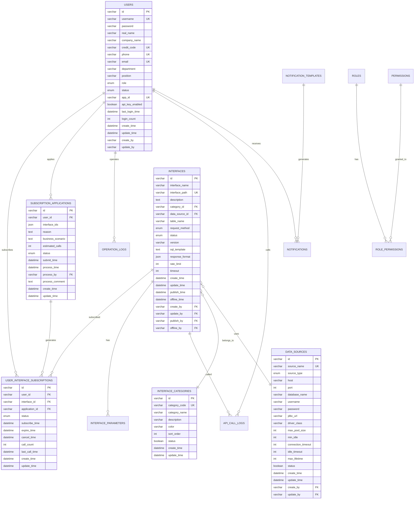

# 电力交易中心接口服务平台数据库模型文档 v1.0

## 版本信息

| 版本号  | 发布日期       | 更新内容            | 维护人员  |
| ---- | ---------- | --------------- | ----- |
| v1.0 | 2024-01-15 | 初始版本，包含核心数据模型设计 | 数据库团队 |

***

## 1. 数据库概览

### 1.1 数据库基本信息

* **数据库名称**: `interface_platform`

* **字符集**: `utf8mb4`

* **排序规则**: `utf8mb4_unicode_ci`

* **存储引擎**: `InnoDB`

* **数据库版本**: MySQL 8.0+

### 1.2 数据模型设计原则

* **规范化设计**: 遵循第三范式，减少数据冗余

* **性能优化**: 合理设置索引，优化查询性能

* **扩展性**: 预留扩展字段，支持业务发展

* **安全性**: 敏感数据加密存储，设置合理权限

* **一致性**: 使用外键约束保证数据一致性

## 2. 数据模型设计

### 2.1 整体ER图



### 2.2 数据模块分类

数据库表按功能模块分为以下几类：

1. **用户管理模块**: users, roles, permissions, role\_permissions
2. **接口管理模块**: interfaces, interface\_categories, interface\_parameters
3. **数据源管理模块**: data\_sources
4. **订阅申请模块**: subscription\_applications, user\_interface\_subscriptions
5. **系统日志模块**: operation\_logs, api\_call\_logs
6. **通知模块**: notifications, notification\_templates
7. **系统配置模块**: system\_configs

## 3. 数据表详细设计

### 3.1 用户管理模块

#### 3.1.1 用户表 (users)

**表描述**: 存储系统用户基本信息和认证数据

| 字段名               | 数据类型     | 长度  | 是否为空     | 默认值                | 约束 | 描述                                  |
| ----------------- | -------- | --- | -------- | ------------------ | -- | ----------------------------------- |
| id                | varchar  | 32  | NOT NULL | -                  | PK | 用户ID，UUID格式                         |
| username          | varchar  | 50  | NOT NULL | -                  | UK | 用户名，登录标识                            |
| password          | varchar  | 255 | NOT NULL | -                  | -  | 密码，BCrypt加密                         |
| real\_name        | varchar  | 50  | NOT NULL | -                  | -  | 真实姓名                                |
| company\_name     | varchar  | 100 | NOT NULL | -                  | -  | 企业名称                                |
| credit\_code      | varchar  | 18  | NOT NULL | -                  | UK | 统一社会信用代码                            |
| phone             | varchar  | 11  | NOT NULL | -                  | UK | 手机号码                                |
| email             | varchar  | 100 | NOT NULL | -                  | UK | 邮箱地址                                |
| department        | varchar  | 50  | NULL     | NULL               | -  | 部门信息                                |
| position          | varchar  | 50  | NULL     | NULL               | -  | 职位信息                                |
| role              | enum     | -   | NOT NULL | 'consumer'         | -  | 用户角色：admin/settlement/tech/consumer |
| status            | enum     | -   | NOT NULL | 'pending'          | -  | 用户状态：active/inactive/pending        |
| app\_id           | varchar  | 32  | NULL     | NULL               | UK | API调用标识                             |
| api\_key\_enabled | tinyint  | 1   | NOT NULL | 1                  | -  | API密钥是否启用                           |
| last\_login\_time | datetime | -   | NULL     | NULL               | -  | 最后登录时间                              |
| login\_count      | int      | -   | NOT NULL | 0                  | -  | 登录次数                                |
| create\_time      | datetime | -   | NOT NULL | CURRENT\_TIMESTAMP | -  | 创建时间                                |
| update\_time      | datetime | -   | NOT NULL | CURRENT\_TIMESTAMP | -  | 更新时间                                |
| create\_by        | varchar  | 32  | NULL     | NULL               | -  | 创建人                                 |
| update\_by        | varchar  | 32  | NULL     | NULL               | -  | 更新人                                 |

**索引设计**:

* PRIMARY KEY: `id`

* UNIQUE KEY: `username`, `phone`, `email`, `credit_code`, `app_id`

* INDEX: `role`, `status`, `create_time`

**业务规则**:

* 用户名、手机号、邮箱、信用代码全局唯一

* 密码使用BCrypt算法加密存储

* app\_id在用户激活时自动生成

* 角色枚举值对应系统权限等级

#### 3.1.2 角色表 (roles)

**表描述**: 定义系统角色和权限级别

| 字段名          | 数据类型     | 长度  | 是否为空     | 默认值                | 约束 | 描述           |
| ------------ | -------- | --- | -------- | ------------------ | -- | ------------ |
| id           | varchar  | 32  | NOT NULL | -                  | PK | 角色ID         |
| role\_code   | varchar  | 50  | NOT NULL | -                  | UK | 角色编码         |
| role\_name   | varchar  | 50  | NOT NULL | -                  | -  | 角色名称         |
| description  | varchar  | 200 | NULL     | NULL               | -  | 角色描述         |
| status       | tinyint  | 1   | NOT NULL | 1                  | -  | 状态：1-启用，0-禁用 |
| create\_time | datetime | -   | NOT NULL | CURRENT\_TIMESTAMP | -  | 创建时间         |
| update\_time | datetime | -   | NOT NULL | CURRENT\_TIMESTAMP | -  | 更新时间         |

**初始数据**:

```sql
INSERT INTO roles VALUES
('role001', 'admin', '系统管理员', '拥有系统所有权限'),
('role002', 'settlement', '结算部', '负责接口上架下架、订阅审批'),
('role003', 'tech', '技术部', '负责接口生成、配置、测试'),
('role004', 'consumer', '数据消费者', '可浏览接口目录、订阅接口、调用API');
```

#### 3.1.3 权限表 (permissions)

**表描述**: 定义系统功能权限点

| 字段名              | 数据类型     | 长度  | 是否为空     | 默认值                | 约束 | 描述                   |
| ---------------- | -------- | --- | -------- | ------------------ | -- | -------------------- |
| id               | varchar  | 32  | NOT NULL | -                  | PK | 权限ID                 |
| permission\_code | varchar  | 100 | NOT NULL | -                  | UK | 权限编码                 |
| permission\_name | varchar  | 100 | NOT NULL | -                  | -  | 权限名称                 |
| resource\_type   | enum     | -   | NOT NULL | -                  | -  | 资源类型：menu/button/api |
| resource\_path   | varchar  | 200 | NULL     | NULL               | -  | 资源路径                 |
| parent\_id       | varchar  | 32  | NULL     | NULL               | -  | 父权限ID                |
| sort\_order      | int      | -   | NOT NULL | 0                  | -  | 排序                   |
| status           | tinyint  | 1   | NOT NULL | 1                  | -  | 状态：1-启用，0-禁用         |
| create\_time     | datetime | -   | NOT NULL | CURRENT\_TIMESTAMP | -  | 创建时间                 |
| update\_time     | datetime | -   | NOT NULL | CURRENT\_TIMESTAMP | -  | 更新时间                 |

### 3.2 接口管理模块

#### 3.2.1 接口表 (interfaces)

**表描述**: 存储接口定义和配置信息

| 字段名              | 数据类型     | 长度  | 是否为空     | 默认值                | 约束 | 描述                                 |
| ---------------- | -------- | --- | -------- | ------------------ | -- | ---------------------------------- |
| id               | varchar  | 32  | NOT NULL | -                  | PK | 接口ID                               |
| interface\_name  | varchar  | 100 | NOT NULL | -                  | -  | 接口名称                               |
| interface\_path  | varchar  | 200 | NOT NULL | -                  | UK | 接口路径，全局唯一                          |
| description      | text     | -   | NULL     | NULL               | -  | 接口描述                               |
| category\_id     | varchar  | 32  | NOT NULL | -                  | FK | 分类ID                               |
| data\_source\_id | varchar  | 32  | NOT NULL | -                  | FK | 数据源ID                              |
| table\_name      | varchar  | 100 | NOT NULL | -                  | -  | 数据表名                               |
| request\_method  | enum     | -   | NOT NULL | 'POST'             | -  | 请求方法：GET/POST/PUT/DELETE           |
| status           | enum     | -   | NOT NULL | 'unpublished'      | -  | 接口状态：unpublished/published/offline |
| version          | varchar  | 10  | NOT NULL | '1.0'              | -  | 接口版本                               |
| sql\_template    | text     | -   | NULL     | NULL               | -  | SQL模板                              |
| response\_format | json     | -   | NULL     | NULL               | -  | 响应格式定义                             |
| rate\_limit      | int      | -   | NULL     | NULL               | -  | 限流配置（每分钟请求数）                       |
| timeout          | int      | -   | NOT NULL | 30                 | -  | 超时时间（秒）                            |
| create\_time     | datetime | -   | NOT NULL | CURRENT\_TIMESTAMP | -  | 创建时间                               |
| update\_time     | datetime | -   | NOT NULL | CURRENT\_TIMESTAMP | -  | 更新时间                               |
| publish\_time    | datetime | -   | NULL     | NULL               | -  | 上架时间                               |
| offline\_time    | datetime | -   | NULL     | NULL               | -  | 下架时间                               |
| create\_by       | varchar  | 32  | NOT NULL | -                  | FK | 创建人                                |
| update\_by       | varchar  | 32  | NULL     | NULL               | FK | 更新人                                |
| publish\_by      | varchar  | 32  | NULL     | NULL               | FK | 上架人                                |
| offline\_by      | varchar  | 32  | NULL     | NULL               | FK | 下架人                                |

**索引设计**:

* PRIMARY KEY: `id`

* UNIQUE KEY: `interface_path`

* INDEX: `category_id`, `status`, `create_by`, `create_time`

* FOREIGN KEY: `category_id` REFERENCES `interface_categories(id)`

* FOREIGN KEY: `data_source_id` REFERENCES `data_sources(id)`

**状态流转规则**:

```
unpublished (未上架) → published (已上架) → offline (已下架)
                    ↑                    ↓
                    └────── republish ────┘
```

#### 3.2.2 接口分类表 (interface\_categories)

**表描述**: 接口业务分类定义

| 字段名            | 数据类型     | 长度  | 是否为空     | 默认值                | 约束 | 描述           |
| -------------- | -------- | --- | -------- | ------------------ | -- | ------------ |
| id             | varchar  | 32  | NOT NULL | -                  | PK | 分类ID         |
| category\_code | varchar  | 50  | NOT NULL | -                  | UK | 分类编码         |
| category\_name | varchar  | 50  | NOT NULL | -                  | -  | 分类名称         |
| description    | varchar  | 200 | NULL     | NULL               | -  | 分类描述         |
| color          | varchar  | 7   | NULL     | NULL               | -  | 分类颜色（HEX格式）  |
| sort\_order    | int      | -   | NOT NULL | 0                  | -  | 排序           |
| status         | tinyint  | 1   | NOT NULL | 1                  | -  | 状态：1-启用，0-禁用 |
| create\_time   | datetime | -   | NOT NULL | CURRENT\_TIMESTAMP | -  | 创建时间         |
| update\_time   | datetime | -   | NOT NULL | CURRENT\_TIMESTAMP | -  | 更新时间         |

**初始数据**:

```sql
INSERT INTO interface_categories VALUES
('cat001', 'day_ahead_spot', '日前现货', '日前现货市场相关数据接口', '#1890ff', 1),
('cat002', 'forecast', '预测', '负荷预测、新能源预测等预测类数据接口', '#52c41a', 2),
('cat003', 'ancillary_service', '辅助服务', '调频、调压、备用等辅助服务数据接口', '#faad14', 3),
('cat004', 'grid_operation', '电网运行', '电网运行状态、约束情况等运行数据接口', '#f5222d', 4);
```

#### 3.2.3 接口参数表 (interface\_parameters)

**表描述**: 接口请求参数定义

| 字段名              | 数据类型     | 长度  | 是否为空     | 默认值                | 约束 | 描述                                               |
| ---------------- | -------- | --- | -------- | ------------------ | -- | ------------------------------------------------ |
| id               | varchar  | 32  | NOT NULL | -                  | PK | 参数ID                                             |
| interface\_id    | varchar  | 32  | NOT NULL | -                  | FK | 接口ID                                             |
| param\_name      | varchar  | 50  | NOT NULL | -                  | -  | 参数名称                                             |
| param\_type      | enum     | -   | NOT NULL | -                  | -  | 参数类型：string/integer/number/boolean/date/datetime |
| param\_location  | enum     | -   | NOT NULL | 'body'             | -  | 参数位置：query/body/header/path                      |
| description      | varchar  | 200 | NULL     | NULL               | -  | 参数描述                                             |
| required         | tinyint  | 1   | NOT NULL | 0                  | -  | 是否必需                                             |
| default\_value   | varchar  | 100 | NULL     | NULL               | -  | 默认值                                              |
| validation\_rule | varchar  | 200 | NULL     | NULL               | -  | 校验规则                                             |
| example          | varchar  | 100 | NULL     | NULL               | -  | 示例值                                              |
| sort\_order      | int      | -   | NOT NULL | 0                  | -  | 排序                                               |
| create\_time     | datetime | -   | NOT NULL | CURRENT\_TIMESTAMP | -  | 创建时间                                             |
| update\_time     | datetime | -   | NOT NULL | CURRENT\_TIMESTAMP | -  | 更新时间                                             |

**索引设计**:

* PRIMARY KEY: `id`

* INDEX: `interface_id`, `sort_order`

* FOREIGN KEY: `interface_id` REFERENCES `interfaces(id)`

### 3.3 数据源管理模块

#### 3.3.1 数据源表 (data\_sources)

**表描述**: 外部数据源连接配置

| 字段名                 | 数据类型     | 长度  | 是否为空     | 默认值                | 约束 | 描述                                      |
| ------------------- | -------- | --- | -------- | ------------------ | -- | --------------------------------------- |
| id                  | varchar  | 32  | NOT NULL | -                  | PK | 数据源ID                                   |
| source\_name        | varchar  | 100 | NOT NULL | -                  | UK | 数据源名称                                   |
| source\_type        | enum     | -   | NOT NULL | -                  | -  | 数据源类型：mysql/postgresql/oracle/sqlserver |
| host                | varchar  | 100 | NOT NULL | -                  | -  | 主机地址                                    |
| port                | int      | -   | NOT NULL | -                  | -  | 端口                                      |
| database\_name      | varchar  | 100 | NOT NULL | -                  | -  | 数据库名                                    |
| username            | varchar  | 100 | NOT NULL | -                  | -  | 用户名                                     |
| password            | varchar  | 255 | NOT NULL | -                  | -  | 密码（AES加密）                               |
| jdbc\_url           | varchar  | 500 | NOT NULL | -                  | -  | JDBC连接URL                               |
| driver\_class       | varchar  | 200 | NOT NULL | -                  | -  | 驱动类名                                    |
| max\_pool\_size     | int      | -   | NOT NULL | 20                 | -  | 最大连接池大小                                 |
| min\_idle           | int      | -   | NOT NULL | 5                  | -  | 最小空闲连接数                                 |
| connection\_timeout | int      | -   | NOT NULL | 30000              | -  | 连接超时时间（毫秒）                              |
| idle\_timeout       | int      | -   | NOT NULL | 600000             | -  | 空闲超时时间（毫秒）                              |
| max\_lifetime       | int      | -   | NOT NULL | 1800000            | -  | 连接最大生存时间（毫秒）                            |
| status              | tinyint  | 1   | NOT NULL | 1                  | -  | 状态：1-启用，0-禁用                            |
| create\_time        | datetime | -   | NOT NULL | CURRENT\_TIMESTAMP | -  | 创建时间                                    |
| update\_time        | datetime | -   | NOT NULL | CURRENT\_TIMESTAMP | -  | 更新时间                                    |
| create\_by          | varchar  | 32  | NOT NULL | -                  | FK | 创建人                                     |
| update\_by          | varchar  | 32  | NULL     | NULL               | FK | 更新人                                     |

**安全考虑**:

* 密码字段使用AES算法加密存储

* 连接池参数根据实际负载调整

* 定期检查连接有效性

### 3.4 订阅申请模块

#### 3.4.1 订阅申请表 (subscription\_applications)

**表描述**: 用户接口订阅申请记录

| 字段名                | 数据类型     | 长度 | 是否为空     | 默认值                | 约束 | 描述                             |
| ------------------ | -------- | -- | -------- | ------------------ | -- | ------------------------------ |
| id                 | varchar  | 32 | NOT NULL | -                  | PK | 申请ID                           |
| user\_id           | varchar  | 32 | NOT NULL | -                  | FK | 申请用户ID                         |
| interface\_ids     | json     | -  | NOT NULL | -                  | -  | 申请接口ID列表                       |
| reason             | text     | -  | NOT NULL | -                  | -  | 申请理由                           |
| business\_scenario | text     | -  | NULL     | NULL               | -  | 业务场景描述                         |
| estimated\_calls   | int      | -  | NULL     | NULL               | -  | 预计每日调用次数                       |
| status             | enum     | -  | NOT NULL | 'pending'          | -  | 申请状态：pending/approved/rejected |
| submit\_time       | datetime | -  | NOT NULL | CURRENT\_TIMESTAMP | -  | 提交时间                           |
| process\_time      | datetime | -  | NULL     | NULL               | -  | 处理时间                           |
| process\_by        | varchar  | 32 | NULL     | NULL               | FK | 处理人                            |
| process\_comment   | text     | -  | NULL     | NULL               | -  | 处理意见                           |
| create\_time       | datetime | -  | NOT NULL | CURRENT\_TIMESTAMP | -  | 创建时间                           |
| update\_time       | datetime | -  | NOT NULL | CURRENT\_TIMESTAMP | -  | 更新时间                           |

**JSON字段示例**:

```json
{
  "interface_ids": ["int001", "int002", "int003"]
}
```

#### 3.4.2 用户接口订阅表 (user\_interface\_subscriptions)

**表描述**: 用户接口订阅关系和状态

| 字段名              | 数据类型     | 长度 | 是否为空     | 默认值                | 约束 | 描述                                     |
| ---------------- | -------- | -- | -------- | ------------------ | -- | -------------------------------------- |
| id               | varchar  | 32 | NOT NULL | -                  | PK | 订阅ID                                   |
| user\_id         | varchar  | 32 | NOT NULL | -                  | FK | 用户ID                                   |
| interface\_id    | varchar  | 32 | NOT NULL | -                  | FK | 接口ID                                   |
| application\_id  | varchar  | 32 | NOT NULL | -                  | FK | 申请ID                                   |
| status           | enum     | -  | NOT NULL | 'active'           | -  | 订阅状态：active/inactive/expired/cancelled |
| subscribe\_time  | datetime | -  | NOT NULL | CURRENT\_TIMESTAMP | -  | 订阅时间                                   |
| expire\_time     | datetime | -  | NULL     | NULL               | -  | 过期时间                                   |
| cancel\_time     | datetime | -  | NULL     | NULL               | -  | 取消时间                                   |
| call\_count      | int      | -  | NOT NULL | 0                  | -  | 调用次数                                   |
| last\_call\_time | datetime | -  | NULL     | NULL               | -  | 最后调用时间                                 |
| create\_time     | datetime | -  | NOT NULL | CURRENT\_TIMESTAMP | -  | 创建时间                                   |
| update\_time     | datetime | -  | NOT NULL | CURRENT\_TIMESTAMP | -  | 更新时间                                   |

**索引设计**:

* PRIMARY KEY: `id`

* UNIQUE KEY: `user_id`, `interface_id`

* INDEX: `user_id`, `interface_id`, `status`

### 3.5 系统日志模块

#### 3.5.1 操作日志表 (operation\_logs)

**表描述**: 系统操作审计日志

| 字段名             | 数据类型     | 长度  | 是否为空     | 默认值                | 约束 | 描述                         |
| --------------- | -------- | --- | -------- | ------------------ | -- | -------------------------- |
| id              | varchar  | 32  | NOT NULL | -                  | PK | 日志ID                       |
| user\_id        | varchar  | 32  | NULL     | NULL               | FK | 操作用户ID                     |
| username        | varchar  | 50  | NULL     | NULL               | -  | 操作用户名                      |
| operation       | varchar  | 100 | NOT NULL | -                  | -  | 操作类型                       |
| method          | varchar  | 200 | NULL     | NULL               | -  | 操作方法                       |
| params          | text     | -   | NULL     | NULL               | -  | 操作参数                       |
| result          | text     | -   | NULL     | NULL               | -  | 操作结果                       |
| ip\_address     | varchar  | 45  | NULL     | NULL               | -  | IP地址（支持IPv6）               |
| user\_agent     | varchar  | 500 | NULL     | NULL               | -  | 用户代理                       |
| execution\_time | int      | -   | NULL     | NULL               | -  | 执行时间（毫秒）                   |
| status          | enum     | -   | NOT NULL | -                  | -  | 操作状态：success/failure/error |
| error\_message  | text     | -   | NULL     | NULL               | -  | 错误信息                       |
| create\_time    | datetime | -   | NOT NULL | CURRENT\_TIMESTAMP | -  | 创建时间                       |

**索引设计**:

* PRIMARY KEY: `id`

* INDEX: `user_id`, `operation`, `status`, `create_time`

#### 3.5.2 API调用日志表 (api\_call\_logs)

**表描述**: API接口调用日志

| 字段名               | 数据类型     | 长度  | 是否为空     | 默认值                | 约束 | 描述       |
| ----------------- | -------- | --- | -------- | ------------------ | -- | -------- |
| id                | varchar  | 32  | NOT NULL | -                  | PK | 日志ID     |
| request\_id       | varchar  | 32  | NULL     | NULL               | -  | 请求ID     |
| user\_id          | varchar  | 32  | NULL     | NULL               | FK | 调用用户ID   |
| app\_id           | varchar  | 32  | NULL     | NULL               | -  | 应用ID     |
| interface\_id     | varchar  | 32  | NOT NULL | -                  | FK | 接口ID     |
| interface\_path   | varchar  | 200 | NOT NULL | -                  | -  | 接口路径     |
| request\_method   | varchar  | 10  | NOT NULL | -                  | -  | 请求方法     |
| request\_params   | text     | -   | NULL     | NULL               | -  | 请求参数     |
| response\_data    | text     | -   | NULL     | NULL               | -  | 响应数据     |
| response\_code    | int      | -   | NOT NULL | -                  | -  | 响应状态码    |
| response\_message | varchar  | 500 | NULL     | NULL               | -  | 响应消息     |
| execution\_time   | int      | -   | NOT NULL | -                  | -  | 执行时间（毫秒） |
| ip\_address       | varchar  | 45  | NULL     | NULL               | -  | IP地址     |
| user\_agent       | varchar  | 500 | NULL     | NULL               | -  | 用户代理     |
| create\_time      | datetime | -   | NOT NULL | CURRENT\_TIMESTAMP | -  | 创建时间     |

**索引设计**:

* PRIMARY KEY: `id`

* INDEX: `user_id`, `app_id`, `interface_id`, `response_code`, `create_time`

### 3.6 通知模块

#### 3.6.1 通知表 (notifications)

**表描述**: 系统通知消息

| 字段名          | 数据类型     | 长度  | 是否为空     | 默认值                | 约束 | 描述                                    |
| ------------ | -------- | --- | -------- | ------------------ | -- | ------------------------------------- |
| id           | varchar  | 32  | NOT NULL | -                  | PK | 通知ID                                  |
| user\_id     | varchar  | 32  | NOT NULL | -                  | FK | 接收用户ID                                |
| title        | varchar  | 200 | NOT NULL | -                  | -  | 通知标题                                  |
| content      | text     | -   | NOT NULL | -                  | -  | 通知内容                                  |
| type         | enum     | -   | NOT NULL | -                  | -  | 通知类型：system/approval/subscription/api |
| status       | enum     | -   | NOT NULL | 'unread'           | -  | 阅读状态：unread/read                      |
| send\_time   | datetime | -   | NOT NULL | CURRENT\_TIMESTAMP | -  | 发送时间                                  |
| read\_time   | datetime | -   | NULL     | NULL               | -  | 阅读时间                                  |
| create\_time | datetime | -   | NOT NULL | CURRENT\_TIMESTAMP | -  | 创建时间                                  |

#### 3.6.2 通知模板表 (notification\_templates)

**表描述**: 通知消息模板

| 字段名               | 数据类型     | 长度  | 是否为空     | 默认值                | 约束 | 描述                    |
| ----------------- | -------- | --- | -------- | ------------------ | -- | --------------------- |
| id                | varchar  | 32  | NOT NULL | -                  | PK | 模板ID                  |
| template\_code    | varchar  | 50  | NOT NULL | -                  | UK | 模板编码                  |
| template\_name    | varchar  | 100 | NOT NULL | -                  | -  | 模板名称                  |
| template\_type    | enum     | -   | NOT NULL | -                  | -  | 模板类型：email/sms/system |
| title\_template   | varchar  | 200 | NOT NULL | -                  | -  | 标题模板                  |
| content\_template | text     | -   | NOT NULL | -                  | -  | 内容模板                  |
| variables         | json     | -   | NULL     | NULL               | -  | 模板变量定义                |
| status            | tinyint  | 1   | NOT NULL | 1                  | -  | 状态：1-启用，0-禁用          |
| create\_time      | datetime | -   | NOT NULL | CURRENT\_TIMESTAMP | -  | 创建时间                  |
| update\_time      | datetime | -   | NOT NULL | CURRENT\_TIMESTAMP | -  | 更新时间                  |

### 3.7 系统配置模块

#### 3.7.1 系统配置表 (system\_configs)

**表描述**: 系统参数配置

| 字段名           | 数据类型     | 长度  | 是否为空     | 默认值                | 约束 | 描述                              |
| ------------- | -------- | --- | -------- | ------------------ | -- | ------------------------------- |
| id            | varchar  | 32  | NOT NULL | -                  | PK | 配置ID                            |
| config\_key   | varchar  | 100 | NOT NULL | -                  | UK | 配置键                             |
| config\_value | text     | -   | NULL     | NULL               | -  | 配置值                             |
| config\_type  | enum     | -   | NOT NULL | 'string'           | -  | 配置类型：string/number/boolean/json |
| description   | varchar  | 200 | NULL     | NULL               | -  | 配置描述                            |
| editable      | tinyint  | 1   | NOT NULL | 1                  | -  | 是否可编辑                           |
| create\_time  | datetime | -   | NOT NULL | CURRENT\_TIMESTAMP | -  | 创建时间                            |
| update\_time  | datetime | -   | NOT NULL | CURRENT\_TIMESTAMP | -  | 更新时间                            |

**初始配置数据**:

```sql
INSERT INTO system_configs VALUES
('cfg001', 'system.name', '电力交易中心接口服务平台', 'string', '系统名称'),
('cfg002', 'system.version', '1.0.0', 'string', '系统版本'),
('cfg003', 'api.rate_limit.default', '1000', 'number', '默认API限流配置（每分钟）'),
('cfg004', 'api.timeout.default', '30', 'number', '默认API超时时间（秒）'),
('cfg005', 'notification.email.enabled', 'true', 'boolean', '是否启用邮件通知'),
('cfg006', 'notification.sms.enabled', 'false', 'boolean', '是否启用短信通知');
```

## 4. 数据约束和规则

### 4.1 外键约束

```sql
-- 接口表外键约束
ALTER TABLE interfaces 
ADD CONSTRAINT fk_interfaces_category 
FOREIGN KEY (category_id) REFERENCES interface_categories(id);

ALTER TABLE interfaces 
ADD CONSTRAINT fk_interfaces_datasource 
FOREIGN KEY (data_source_id) REFERENCES data_sources(id);

ALTER TABLE interfaces 
ADD CONSTRAINT fk_interfaces_creator 
FOREIGN KEY (create_by) REFERENCES users(id);

-- 订阅表外键约束
ALTER TABLE user_interface_subscriptions 
ADD CONSTRAINT fk_subscriptions_user 
FOREIGN KEY (user_id) REFERENCES users(id);

ALTER TABLE user_interface_subscriptions 
ADD CONSTRAINT fk_subscriptions_interface 
FOREIGN KEY (interface_id) REFERENCES interfaces(id);

ALTER TABLE user_interface_subscriptions 
ADD CONSTRAINT fk_subscriptions_application 
FOREIGN KEY (application_id) REFERENCES subscription_applications(id);
```

### 4.2 检查约束

```sql
-- 用户表检查约束
ALTER TABLE users 
ADD CONSTRAINT chk_users_phone 
CHECK (phone REGEXP '^1[3-9][0-9]{9}$');

ALTER TABLE users 
ADD CONSTRAINT chk_users_email 
CHECK (email REGEXP '^[a-zA-Z0-9._%+-]+@[a-zA-Z0-9.-]+\.[a-zA-Z]{2,}$');

-- 接口表检查约束
ALTER TABLE interfaces 
ADD CONSTRAINT chk_interfaces_timeout 
CHECK (timeout > 0 AND timeout <= 300);

ALTER TABLE interfaces 
ADD CONSTRAINT chk_interfaces_rate_limit 
CHECK (rate_limit IS NULL OR rate_limit > 0);
```

### 4.3 触发器

```sql
-- 用户登录次数更新触发器
DELIMITER //
CREATE TRIGGER tr_users_login_update
BEFORE UPDATE ON users
FOR EACH ROW
BEGIN
    IF NEW.last_login_time != OLD.last_login_time THEN
        SET NEW.login_count = OLD.login_count + 1;
    END IF;
END//
DELIMITER ;

-- 接口调用次数更新触发器
DELIMITER //
CREATE TRIGGER tr_subscription_call_update
AFTER INSERT ON api_call_logs
FOR EACH ROW
BEGIN
    UPDATE user_interface_subscriptions 
    SET call_count = call_count + 1,
        last_call_time = NEW.create_time
    WHERE user_id = NEW.user_id 
      AND interface_id = NEW.interface_id;
END//
DELIMITER ;
```

## 5. 性能优化

### 5.1 索引优化策略

**复合索引设计**:

```sql
-- 接口查询优化索引
CREATE INDEX idx_interfaces_category_status ON interfaces(category_id, status);
CREATE INDEX idx_interfaces_status_create_time ON interfaces(status, create_time DESC);

-- 订阅查询优化索引
CREATE INDEX idx_subscriptions_user_status ON user_interface_subscriptions(user_id, status);
CREATE INDEX idx_subscriptions_interface_status ON user_interface_subscriptions(interface_id, status);

-- 日志查询优化索引
CREATE INDEX idx_api_logs_user_time ON api_call_logs(user_id, create_time DESC);
CREATE INDEX idx_api_logs_interface_time ON api_call_logs(interface_id, create_time DESC);
```

### 5.2 分区策略

**日志表按时间分区**:

```sql
-- API调用日志表分区
ALTER TABLE api_call_logs 
PARTITION BY RANGE (YEAR(create_time)) (
    PARTITION p2024 VALUES LESS THAN (2025),
    PARTITION p2025 VALUES LESS THAN (2026),
    PARTITION p2026 VALUES LESS THAN (2027),
    PARTITION p_future VALUES LESS THAN MAXVALUE
);

-- 操作日志表分区
ALTER TABLE operation_logs 
PARTITION BY RANGE (YEAR(create_time)) (
    PARTITION p2024 VALUES LESS THAN (2025),
    PARTITION p2025 VALUES LESS THAN (2026),
    PARTITION p2026 VALUES LESS THAN (2027),
    PARTITION p_future VALUES LESS THAN MAXVALUE
);
```

### 5.3 查询优化

**常用查询优化示例**:

```sql
-- 接口列表查询优化
SELECT i.id, i.interface_name, i.status, c.category_name, c.color
FROM interfaces i
INNER JOIN interface_categories c ON i.category_id = c.id
WHERE i.status = 'published'
  AND c.status = 1
ORDER BY i.create_time DESC
LIMIT 20;

-- 用户订阅统计查询优化
SELECT 
    u.id,
    u.real_name,
    COUNT(s.id) as subscription_count,
    SUM(s.call_count) as total_calls
FROM users u
LEFT JOIN user_interface_subscriptions s ON u.id = s.user_id AND s.status = 'active'
WHERE u.status = 'active'
GROUP BY u.id, u.real_name
ORDER BY subscription_count DESC;
```

## 6. 数据安全

### 6.1 敏感数据加密

**密码加密**:

* 用户密码使用BCrypt算法加密

* 数据源密码使用AES-256算法加密

* API密钥使用SHA-256哈希

**加密实现示例**:

```sql
-- 插入用户时密码加密
INSERT INTO users (id, username, password, ...)
VALUES ('user001', 'testuser', '$2a$10$...', ...);

-- 数据源密码加密存储
INSERT INTO data_sources (id, source_name, password, ...)
VALUES ('ds001', 'MySQL-Main', AES_ENCRYPT('password123', 'encryption_key'), ...);
```

### 6.2 数据访问控制

**数据库用户权限**:

```sql
-- 创建应用数据库用户
CREATE USER 'app_user'@'%' IDENTIFIED BY 'strong_password';

-- 授予基本权限
GRANT SELECT, INSERT, UPDATE, DELETE ON interface_platform.* TO 'app_user'@'%';

-- 创建只读用户（用于报表查询）
CREATE USER 'readonly_user'@'%' IDENTIFIED BY 'readonly_password';
GRANT SELECT ON interface_platform.* TO 'readonly_user'@'%';

-- 撤销敏感表的权限
REVOKE ALL ON interface_platform.users FROM 'readonly_user'@'%';
GRANT SELECT(id, username, real_name, company_name, role, status, create_time) 
ON interface_platform.users TO 'readonly_user'@'%';
```

### 6.3 数据备份策略

**备份计划**:

* 全量备份：每日凌晨2点

* 增量备份：每4小时一次

* 日志备份：每小时一次

* 备份保留：30天

**备份脚本示例**:

```bash
#!/bin/bash
# 数据库全量备份脚本

DATE=$(date +%Y%m%d_%H%M%S)
BACKUP_DIR="/backup/mysql"
DB_NAME="interface_platform"

# 创建备份目录
mkdir -p $BACKUP_DIR

# 执行备份
mysqldump --single-transaction --routines --triggers \
  --user=backup_user --password=backup_password \
  $DB_NAME > $BACKUP_DIR/interface_platform_$DATE.sql

# 压缩备份文件
gzip $BACKUP_DIR/interface_platform_$DATE.sql

# 删除30天前的备份
find $BACKUP_DIR -name "*.sql.gz" -mtime +30 -delete
```

## 7. 监控和维护

### 7.1 性能监控

**关键指标监控**:

* 数据库连接数

* 慢查询统计

* 表空间使用率

* 索引使用效率

* 锁等待时间

**监控查询示例**:

```sql
-- 查看当前连接数
SHOW STATUS LIKE 'Threads_connected';

-- 查看慢查询
SELECT * FROM mysql.slow_log 
WHERE start_time > DATE_SUB(NOW(), INTERVAL 1 HOUR)
ORDER BY query_time DESC;

-- 查看表大小
SELECT 
    table_name,
    ROUND(((data_length + index_length) / 1024 / 1024), 2) AS 'Size (MB)'
FROM information_schema.tables 
WHERE table_schema = 'interface_platform'
ORDER BY (data_length + index_length) DESC;
```

### 7.2 数据清理策略

**日志数据清理**:

```sql
-- 清理90天前的API调用日志
DELETE FROM api_call_logs 
WHERE create_time < DATE_SUB(NOW(), INTERVAL 90 DAY);

-- 清理180天前的操作日志
DELETE FROM operation_logs 
WHERE create_time < DATE_SUB(NOW(), INTERVAL 180 DAY);

-- 清理已读的30天前通知
DELETE FROM notifications 
WHERE status = 'read' 
  AND read_time < DATE_SUB(NOW(), INTERVAL 30 DAY);
```

***

