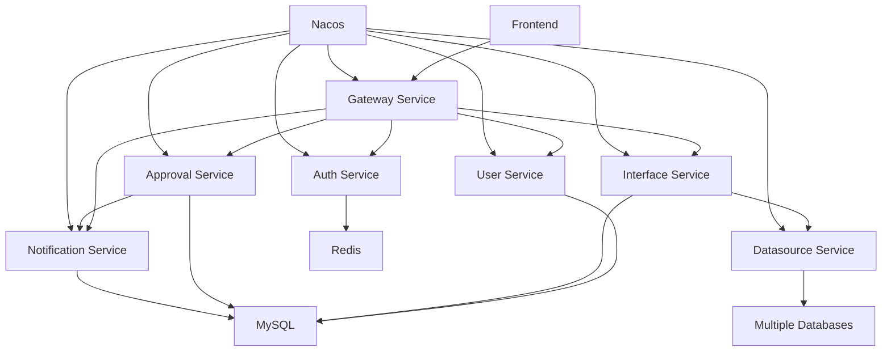

# 电力交易中心接口服务平台 - 微服务架构分析与测试方案

**文档版本**: v1.0  
**创建时间**: 2024-01-15  
**分析范围**: 微服务架构、通信机制、测试策略  

---

## 📊 微服务架构概览

### 服务清单

| 服务名称 | 端口 | 职责 | 状态 |
|---------|------|------|------|
| gateway-service | 8080 | API网关、路由转发、认证鉴权 | ✅ 运行中 |
| auth-service | 8081 | 用户认证、权限管理、JWT管理 | ✅ 运行中 |
| user-service | 8081 | 用户管理、角色权限 | ⚠️ 端口冲突 |
| interface-service | 8083 | 接口管理、接口执行 | ✅ 运行中 |
| datasource-service | 8081 | 数据源管理、查询执行 | ⚠️ 端口冲突 |
| approval-service | 8083 | 订阅申请、审批流程 | ⚠️ 端口冲突 |
| notification-service | 8084 | 消息通知、邮件发送 | ✅ 运行中 |

### 架构依赖关系



---

## 🔍 架构问题分析

### 1. 端口冲突问题 (Critical)

**问题描述**:
- `user-service`、`datasource-service` 都配置为端口 8081
- `interface-service`、`approval-service` 都配置为端口 8083

**影响**:
- 服务无法同时启动
- 部署冲突
- 服务发现异常

**修复建议**:
```yaml
# 建议端口分配
gateway-service: 8080
auth-service: 8081
user-service: 8082
interface-service: 8083
approval-service: 8084
notification-service: 8085
datasource-service: 8086
```

### 2. 服务发现配置不一致 (High)

**问题描述**:
- 部分服务缺少Nacos配置
- 命名空间配置不统一
- 服务分组不规范

**修复建议**:
```yaml
spring:
  cloud:
    nacos:
      discovery:
        server-addr: localhost:8848
        namespace: interface-platform
        group: DEFAULT_GROUP
      config:
        server-addr: localhost:8848
        namespace: interface-platform
        group: DEFAULT_GROUP
        file-extension: yml
```

### 3. 缺少熔断器和限流 (High)

**问题描述**:
- 服务间调用缺少熔断保护
- 无限流机制
- 缺少降级策略

**修复建议**:
```java
@Component
public class ServiceFallback {
    
    @HystrixCommand(fallbackMethod = "fallbackMethod")
    public String callService() {
        // 服务调用逻辑
    }
    
    public String fallbackMethod() {
        return "服务暂时不可用";
    }
}
```

### 4. 服务间通信安全 (Medium)

**问题描述**:
- 内部服务间通信未加密
- 缺少服务间认证
- 无API密钥验证

**修复建议**:
1. 实施mTLS加密
2. 服务间JWT认证
3. API网关统一鉴权

---

## 🧪 测试策略设计

### 1. 单元测试 (Unit Testing)

#### 测试覆盖目标
- **代码覆盖率**: ≥ 80%
- **分支覆盖率**: ≥ 70%
- **方法覆盖率**: ≥ 90%

#### 核心测试用例

**Auth Service 测试用例**:
```java
@SpringBootTest
class AuthServiceTest {
    
    @Test
    void testUserLogin_ValidCredentials_Success() {
        // Given
        LoginRequest request = new LoginRequest("admin", "password");
        
        // When
        LoginResponse response = authService.login(request);
        
        // Then
        assertThat(response.isSuccess()).isTrue();
        assertThat(response.getToken()).isNotEmpty();
    }
    
    @Test
    void testUserLogin_InvalidCredentials_Failure() {
        // Given
        LoginRequest request = new LoginRequest("admin", "wrongpassword");
        
        // When & Then
        assertThrows(AuthenticationException.class, 
            () -> authService.login(request));
    }
    
    @Test
    void testJwtToken_Expired_ThrowsException() {
        // Given
        String expiredToken = generateExpiredToken();
        
        // When & Then
        assertThrows(TokenExpiredException.class,
            () -> jwtTokenUtil.validateToken(expiredToken));
    }
}
```

**Interface Service 测试用例**:
```java
@SpringBootTest
class InterfaceExecutionServiceTest {
    
    @Test
    void testExecuteInterface_ValidParameters_Success() {
        // Given
        String interfaceId = "test-interface-001";
        Map<String, Object> params = Map.of("userId", "123");
        
        // When
        InterfaceExecutionResult result = 
            interfaceExecutionService.executeInterface(interfaceId, params);
        
        // Then
        assertThat(result.isSuccess()).isTrue();
        assertThat(result.getData()).isNotNull();
    }
    
    @Test
    void testExecuteInterface_SqlInjection_Blocked() {
        // Given
        String interfaceId = "test-interface-001";
        Map<String, Object> params = Map.of(
            "userId", "1; DROP TABLE users; --"
        );
        
        // When & Then
        assertThrows(SecurityException.class,
            () -> interfaceExecutionService.executeInterface(interfaceId, params));
    }
}
```

### 2. 集成测试 (Integration Testing)

#### 服务间通信测试
```java
@SpringBootTest(webEnvironment = SpringBootTest.WebEnvironment.RANDOM_PORT)
@TestPropertySource(properties = {
    "spring.cloud.nacos.discovery.enabled=false"
})
class ServiceIntegrationTest {
    
    @Test
    void testUserServiceIntegration() {
        // 测试用户服务与认证服务的集成
        given()
            .contentType(ContentType.JSON)
            .body(loginRequest)
        .when()
            .post("/api/auth/login")
        .then()
            .statusCode(200)
            .body("success", equalTo(true));
    }
    
    @Test
    void testInterfaceExecutionFlow() {
        // 测试完整的接口执行流程
        // 1. 用户认证
        // 2. 接口权限检查
        // 3. 参数验证
        // 4. 数据源查询
        // 5. 结果返回
    }
}
```

### 3. 契约测试 (Contract Testing)

#### Pact 测试示例
```java
@ExtendWith(PactConsumerTestExt.class)
@PactTestFor(providerName = "auth-service")
class AuthServiceContractTest {
    
    @Pact(consumer = "interface-service")
    public RequestResponsePact validateTokenPact(PactDslWithProvider builder) {
        return builder
            .given("valid token exists")
            .uponReceiving("a request to validate token")
            .path("/api/auth/validate")
            .method("POST")
            .headers(Map.of("Authorization", "Bearer valid-token"))
            .willRespondWith()
            .status(200)
            .body(new PactDslJsonBody()
                .booleanValue("valid", true)
                .stringValue("userId", "123"))
            .toPact();
    }
}
```

### 4. 端到端测试 (E2E Testing)

#### 业务流程测试
```java
@SpringBootTest
@Testcontainers
class EndToEndTest {
    
    @Container
    static MySQLContainer<?> mysql = new MySQLContainer<>("mysql:8.0")
            .withDatabaseName("interface_platform")
            .withUsername("test")
            .withPassword("test");
    
    @Test
    void testCompleteInterfaceSubscriptionFlow() {
        // 1. 用户注册
        registerUser("testuser", "password");
        
        // 2. 用户登录
        String token = loginUser("testuser", "password");
        
        // 3. 浏览接口目录
        List<Interface> interfaces = getInterfaceList(token);
        
        // 4. 申请接口订阅
        String applicationId = applyForSubscription(token, interfaces.get(0).getId());
        
        // 5. 管理员审批
        approveApplication(adminToken, applicationId);
        
        // 6. 调用接口
        InterfaceResponse response = callInterface(token, interfaces.get(0).getId());
        
        // 验证结果
        assertThat(response.isSuccess()).isTrue();
    }
}
```

### 5. 性能测试 (Performance Testing)

#### JMeter 测试计划
```xml
<?xml version="1.0" encoding="UTF-8"?>
<jmeterTestPlan version="1.2">
  <hashTree>
    <TestPlan testname="Interface Platform Performance Test">
      <elementProp name="TestPlan.arguments" elementType="Arguments" guiclass="ArgumentsPanel">
        <collectionProp name="Arguments.arguments">
          <elementProp name="baseUrl" elementType="Argument">
            <stringProp name="Argument.name">baseUrl</stringProp>
            <stringProp name="Argument.value">http://localhost:8080</stringProp>
          </elementProp>
        </collectionProp>
      </elementProp>
    </TestPlan>
    
    <hashTree>
      <ThreadGroup testname="Interface Call Load Test">
        <stringProp name="ThreadGroup.num_threads">100</stringProp>
        <stringProp name="ThreadGroup.ramp_time">60</stringProp>
        <stringProp name="ThreadGroup.duration">300</stringProp>
      </ThreadGroup>
    </hashTree>
  </hashTree>
</jmeterTestPlan>
```

#### 性能指标目标
- **响应时间**: P95 < 500ms
- **吞吐量**: > 1000 TPS
- **错误率**: < 0.1%
- **CPU使用率**: < 70%
- **内存使用率**: < 80%

### 6. 安全测试 (Security Testing)

#### OWASP ZAP 自动化扫描
```bash
#!/bin/bash
# 启动ZAP代理
zap.sh -daemon -host 0.0.0.0 -port 8090 -config api.addrs.addr.name=.* -config api.addrs.addr.regex=true

# 执行基线扫描
curl "http://localhost:8090/JSON/spider/action/scan/?url=http://localhost:8080&maxChildren=10"

# 执行主动扫描
curl "http://localhost:8090/JSON/ascan/action/scan/?url=http://localhost:8080&recurse=true"

# 生成报告
curl "http://localhost:8090/OTHER/core/other/htmlreport/" > security-report.html
```

#### 安全测试用例
```java
@SpringBootTest
class SecurityTest {
    
    @Test
    void testSqlInjection() {
        // 测试SQL注入防护
        String maliciousInput = "1' OR '1'='1";
        
        given()
            .param("userId", maliciousInput)
        .when()
            .get("/api/interfaces/search")
        .then()
            .statusCode(400); // 应该被拦截
    }
    
    @Test
    void testXssProtection() {
        // 测试XSS防护
        String xssPayload = "<script>alert('xss')</script>";
        
        given()
            .contentType(ContentType.JSON)
            .body(Map.of("description", xssPayload))
        .when()
            .post("/api/interfaces")
        .then()
            .statusCode(400); // 应该被拦截
    }
}
```

---

## 📋 测试执行计划

### 第一阶段：基础测试 (1周)
1. **单元测试编写和执行**
   - 所有Service层方法
   - 工具类和帮助方法
   - 异常处理逻辑

2. **集成测试设计**
   - 数据库集成测试
   - Redis集成测试
   - 外部服务集成测试

### 第二阶段：系统测试 (1周)
1. **API测试**
   - 所有REST接口
   - 参数验证
   - 错误处理

2. **业务流程测试**
   - 用户注册登录流程
   - 接口订阅申请流程
   - 接口调用流程

### 第三阶段：性能和安全测试 (1周)
1. **性能测试**
   - 负载测试
   - 压力测试
   - 稳定性测试

2. **安全测试**
   - 漏洞扫描
   - 渗透测试
   - 安全配置检查

### 第四阶段：端到端测试 (3天)
1. **完整业务场景测试**
2. **用户验收测试**
3. **生产环境验证**

---

## 🛠️ 测试工具和框架

### 单元测试
- **JUnit 5**: 测试框架
- **Mockito**: Mock框架
- **AssertJ**: 断言库
- **Testcontainers**: 集成测试容器

### API测试
- **REST Assured**: API测试框架
- **Postman/Newman**: API测试工具
- **WireMock**: 服务Mock

### 性能测试
- **JMeter**: 负载测试工具
- **Gatling**: 高性能测试工具
- **Artillery**: 轻量级性能测试

### 安全测试
- **OWASP ZAP**: 安全扫描工具
- **SonarQube**: 代码安全分析
- **Checkmarx**: 静态安全分析

---

## 📊 测试报告和指标

### 测试覆盖率报告
```bash
# 生成覆盖率报告
mvn clean test jacoco:report

# 查看报告
open target/site/jacoco/index.html
```

### 性能测试报告
- **响应时间分布图**
- **吞吐量趋势图**
- **错误率统计**
- **资源使用率监控**

### 安全测试报告
- **漏洞等级分布**
- **修复建议清单**
- **合规性检查结果**

---

## 🔄 持续集成测试

### Jenkins Pipeline
```groovy
pipeline {
    agent any
    
    stages {
        stage('Unit Tests') {
            steps {
                sh 'mvn clean test'
            }
            post {
                always {
                    junit 'target/surefire-reports/*.xml'
                    jacoco execPattern: 'target/jacoco.exec'
                }
            }
        }
        
        stage('Integration Tests') {
            steps {
                sh 'mvn verify -P integration-test'
            }
        }
        
        stage('Security Scan') {
            steps {
                sh 'mvn sonar:sonar'
            }
        }
        
        stage('Performance Test') {
            when {
                branch 'main'
            }
            steps {
                sh 'jmeter -n -t performance-test.jmx -l results.jtl'
            }
        }
    }
}
```

---

## 📈 质量门禁标准

### 代码质量
- 单元测试覆盖率 ≥ 80%
- 代码重复率 ≤ 3%
- 代码复杂度 ≤ 10
- 无Critical和High级别的代码问题

### 性能标准
- API响应时间P95 ≤ 500ms
- 系统吞吐量 ≥ 1000 TPS
- 错误率 ≤ 0.1%
- 内存使用率 ≤ 80%

### 安全标准
- 无Critical和High级别安全漏洞
- 所有输入验证完整
- 敏感信息加密存储
- 访问控制机制完善

---

**文档结束**

*本文档将根据测试执行情况持续更新和完善。*