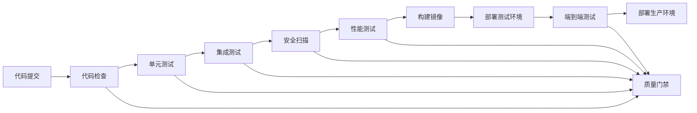

# 电力交易中心接口服务平台 - 持续集成质量检查流程

**文档版本**: v1.0  
**创建时间**: 2024-01-15  
**适用范围**: 开发、测试、运维团队  

---

## 📋 概述

本文档定义了电力交易中心接口服务平台的持续集成质量检查流程，确保代码质量、安全性和性能标准得到持续监控和改进。

---

## 🔄 CI/CD 流水线架构



---

## 🚪 质量门禁标准

### 1. 代码质量门禁

| 指标 | 标准 | 工具 |
|------|------|------|
| 单元测试覆盖率 | ≥ 80% | JaCoCo |
| 分支覆盖率 | ≥ 70% | JaCoCo |
| 代码重复率 | ≤ 3% | SonarQube |
| 代码复杂度 | ≤ 10 | SonarQube |
| 技术债务 | ≤ 1天 | SonarQube |
| 代码异味 | 0个 | SonarQube |

### 2. 安全质量门禁

| 指标 | 标准 | 工具 |
|------|------|------|
| Critical漏洞 | 0个 | OWASP ZAP |
| High级别漏洞 | 0个 | OWASP ZAP |
| 依赖漏洞扫描 | 无高危 | OWASP Dependency Check |
| 敏感信息泄露 | 0个 | GitLeaks |
| 代码安全评分 | ≥ A级 | SonarQube Security |

### 3. 性能质量门禁

| 指标 | 标准 | 工具 |
|------|------|------|
| API响应时间P95 | ≤ 500ms | JMeter |
| 系统吞吐量 | ≥ 1000 TPS | JMeter |
| 错误率 | ≤ 0.1% | JMeter |
| CPU使用率 | ≤ 70% | Prometheus |
| 内存使用率 | ≤ 80% | Prometheus |

---

## 🛠️ Jenkins Pipeline 配置

### 主流水线 (Jenkinsfile)

```groovy
pipeline {
    agent any
    
    environment {
        MAVEN_OPTS = '-Xmx1024m'
        SONAR_TOKEN = credentials('sonar-token')
        DOCKER_REGISTRY = 'registry.powertrading.com'
    }
    
    stages {
        stage('Checkout') {
            steps {
                checkout scm
                script {
                    env.GIT_COMMIT_SHORT = sh(
                        script: 'git rev-parse --short HEAD',
                        returnStdout: true
                    ).trim()
                }
            }
        }
        
        stage('Code Quality Check') {
            parallel {
                stage('Compile') {
                    steps {
                        sh 'mvn clean compile -DskipTests'
                    }
                }
                
                stage('Code Style Check') {
                    steps {
                        sh 'mvn checkstyle:check'
                    }
                    post {
                        always {
                            publishHTML([
                                allowMissing: false,
                                alwaysLinkToLastBuild: true,
                                keepAll: true,
                                reportDir: 'target/site',
                                reportFiles: 'checkstyle.html',
                                reportName: 'Checkstyle Report'
                            ])
                        }
                    }
                }
                
                stage('Security Scan - Secrets') {
                    steps {
                        sh 'gitleaks detect --source . --verbose'
                    }
                }
            }
        }
        
        stage('Unit Tests') {
            steps {
                sh 'mvn test'
            }
            post {
                always {
                    junit 'target/surefire-reports/*.xml'
                    jacoco execPattern: 'target/jacoco.exec'
                }
            }
        }
        
        stage('SonarQube Analysis') {
            steps {
                withSonarQubeEnv('SonarQube') {
                    sh '''
                        mvn sonar:sonar \
                          -Dsonar.projectKey=interface-platform \
                          -Dsonar.host.url=$SONAR_HOST_URL \
                          -Dsonar.login=$SONAR_TOKEN
                    '''
                }
            }
        }
        
        stage('Quality Gate') {
            steps {
                timeout(time: 5, unit: 'MINUTES') {
                    waitForQualityGate abortPipeline: true
                }
            }
        }
        
        stage('Integration Tests') {
            steps {
                sh 'mvn verify -P integration-test'
            }
            post {
                always {
                    junit 'target/failsafe-reports/*.xml'
                }
            }
        }
        
        stage('Security Scan - OWASP') {
            steps {
                sh '''
                    mvn org.owasp:dependency-check-maven:check
                    docker run --rm -v $(pwd):/zap/wrk/:rw \
                      -t owasp/zap2docker-stable zap-baseline.py \
                      -t http://localhost:8080 -J zap-report.json
                '''
            }
            post {
                always {
                    publishHTML([
                        allowMissing: false,
                        alwaysLinkToLastBuild: true,
                        keepAll: true,
                        reportDir: 'target',
                        reportFiles: 'dependency-check-report.html',
                        reportName: 'OWASP Dependency Check'
                    ])
                }
            }
        }
        
        stage('Build Docker Images') {
            when {
                anyOf {
                    branch 'main'
                    branch 'develop'
                }
            }
            steps {
                script {
                    def services = ['gateway', 'auth', 'user', 'interface', 'approval', 'notification', 'datasource']
                    services.each { service ->
                        sh "docker build -t ${DOCKER_REGISTRY}/${service}-service:${env.GIT_COMMIT_SHORT} ./backend/${service}-service"
                        sh "docker push ${DOCKER_REGISTRY}/${service}-service:${env.GIT_COMMIT_SHORT}"
                    }
                }
            }
        }
        
        stage('Deploy to Test Environment') {
            when {
                branch 'develop'
            }
            steps {
                sh '''
                    helm upgrade --install interface-platform-test ./helm \
                      --namespace test \
                      --set image.tag=${GIT_COMMIT_SHORT} \
                      --set environment=test
                '''
            }
        }
        
        stage('Performance Tests') {
            when {
                branch 'develop'
            }
            steps {
                sh '''
                    # 等待服务启动
                    sleep 60
                    
                    # 执行性能测试
                    jmeter -n -t performance-tests/load-test.jmx \
                      -l performance-results.jtl \
                      -e -o performance-report
                '''
            }
            post {
                always {
                    publishHTML([
                        allowMissing: false,
                        alwaysLinkToLastBuild: true,
                        keepAll: true,
                        reportDir: 'performance-report',
                        reportFiles: 'index.html',
                        reportName: 'Performance Test Report'
                    ])
                }
            }
        }
        
        stage('E2E Tests') {
            when {
                branch 'develop'
            }
            steps {
                sh '''
                    cd frontend
                    npm install
                    npm run test:e2e
                '''
            }
        }
        
        stage('Deploy to Production') {
            when {
                branch 'main'
            }
            steps {
                input message: 'Deploy to production?', ok: 'Deploy'
                sh '''
                    helm upgrade --install interface-platform ./helm \
                      --namespace production \
                      --set image.tag=${GIT_COMMIT_SHORT} \
                      --set environment=production
                '''
            }
        }
    }
    
    post {
        always {
            cleanWs()
        }
        success {
            emailext (
                subject: "✅ Build Success: ${env.JOB_NAME} - ${env.BUILD_NUMBER}",
                body: "Build completed successfully. Check console output at ${env.BUILD_URL}",
                to: "${env.CHANGE_AUTHOR_EMAIL}"
            )
        }
        failure {
            emailext (
                subject: "❌ Build Failed: ${env.JOB_NAME} - ${env.BUILD_NUMBER}",
                body: "Build failed. Check console output at ${env.BUILD_URL}",
                to: "${env.CHANGE_AUTHOR_EMAIL}"
            )
        }
    }
}
```

---

## 📊 代码质量监控

### SonarQube 配置

**sonar-project.properties**:
```properties
sonar.projectKey=interface-platform
sonar.projectName=Interface Platform
sonar.projectVersion=1.0

# 源码路径
sonar.sources=backend/*/src/main/java,frontend/src
sonar.tests=backend/*/src/test/java,frontend/src/**/*.spec.ts

# 排除文件
sonar.exclusions=**/*.xml,**/*.yml,**/target/**,**/node_modules/**

# 测试覆盖率
sonar.java.coveragePlugin=jacoco
sonar.jacoco.reportPaths=target/jacoco.exec
sonar.javascript.lcov.reportPaths=frontend/coverage/lcov.info

# 质量门禁
sonar.qualitygate.wait=true
```

### 质量规则配置

**Quality Profile - Java**:
```json
{
  "name": "PowerTrading Java Rules",
  "language": "java",
  "rules": [
    {
      "key": "squid:S1192",
      "severity": "MAJOR",
      "params": {
        "threshold": "3"
      }
    },
    {
      "key": "squid:S3776",
      "severity": "CRITICAL",
      "params": {
        "threshold": "15"
      }
    }
  ]
}
```

---

## 🔒 安全扫描配置

### OWASP ZAP 配置

**zap-baseline.conf**:
```
# 忽略的URL模式
ignore.url.pattern=.*\/swagger-ui\/.*
ignore.url.pattern=.*\/actuator\/.*

# 扫描策略
scan.policy=Default Policy

# 报告格式
report.format=HTML,JSON,XML

# 超时设置
timeout=300
```

### GitLeaks 配置

**.gitleaks.toml**:
```toml
title = "PowerTrading GitLeaks Config"

[[rules]]
  description = "AWS Access Key"
  regex = '''AKIA[0-9A-Z]{16}'''
  tags = ["key", "AWS"]

[[rules]]
  description = "Database Password"
  regex = '''password\s*=\s*["'][^"'\s]{8,}["']'''
  tags = ["password", "database"]

[[rules]]
  description = "JWT Secret"
  regex = '''jwt[._-]?secret\s*[=:]\s*["'][^"'\s]{16,}["']'''
  tags = ["jwt", "secret"]

[allowlist]
  description = "Test files"
  paths = [
    '''.*test.*''',
    '''.*Test.*'''
  ]
```

---

## 📈 性能监控

### JMeter 测试计划

**load-test.jmx** (关键配置):
```xml
<TestPlan testname="Interface Platform Load Test">
  <elementProp name="TestPlan.arguments" elementType="Arguments">
    <collectionProp name="Arguments.arguments">
      <elementProp name="baseUrl" elementType="Argument">
        <stringProp name="Argument.value">${__P(baseUrl,http://localhost:8080)}</stringProp>
      </elementProp>
      <elementProp name="users" elementType="Argument">
        <stringProp name="Argument.value">${__P(users,100)}</stringProp>
      </elementProp>
      <elementProp name="rampUp" elementType="Argument">
        <stringProp name="Argument.value">${__P(rampUp,60)}</stringProp>
      </elementProp>
      <elementProp name="duration" elementType="Argument">
        <stringProp name="Argument.value">${__P(duration,300)}</stringProp>
      </elementProp>
    </collectionProp>
  </elementProp>
</TestPlan>
```

### 性能基准测试脚本

**performance-test.sh**:
```bash
#!/bin/bash

# 性能测试配置
BASE_URL="http://localhost:8080"
USERS=100
RAMP_UP=60
DURATION=300

# 执行负载测试
echo "开始执行负载测试..."
jmeter -n -t load-test.jmx \
  -JbaseUrl=$BASE_URL \
  -Jusers=$USERS \
  -JrampUp=$RAMP_UP \
  -Jduration=$DURATION \
  -l results.jtl \
  -e -o report

# 检查性能指标
echo "检查性能指标..."
python3 check-performance.py results.jtl

if [ $? -eq 0 ]; then
    echo "✅ 性能测试通过"
    exit 0
else
    echo "❌ 性能测试失败"
    exit 1
fi
```

---

## 🚨 告警和通知

### Slack 通知配置

```groovy
// Jenkins Pipeline 中的通知
post {
    failure {
        slackSend(
            channel: '#dev-alerts',
            color: 'danger',
            message: "❌ Build Failed: ${env.JOB_NAME} - ${env.BUILD_NUMBER}\n" +
                    "Branch: ${env.BRANCH_NAME}\n" +
                    "Commit: ${env.GIT_COMMIT_SHORT}\n" +
                    "Console: ${env.BUILD_URL}console"
        )
    }
    
    success {
        slackSend(
            channel: '#dev-notifications',
            color: 'good',
            message: "✅ Build Success: ${env.JOB_NAME} - ${env.BUILD_NUMBER}\n" +
                    "Branch: ${env.BRANCH_NAME}\n" +
                    "Commit: ${env.GIT_COMMIT_SHORT}"
        )
    }
}
```

### 邮件通知模板

**email-template.html**:
```html
<!DOCTYPE html>
<html>
<head>
    <title>Build Notification</title>
    <style>
        .success { color: #28a745; }
        .failure { color: #dc3545; }
        .info { color: #17a2b8; }
    </style>
</head>
<body>
    <h2 class="${BUILD_STATUS}">${BUILD_STATUS} - ${JOB_NAME} #${BUILD_NUMBER}</h2>
    
    <table>
        <tr><td><strong>项目:</strong></td><td>${JOB_NAME}</td></tr>
        <tr><td><strong>分支:</strong></td><td>${BRANCH_NAME}</td></tr>
        <tr><td><strong>提交:</strong></td><td>${GIT_COMMIT_SHORT}</td></tr>
        <tr><td><strong>作者:</strong></td><td>${CHANGE_AUTHOR}</td></tr>
        <tr><td><strong>时间:</strong></td><td>${BUILD_TIMESTAMP}</td></tr>
        <tr><td><strong>控制台:</strong></td><td><a href="${BUILD_URL}console">查看日志</a></td></tr>
    </table>
    
    <h3>质量指标</h3>
    <ul>
        <li>代码覆盖率: ${CODE_COVERAGE}%</li>
        <li>安全漏洞: ${SECURITY_ISSUES}</li>
        <li>性能测试: ${PERFORMANCE_RESULT}</li>
    </ul>
</body>
</html>
```

---

## 📋 检查清单

### 开发者提交前检查
- [ ] 代码格式化完成
- [ ] 单元测试编写并通过
- [ ] 代码审查完成
- [ ] 敏感信息已移除
- [ ] 文档已更新

### CI流水线检查
- [ ] 编译成功
- [ ] 单元测试通过
- [ ] 代码覆盖率达标
- [ ] 安全扫描通过
- [ ] 性能测试通过
- [ ] 集成测试通过

### 部署前检查
- [ ] 所有质量门禁通过
- [ ] 端到端测试通过
- [ ] 数据库迁移脚本准备
- [ ] 回滚方案准备
- [ ] 监控告警配置

---

## 🔧 工具配置和维护

### Jenkins 插件清单
```
# 必需插件
Pipeline
Git
Docker Pipeline
SonarQube Scanner
JaCoCo
HTML Publisher
Email Extension
Slack Notification
OWASP Dependency-Check

# 推荐插件
Blue Ocean
Build Monitor View
Dashboard View
Timestamper
Workspace Cleanup
```

### SonarQube 维护
```bash
# 定期清理旧数据
curl -u admin:admin -X POST "http://sonarqube:9000/api/projects/bulk_delete?projects=old-project"

# 更新质量规则
curl -u admin:admin -X POST "http://sonarqube:9000/api/qualityprofiles/restore" \
  -F backup=@quality-profile.xml

# 备份配置
curl -u admin:admin "http://sonarqube:9000/api/qualityprofiles/backup?qualityProfile=PowerTrading%20Java%20Rules" \
  > quality-profile-backup.xml
```

---

## 📊 质量度量和报告

### 每日质量报告
```python
#!/usr/bin/env python3
# daily-quality-report.py

import requests
import json
from datetime import datetime

def generate_quality_report():
    # 获取SonarQube指标
    sonar_metrics = get_sonar_metrics()
    
    # 获取Jenkins构建状态
    jenkins_status = get_jenkins_status()
    
    # 生成报告
    report = {
        'date': datetime.now().isoformat(),
        'code_quality': sonar_metrics,
        'build_status': jenkins_status,
        'recommendations': generate_recommendations(sonar_metrics)
    }
    
    # 发送报告
    send_report(report)

if __name__ == '__main__':
    generate_quality_report()
```

### 周度质量趋势分析
```sql
-- 代码质量趋势查询
SELECT 
    DATE(created_at) as date,
    AVG(coverage) as avg_coverage,
    AVG(duplicated_lines_density) as avg_duplication,
    COUNT(CASE WHEN severity = 'CRITICAL' THEN 1 END) as critical_issues,
    COUNT(CASE WHEN severity = 'MAJOR' THEN 1 END) as major_issues
FROM sonar_measures 
WHERE created_at >= DATE_SUB(NOW(), INTERVAL 7 DAY)
GROUP BY DATE(created_at)
ORDER BY date;
```

---

## 🎯 持续改进计划

### 短期目标 (1个月)
1. 建立完整的CI/CD流水线
2. 实现自动化质量检查
3. 配置监控告警
4. 培训开发团队

### 中期目标 (3个月)
1. 优化测试覆盖率到90%
2. 实现零安全漏洞
3. 建立性能基准
4. 完善文档和流程

### 长期目标 (6个月)
1. 实现全自动化部署
2. 建立质量文化
3. 持续性能优化
4. 技术债务清零

---

**文档结束**

*本流程将根据项目发展和团队反馈持续优化和完善。*