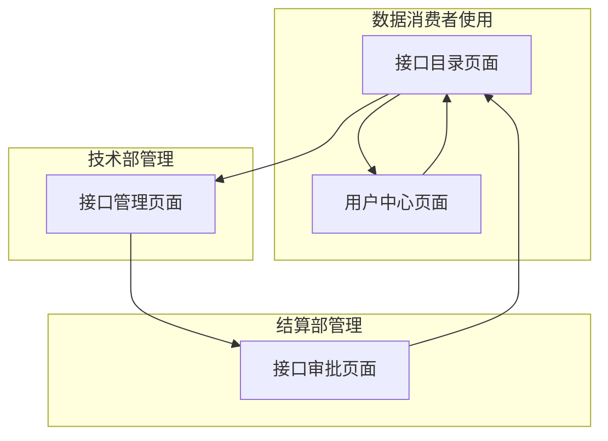
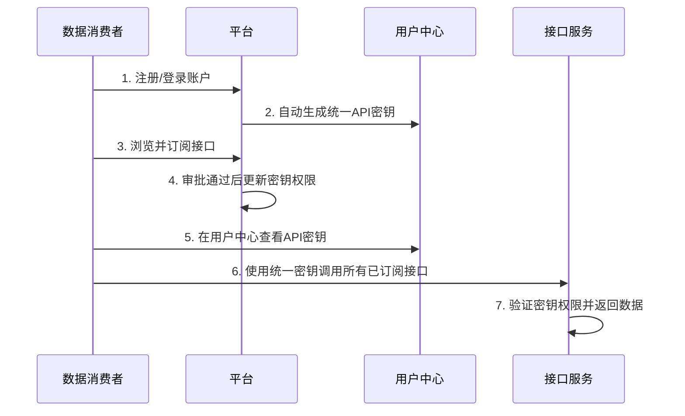
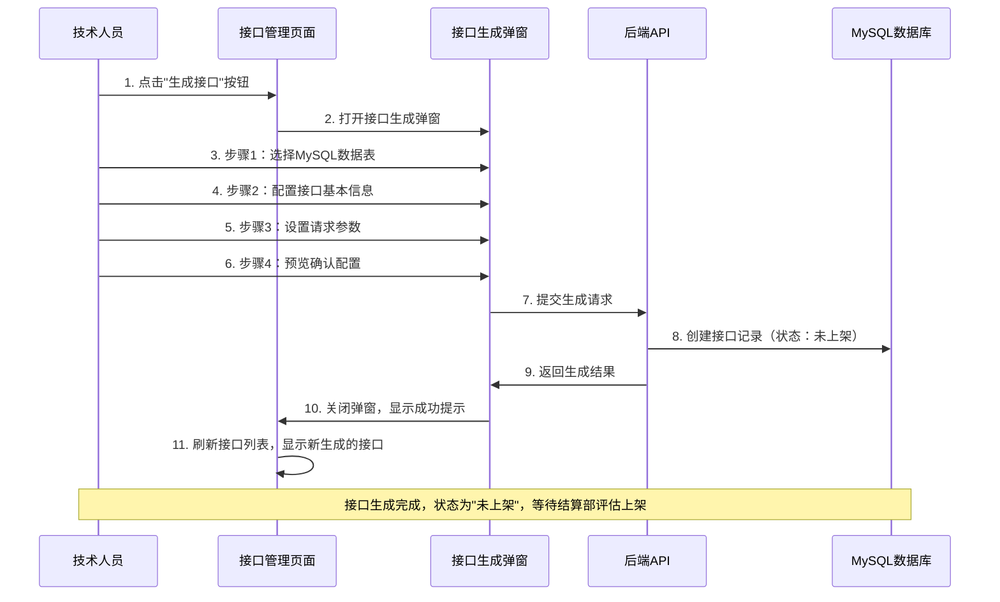
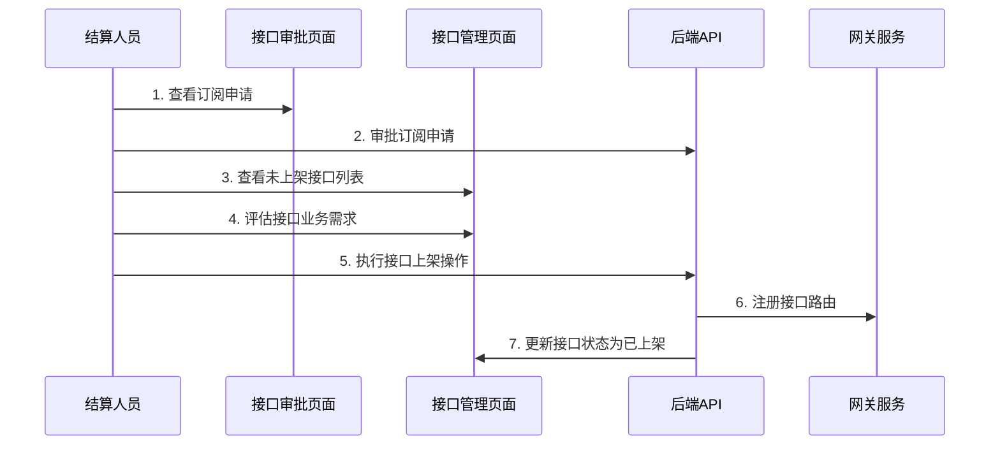
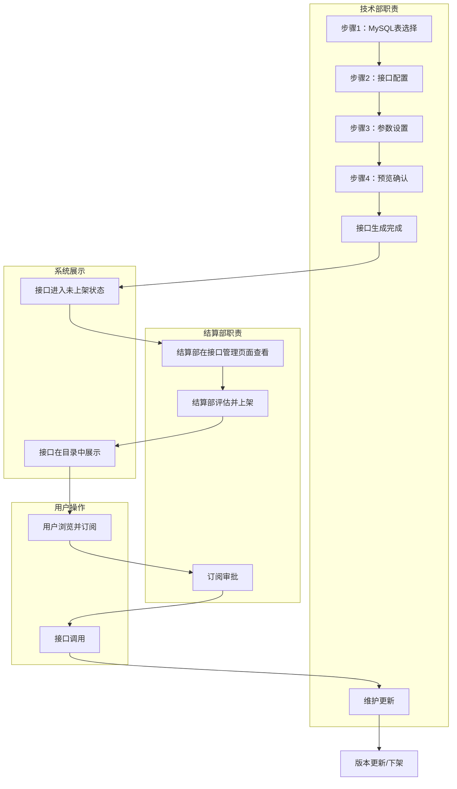
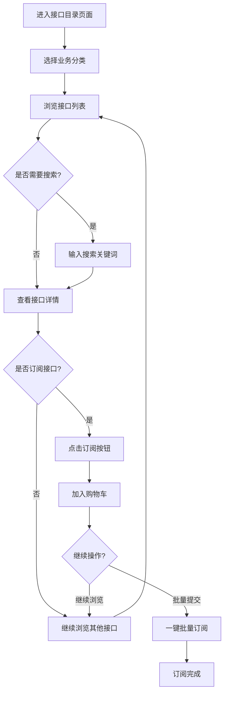
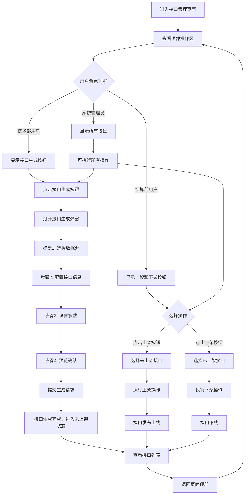
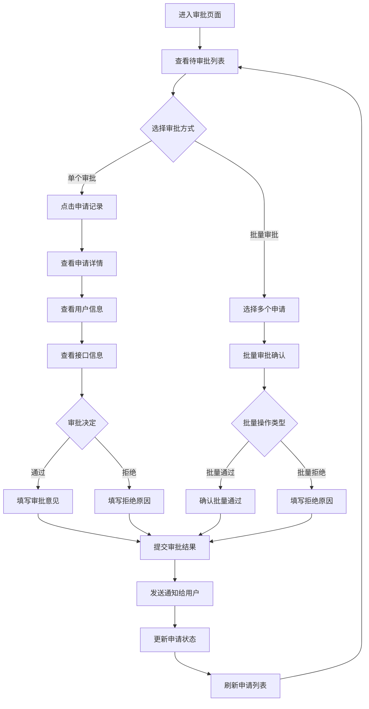
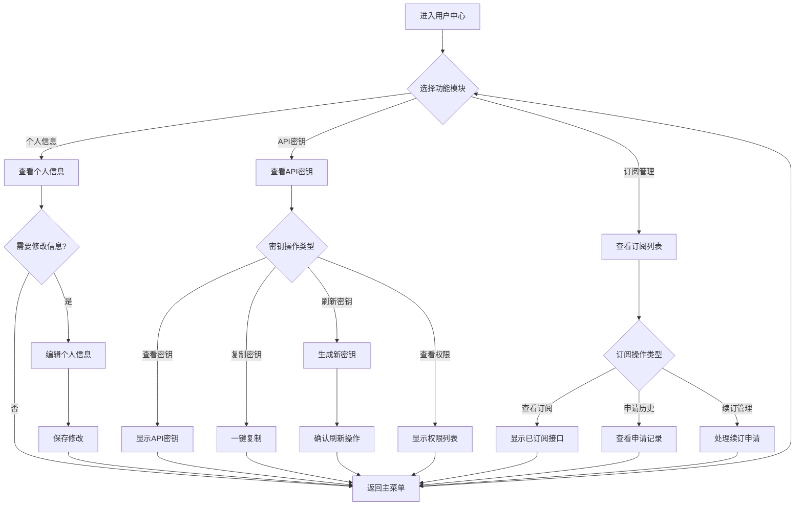

# 电力交易中心接口服务平台产品需求文档 v1.0

## 版本信息

| 版本号  | 发布日期       | 更新内容            | 维护人员 |
| ---- | ---------- | --------------- | ---- |
| v1.0 | 2024-01-15 | 初始版本，包含核心接口管理功能 | 产品团队 |

## 版本规划说明

**当前版本（v1.0）功能范围：**

* ✅ 接口目录浏览与订阅

* ✅ 接口生成与管理

* ✅ 订阅申请审批

* ✅ 用户中心管理

**后续版本规划：**

* 📋 v2.0：接口监控功能（调用统计、性能监控、热度分析）、日志审计功能（操作日志、API调用日志、系统审计）

* 🚫 计费管理功能：暂不纳入开发计划

***

## 1. 产品概览

电力交易中心接口服务平台是一个专业的数据接口管理和服务平台，为电力交易参与者提供标准化的数据接口服务。平台整合电力交易核心数据（检修计划、机组状态、系统负荷等），通过RESTful API对外提供统一的数据服务。

* 解决电力交易数据分散、接口标准不统一的问题，构建一站式数据服务入口

* 目标是建立电力行业标准化的数据接口生态，提升数据流通效率和交易透明度

## 2. 核心功能

### 2.1 用户角色

| 角色         | 注册方式    | 核心权限                 |
| ---------- | ------- | -------------------- |
| 数据消费者      | 企业认证注册  | 浏览接口目录、订阅接口、调用已授权接口  |
| 接口管理员(技术部) | 内部分配账号  | 接口生成、配置、测试、提交上架申请    |
| 接口管理员(结算部) | 内部分配账号  | 接口上架下架、订阅审批          |
| 系统管理员      | 超级管理员分配 | 拥有平台所有权限，包括用户管理、系统配置 |

### 2.2 功能模块

平台核心功能包含以下主要页面：

1. **接口目录页面**：分类展示、接口搜索、批量订阅
2. **接口管理页面**：接口生成、配置、上架下架管理
3. **接口审批页面**：订阅申请一级审批、审批历史管理
4. **用户中心页面**：个人信息、appId管理、订阅管理

### 2.3 接口分类标签体系

平台采用四大业务板块进行接口分类管理：

| 分类标签 | 分类代码               | 描述                 | 颜色标识    |
| ---- | ------------------ | ------------------ | ------- |
| 日前现货 | day\_ahead\_spot   | 日前现货市场相关数据接口       | #1890ff |
| 预测   | forecast           | 负荷预测、新能源预测等预测类数据接口 | #52c41a |
| 辅助服务 | ancillary\_service | 调频、调压、备用等辅助服务数据接口  | #faad14 |
| 电网运行 | grid\_operation    | 电网运行状态、约束情况等运行数据接口 | #f5222d |

### 2.4 模块关系图



### 2.5 页面详情

| 页面名称   | 模块名称     | 功能描述                                     |
| ------ | -------- | ---------------------------------------- |
| 接口目录页面 | 分类树管理    | 左侧树形结构展示业务领域分类，支持展开折叠和搜索                 |
| 接口目录页面 | 接口列表     | 右侧展示接口详细信息，包括名称、描述、参数说明                  |
| 接口目录页面 | 批量订阅     | 支持接口多选、购物车功能、一键批量订阅                      |
| 接口管理页面 | 顶部操作区    | 三个按钮水平排列：接口生成（技术部可见）、上架（结算部可见）、下架（结算部可见） |
| 接口管理页面 | 接口生成弹窗   | 步骤式向导弹窗，包含数据源选择、接口配置、参数设置、预览确认四个步骤       |
| 接口管理页面 | 接口配置     | 配置接口基本信息、请求参数、响应格式等                      |
| 接口管理页面 | 接口列表展示   | 显示接口ID、名称、状态、创建时间等信息，支持多选和批量操作           |
| 接口管理页面 | 接口生命周期管理 | 管理接口状态流转：草稿→已开发→未上架→已上架→已下架              |
| 接口审批页面 | 申请管理     | 展示订阅申请列表，支持一级审批和批量处理                     |
| 接口审批页面 | 审批流程     | 简化的一级审批流程，支持通过/拒绝操作和历史记录                 |
| 用户中心页面 | 个人信息管理   | 编辑基本信息（姓名、邮箱、手机、部门、职位）、密码修改              |
| 用户中心页面 | API密钥管理  | 统一密钥展示、一键复制、权限查看、安全操作（刷新/禁用）             |
| 用户中心页面 | 订阅管理     | 已订阅接口列表、订阅状态管理、申请历史                      |

## 3. 核心流程

### 3.1 数据消费者使用流程

用户登录 → 浏览接口目录 → 查看接口详情 → 提交订阅申请 → 等待审批通过 → 获得统一API密钥 → 调用所有已订阅接口获取数据



### 3.2 接口管理员(技术部)工作流程

选择MySQL数据表 → 生成接口 → 配置接口参数 → 确认生成 → 接口进入未上架状态 → 等待结算部上架



### 3.3 接口管理员(结算部)工作流程

审批用户订阅申请（一级审批：通过/拒绝）→ 评估未上架接口业务需求 → 执行接口上架操作 → 处理接口维护



### 3.4 接口全生命周期流程



## 4. 功能模块原子化分解

### 4.1 模块分解原则

每个功能模块按照以下原则进行原子化分解：

* **独立性**：每个子模块可独立开发、测试、部署

* **完整性**：包含完整的输入输出定义、业务逻辑、异常处理

* **可验证性**：具备明确的验收标准和测试用例

* **可追溯性**：与技术实现方案一一对应

### 4.2 用户管理模块原子化

#### 4.2.1 用户注册子模块

**功能描述**：企业用户注册账号

**输入定义**：

* 企业名称：2-50个字符，支持中英文

* 统一社会信用代码：18位标准格式

* 联系人姓名：2-20个字符

* 手机号码：11位数字，符合中国大陆格式

* 邮箱地址：标准邮箱格式，最长100字符

* 密码：8-20位，包含大小写字母、数字、特殊字符

**输出定义**：

* 成功：返回用户ID、注册时间、待审核状态

* 失败：返回具体错误信息和错误码

**业务规则**：

* 企业名称和信用代码不能重复

* 手机号和邮箱不能重复

* 密码需符合安全策略

* 注册后状态为"待审核"

**异常处理**：

* 重复注册：提示"该企业已注册"

* 格式错误：提示具体字段格式要求

* 系统异常：提示"注册失败，请稍后重试"

**验收标准**：

* 正常注册流程完整可用

* 各种异常情况正确处理

* 数据校验规则生效

* 注册成功后数据正确存储

#### 4.2.2 用户登录子模块

**功能描述**：用户账号密码登录

**输入定义**：

* 登录账号：手机号或邮箱

* 密码：用户设置的密码

* 验证码：4位数字（可选）

**输出定义**：

* 成功：JWT Token、用户基本信息、权限列表

* 失败：错误信息、剩余尝试次数

**业务规则**：

* 连续5次失败锁定账号30分钟

* Token有效期24小时

* 只有"已审核"状态用户可登录

**异常处理**：

* 账号不存在："用户不存在"

* 密码错误："密码错误，还可尝试X次"

* 账号锁定："账号已锁定，请30分钟后重试"

* 账号未审核："账号待审核，请联系管理员"

**验收标准**：

* 正确账号密码可成功登录

* 错误信息准确提示

* 锁定机制正常工作

* Token生成和验证正确

#### 4.2.3 权限管理子模块

**功能描述**：基于角色的权限控制

**角色定义**：

* 数据消费者：浏览、订阅、调用接口

* 技术部：接口生成、配置、测试

* 结算部：接口上架、下架、订阅审批

* 系统管理员：所有权限

**权限粒度**：

* 页面访问权限

* 按钮操作权限

* 数据查看权限

* API调用权限

**验收标准**：

* 不同角色看到对应功能

* 无权限操作被正确拦截

* 权限变更实时生效

### 4.3 接口管理模块原子化

#### 4.3.1 接口生成子模块

**功能描述**：技术部通过四步骤向导生成数据接口

**步骤1：MySQL表选择**

**输入定义**：

* MySQL数据表名：从系统MySQL数据库中选择结构化表

* 表结构验证：确认表包含有效的数据字段

**输出定义**：

* 表结构信息：字段名、类型、注释、主键标识

* 表类型识别：24小时表、288点表、设备表、统计表

* 推荐模板：基于表类型的接口模板

**业务规则**：

* 只能选择MySQL数据库中的结构化表

* 表必须包含有效的数据字段

* 自动识别表类型并推荐模板

* 支持表结构预览和字段说明

**异常处理**：

* MySQL连接失败："MySQL数据库连接异常，请联系管理员"

* 表不存在："选择的表不存在或已删除"

* 表无数据："表中无有效数据，无法生成接口"

* 表结构异常："表结构不符合要求，请检查表设计"

**验收标准**：

* MySQL表列表正确显示

* 表结构信息准确获取

* 表类型识别准确

* 异常情况正确处理

* 支持表结构预览功能

**步骤2：接口配置**

**输入定义**：

* 接口名称：2-50个字符，中英文数字

* 接口描述：10-200个字符，详细说明

* 业务分类：四大板块之一

* 接口路径：自动生成，可手动调整

**输出定义**：

* 完整接口路径：包含前缀的完整URL

* 预估响应时间：基于表大小计算

* 接口唯一标识：系统生成的UUID

**业务规则**：

* 接口名称在系统内唯一

* 接口路径符合RESTful规范

* 分类必须从预定义列表选择

**异常处理**：

* 名称重复："接口名称已存在，请修改"

* 路径冲突："接口路径冲突，请调整"

* 格式错误："字段格式不正确，请检查"

**验收标准**：

* 接口信息正确保存

* 路径生成规则正确

* 重复性检查有效

* 预览信息准确显示

**步骤3：参数设置**

**输入定义**：

* 标准参数：dataTime（必需）、appId（必需）

* 业务参数：自定义参数列表

* 参数属性：名称、类型、描述、必需性、默认值

**输出定义**：

* 完整参数列表：包含所有参数定义

* 请求示例：基于参数生成的请求样例

* 响应格式：标准JSON响应结构

**业务规则**：

* 标准参数不可删除或修改

* 业务参数名称不能重复

* 参数类型从预定义列表选择

**异常处理**：

* 参数名重复："参数名称重复，请修改"

* 类型不匹配："参数类型不正确"

* 必需参数缺失："必需参数不能为空"

**验收标准**：

* 参数配置正确保存

* 请求响应格式正确

* 参数校验规则生效

* 示例代码可用

**步骤4：预览确认**

**输入定义**：

* 确认操作：用户点击"生成接口"按钮

* 配置摘要：前三步的所有配置信息

**输出定义**：

* 接口创建结果：成功或失败状态

* 接口ID：系统生成的唯一标识

* 接口状态："未上架"

**业务规则**：

* 生成后接口状态为"未上架"

* 接口信息不可再修改（需重新生成）

* 自动记录创建人和创建时间

**异常处理**：

* 生成失败："接口生成失败，请重试"

* 系统异常："系统繁忙，请稍后重试"

* 权限不足："无权限执行此操作"

**验收标准**：

* 接口成功创建并保存

* 状态正确设置为"未上架"

* 创建信息准确记录

* 生成结果正确反馈

#### 4.3.2 接口状态管理子模块

**功能描述**：管理接口在生命周期中的状态转换

**状态定义**：

* 未上架(unpublished)：技术部生成后的初始状态

* 已上架(published)：结算部审核通过并上架

* 已下架(offline)：结算部主动下架

**状态转换规则**：

```
技术部生成 → 未上架 → 已上架 → 已下架
                ↑         ↓
                └─── 重新上架 ←──┘
```

**权限控制**：

* 技术部：只能生成接口（状态变为未上架）

* 结算部：可以上架（未上架→已上架）、下架（已上架→已下架）、重新上架（已下架→已上架）

* 系统管理员：所有状态转换权限

**业务规则**：

* 状态转换必须按规定路径进行

* 每次状态变更记录操作人和时间

* 已上架接口在接口目录中可见

* 未上架和已下架接口仅在管理页面可见

**验收标准**：

* 状态转换逻辑正确

* 权限控制有效

* 状态变更日志完整

* 可见性规则正确

#### 4.3.3 接口列表管理子模块

**功能描述**：展示和管理接口列表，支持筛选、搜索、批量操作

**列表字段**：

* 接口ID：系统生成的唯一标识

* 接口名称：用户定义的接口名称

* 接口路径：完整的API路径

* 业务分类：所属业务板块

* 状态：当前接口状态

* 创建人：接口创建者

* 创建时间：接口创建时间

* 更新时间：最后修改时间

**筛选功能**：

* 按状态筛选：未上架、已上架、已下架

* 按分类筛选：四大业务板块

* 按创建人筛选：技术部成员列表

* 按时间范围筛选：创建时间、更新时间

**搜索功能**：

* 接口名称模糊搜索

* 接口路径精确搜索

* 描述内容关键词搜索

**批量操作**：

* 批量上架：选中多个未上架接口执行上架

* 批量下架：选中多个已上架接口执行下架

* 批量删除：删除未上架状态的接口（仅系统管理员）

**验收标准**：

* 列表数据准确显示

* 筛选搜索功能正常

* 批量操作事务安全

* 权限控制正确

### 4.4 订阅审批模块原子化

#### 4.4.1 订阅申请子模块

**功能描述**：数据消费者提交接口订阅申请

**输入定义**：

* 接口ID列表：要订阅的接口标识

* 申请理由：100-500字符，详细说明

* 业务场景：具体使用场景描述

* 预计调用量：每日预计调用次数

**输出定义**：

* 申请ID：系统生成的申请标识

* 申请状态："待审批"

* 申请时间：提交时间戳

**业务规则**：

* 只能申请"已上架"状态的接口

* 不能重复申请已订阅的接口

* 申请理由不能为空

* 单次最多申请20个接口

**异常处理**：

* 接口不存在："选择的接口不存在或已下架"

* 重复申请："该接口已订阅或申请中"

* 申请过多："单次申请接口数量不能超过20个"

* 理由为空："申请理由不能为空"

**验收标准**：

* 申请提交成功

* 申请信息准确保存

* 重复性检查有效

* 异常情况正确处理

#### 4.4.2 一级审批处理子模块

**功能描述**：结算部进行简化的一级审批

**输入定义**：

* 申请ID：要处理的申请标识

* 审批动作：通过(approve)或拒绝(reject)

* 审批意见：审批理由或建议（拒绝时必填）

**输出定义**：

* 审批结果：成功或失败

* 权限更新：通过时立即更新用户API权限

* 通知发送：审批结果通知申请人

**业务规则**：

* 申请状态：pending（待审批）→ approved（通过）/rejected（拒绝）

* 审批通过后立即生效，无需多级审批

* 审批拒绝必须填写拒绝理由

* 审批操作不可撤销，但支持重新申请

**操作界面**：

* 两个操作按钮："通过"（绿色）、"拒绝"（红色）

* 审批意见输入框（拒绝时必填）

* 申请详情展示区域

**异常处理**：

* 申请不存在："申请不存在或已处理"

* 权限不足："无权限审批此申请"

* 意见为空："拒绝申请必须填写理由"

* 系统异常："审批失败，请重试"

**验收标准**：

* 一键审批操作成功执行

* 权限更新正确

* 审批记录完整

* 通知发送成功

#### 4.4.3 批量审批子模块

**功能描述**：批量处理多个订阅申请

**输入定义**：

* 申请ID列表：要批量处理的申请

* 批量动作：批量通过或批量拒绝

* 统一意见：适用于所有申请的审批意见

**输出定义**：

* 处理结果统计：成功数量、失败数量

* 详细结果列表：每个申请的处理结果

* 失败原因：处理失败的具体原因

**业务规则**：

* 单次最多处理50个申请

* 部分失败不影响其他申请处理

* 批量操作支持事务回滚

* 操作结果详细记录

**异常处理**：

* 申请过多："单次处理申请数量不能超过50个"

* 部分失败：显示成功和失败的详细列表

* 全部失败："批量操作失败，请检查申请状态"

**验收标准**：

* 批量操作正确执行

* 事务处理安全

* 结果统计准确

* 异常处理完善

### 4.5 用户中心模块原子化

#### 4.5.1 个人信息管理子模块

**功能描述**：用户管理个人基本信息

**可编辑字段**：

* 真实姓名：2-20个字符

* 手机号码：11位数字

* 邮箱地址：标准邮箱格式

* 部门信息：所属部门

* 职位信息：具体职位

**不可编辑字段**：

* 用户名：注册时确定

* 企业名称：注册时确定

* 注册时间：系统记录

* 用户状态：管理员控制

**业务规则**：

* 手机号和邮箱不能与其他用户重复

* 修改关键信息需要验证原密码

* 信息变更记录操作日志

**验收标准**：

* 信息修改成功保存

* 重复性检查有效

* 操作日志完整

* 界面友好易用

#### 4.5.2 API密钥管理子模块

**功能描述**：管理用户的API调用密钥

**密钥信息**：

* AppId：用户唯一标识

* 密钥状态：启用、禁用

* 创建时间：密钥生成时间

* 最后使用时间：最近调用时间

* 权限范围：可调用的接口列表

**操作功能**：

* 查看密钥：显示AppId（密钥不显示）

* 复制密钥：一键复制到剪贴板

* 刷新密钥：重新生成新密钥

* 禁用密钥：临时停用API调用

* 启用密钥：恢复API调用权限

**业务规则**：

* 每个用户只有一个AppId

* 密钥刷新后旧密钥立即失效

* 禁用状态下无法调用任何接口

* 权限范围基于已审批的订阅

**验收标准**：

* 密钥操作正确执行

* 权限控制准确

* 状态变更实时生效

* 安全性措施到位

#### 4.5.3 订阅管理子模块

**功能描述**：管理用户的接口订阅情况

**订阅信息**：

* 接口名称：订阅的接口名称

* 接口分类：所属业务板块

* 订阅状态：已订阅、申请中、已拒绝

* 申请时间：提交申请的时间

* 审批时间：审批完成的时间

* 审批意见：审批人的意见或建议

**操作功能**：

* 查看详情：接口详细信息和调用文档

* 取消订阅：主动取消已订阅的接口

* 重新申请：对被拒绝的申请重新提交

* 申请历史：查看所有申请记录

**业务规则**：

* 取消订阅立即生效

* 重新申请需要修改申请理由

* 申请历史保留完整记录

* 订阅状态实时更新

**验收标准**：

* 订阅信息准确显示

* 操作功能正常

* 状态更新及时

* 历史记录完整

## 6. 业务逻辑细化

### 6.1 接口生成业务流程细化

#### 6.1.1 数据源选择流程

**步骤序列**：

1. **页面初始化**

   * 加载用户有权限的数据源列表

   * 检查数据源连接状态

   * 显示数据源基本信息（名称、类型、状态）

2. **数据源选择**

   * 判断条件：数据源状态 = "正常"

   * 用户点击数据源卡片

   * 系统发起数据源连接测试

   * 连接成功：展开显示数据表列表

   * 连接失败：显示错误提示，禁用该数据源

3. **数据表选择**

   * 判断条件：表记录数 > 0 且 字段数 > 1

   * 用户点击表名

   * 系统查询表结构信息

   * 执行表类型智能识别算法

   * 显示表详情和推荐模板

4. **表类型识别算法**

   ```
   IF 存在字段(value1, value2, ..., value24) THEN
       表类型 = "24小时时间点表"
       推荐模板 = "hourly_data_template"
   ELSE IF 存在字段(P1, P2, ..., P288) THEN
       表类型 = "288点时间序列表"
       推荐模板 = "timeseries_template"
   ELSE IF 存在字段(devname, devType) THEN
       表类型 = "设备信息表"
       推荐模板 = "device_info_template"
   ELSE IF 存在字段(sum, avg, count) THEN
       表类型 = "统计汇总表"
       推荐模板 = "statistics_template"
   ELSE
       表类型 = "通用数据表"
       推荐模板 = "general_template"
   END IF
   ```

5. **步骤验证**

   * 判断条件：已选择数据源 AND 已选择数据表

   * 验证通过：启用"下一步"按钮

   * 验证失败：禁用"下一步"按钮，显示提示信息

#### 6.1.2 接口配置流程

**步骤序列**：

1. **表单初始化**

   * 根据选中表名自动生成接口名称

   * 根据表类型自动生成接口描述模板

   * 根据接口名称自动生成接口路径

2. **接口名称处理**

   ```
   自动生成规则：
   IF 表类型 = "24小时时间点表" THEN
       接口名称 = 表名 + "小时数据查询"
   ELSE IF 表类型 = "288点时间序列表" THEN
       接口名称 = 表名 + "时间序列数据查询"
   ELSE
       接口名称 = 表名 + "数据查询"
   END IF
   ```

3. **接口路径生成**

   ```
   生成规则：
   1. 将接口名称转换为英文（使用翻译服务或预定义映射）
   2. 转换为驼峰命名法
   3. 添加统一前缀：/px-phzhb-external-share/dataproduct/
   4. 检查路径唯一性
   5. 如有冲突，添加数字后缀
   ```

4. **实时校验**

   * 接口名称输入时：检查长度（2-50字符）、重复性

   * 接口描述输入时：检查长度（10-200字符）

   * 业务分类选择时：更新分类标签颜色

   * 接口路径修改时：检查格式、重复性

5. **步骤验证**

   ```
   验证条件：
   接口名称.length >= 2 AND 接口名称.length <= 50 AND
   接口描述.length >= 10 AND 接口描述.length <= 200 AND
   业务分类 != null AND
   接口路径格式正确 AND 接口路径唯一
   ```

#### 6.1.3 参数设置流程

**步骤序列**：

1. **标准参数初始化**

   * 自动添加dataTime参数（必需，datetime类型）

   * 自动添加appId参数（必需，string类型）

   * 标准参数不可删除、不可修改

2. **业务参数配置**

   * 根据表类型推荐业务参数

   * 用户可添加自定义参数

   * 参数属性配置：名称、类型、描述、必需性、默认值

3. **参数推荐算法**

   ```
   IF 表类型 = "24小时时间点表" THEN
       推荐参数 = ["caseType", "extType"]
   ELSE IF 表类型 = "设备信息表" THEN
       推荐参数 = ["deviceType", "deviceStatus"]
   ELSE IF 表类型 = "统计汇总表" THEN
       推荐参数 = ["statisticType", "timeRange"]
   END IF
   ```

4. **参数校验规则**

   * 参数名称：2-50字符，字母数字下划线

   * 参数类型：从预定义列表选择

   * 参数描述：1-200字符

   * 默认值：符合参数类型格式

5. **响应格式生成**

   * 基于表结构自动生成响应字段

   * 生成请求示例代码

   * 实时预览响应格式

#### 6.1.4 预览确认流程

**步骤序列**：

1. **配置摘要生成**

   * 汇总前三步的所有配置信息

   * 生成完整的接口文档预览

   * 计算预估响应时间

2. **SQL模板生成**

   ```
   基础SQL模板：
   SELECT * FROM {表名}
   WHERE 1=1

   IF 存在dataTime参数 THEN
       添加：AND date_time = #{dataTime}
   END IF

   FOR EACH 业务参数 DO
       IF 参数.必需 = true THEN
           添加：AND {参数名} = #{参数名}
       ELSE
           添加：<if test="{参数名} != null">AND {参数名} = #{参数名}</if>
       END IF
   END FOR
   ```

3. **最终验证**

   * 检查所有必填项是否完整

   * 验证SQL模板语法正确性

   * 确认接口路径唯一性

   * 检查用户权限

4. **接口生成执行**

   ```
   生成流程：
   1. 开启数据库事务
   2. 创建接口记录（状态：未上架）
   3. 创建参数记录
   4. 生成接口代码文件
   5. 提交事务
   6. 返回生成结果

   异常处理：
   IF 任何步骤失败 THEN
       回滚事务
       返回错误信息
   END IF
   ```

### 6.2 接口状态管理业务流程

#### 6.2.1 状态转换规则

**状态定义**：

* 未上架(unpublished)：初始状态，技术部生成后的状态

* 已上架(published)：结算部审核通过并上架的状态

* 已下架(offline)：结算部主动下架的状态

**状态转换矩阵**：

```
当前状态 \ 目标状态  | 未上架 | 已上架 | 已下架
---------------------|--------|--------|--------
未上架               |   -    |   ✓    |   ✗
已上架               |   ✗    |   -    |   ✓
已下架               |   ✗    |   ✓    |   -
```

**权限控制矩阵**：

```
角色 \ 操作        | 生成接口 | 上架接口 | 下架接口 | 重新上架
------------------|----------|----------|----------|----------
技术部            |    ✓     |    ✗     |    ✗     |    ✗
结算部            |    ✗     |    ✓     |    ✓     |    ✓
系统管理员        |    ✓     |    ✓     |    ✓     |    ✓
```

#### 6.2.2 上架操作流程

**前置条件检查**：

```
IF 接口状态 != "未上架" THEN
    返回错误："只能上架未上架状态的接口"
ELSE IF 用户角色 != "结算部" AND 用户角色 != "系统管理员" THEN
    返回错误："权限不足"
ELSE IF 接口路径已存在于网关 THEN
    返回错误："接口路径冲突"
END IF
```

**上架执行流程**：

1. **数据库更新**

   * 更新接口状态为"已上架"

   * 记录上架时间

   * 记录操作人信息

2. **网关注册**

   * 向网关服务注册接口路由

   * 配置接口访问权限

   * 启用接口监控

3. **缓存更新**

   * 更新接口目录缓存

   * 刷新权限缓存

   * 通知其他服务节点

4. **操作日志**

   * 记录操作类型："接口上架"

   * 记录操作人、操作时间

   * 记录操作前后状态

#### 6.2.3 批量操作流程

**批量上架流程**：

```
输入：接口ID列表，操作原因

1. 预检查阶段：
   FOR EACH 接口ID DO
       检查接口是否存在
       检查接口状态是否允许上架
       检查用户权限
       记录检查结果
   END FOR

2. 执行阶段：
   创建批量操作任务记录
   FOR EACH 通过预检查的接口 DO
       执行单个上架操作
       记录操作结果（成功/失败/原因）
   END FOR

3. 结果汇总：
   统计成功数量、失败数量
   生成操作报告
   更新任务状态
```

### 6.3 订阅审批业务流程

#### 6.3.1 订阅申请流程

**申请提交流程**：

1. **前置检查**

   ```
   FOR EACH 接口ID DO
       IF 接口状态 != "已上架" THEN
           返回错误："只能申请已上架的接口"
       ELSE IF 用户已订阅该接口 THEN
           返回错误："该接口已订阅"
       ELSE IF 存在待审批申请 THEN
           返回错误："该接口申请审批中"
       END IF
   END FOR
   ```

2. **申请创建**

   * 生成申请ID

   * 设置申请状态为"待审批"

   * 记录申请时间和申请人

   * 保存申请理由和业务场景

3. **申请验证**

   * 申请理由长度：100-500字符

   * 业务场景描述：必填

   * 预计调用量：数字类型，>0

   * 单次申请接口数量：≤20

#### 6.3.2 审批处理流程

**审批决策流程**：

```
输入：申请ID，审批动作（通过/拒绝），审批意见

1. 权限检查：
   IF 用户角色 != "结算部" AND 用户角色 != "系统管理员" THEN
       返回错误："无审批权限"
   END IF

2. 状态检查：
   IF 申请状态 != "待审批" THEN
       返回错误："申请已处理或不存在"
   END IF

3. 审批执行：
   IF 审批动作 = "通过" THEN
       更新申请状态为"已通过"
       更新用户API权限
       发送通过通知
   ELSE IF 审批动作 = "拒绝" THEN
       IF 审批意见为空 THEN
           返回错误："拒绝申请必须填写理由"
       END IF
       更新申请状态为"已拒绝"
       发送拒绝通知
   END IF

4. 记录审批历史：
   创建审批记录
   记录审批人、审批时间、审批动作、审批意见
```

**权限更新流程**：

```
当审批通过时：
1. 查询用户当前API权限
2. 添加新接口权限到权限列表
3. 更新用户appId权限范围
4. 刷新权限缓存
5. 通知网关服务更新权限
```

### 6.4 用户中心业务流程

#### 6.4.1 API密钥管理流程

**密钥生成规则**：

```
appId生成算法：
appId = "app_" + 用户ID + "_" + 时间戳(YYYYMMDD)
示例：app_1001_20240115

密钥生成算法：
1. 生成32位随机字符串
2. 使用用户ID和时间戳作为盐值
3. 进行SHA256加密
4. 取前32位作为密钥
```

**密钥刷新流程**：

```
1. 验证用户身份（需要输入当前密码）
2. 生成新的密钥
3. 更新数据库中的密钥记录
4. 将旧密钥加入黑名单（保留24小时缓冲期）
5. 清除相关缓存
6. 返回新密钥给用户
```

**密钥状态管理**：

* 启用：可以正常调用API

* 禁用：暂时停用，无法调用API

* 过期：超过有效期，需要刷新

* 锁定：异常使用被锁定，需要管理员解锁

#### 6.4.2 订阅管理流程

**订阅状态同步**：

```
定时任务（每5分钟执行）：
1. 查询用户所有订阅申请
2. 检查申请状态变化
3. 更新本地订阅状态缓存
4. 推送状态变更通知到前端
```

**取消订阅流程**：

```
1. 检查订阅状态（只能取消"已订阅"状态）
2. 确认操作（显示取消后果提示）
3. 更新订阅状态为"已取消"
4. 从用户API权限中移除该接口
5. 更新权限缓存
6. 记录操作日志
```

## 7. 异常处理完善

### 7.1 系统级异常处理

#### 7.1.1 网络连接异常

**异常场景**：

* 前端与后端API连接超时

* 后端与数据库连接中断

* 后端与网关服务连接失败

* 第三方服务（翻译、监控）不可用

**处理策略**：

```
连接超时处理：
1. 设置请求超时时间：30秒
2. 超时后自动重试：最多3次
3. 重试间隔：2秒、5秒、10秒（递增）
4. 最终失败后显示友好错误提示

数据库连接异常：
1. 启用连接池监控
2. 连接失败时切换到备用数据源
3. 记录异常日志
4. 通知运维人员

网关服务异常：
1. 检测网关服务健康状态
2. 服务不可用时暂停接口上架操作
3. 显示系统维护提示
4. 自动恢复检测机制
```

**用户提示信息**：

* 网络连接超时："网络连接超时，请检查网络后重试"

* 服务暂不可用："系统正在维护中，请稍后再试"

* 数据加载失败："数据加载失败，请刷新页面重试"

#### 7.1.2 权限验证异常

**异常场景**：

* 用户token过期

* 用户权限被撤销

* 跨域访问被拒绝

* API密钥失效

**处理策略**：

```
token过期处理：
1. 检测到401状态码
2. 自动跳转到登录页面
3. 保存当前页面路径
4. 登录成功后自动跳转回原页面

权限不足处理：
1. 检测到403状态码
2. 显示权限不足提示
3. 提供申请权限入口
4. 记录权限访问日志

API密钥异常：
1. 密钥验证失败时返回特定错误码
2. 提示用户检查密钥配置
3. 提供密钥重新生成功能
4. 记录异常访问尝试
```

**错误码定义**：

* 4001：token已过期

* 4002：权限不足

* 4003：API密钥无效

* 4004：API密钥已过期

* 4005：访问频率超限

### 7.2 业务逻辑异常处理

#### 7.2.1 接口生成异常

**异常场景及处理**：

**数据源连接异常**：

```
异常情况：
- 数据源服务器不可达
- 数据库连接参数错误
- 数据库用户权限不足
- 数据源正在维护

处理流程：
1. 捕获连接异常
2. 记录详细错误信息
3. 向用户显示具体错误原因
4. 提供重试和联系管理员选项

错误提示：
- "数据源连接失败：服务器不可达"
- "数据源连接失败：用户名或密码错误"
- "数据源连接失败：权限不足"
```

**表结构解析异常**：

```
异常情况：
- 表不存在或已被删除
- 表结构发生变化
- 表字段类型不支持
- 表数据为空

处理流程：
1. 验证表的存在性
2. 检查表结构完整性
3. 验证字段类型兼容性
4. 提供表结构修复建议

错误提示：
- "表'{表名}'不存在，请检查表名是否正确"
- "表'{表名}'无数据，无法生成接口"
- "表'{表名}'包含不支持的字段类型"
```

**接口配置验证异常**：

```
异常情况：
- 接口名称重复
- 接口路径格式错误
- 参数配置冲突
- SQL模板生成失败

处理流程：
1. 实时验证用户输入
2. 提供输入格式提示
3. 自动修正常见错误
4. 显示详细验证结果

验证规则：
接口名称验证：
- 长度：2-50字符
- 格式：中文、英文、数字、下划线
- 唯一性：系统内不重复

接口路径验证：
- 格式：/开头，符合RESTful规范
- 长度：10-200字符
- 唯一性：网关内不重复
```

#### 7.2.2 接口管理异常

**状态转换异常**：

```
异常场景：
- 尝试上架已上架的接口
- 尝试下架未上架的接口
- 并发操作导致状态冲突
- 网关注册失败

处理策略：
1. 状态检查前置验证
2. 使用数据库锁防止并发冲突
3. 网关操作失败时回滚数据库状态
4. 提供状态同步修复功能

错误处理：
IF 接口状态检查失败 THEN
    返回错误码：5001
    错误信息："接口状态不允许此操作"
    建议操作："请刷新页面查看最新状态"
END IF

IF 网关注册失败 THEN
    回滚数据库操作
    返回错误码：5002
    错误信息："网关服务异常，操作失败"
    建议操作："请稍后重试或联系管理员"
END IF
```

**批量操作异常**：

```
异常场景：
- 部分接口操作成功，部分失败
- 批量操作超时
- 操作过程中系统异常
- 权限在操作过程中发生变化

处理策略：
1. 采用事务性批量操作
2. 记录每个接口的操作结果
3. 提供详细的操作报告
4. 支持失败项目的重试操作

操作报告格式：
{
  "总数": 10,
  "成功数": 8,
  "失败数": 2,
  "成功列表": ["接口1", "接口2", ...],
  "失败列表": [
    {
      "接口名": "接口9",
      "失败原因": "网关注册失败",
      "错误码": "5002"
    }
  ]
}
```

#### 7.2.3 订阅审批异常

**申请提交异常**：

```
异常场景：
- 重复申请同一接口
- 申请已下架的接口
- 申请理由不符合规范
- 用户权限不足

处理流程：
1. 申请前置条件检查
2. 申请内容格式验证
3. 重复申请检测
4. 用户权限验证

验证规则：
申请理由验证：
- 长度：100-500字符
- 内容：不能包含敏感词汇
- 格式：纯文本，不支持HTML

业务场景验证：
- 必填项检查
- 场景描述合理性
- 预计调用量范围：1-10000次/天
```

**审批处理异常**：

```
异常场景：
- 审批人权限不足
- 申请状态已变更
- 审批意见格式错误
- 系统权限更新失败

处理策略：
1. 审批前状态锁定
2. 权限更新事务处理
3. 审批历史完整记录
4. 异常情况自动回滚

审批事务流程：
BEGIN TRANSACTION
  1. 锁定申请记录
  2. 验证审批人权限
  3. 更新申请状态
  4. 更新用户权限（如果通过）
  5. 记录审批历史
  6. 发送通知
COMMIT TRANSACTION

异常回滚：
IF 任何步骤失败 THEN
  ROLLBACK TRANSACTION
  记录异常日志
  通知审批人操作失败
END IF
```

### 7.3 数据验证异常处理

#### 7.3.1 输入参数验证

**前端验证规则**：

```
字符串类型验证：
- 长度限制检查
- 特殊字符过滤
- XSS攻击防护
- SQL注入防护

数字类型验证：
- 数值范围检查
- 数据类型转换
- 精度限制验证
- 负数处理规则

日期类型验证：
- 日期格式标准化
- 日期范围合理性
- 时区处理
- 历史日期限制
```

**后端验证增强**：

```
参数完整性验证：
1. 必填参数检查
2. 参数类型验证
3. 参数值范围验证
4. 参数组合逻辑验证

安全性验证：
1. 防SQL注入检查
2. 防XSS攻击检查
3. 文件上传安全检查
4. 请求频率限制

业务逻辑验证：
1. 业务规则一致性
2. 数据关联性检查
3. 权限范围验证
4. 操作时序验证
```

#### 7.3.2 数据库操作异常

**数据库约束异常**：

```
主键冲突处理：
- 检测主键重复
- 提供数据更新选项
- 生成新的主键值
- 记录冲突日志

外键约束异常：
- 验证关联数据存在性
- 提供关联数据创建入口
- 显示约束关系说明
- 提供数据修复建议

唯一性约束异常：
- 检查唯一字段冲突
- 提供字段值修改建议
- 显示冲突的具体记录
- 支持批量冲突解决
```

**数据库连接异常**：

```
连接池耗尽：
1. 监控连接池使用情况
2. 自动扩展连接池大小
3. 释放长时间占用的连接
4. 记录连接使用统计

事务超时：
1. 设置合理的事务超时时间
2. 长事务自动拆分
3. 事务执行进度监控
4. 超时事务自动回滚

死锁检测：
1. 数据库死锁自动检测
2. 死锁发生时自动重试
3. 死锁统计和分析
4. 优化SQL执行顺序
```

### 7.4 用户体验异常处理

#### 7.4.1 页面加载异常

**加载超时处理**：

```
页面加载策略：
1. 关键内容优先加载
2. 非关键内容延迟加载
3. 加载进度实时显示
4. 加载失败重试机制

超时处理流程：
1. 设置页面加载超时：15秒
2. 超时后显示加载失败提示
3. 提供手动刷新按钮
4. 记录加载性能数据

用户提示：
- 加载中："正在加载数据，请稍候..."
- 加载超时："页面加载超时，请点击重试"
- 加载失败："数据加载失败，请检查网络连接"
```

**数据展示异常**：

```
空数据处理：
- 显示友好的空状态提示
- 提供数据添加入口
- 显示数据获取帮助信息
- 提供示例数据参考

数据格式异常：
- 自动数据格式修正
- 显示原始数据和修正后数据
- 提供数据格式说明
- 记录数据质量问题

大数据量处理：
- 分页加载机制
- 虚拟滚动技术
- 数据懒加载
- 加载性能优化
```

#### 7.4.2 操作反馈异常

**操作确认机制**：

```
危险操作确认：
- 删除操作：二次确认弹窗
- 批量操作：显示影响范围
- 状态变更：显示变更后果
- 权限变更：显示权限影响

操作进度反馈：
- 实时进度条显示
- 操作步骤详细说明
- 预估完成时间
- 取消操作选项

操作结果反馈：
- 成功操作：绿色提示信息
- 失败操作：红色错误信息
- 部分成功：黄色警告信息
- 详细结果：可展开查看
```

### 7.5 系统监控和告警

#### 7.5.1 异常监控指标

**系统性能监控**：

```
响应时间监控：
- API响应时间：< 2秒
- 页面加载时间：< 5秒
- 数据库查询时间：< 1秒
- 文件上传时间：< 30秒

系统资源监控：
- CPU使用率：< 80%
- 内存使用率：< 85%
- 磁盘使用率：< 90%
- 网络带宽使用率：< 70%

业务指标监控：
- 接口调用成功率：> 99%
- 用户登录成功率：> 95%
- 数据同步成功率：> 99%
- 审批处理及时率：> 90%
```

**异常告警规则**：

```
告警级别定义：
- 紧急：系统不可用，影响所有用户
- 重要：核心功能异常，影响部分用户
- 一般：非核心功能异常，用户体验下降
- 提醒：性能指标异常，需要关注

告警触发条件：
紧急告警：
- 系统响应时间 > 10秒
- 错误率 > 10%
- 服务不可用时间 > 5分钟

重要告警：
- 系统响应时间 > 5秒
- 错误率 > 5%
- 数据库连接失败

告警通知方式：
- 邮件通知：所有级别告警
- 短信通知：紧急和重要告警
- 钉钉通知：实时告警推送
- 系统内通知：一般和提醒告警
```

#### 7.5.2 日志记录规范

**日志分类标准**：

```
系统日志：
- 应用启动/停止日志
- 配置变更日志
- 系统异常日志
- 性能监控日志

业务日志：
- 用户操作日志
- 接口调用日志
- 数据变更日志
- 审批流程日志

安全日志：
- 登录/登出日志
- 权限变更日志
- 异常访问日志
- 安全事件日志
```

**日志格式规范**：

```
标准日志格式：
{
  "timestamp": "2024-01-15T10:30:00.000Z",
  "level": "ERROR",
  "logger": "com.example.service.InterfaceService",
  "message": "接口生成失败",
  "userId": "1001",
  "requestId": "req_123456789",
  "errorCode": "5001",
  "errorDetails": {
    "interfaceName": "测试接口",
    "tableName": "test_table",
    "errorReason": "表不存在"
  },
  "stackTrace": "..."
}

日志保留策略：
- 系统日志：保留30天
- 业务日志：保留90天
- 安全日志：保留365天
- 审计日志：永久保留
```

## 8. 边界条件明确

### 8.1 输入参数边界定义

#### 8.1.1 用户管理参数边界

**用户注册/编辑参数**：

```
用户名 (username):
- 数据类型: String
- 长度范围: 3-50字符
- 格式要求: 必须以字母开头，只能包含字母、数字、下划线
- 正则表达式: ^[a-zA-Z][a-zA-Z0-9_]{2,49}$
- 禁用值: admin, root, system, test, null, undefined
- 唯一性: 全局唯一
- 示例: user123, zhang_san, admin_user

真实姓名 (real_name):
- 数据类型: String
- 长度范围: 2-50字符
- 格式要求: 中文、英文字母、空格
- 正则表达式: ^[\u4e00-\u9fa5a-zA-Z\s]{2,50}$
- 特殊处理: 自动去除首尾空格，连续空格合并为单个
- 示例: 张三, John Smith, 李小明

邮箱地址 (email):
- 数据类型: String
- 长度范围: 5-100字符
- 格式要求: 标准邮箱格式
- 正则表达式: ^[a-zA-Z0-9._%+-]+@[a-zA-Z0-9.-]+\.[a-zA-Z]{2,}$
- 唯一性: 全局唯一
- 域名限制: 支持常见邮箱域名，禁用临时邮箱域名
- 示例: user@example.com, zhang.san@company.com.cn

手机号码 (phone):
- 数据类型: String
- 长度范围: 11位（中国大陆）
- 格式要求: 1开头的11位数字
- 正则表达式: ^1[3-9]\d{9}$
- 运营商验证: 验证号段有效性
- 示例: 13812345678, 18900001234

密码 (password):
- 数据类型: String
- 长度范围: 8-128字符
- 复杂度要求: 至少包含大写字母、小写字母、数字、特殊字符中的3种
- 正则表达式: ^(?=.*[a-z])(?=.*[A-Z])(?=.*\d)[a-zA-Z\d@$!%*?&]{8,128}$
- 禁用模式: 连续字符、重复字符、常见弱密码
- 历史限制: 不能与最近3次密码相同
```

**部门职位参数**：

```
部门 (department):
- 数据类型: String
- 长度范围: 2-100字符
- 枚举值: ["技术部", "结算部", "运营部", "管理部", "财务部"]
- 扩展性: 支持自定义部门，需管理员审批
- 默认值: 无（必须选择）

职位 (position):
- 数据类型: String
- 长度范围: 2-100字符
- 格式要求: 中英文、数字、括号
- 示例: 高级工程师, 部门经理, 系统管理员
- 层级关系: 支持职位层级定义
```

#### 8.1.2 接口管理参数边界

**接口基础信息参数**：

```
接口名称 (name):
- 数据类型: String
- 长度范围: 2-100字符
- 格式要求: 中英文、数字、下划线、连字符、空格
- 正则表达式: ^[\u4e00-\u9fa5a-zA-Z0-9_\-\s]{2,100}$
- 唯一性: 系统内唯一
- 命名规范: 建议使用"数据表名+功能描述"格式
- 示例: 电力数据小时查询, PowerDataHourlyQuery

接口描述 (description):
- 数据类型: Text
- 长度范围: 10-500字符
- 格式要求: 纯文本，支持换行
- 必填字段: 是
- 内容要求: 描述接口功能、用途、返回数据类型
- 示例: 查询指定时间段的电力设备小时数据，支持按设备类型和区域筛选

接口路径 (path):
- 数据类型: String
- 长度范围: 10-200字符
- 格式要求: RESTful风格，以/开头
- 正则表达式: ^/[a-zA-Z0-9/_\-]+$
- 路径规范: /px-phzhb-external-share/dataproduct/{resource}
- 唯一性: 全局唯一
- 版本控制: 支持/v1/、/v2/等版本前缀
- 示例: /px-phzhb-external-share/dataproduct/powerData

HTTP方法 (method):
- 数据类型: String
- 枚举值: ["GET", "POST"]
- 默认值: GET
- 约束规则: 查询类接口使用GET，复杂查询使用POST
```

**接口分类参数**：

```
业务分类 (category_id):
- 数据类型: Integer
- 取值范围: 1-999999
- 引用约束: 必须存在于interface_categories表
- 默认分类: 通用数据(id=1)
- 分类层级: 支持二级分类

数据源标识 (data_source):
- 数据类型: String
- 长度范围: 2-100字符
- 格式要求: 字母数字下划线
- 正则表达式: ^[a-zA-Z][a-zA-Z0-9_]{1,99}$
- 预定义值: ["mysql_main", "oracle_his", "mongodb_log"]
- 连接验证: 创建时验证数据源可用性

数据表名 (table_name):
- 数据类型: String
- 长度范围: 1-100字符
- 格式要求: 数据库表名规范
- 正则表达式: ^[a-zA-Z][a-zA-Z0-9_]{0,99}$
- 存在性验证: 必须在指定数据源中存在
- 权限验证: 验证对表的SELECT权限
```

**性能配置参数**：

```
频率限制 (rate_limit):
- 数据类型: Integer
- 取值范围: 1-10000（次/小时）
- 默认值: 1000
- 分级设置: 普通用户1000，VIP用户5000，系统用户10000
- 动态调整: 支持根据系统负载动态调整

超时时间 (timeout_seconds):
- 数据类型: Integer
- 取值范围: 5-300（秒）
- 默认值: 30
- 约束规则: 复杂查询建议60-120秒
- 系统限制: 最大不超过300秒

缓存时间 (cache_ttl):
- 数据类型: Integer
- 取值范围: 0-86400（秒）
- 默认值: 300（5分钟）
- 特殊值: 0表示不缓存
- 建议值: 实时数据60秒，历史数据3600秒
```

#### 8.1.3 接口参数边界定义

**标准参数约束**：

```
dataTime (数据时间):
- 数据类型: String
- 格式要求: yyyy-MM-dd HH:mm:ss
- 正则表达式: ^\d{4}-\d{2}-\d{2} \d{2}:\d{2}:\d{2}$
- 时间范围: 2020-01-01 00:00:00 至 当前时间+1天
- 时区处理: 统一使用Asia/Shanghai时区
- 必填性: 是
- 示例: 2024-01-15 10:30:00

appId (应用标识):
- 数据类型: String
- 长度范围: 20-50字符
- 格式要求: app_前缀+用户ID+时间戳
- 正则表达式: ^app_\d+_\d{8}$
- 验证规则: 必须在user_app_ids表中存在且状态为启用
- 权限检查: 验证appId对接口的访问权限
- 示例: app_1001_20240115
```

**业务参数类型约束**：

```
字符串类型 (string):
- 长度范围: 0-255字符（可配置）
- 编码格式: UTF-8
- 特殊字符: 禁用SQL注入敏感字符
- 转义处理: 自动转义单引号、双引号
- 空值处理: null、undefined、空字符串视为无效

整数类型 (integer):
- 取值范围: -2147483648 到 2147483647
- 格式验证: 纯数字，可带正负号
- 正则表达式: ^-?\d+$
- 溢出处理: 超出范围返回错误
- 默认值: 0（如果允许）

长整数类型 (long):
- 取值范围: -9223372036854775808 到 9223372036854775807
- 格式验证: 纯数字，可带正负号
- 应用场景: ID、时间戳、大数值

小数类型 (decimal):
- 精度范围: 最多10位整数，2位小数
- 格式验证: 数字+小数点+数字
- 正则表达式: ^-?\d{1,10}(\.\d{1,2})?$
- 舍入规则: 四舍五入到指定精度
- 示例: 123.45, -999.99

布尔类型 (boolean):
- 有效值: true, false, 1, 0, "true", "false"
- 大小写: 不敏感
- 默认值: false
- 转换规则: 1/"1"/"true"→true，其他→false

日期类型 (date):
- 格式要求: yyyy-MM-dd
- 正则表达式: ^\d{4}-\d{2}-\d{2}$
- 日期范围: 1900-01-01 到 2099-12-31
- 有效性验证: 检查日期合法性（如2月30日无效）
- 示例: 2024-01-15

日期时间类型 (datetime):
- 格式要求: yyyy-MM-dd HH:mm:ss
- 正则表达式: ^\d{4}-\d{2}-\d{2} \d{2}:\d{2}:\d{2}$
- 时间范围: 1900-01-01 00:00:00 到 2099-12-31 23:59:59
- 时区处理: 统一转换为UTC存储
- 示例: 2024-01-15 10:30:00

JSON类型 (json):
- 格式要求: 有效的JSON字符串
- 大小限制: 最大1MB
- 嵌套层级: 最多10层
- 验证规则: JSON.parse()不抛出异常
- 示例: {"key": "value", "number": 123}
```

#### 8.1.4 订阅申请参数边界

**申请基础信息**：

```
申请理由 (application_reason):
- 数据类型: Text
- 长度范围: 100-500字符
- 格式要求: 纯文本，支持换行
- 内容要求: 详细说明使用目的、业务需求
- 敏感词检查: 禁用违规词汇
- 示例: 用于电力负荷预测分析，需要获取历史小时数据进行模型训练

业务场景描述 (business_scenario):
- 数据类型: Text
- 长度范围: 50-1000字符
- 必填性: 是
- 内容要求: 描述具体业务场景、数据用途
- 格式建议: 包含背景、目标、预期效果

预计调用量 (expected_calls_per_day):
- 数据类型: Integer
- 取值范围: 1-10000（次/天）
- 默认值: 100
- 分级审批: >1000次需要高级审批
- 监控告警: 实际调用量超过预计值150%时告警

联系方式 (contact_info):
- 数据类型: JSON
- 必填字段: phone, email
- 格式要求: {"phone": "手机号", "email": "邮箱", "wechat": "微信号"}
- 验证规则: phone和email必须有效
- 示例: {"phone": "13812345678", "email": "user@example.com"}
```

**申请状态约束**：

```
申请状态 (status):
- 数据类型: String
- 枚举值: ["pending", "approved", "rejected", "cancelled"]
- 状态转换: pending→approved/rejected, approved→cancelled
- 默认值: pending
- 最终状态: approved, rejected, cancelled

优先级 (priority):
- 数据类型: Integer
- 枚举值: 1(高), 2(中), 3(低)
- 默认值: 2
- 处理顺序: 高优先级优先处理
- 自动升级: 超过3天未处理自动升级为高优先级
```

### 8.2 数据格式要求

#### 8.2.1 API请求格式规范

**请求头要求**：

```
Content-Type:
- 支持格式: application/json, application/x-www-form-urlencoded
- 默认格式: application/json
- 字符编码: UTF-8

Authorization:
- 格式要求: Bearer {token}
- Token类型: JWT
- 有效期: 24小时
- 刷新机制: 过期前30分钟可刷新

User-Agent:
- 格式要求: 标准HTTP User-Agent
- 必填性: 是
- 用途: 客户端识别、统计分析

X-Request-ID:
- 格式要求: UUID v4
- 必填性: 否（系统自动生成）
- 用途: 请求追踪、日志关联
```

**请求体格式**：

```
JSON格式要求:
- 编码: UTF-8
- 大小限制: 最大10MB
- 嵌套层级: 最多5层
- 数组长度: 最多1000个元素
- 字符串长度: 单个字段最大10000字符

表单格式要求:
- 编码: application/x-www-form-urlencoded
- 大小限制: 最大1MB
- 字段数量: 最多100个字段
- 文件上传: 不支持（需使用multipart/form-data）

查询参数格式:
- URL长度: 最大2048字符
- 参数数量: 最多50个参数
- 参数值编码: URL编码
- 特殊字符: 自动转义
```

#### 8.2.2 API响应格式规范

**标准响应结构**：

```
成功响应格式:
{
  "code": 200,                    // 业务状态码
  "message": "success",           // 响应消息
  "data": {},                     // 业务数据
  "timestamp": "2024-01-15T10:30:00Z", // 响应时间戳
  "requestId": "uuid-string"     // 请求ID
}

错误响应格式:
{
  "code": 4001,                   // 错误码
  "message": "参数验证失败",        // 错误消息
  "errors": [                     // 详细错误信息
    {
      "field": "username",
      "message": "用户名格式不正确",
      "code": "INVALID_FORMAT"
    }
  ],
  "timestamp": "2024-01-15T10:30:00Z",
  "requestId": "uuid-string"
}

分页响应格式:
{
  "code": 200,
  "message": "success",
  "data": {
    "records": [],               // 数据记录
    "total": 100,               // 总记录数
    "page": 1,                  // 当前页码
    "size": 20,                 // 每页大小
    "pages": 5                  // 总页数
  },
  "timestamp": "2024-01-15T10:30:00Z",
  "requestId": "uuid-string"
}
```

**响应数据类型约束**：

```
字符串字段:
- 编码: UTF-8
- 空值表示: null（不使用空字符串）
- 特殊字符: 已转义
- HTML内容: 已过滤XSS

数字字段:
- 整数: 使用Number类型
- 小数: 保留指定精度
- 大数: 使用字符串表示（如ID）
- 无穷大/NaN: 转换为null

日期时间字段:
- 格式: ISO 8601标准
- 时区: UTC（以Z结尾）
- 精度: 秒级
- 示例: "2024-01-15T10:30:00Z"

布尔字段:
- 类型: Boolean
- 值: true/false（不使用1/0）

数组字段:
- 空数组: []
- 元素类型: 统一
- 排序: 明确排序规则

对象字段:
- 空对象: {}
- 嵌套层级: 最多3层
- 字段命名: 驼峰命名法
```

### 8.3 业务规则约束

#### 8.3.1 用户权限约束

**角色权限矩阵**：

```
技术部权限:
- 接口生成: 允许
- 接口编辑: 允许（自己创建的）
- 接口删除: 禁止
- 接口上架: 禁止
- 接口下架: 禁止
- 用户管理: 禁止
- 审批管理: 禁止

结算部权限:
- 接口生成: 禁止
- 接口编辑: 禁止
- 接口删除: 禁止
- 接口上架: 允许
- 接口下架: 允许
- 用户管理: 禁止
- 审批管理: 允许

系统管理员权限:
- 接口生成: 允许
- 接口编辑: 允许
- 接口删除: 允许
- 接口上架: 允许
- 接口下架: 允许
- 用户管理: 允许
- 审批管理: 允许

普通用户权限:
- 接口浏览: 允许（已上架）
- 接口申请: 允许
- 接口调用: 允许（已授权）
- 个人信息: 允许（查看/编辑）
```

**操作权限约束**：

```
接口操作约束:
- 创建者可编辑未上架接口
- 上架后接口不可编辑基础信息
- 只能删除未上架且无依赖的接口
- 批量操作最多选择50个接口
- 同一用户每日最多创建20个接口

审批操作约束:
- 审批人不能审批自己的申请
- 同一申请不能重复审批
- 拒绝申请必须填写理由
- 审批意见长度10-200字符
- 超过7天的申请自动过期

数据访问约束:
- 用户只能查看有权限的接口
- API调用需要有效的appId
- 超出频率限制自动拒绝
- 敏感数据自动脱敏显示
```

#### 8.3.2 业务流程约束

**接口生命周期约束**：

```
接口创建阶段:
- 数据源必须可连接
- 数据表必须存在且有数据
- 接口名称和路径不能重复
- SQL模板必须语法正确
- 参数定义必须完整

接口上架阶段:
- 只能上架"未上架"状态的接口
- 必须通过安全检查
- 必须有结算部或管理员权限
- 上架后自动注册到网关
- 生成接口文档

接口运行阶段:
- 监控调用频率和响应时间
- 记录调用日志和错误信息
- 自动处理异常和超时
- 定期检查数据源连接

接口下架阶段:
- 只能下架"已上架"状态的接口
- 下架前通知所有订阅用户
- 从网关注销路由
- 保留历史调用记录
```

**订阅审批流程约束**：

```
申请提交约束:
- 同一用户对同一接口只能有一个待审批申请
- 申请理由必须详细且合理
- 预计调用量不能超过接口限制
- 联系方式必须真实有效

审批处理约束:
- 普通申请3个工作日内处理
- 高优先级申请1个工作日内处理
- 大批量申请需要技术评估
- 拒绝申请需要详细说明理由

权限生效约束:
- 审批通过后立即生效
- 生成对应的appId和权限
- 发送通知邮件给申请人
- 记录完整的审批历史
```

#### 8.3.3 数据质量约束

**数据完整性约束**：

```
必填字段约束:
- 用户表: username, email, real_name, password_hash
- 接口表: name, path, data_source, table_name, sql_template
- 申请表: user_id, interface_id, application_reason

唯一性约束:
- 用户名全局唯一
- 邮箱地址全局唯一
- 接口路径全局唯一
- appId全局唯一

引用完整性约束:
- 接口创建人必须存在
- 申请的接口必须存在
- 审批人必须存在
- 分类ID必须有效
```

**数据一致性约束**：

```
状态一致性:
- 接口状态与网关注册状态一致
- 用户权限与实际访问权限一致
- 申请状态与审批历史一致

时间一致性:
- 创建时间 ≤ 更新时间
- 申请时间 ≤ 审批时间
- 上架时间 ≥ 创建时间

数量一致性:
- 统计数据与实际记录数一致
- 调用次数与日志记录一致
- 权限数量与授权记录一致
```

### 8.4 系统限制约束

#### 8.4.1 性能限制约束

**并发访问限制**：

```
用户并发限制:
- 同一用户最大并发请求: 10个
- 同一IP最大并发请求: 50个
- 全局最大并发请求: 1000个
- 超出限制返回429状态码

接口调用限制:
- 单个接口QPS限制: 100
- 用户级别QPS限制: 10
- 系统级别QPS限制: 1000
- 限流算法: 令牌桶算法

数据库连接限制:
- 最大连接数: 100
- 最大空闲连接: 20
- 连接超时时间: 30秒
- 查询超时时间: 60秒
```

**资源使用限制**：

```
内存使用限制:
- 单次查询结果最大: 100MB
- 缓存数据最大: 1GB
- 文件上传最大: 10MB
- 会话数据最大: 1MB

存储空间限制:
- 日志文件保留: 30天
- 备份文件保留: 90天
- 临时文件清理: 24小时
- 附件文件最大: 50MB

网络传输限制:
- 请求体最大: 10MB
- 响应体最大: 100MB
- 超时时间: 30秒
- 重试次数: 3次
```

#### 8.4.2 安全限制约束

**访问安全限制**：

```
登录安全:
- 密码错误次数限制: 5次
- 账户锁定时间: 30分钟
- 验证码有效期: 5分钟
- 会话超时时间: 24小时

API安全:
- Token有效期: 24小时
- 刷新Token有效期: 7天
- IP白名单验证: 可选
- 签名验证: 可选

数据安全:
- 敏感数据加密存储
- 传输数据HTTPS加密
- 日志数据脱敏处理
- 备份数据加密存储
```

**操作安全限制**：

```
危险操作限制:
- 批量删除需要二次确认
- 重要配置修改需要审批
- 系统维护需要提前通知
- 数据导出需要权限验证

审计要求:
- 所有操作记录日志
- 敏感操作实时告警
- 异常行为自动检测
- 定期安全扫描
```

## 9. 验收标准具体化

### 9.1 功能验收标准

#### 9.1.1 用户管理功能验收

**用户注册功能**：

*验收标准*：

* AC001: 用户能够使用有效信息成功注册账户

* AC002: 系统能够验证用户名、邮箱的唯一性

* AC003: 密码强度验证符合安全要求

* AC004: 注册成功后自动发送确认邮件

* AC005: 重复注册时显示友好错误提示

*测试用例*：

```
测试用例TC001: 正常注册流程
前置条件: 用户访问注册页面
测试步骤:
1. 输入用户名: testuser123
2. 输入邮箱: test@example.com
3. 输入真实姓名: 测试用户
4. 输入手机号: 13812345678
5. 输入密码: Test123!@#
6. 确认密码: Test123!@#
7. 选择部门: 技术部
8. 输入职位: 软件工程师
9. 点击注册按钮
预期结果:
- 注册成功，跳转到登录页面
- 显示"注册成功，请查收邮件激活账户"提示
- 数据库中创建用户记录，状态为未激活
- 发送激活邮件到用户邮箱

测试用例TC002: 用户名重复验证
前置条件: 数据库中已存在用户名"existuser"
测试步骤:
1. 输入用户名: existuser
2. 输入其他有效信息
3. 点击注册按钮
预期结果:
- 显示错误提示"用户名已存在，请使用其他用户名"
- 注册失败，停留在注册页面
- 用户名输入框标红显示

测试用例TC003: 密码强度验证
前置条件: 用户访问注册页面
测试步骤:
1. 输入弱密码: 123456
2. 输入其他有效信息
3. 点击注册按钮
预期结果:
- 显示密码强度提示"密码至少8位，包含大小写字母、数字和特殊字符"
- 注册失败，密码输入框标红
- 显示密码强度指示器
```

**用户登录功能**：

*验收标准*：

* AC006: 用户能够使用正确的用户名/邮箱和密码登录

* AC007: 登录失败时显示明确的错误信息

* AC008: 连续登录失败5次后账户被锁定30分钟

* AC009: 登录成功后跳转到用户上次访问的页面

* AC010: 支持"记住我"功能，延长会话时间

*测试用例*：

```
测试用例TC004: 正常登录流程
前置条件: 用户已注册并激活账户
测试步骤:
1. 输入用户名: testuser123
2. 输入密码: Test123!@#
3. 点击登录按钮
预期结果:
- 登录成功，跳转到首页
- 显示用户信息在页面头部
- 生成有效的JWT token
- 记录登录日志

测试用例TC005: 账户锁定机制
前置条件: 用户账户正常状态
测试步骤:
1. 连续5次输入错误密码
2. 第6次尝试登录
预期结果:
- 前5次显示"用户名或密码错误"
- 第6次显示"账户已被锁定30分钟，请稍后再试"
- 数据库中用户状态更新为锁定
- 锁定时间记录正确
```

#### 9.1.2 接口管理功能验收

**接口生成功能**：

*验收标准*：

* AC011: 技术部用户能够通过向导成功生成接口

* AC012: 系统能够自动识别数据表类型并推荐参数

* AC013: 生成的SQL模板语法正确且可执行

* AC014: 接口路径自动生成且全局唯一

* AC015: 生成后的接口状态为"未上架"

*测试用例*：

```
测试用例TC006: 完整接口生成流程
前置条件: 技术部用户已登录，数据源连接正常
测试步骤:
1. 点击"生成接口"按钮
2. 选择数据源: mysql_main
3. 选择数据表: power_hourly_data
4. 系统自动识别为"24小时时间点表"
5. 接口名称自动填充: "power_hourly_data小时数据查询"
6. 接口路径自动生成: "/px-phzhb-external-share/dataproduct/powerHourlyData"
7. 选择业务分类: 电力数据
8. 添加业务参数: deviceType(设备类型)
9. 预览SQL模板和响应格式
10. 点击"生成接口"按钮
预期结果:
- 接口生成成功，返回接口ID
- 数据库中创建接口记录，状态为"unpublished"
- 生成正确的SQL模板
- 跳转到接口管理页面并高亮显示新接口

测试用例TC007: 接口路径唯一性验证
前置条件: 已存在路径"/px-phzhb-external-share/dataproduct/testData"
测试步骤:
1. 生成接口时手动设置相同路径
2. 点击生成按钮
预期结果:
- 显示错误提示"接口路径已存在，请使用其他路径"
- 生成失败，停留在配置页面
- 路径输入框标红显示
```

**接口上架功能**：

*验收标准*：

* AC016: 结算部用户能够上架"未上架"状态的接口

* AC017: 上架时进行安全检查和SQL验证

* AC018: 上架成功后接口自动注册到网关

* AC019: 上架后接口状态更新为"已上架"

* AC020: 技术部用户无法执行上架操作

*测试用例*：

```
测试用例TC008: 正常上架流程
前置条件: 结算部用户已登录，存在未上架接口
测试步骤:
1. 进入接口管理页面
2. 筛选"未上架"状态接口
3. 选择要上架的接口
4. 点击"上架"按钮
5. 填写上架理由: "接口测试通过，可以上架"
6. 确认上架操作
预期结果:
- 上架成功提示
- 接口状态更新为"已上架"
- 网关中注册新路由
- 记录上架操作日志
- 发布时间字段更新

测试用例TC009: 权限控制验证
前置条件: 技术部用户已登录
测试步骤:
1. 尝试访问接口上架功能
预期结果:
- 上架按钮不可见或禁用
- 直接访问上架API返回403权限不足
- 显示"您没有权限执行此操作"提示
```

#### 9.1.3 订阅审批功能验收

**订阅申请功能**：

*验收标准*：

* AC021: 普通用户能够申请已上架的接口

* AC022: 申请表单验证完整且准确

* AC023: 同一接口不能重复申请

* AC024: 申请提交后状态为"待审批"

* AC025: 申请人收到申请确认通知

*测试用例*：

```
测试用例TC010: 正常申请流程
前置条件: 普通用户已登录，存在已上架接口
测试步骤:
1. 浏览接口目录
2. 选择需要的接口
3. 点击"申请订阅"按钮
4. 填写申请理由: "用于电力负荷预测分析，需要获取历史小时数据进行模型训练和算法优化"
5. 填写业务场景: "电力系统负荷预测项目"
6. 填写预计调用量: 500
7. 填写联系方式
8. 提交申请
预期结果:
- 申请提交成功
- 数据库中创建申请记录，状态为"pending"
- 申请人收到确认邮件
- 审批人收到待审批通知

测试用例TC011: 重复申请验证
前置条件: 用户已对某接口提交待审批申请
测试步骤:
1. 再次申请同一接口
预期结果:
- 显示"该接口申请审批中，请勿重复申请"
- 申请按钮禁用
- 显示当前申请状态
```

**审批处理功能**：

*验收标准*：

* AC026: 结算部用户能够审批待处理申请

* AC027: 审批通过后用户立即获得接口权限

* AC028: 审批拒绝时必须填写拒绝理由

* AC029: 审批历史完整记录

* AC030: 申请人收到审批结果通知

*测试用例*：

```
测试用例TC012: 审批通过流程
前置条件: 结算部用户已登录，存在待审批申请
测试步骤:
1. 进入审批管理页面
2. 查看申请详情
3. 选择"通过"操作
4. 填写审批意见: "申请理由充分，业务场景合理，同意开通权限"
5. 确认审批
预期结果:
- 申请状态更新为"已通过"
- 用户获得接口访问权限
- 生成用户appId
- 申请人收到通过通知邮件
- 记录审批历史

测试用例TC013: 审批拒绝流程
前置条件: 结算部用户已登录，存在待审批申请
测试步骤:
1. 选择"拒绝"操作
2. 不填写拒绝理由，直接确认
预期结果:
- 显示"拒绝申请必须填写理由"错误提示
- 审批操作失败
- 理由输入框标红显示
```

### 9.2 性能验收标准

#### 9.2.1 响应时间标准

**页面加载性能**：

*验收标准*：

* PC001: 首页加载时间 ≤ 2秒

* PC002: 接口目录页面加载时间 ≤ 3秒

* PC003: 接口生成向导加载时间 ≤ 2秒

* PC004: 用户中心页面加载时间 ≤ 2秒

*测试用例*：

```
测试用例TC014: 首页加载性能测试
测试环境: Chrome浏览器，正常网络环境
测试步骤:
1. 清除浏览器缓存
2. 访问系统首页
3. 记录页面完全加载时间
预期结果:
- 页面加载时间 ≤ 2秒
- 所有静态资源加载完成
- 页面可正常交互

性能测试工具: Lighthouse, WebPageTest
测试指标:
- First Contentful Paint (FCP) ≤ 1.5秒
- Largest Contentful Paint (LCP) ≤ 2秒
- Cumulative Layout Shift (CLS) ≤ 0.1
```

**API响应性能**：

*验收标准*：

* PC005: 用户登录API响应时间 ≤ 500ms

* PC006: 接口列表查询API响应时间 ≤ 1秒

* PC007: 接口生成API响应时间 ≤ 3秒

* PC008: 数据查询API响应时间 ≤ 2秒

*测试用例*：

```
测试用例TC015: API响应时间测试
测试工具: JMeter, Postman
测试步骤:
1. 配置并发用户数: 50
2. 执行登录API压力测试
3. 记录响应时间分布
预期结果:
- 平均响应时间 ≤ 500ms
- 95%请求响应时间 ≤ 800ms
- 99%请求响应时间 ≤ 1秒
- 错误率 ≤ 0.1%
```

#### 9.2.2 并发处理标准

**系统并发能力**：

*验收标准*：

* PC009: 支持1000个并发用户同时在线

* PC010: 支持100个并发API调用

* PC011: 高并发下系统响应时间增长 ≤ 50%

* PC012: 系统资源使用率 ≤ 80%

*测试用例*：

```
测试用例TC016: 并发用户测试
测试工具: JMeter
测试场景:
- 并发用户数: 1000
- 测试时长: 30分钟
- 操作场景: 登录、浏览、查询、申请
预期结果:
- 系统稳定运行，无崩溃
- CPU使用率 ≤ 80%
- 内存使用率 ≤ 80%
- 数据库连接池使用率 ≤ 80%
- 平均响应时间增长 ≤ 50%
```

### 9.3 安全验收标准

#### 9.3.1 身份认证安全

**登录安全验证**：

*验收标准*：

* SC001: 密码传输使用HTTPS加密

* SC002: 密码存储使用BCrypt加密

* SC003: 登录失败5次后账户锁定

* SC004: JWT Token有效期24小时

* SC005: 支持Token刷新机制

*测试用例*：

```
测试用例TC017: 密码加密验证
测试步骤:
1. 注册新用户
2. 查看数据库中密码字段
预期结果:
- 密码字段为BCrypt哈希值
- 哈希值长度为60字符
- 原始密码无法从哈希值推导

测试用例TC018: HTTPS传输验证
测试工具: Wireshark, OWASP ZAP
测试步骤:
1. 监控登录请求网络传输
2. 检查传输协议和加密情况
预期结果:
- 所有敏感数据使用HTTPS传输
- SSL证书有效
- 传输数据已加密，无法直接读取
```

#### 9.3.2 权限控制安全

**访问权限验证**：

*验收标准*：

* SC006: 用户只能访问有权限的功能

* SC007: API调用需要有效Token验证

* SC008: 敏感操作需要二次验证

* SC009: 权限变更立即生效

* SC010: 所有权限操作记录日志

*测试用例*：

```
测试用例TC019: 越权访问测试
测试步骤:
1. 使用普通用户Token
2. 尝试访问管理员功能API
预期结果:
- 返回403权限不足错误
- 记录越权访问日志
- 不泄露敏感信息

测试用例TC020: Token失效验证
测试步骤:
1. 获取有效Token
2. 等待Token过期
3. 使用过期Token访问API
预期结果:
- 返回401认证失败错误
- 提示Token已过期
- 自动跳转到登录页面
```

### 9.4 兼容性验收标准

#### 9.4.1 浏览器兼容性

**支持浏览器列表**：

*验收标准*：

* BC001: Chrome 90+ 完全支持

* BC002: Firefox 88+ 完全支持

* BC003: Safari 14+ 完全支持

* BC004: Edge 90+ 完全支持

* BC005: 移动端浏览器基本支持

*测试用例*：

```
测试用例TC021: 浏览器兼容性测试
测试矩阵:
浏览器 | 版本 | 功能完整性 | 性能表现 | UI显示
Chrome | 90+  | 100%      | 优秀     | 完美
Firefox| 88+  | 100%      | 良好     | 完美
Safari | 14+  | 95%       | 良好     | 良好
Edge   | 90+  | 100%      | 优秀     | 完美

测试内容:
- 页面布局显示
- 交互功能正常
- JavaScript执行
- CSS样式渲染
- 文件上传下载
```

#### 9.4.2 设备兼容性

**响应式设计验证**：

*验收标准*：

* BC006: 桌面端(1920x1080)完美显示

* BC007: 笔记本端(1366x768)良好显示

* BC008: 平板端(768x1024)基本可用

* BC009: 手机端(375x667)核心功能可用

*测试用例*：

```
测试用例TC022: 响应式布局测试
测试设备:
- 桌面: 1920x1080, 1440x900
- 笔记本: 1366x768, 1280x720
- 平板: 768x1024, 1024x768
- 手机: 375x667, 414x896

验证内容:
- 页面元素自适应
- 导航菜单响应式
- 表格横向滚动
- 按钮大小适配
- 文字大小可读
```

### 9.5 可用性验收标准

#### 9.5.1 用户体验标准

**界面友好性**：

*验收标准*：

* UX001: 界面布局清晰，信息层次分明

* UX002: 操作流程简单，步骤不超过5步

* UX003: 错误提示明确，提供解决建议

* UX004: 加载状态有明确提示

* UX005: 支持键盘快捷键操作

*测试用例*：

```
测试用例TC023: 用户体验测试
测试方法: 用户访谈，可用性测试
测试对象: 10名目标用户
测试任务:
1. 完成用户注册和登录
2. 浏览和申请接口
3. 生成新接口（技术人员）
4. 处理审批申请（结算人员）

评估指标:
- 任务完成率 ≥ 90%
- 任务完成时间符合预期
- 用户满意度 ≥ 4.0/5.0
- 错误率 ≤ 5%
```

#### 9.5.2 可访问性标准

**无障碍访问**：

*验收标准*：

* AC001: 支持屏幕阅读器

* AC002: 键盘导航完整

* AC003: 颜色对比度符合WCAG标准

* AC004: 图片提供alt文本

* AC005: 表单标签关联正确

*测试用例*：

```
测试用例TC024: 可访问性测试
测试工具: axe-core, WAVE, Lighthouse
测试内容:
1. 自动化可访问性扫描
2. 键盘导航测试
3. 屏幕阅读器测试
4. 颜色对比度检查

验证标准:
- WCAG 2.1 AA级别合规
- 无严重可访问性问题
- 键盘可完成所有操作
- 屏幕阅读器可正确朗读
```

### 9.6 数据完整性验收标准

#### 9.6.1 数据一致性验证

**数据同步验证**：

*验收标准*：

* DC001: 接口状态与网关注册状态一致

* DC002: 用户权限与实际访问权限一致

* DC003: 统计数据与实际记录数一致

* DC004: 缓存数据与数据库数据一致

* DC005: 日志记录完整无遗漏

*测试用例*：

```
测试用例TC025: 数据一致性测试
测试场景: 接口上架操作
测试步骤:
1. 执行接口上架操作
2. 检查数据库接口状态
3. 检查网关路由注册
4. 检查缓存更新
5. 检查操作日志
预期结果:
- 数据库状态更新为"已上架"
- 网关中存在对应路由
- 缓存中接口状态已更新
- 操作日志记录完整
```

#### 9.6.2 数据备份恢复

**备份恢复验证**：

*验收标准*：

* DC006: 每日自动备份执行成功

* DC007: 备份文件完整性验证通过

* DC008: 数据恢复功能正常

* DC009: 恢复后数据完整性保持

* DC010: 备份恢复操作有完整日志

*测试用例*：

```
测试用例TC026: 数据备份恢复测试
测试步骤:
1. 创建测试数据
2. 执行数据备份
3. 删除部分测试数据
4. 执行数据恢复
5. 验证数据完整性
预期结果:
- 备份文件生成成功
- 恢复操作执行成功
- 数据完整性保持100%
- 恢复时间在可接受范围内
```

### 9.7 集成测试验收标准

#### 9.7.1 系统集成验证

**端到端流程测试**：

*验收标准*：

* IT001: 完整业务流程端到端执行成功

* IT002: 系统间数据传输正确

* IT003: 第三方服务集成正常

* IT004: 异常情况处理正确

* IT005: 事务一致性保证

*测试用例*：

```
测试用例TC027: 端到端业务流程测试
测试场景: 从接口生成到用户调用的完整流程
测试步骤:
1. 技术部用户生成接口
2. 结算部用户审核上架
3. 普通用户申请订阅
4. 结算部用户审批通过
5. 用户获得权限并调用接口
6. 系统记录调用日志
预期结果:
- 整个流程顺利完成
- 每个环节数据正确传递
- 权限控制正确执行
- 日志记录完整
- 通知机制正常工作
```

#### 9.7.2 第三方集成验证

**外部系统集成**：

*验收标准*：

* IT006: 邮件服务集成正常

* IT007: 短信服务集成正常

* IT008: 数据源连接稳定

* IT009: 网关服务同步正确

* IT010: 监控系统数据准确

*测试用例*：

```
测试用例TC028: 邮件服务集成测试
测试步骤:
1. 触发各种邮件发送场景
2. 检查邮件发送状态
3. 验证邮件内容正确性
4. 测试邮件发送失败处理
预期结果:
- 邮件发送成功率 ≥ 99%
- 邮件内容格式正确
- 发送失败时有重试机制
- 发送状态记录准确
```

## 10. 页面功能详细设计

### 4.1 接口目录页面

#### 4.1.1 页面布局

* **左侧分类树**：展示业务领域分类（日前现货、预测、辅助服务、电网运行）

* **右侧接口列表**：展示当前分类下的**已上架**接口信息

  * 仅显示状态为"已上架"的接口

  * 未上架和已下架的接口不在此页面显示

  * 接口卡片显示：名称、描述、分类标签、订阅数量、更新时间

* **顶部搜索栏**：支持接口名称、描述关键词搜索（仅搜索已上架接口）

* **底部分页器**：支持分页浏览已上架接口

#### 4.1.2 接口展示规则

**展示条件**：

* 接口状态必须为"已上架"

* 接口已通过结算部审核

* 接口功能正常，可对外提供服务

**不展示条件**：

* 未上架状态的接口（技术部刚生成，等待结算部评估）

* 已下架状态的接口（结算部已下线的接口）

* 草稿或开发中的接口

#### 4.1.3 用户操作流程图



#### 4.1.4 核心功能

**分类浏览功能**：

* 树形结构展示业务分类

* 支持分类展开/折叠

* 点击分类自动筛选接口

**接口搜索功能**：

* 实时搜索接口名称和描述

* 支持模糊匹配

* 搜索结果高亮显示

**批量订阅功能**：

* 接口多选功能：支持在浏览过程中选择多个感兴趣的接口

* 购物车式管理：点击订阅按钮直接加入购物车，无需填写申请信息

* 一键批量提交订阅申请：在购物车中统一管理所有选中的接口，支持批量提交订阅

### 4.2 接口管理页面

#### 4.2.1 页面布局

* **顶部操作区**：三个按钮水平排列 - 「接口生成」（技术部可见）、「上架」（结算部可见）、「下架」（结算部可见）

* **筛选区域**：状态筛选、分类筛选、关键词搜索

* **接口列表**：表格形式展示接口信息，支持多选

* **分页区域**：分页导航和每页条数设置

**按钮权限控制**：

* **接口生成按钮**：仅技术部用户可见和操作，用于创建新接口

* **上架按钮**：仅结算部用户可见和操作，用于将未上架接口发布上线

* **下架按钮**：仅结算部用户可见和操作，用于将已上架接口下线

**接口状态说明**：

* 技术部生成接口后，接口自动进入"未上架接口列表"

* 结算部需根据实际业务需求评估接口，决定是否进行上架操作

* 结算部点击"接口上架"后，该接口正式发布至接口目录，供用户查看和使用

#### 4.2.2 接口管理流程图



### 4.3 接口开发完成到上架的具体流程

#### 4.3.1 技术部接口开发完成流程

* 技术部通过接口生成弹窗完成接口创建后，接口状态自动设置为"未上架"

* 系统自动将接口添加到"未上架接口列表"

* 结算部可在接口管理页面查看所有未上架接口，无需系统通知

#### 4.3.2 结算部在接口管理中的操作权限

* **查看权限**：查看所有接口的详细信息（接口名称、描述、参数、创建人、创建时间）

* **配置管理权限**：自主勾选和配置可用于上架操作的接口

* **上架权限**：直接执行接口上架操作，无需额外审批

* **批量操作权限**：支持批量上架操作

#### 4.3.3 结算部操作步骤

1. 登录系统，进入接口管理页面
2. 在接口列表中直接选择需要上架的接口
3. 点击"上架"按钮或"批量上架"按钮，系统立即执行上架操作

### 4.4 批量上架/下架操作的事务处理和回滚机制

#### 4.4.1 批量操作事务处理流程

* **预检查阶段**：

  * 验证所有选中接口的状态是否符合操作条件

  * 检查用户权限是否足够

  * 验证接口依赖关系和冲突

  * 预估操作时间和资源消耗

* **执行阶段**：

  * 创建批量操作任务记录

  * 按顺序逐个处理接口，每个接口作为独立事务

  * 实时更新操作进度和状态

  * 记录每个接口的操作结果（成功/失败/跳过）

* **结果处理阶段**：

  * 统计操作结果：成功数量、失败数量、跳过数量

  * 生成操作报告并在页面显示

  * 更新接口列表状态，实时反映操作结果

#### 4.4.2 失败回滚机制

* **部分失败策略**：继续处理剩余接口，不回滚已成功的操作

* **失败重试机制**：

  * 自动重试：网络超时、临时性错误自动重试3次

  * 手动重试：用户可以对失败的接口进行手动重试

  * 跳过失败：用户可以选择跳过失败的接口，继续处理其他接口

* **持续操作直到上架**：

  * 提供"重试失败项"功能，用户可以重新执行失败的接口操作

  * 支持"增量上架"，只处理尚未成功上架的接口

  * 操作历史记录，用户可以查看每次批量操作的详细结果

#### 4.4.3 事务日志记录

* 记录批量操作的完整过程

* 包含操作人、操作时间、操作接口列表、执行结果

* 支持操作审计和问题追溯

### 4.5 接口配置管理

#### 4.5.1 接口配置管理界面

结算部具备完整的接口配置管理权限：

**配置管理功能**：

* 查看所有接口的详细配置信息

* 自主勾选可用于上架操作的接口

* 直接管理接口的上架状态

**操作特点**：

* 所有上架操作无需额外审批或确认步骤

* 支持单个接口和批量接口的快速上架

* 提供简洁直观的接口列表管理界面

#### 4.2.3 接口生成弹窗详细设计

**弹窗整体布局**：

* **弹窗尺寸**：宽度800px，高度650px，居中显示，带遮罩层

* **顶部标题栏**："接口生成向导" + 关闭按钮（右上角X图标）

* **步骤导航条**：水平显示4个步骤，当前步骤蓝色高亮，已完成步骤显示绿色勾选图标，未完成步骤灰色显示

* **主体内容区**：高度480px，根据当前步骤显示不同的表单内容，支持滚动

* **底部操作栏**：固定在底部，包含上一步、下一步、取消、完成按钮，按钮状态根据当前步骤动态调整

**步骤导航条设计**：

```
[1] 数据源选择 ——— [2] 接口配置 ——— [3] 参数设置 ——— [4] 预览确认
```

* 步骤间用虚线连接，当前步骤及之前步骤用实线连接

* 每个步骤显示序号、标题和状态图标

* 支持点击已完成步骤快速跳转

**步骤1：数据源选择**

**UI布局**：

* 左侧：数据源列表（占60%宽度）

  * 顶部搜索框：支持数据源名称模糊搜索，带搜索图标

  * 数据源卡片列表：垂直排列，每个卡片包含：

    * 数据源名称（加粗显示）

    * 数据源类型标签（MySQL/Oracle等）

    * 连接状态指示器（绿色圆点表示正常，红色表示异常）

    * 表数量统计（如：包含15个表）

  * 表列表：选中数据源后在卡片下方展开显示数据表，支持折叠

* 右侧：表详情预览（占40%宽度）

  * 表基本信息：表名称、中文描述、记录数量

  * 字段列表表格：字段名、数据类型、长度、注释、是否主键

  * **智能表类型识别标签**：

    * 🕐 24小时时间点表（检测value1-value24字段）

    * ⏰ 288点时间序列表（检测P1-P288字段）

    * 📋 设备信息表（检测devname、devType字段）

    * 📊 统计汇总表（检测sum、avg、count字段）

  * 推荐接口模板按钮（根据表类型推荐）

**交互方式**：

* 点击数据源卡片 → 展开显示表列表，其他数据源自动折叠

* 点击表名 → 右侧显示表详情，表名高亮选中

* 双击表名 → 自动进入下一步并预填表信息

* 支持键盘上下键选择表，回车键确认选择

**步骤2：接口配置**

**UI布局**：

* 表单布局，左右两列排列（各占50%宽度）

* 左列：基本信息配置

  * 接口名称输入框：

    * 必填字段，带红色星号标识

    * 字符计数显示（0/50），超出限制红色提示

    * 支持中英文，自动去除首尾空格

  * 接口描述文本域：

    * 必填字段，高度120px，支持多行输入

    * 字符计数显示（0/200）

    * 支持换行和基本格式

  * 业务分类选择器：

    * 单选下拉框，四大板块标签

    * 每个选项显示分类名称和对应颜色标识

* 右列：技术信息预览

  * 数据源信息卡片：显示选中的数据源和表名

  * 接口路径预览：自动生成，灰色只读，可复制

  * 请求方法显示：固定POST，灰色标签

  * 内容类型显示：固定application/json，灰色标签

  * 预估响应时间：根据表大小自动计算

**交互方式**：

* 接口名称输入 → 实时生成接口路径，转换为驼峰命名

* 业务分类选择 → 更新分类标签颜色，路径前缀相应调整

* 实时表单验证：错误字段红色边框提示，底部显示错误信息

* 支持Tab键在表单字段间切换

**步骤3：参数设置**

**UI布局**：

* 左侧：参数配置区（占70%宽度）

  * 上半部分：标准参数（不可编辑）

    * 标题："系统标准参数"，带信息图标提示

    * 参数卡片展示：dataTime、appId

    * 每个卡片显示：参数名、数据类型、描述、是否必需、示例值

    * 卡片样式：浅灰色背景，表示不可编辑

  * 下半部分：业务参数（可选配置）

    * 标题："业务参数配置"，带添加按钮

    * 参数列表表格：参数名、类型、描述、必需性、默认值、操作

    * 表格支持行内编辑、删除、排序

    * 预设业务参数快速添加区：

      * caseType（案例类型）- 快速添加按钮

      * extType（扩展类型）- 快速添加按钮

      * dateRange（日期范围）- 快速添加按钮

* 右侧：响应格式预览（占30%宽度）

  * 标题："响应格式预览"

  * JSON格式展示：{status, message, data}

  * 语法高亮显示，支持折叠展开

  * 示例数据预览（基于选中表结构生成）

**交互方式**：

* 点击"添加参数"按钮 → 弹出参数配置子弹窗

* 点击预设参数按钮 → 快速添加到参数列表，自动填充默认配置

* 拖拽表格行 → 调整参数顺序

* 双击表格单元格 → 行内编辑参数信息

* 参数变更 → 实时更新右侧响应格式预览

**步骤4：预览确认**

**UI布局**：

* 左侧：接口配置摘要（占50%）

  * 基本信息卡片：

    * 接口名称（大字体显示）

    * 接口描述（支持换行显示）

    * 业务分类（带颜色标签）

    * 创建人和创建时间

  * 技术信息卡片：

    * 接口路径（可复制）

    * 请求方法（POST标签）

    * 参数数量统计

    * 预估响应时间

  * 数据源信息卡片：

    * 数据源名称和类型

    * 数据表名称

    * 表记录数量

* 右侧：API文档预览（占50%）

  * 标准API文档格式展示

  * 请求示例代码（支持多语言：curl、JavaScript、Python）

  * 响应示例数据（基于真实表结构）

  * SQL查询模板（可折叠，显示实际生成的SQL）

  * 文档导出按钮（支持导出为PDF或Word）

**交互方式**：

* 点击各卡片的"编辑"按钮 → 返回对应步骤修改

* 点击"生成接口"按钮 → 提交生成请求

* 支持复制API文档内容，一键复制请求示例

* 支持切换请求示例的编程语言

**确认生成操作**：

* 点击生成按钮后显示确认对话框："确认生成此接口？生成后将进入未上架状态，需要结算部审核上架。"

* 显示生成进度条（数据源连接→表结构分析→接口代码生成→数据库记录创建）

* 成功后显示"接口已生成，当前状态：未上架"提示

* 提供"查看接口列表"和"继续生成接口"按钮

#### 4.2.4 统一接口配置规范

**接口路径规范**：

* 统一前缀：`/px-phzhb-external-share/dataproduct/`

* 命名规则：动词+业务对象，如`queryKeySectionConstraints`

* 路径示例：`/px-phzhb-external-share/dataproduct/queryMustOpenOffNameAndCapacity`

**请求规范**：

* 请求方法：统一使用POST

* 内容类型：application/json

* 参数位置：请求体（body）

**响应格式规范**：

```json
{
  "status": "0",        // 0-成功，其他-失败
  "message": "Success",  // 响应消息
  "data": []             // 数据内容数组
}
```

**参数校验规范**：

* 日期格式：YYYY-MM-DD

* 必需参数：dataTime、appId

* 可选参数：caseType、extType

* 参数验证：格式校验、范围校验、权限校验

#### 4.2.5 接口状态管理

**状态流转规则**：

* **未上架**：技术部生成接口后的初始状态，接口已创建但未对外提供服务

  * 仅在接口管理页面可见

  * 结算部可以查看和评估

  * 不在接口目录中展示

* **已上架**：结算部评估通过并执行上架操作后的状态

  * 在接口管理页面和接口目录中均可见

  * 用户可以在接口目录中查看和订阅

  * 接口正式对外提供服务

* **已下架**：结算部执行下架操作后的状态

  * 仅在接口管理页面可见

  * 不在接口目录中展示

  * 已订阅用户无法继续调用

  * 可以重新上架

**状态流转路径**：

```
技术部生成 → 未上架 → 已上架 → 已下架
                ↑         ↓
                └─── 重新上架 ←──┘
```

**接口可见性规则**：

* **接口管理页面**：显示所有状态的接口（未上架、已上架、已下架）

* **接口目录页面**：仅显示"已上架"状态的接口

### 4.3 接口审批页面

#### 4.3.1 页面布局

* **顶部统计区**：待审批数量、今日处理数量等统计信息

* **筛选区域**：申请类型、状态、时间范围筛选

* **申请列表**：表格展示申请信息，支持批量操作

* **审批详情**：右侧抽屉展示申请详细信息

#### 4.3.2 审批流程图



#### 4.4.4 核心功能

**个人信息管理**：

* 基本信息编辑（姓名、邮箱、手机、部门、职位）

* 企业信息管理（企业名称、统一社会信用代码）

* 密码修改和安全设置

**appId管理**：

* appId展示和复制功能

* appId重新生成（安全操作）

* 使用统计和调用记录

* 权限范围查看

**订阅管理**：

* 已订阅接口列表展示

* 订阅状态管理（有效、过期、暂停）

* 申请历史记录查看

* 续订和取消订阅操作

**使用统计**：

* API调用次数统计

* 调用趋势图表展示

* 热门接口排行

* 错误率和响应时间统计

### 4.4 用户中心页面

#### 4.4.1 页面布局

* **左侧导航菜单**：个人信息、API密钥、订阅管理

* **右侧内容区域**：对应功能模块的详细内容

* **顶部面包屑**：当前位置导航

#### 4.4.2 用户ID集成方案

**appId管理机制**：

* **生成规则**：用户注册后自动生成唯一的appId（15-20位字符）

* **格式示例**：`KzoHypQZH4-F6qM63L`

* **用途说明**：作为API调用时的用户身份标识，替代传统的API Key

* **权限绑定**：appId与用户的接口订阅权限直接关联

**appId使用流程**：

1. 用户完成企业认证注册后，系统自动分配唯一appId
2. 用户在用户中心查看和管理自己的appId
3. 调用接口时，在请求参数中传入appId进行身份验证
4. 系统根据appId验证用户权限和接口访问权限

**安全机制**：

* appId与用户账号绑定，不可转让

* 支持appId重新生成（旧appId立即失效）

* 调用频率限制和异常监控

* 详细的API调用日志记录

#### 4.4.3 用户中心操作流程图



#### 4.4.3 用户中心功能

**个人信息管理**：

* 基本信息编辑（姓名、邮箱、手机、部门、职位）

* 密码修改功能

**API密钥管理**：

* 统一密钥展示

* 一键复制功能

* 权限范围查看

* 使用统计信息

* 安全操作（刷新/禁用）

**订阅管理**：

* 已订阅接口列表

* 订阅状态管理

* 申请历史查看

* 续订申请处理

## 5. 用户界面设计

### 5.1 设计风格

* **主色调**：深蓝色(#1890FF)为主色，浅灰色(#F5F5F5)为背景色

* **按钮样式**：圆角矩形按钮，主要按钮使用蓝色渐变效果

* **字体**：中文使用微软雅黑，英文使用Roboto，主要字号14px-16px

* **布局风格**：左右分栏布局，顶部导航栏，卡片式内容展示

* **图标风格**：使用Element UI图标库，简洁现代的线性图标

### 5.2 页面设计概览

| 页面名称   | 模块名称   | UI元素                         |
| ------ | ------ | ---------------------------- |
| 接口目录页面 | 分类树管理  | 左侧树形组件，蓝色选中状态，灰色展开图标         |
| 接口目录页面 | 接口列表   | 卡片式布局，白色背景，蓝色标题，灰色描述文字       |
| 接口目录页面 | 批量订阅   | 橙色购物车图标，蓝色订阅按钮，数量徽章          |
| 接口管理页面 | 顶部操作区  | 蓝色主按钮，灰色次要按钮，16px字体          |
| 接口管理页面 | 接口生成弹窗 | 白色背景弹窗，步骤导航条，蓝色进度指示          |
| 接口管理页面 | 接口列表   | 表格布局，斑马纹背景，状态标签彩色显示          |
| 接口审批页面 | 申请管理   | 列表卡片，待审批橙色标签，已通过绿色标签，已拒绝红色标签 |
| 接口审批页面 | 一级审批详情 | 右侧抽屉组件，简化表单布局，通过/拒绝按钮底部固定    |
| 日志审计页面 | 统计图表   | 蓝色折线图，柱状图，圆环图，响应式布局          |
| 日志审计页面 | 日志列表   | 表格组件，时间列蓝色显示，状态列彩色标签         |
| 用户中心页面 | 导航菜单   | 左侧垂直菜单，蓝色选中状态，图标+文字布局        |
| 用户中心页面 | 内容区域   | 白色卡片背景，表单组件，简洁信息展示           |

### 5.3 响应式设计

平台采用桌面优先的响应式设计，支持1920px、1366px、1024px等主流分辨率，确保在不同设备上的良好显示效果。

## 6. 数据接口规范

### 6.1 RESTful API设计规范

**URL设计规范**：

* 使用名词复数形式：`/api/interfaces`、`/api/applications`

* 使用连字符分隔：`/api/interface-categories`

* 版本控制：`/api/v1/interfaces`

**HTTP方法规范**：

* GET：查询数据

* POST：创建数据

* PUT：更新数据

* DELETE：删除数据

**响应格式规范**：

```json
{
  "code": 200,
  "message": "success",
  "data": {},
  "timestamp": "2024-01-15T10:30:00Z"
}
```

### 6.2 数据格式标准

**时间格式**：ISO 8601标准（YYYY-MM-DDTHH:mm:ssZ）
**字符编码**：UTF-8
**数字格式**：JSON Number类型
**布尔值**：true/false

## 7. 安全与权限控制

### 7.1 权限控制矩阵

#### 7.1.1 功能模块权限

| 功能模块    | 数据消费者 | 技术部 | 结算部 | 系统管理员 |
| ------- | ----- | --- | --- | ----- |
| 接口目录浏览  | ✅     | ✅   | ✅   | ✅     |
| 接口订阅申请  | ✅     | ❌   | ❌   | ✅     |
| 接口生成    | ❌     | ✅   | ❌   | ✅     |
| 接口配置    | ❌     | ✅   | ❌   | ✅     |
| 接口上架    | ❌     | ❌   | ✅   | ✅     |
| 接口下架    | ❌     | ❌   | ✅   | ✅     |
| 订阅审批    | ❌     | ❌   | ✅   | ✅     |
| 个人信息管理  | ✅     | ✅   | ✅   | ✅     |
| API密钥管理 | ✅     | ✅   | ✅   | ✅     |
| 订阅管理    | ✅     | ✅   | ✅   | ✅     |
| 用户管理    | ❌     | ❌   | ❌   | ✅     |
| 系统配置    | ❌     | ❌   | ❌   | ✅     |

#### 7.1.2 接口管理页面按钮权限

| 按钮名称 | 数据消费者 | 技术部 | 结算部 | 系统管理员 | 说明                   |
| ---- | ----- | --- | --- | ----- | -------------------- |
| 接口生成 | ❌     | ✅   | ❌   | ✅     | 创建新接口，仅技术部可见和操作      |
| 上架   | ❌     | ❌   | ✅   | ✅     | 将未上架接口发布上线，仅结算部可见和操作 |
| 下架   | ❌     | ❌   | ✅   | ✅     | 将已上架接口下线，仅结算部可见和操作   |

### 7.2 数据安全

**API密钥管理**：

* 统一密钥生成和管理

* 密钥定期轮换机制

* 密钥权限动态调整

**数据传输安全**：

* HTTPS加密传输

* API请求签名验证

* 请求频率限制

**访问控制**：

* 基于角色的权限控制（RBAC）

* 接口级别的访问控制

* 操作日志记录

## 8. 性能要求

### 8.1 响应时间要求

* 页面加载时间：< 3秒

* API响应时间：< 1秒

* 接口生成时间：< 30秒

* 大数据量查询：< 10秒

### 8.2 并发性能要求

* 支持1000个并发用户

* API调用峰值：10000次/分钟

* 系统可用性：99.9%

## 9. 验收标准

### 9.1 功能验收标准

**接口目录功能**：

* ✅ 分类树正确展示所有业务分类

* ✅ 接口搜索功能正常工作

* ✅ 批量订阅功能完整可用

* ✅ 接口详情页面信息完整

**接口管理功能**：

* ✅ 接口生成弹窗四步骤流程完整

* ✅ 接口状态流转规则正确执行

* ✅ 权限控制按角色正确限制

* ✅ 批量操作功能正常工作

**接口审批功能**：

* ✅ 申请列表正确展示待审批项目

* ✅ 审批流程完整，状态更新及时

* ✅ 批量审批功能正常工作

* ✅ 审批通知正确发送

**用户中心功能**：

* ✅ 个人信息管理功能完整

* ✅ API密钥管理功能正常

* ✅ 订阅管理功能完整

### 9.2 性能验收标准

* ✅ 页面加载时间符合要求（< 3秒）

* ✅ API响应时间符合要求（< 1秒）

* ✅ 并发用户数达到要求（1000用户）

* ✅ 系统稳定性达到要求（99.9%可用性）

### 9.3 安全验收标准

* ✅ 权限控制矩阵正确实施

* ✅ API密钥安全管理

* ✅ 数据传输加密

* ✅ 操作审计完整

***

## 文档维护信息

**文档版本**：v1.0\
**最后更新**：2024-01-15\
**维护人员**：产品团队\
**审核状态**：待审核

**变更记录**：

* v1.0：初始版本发布，包含核心功能模块设计

* 移除功能：接口监控模块（计划v2.0实现）、日志审计功能（计划v2.0实现）、计费管理功能（暂不实现）

* 新增内容：每个页面详细流程图、版本规划说明

