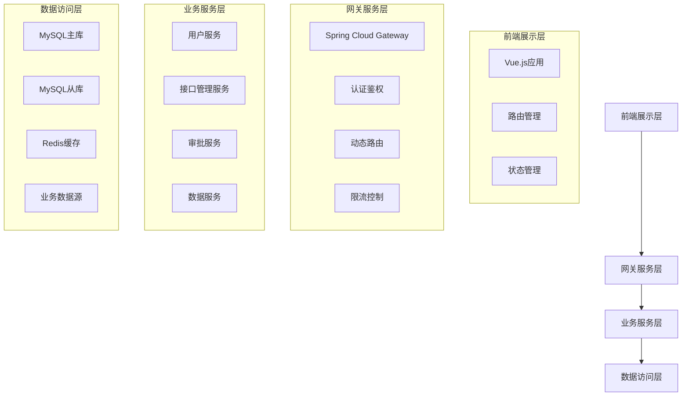

# 电力交易中心接口服务平台模块化开发规划

## 版本信息

| 版本号 | 发布日期 | 更新内容 | 维护人员 |
|--------|----------|----------|----------|
| v1.0 | 2024-01-15 | 初始模块化开发规划 | 技术团队 |

---

## 1. 文档分析与需求梳理

### 1.1 核心功能点提取

基于PRD文档和技术文档分析，系统核心功能包括：

**业务功能层面：**
- 用户管理：企业注册、登录认证、权限控制
- 接口管理：接口生成、配置、状态管理、生命周期管理
- 订阅审批：申请提交、一级审批、批量处理
- 接口目录：分类展示、搜索订阅、批量操作
- 用户中心：个人信息、API密钥、订阅管理

**技术功能层面：**
- 网关路由：动态路由管理、认证鉴权、限流控制
- 数据访问：多数据源管理、连接池优化、事务控制
- 安全认证：JWT Token、appId验证、权限校验
- 系统监控：日志记录、性能监控、异常处理

### 1.2 关键技术要求

**架构要求：**
- 微服务架构：Spring Cloud + Spring Boot
- 前后端分离：Vue.js 3.x + RESTful API
- 统一网关：Spring Cloud Gateway
- 服务治理：Nacos注册中心和配置中心

**性能要求：**
- 数据库：MySQL 8.0主从架构，读写分离
- 连接池：HikariCP高性能连接池
- 缓存策略：Redis分布式缓存
- 负载均衡：Nginx反向代理

**安全要求：**
- 认证机制：Spring Security + JWT
- 权限控制：基于角色的访问控制(RBAC)
- 数据安全：敏感数据脱敏、传输加密
- 审计日志：操作日志、API调用日志

### 1.3 技术难点识别

**核心技术难点：**
1. **动态接口生成**：基于数据库表结构自动生成RESTful API
2. **动态路由管理**：接口上架时实时注册Gateway路由
3. **多数据源管理**：支持多个业务数据库的统一访问
4. **权限精细化控制**：接口级别的权限管控和动态授权
5. **高并发处理**：大量API调用的性能优化和限流控制

**依赖关系分析：**
- 接口生成依赖数据源管理和路由管理
- 订阅审批依赖用户管理和权限控制
- API调用依赖认证服务和网关路由
- 前端展示依赖后端API和权限验证

---

## 2. 模块划分规范

### 2.1 系统架构分层



### 2.2 核心模块划分

基于高内聚、低耦合原则，系统划分为以下8个核心模块：

| 模块名称 | 模块类型 | 主要职责 | 依赖关系 |
|----------|----------|----------|----------|
| 前端应用模块 | 展示层 | 用户界面、交互逻辑 | 依赖所有后端服务 |
| 网关服务模块 | 服务层 | 路由转发、认证鉴权 | 依赖用户服务 |
| 用户管理模块 | 业务层 | 用户注册、登录、权限 | 独立模块 |
| 接口管理模块 | 业务层 | 接口生成、配置、状态管理 | 依赖数据源模块 |
| 审批服务模块 | 业务层 | 订阅申请、审批流程 | 依赖用户管理模块 |
| 数据源管理模块 | 业务层 | 多数据源连接、查询执行 | 独立模块 |
| 认证服务模块 | 服务层 | JWT生成、Token验证 | 依赖用户管理模块 |
| 通知服务模块 | 服务层 | 消息通知、邮件发送 | 独立模块 |

---

## 3. 模块任务说明书

### 3.1 前端应用模块

#### 功能描述
基于Vue.js 3.x构建的单页面应用，提供用户友好的操作界面，实现接口目录浏览、接口管理、订阅审批、用户中心等核心功能的前端展示和交互。

#### 实现要点
- **技术栈**：Vue.js 3.x + Vue Router + Vuex + Element Plus + Vite
- **组件化设计**：可复用组件库，统一UI风格
- **权限控制**：路由守卫 + 组件级权限控制
- **状态管理**：Vuex集中管理用户状态和业务数据
- **响应式设计**：支持PC端和移动端适配

#### 接口规范

**输入参数：**
- 用户操作事件：点击、输入、选择等DOM事件
- 路由参数：页面跳转参数、查询参数
- 表单数据：用户输入的业务数据

**输出结果：**
- HTTP请求：调用后端API接口
- 页面渲染：动态更新DOM元素
- 用户反馈：成功提示、错误信息、加载状态

**异常处理：**
- 网络异常：请求超时、连接失败
- 业务异常：权限不足、数据校验失败
- 系统异常：页面崩溃、组件加载失败

#### 依赖关系
- **上游依赖**：用户操作、浏览器环境
- **下游依赖**：网关服务模块（所有API调用）
- **数据流向**：用户输入 → 前端验证 → API调用 → 结果展示

### 3.2 网关服务模块

#### 功能描述
基于Spring Cloud Gateway实现的统一网关服务，负责所有请求的路由转发、认证鉴权、限流控制、动态路由管理等核心功能。

#### 实现要点
- **动态路由**：支持接口上架时实时注册路由
- **认证鉴权**：JWT Token验证 + appId权限校验
- **限流控制**：基于Redis的分布式限流
- **负载均衡**：服务发现 + 负载均衡策略
- **监控日志**：请求日志、性能监控、异常记录

#### 接口规范

**输入参数：**
```java
// HTTP请求对象
public class GatewayRequest {
    private String path;           // 请求路径
    private String method;         // HTTP方法
    private Map<String, String> headers;  // 请求头
    private String body;           // 请求体
    private Map<String, String> params;   // 查询参数
}
```

**输出结果：**
```java
// HTTP响应对象
public class GatewayResponse {
    private int status;            // HTTP状态码
    private Map<String, String> headers;  // 响应头
    private String body;           // 响应体
    private long timestamp;        // 响应时间戳
}
```

**异常处理：**
- 认证失败：返回401 Unauthorized
- 权限不足：返回403 Forbidden
- 服务不可用：返回503 Service Unavailable
- 限流触发：返回429 Too Many Requests

#### 依赖关系
- **上游依赖**：前端应用模块、外部API调用
- **下游依赖**：认证服务模块、各业务服务模块
- **数据流向**：请求接收 → 认证鉴权 → 路由转发 → 响应返回

### 3.3 用户管理模块

#### 功能描述
负责用户注册、登录认证、权限管理、个人信息维护等用户相关的核心功能，支持基于角色的权限控制(RBAC)。

#### 实现要点
- **用户注册**：企业认证注册、信息校验、状态管理
- **登录认证**：多种登录方式、安全策略、会话管理
- **权限控制**：角色定义、权限分配、动态授权
- **信息管理**：个人信息、密码管理、API密钥
- **安全策略**：密码策略、登录锁定、操作日志

#### 接口规范

**输入参数：**
```java
// 用户注册请求
public class UserRegisterRequest {
    @NotBlank(message = "企业名称不能为空")
    @Length(min = 2, max = 50, message = "企业名称长度2-50字符")
    private String companyName;
    
    @NotBlank(message = "统一社会信用代码不能为空")
    @Pattern(regexp = "^[0-9A-HJ-NPQRTUWXY]{2}\\d{6}[0-9A-HJ-NPQRTUWXY]{10}$")
    private String creditCode;
    
    @NotBlank(message = "联系人姓名不能为空")
    @Length(min = 2, max = 20, message = "联系人姓名长度2-20字符")
    private String contactName;
    
    @NotBlank(message = "手机号码不能为空")
    @Pattern(regexp = "^1[3-9]\\d{9}$", message = "手机号码格式不正确")
    private String phone;
    
    @NotBlank(message = "邮箱地址不能为空")
    @Email(message = "邮箱格式不正确")
    @Length(max = 100, message = "邮箱长度不能超过100字符")
    private String email;
    
    @NotBlank(message = "密码不能为空")
    @Pattern(regexp = "^(?=.*[a-z])(?=.*[A-Z])(?=.*\\d)(?=.*[@$!%*?&])[A-Za-z\\d@$!%*?&]{8,20}$")
    private String password;
}

// 用户登录请求
public class UserLoginRequest {
    @NotBlank(message = "登录账号不能为空")
    private String account;  // 手机号或邮箱
    
    @NotBlank(message = "密码不能为空")
    private String password;
    
    private String captcha;  // 验证码（可选）
}
```

**输出结果：**
```java
// 用户注册响应
public class UserRegisterResponse {
    private String userId;           // 用户ID
    private String status;           // 注册状态：待审核
    private LocalDateTime createTime; // 注册时间
    private String message;          // 响应消息
}

// 用户登录响应
public class UserLoginResponse {
    private String token;            // JWT Token
    private UserInfo userInfo;       // 用户基本信息
    private List<String> permissions; // 权限列表
    private long expireTime;         // Token过期时间
}

// 用户信息对象
public class UserInfo {
    private String userId;
    private String username;
    private String companyName;
    private String role;
    private String status;
    private LocalDateTime createTime;
}
```

**异常处理：**
- 注册异常：企业重复、信息格式错误、系统异常
- 登录异常：账号不存在、密码错误、账号锁定、未审核
- 权限异常：权限不足、Token过期、非法访问

#### 依赖关系
- **上游依赖**：网关服务模块
- **下游依赖**：MySQL数据库、Redis缓存
- **数据流向**：用户请求 → 业务处理 → 数据持久化 → 响应返回

### 3.4 接口管理模块

#### 功能描述
负责接口的生成、配置、状态管理、生命周期管理等核心功能，支持基于数据库表结构的自动化接口生成。

#### 实现要点
- **接口生成**：四步骤向导（数据源选择、接口配置、参数设置、预览确认）
- **状态管理**：未上架、已上架、已下架状态流转
- **配置管理**：接口路径、参数定义、响应格式
- **批量操作**：批量上架、下架、删除
- **动态路由**：与网关服务联动，实时注册路由

#### 接口规范

**输入参数：**
```java
// 接口生成请求
public class InterfaceCreateRequest {
    // 步骤1：数据源选择
    @NotBlank(message = "数据源ID不能为空")
    private String dataSourceId;
    
    @NotBlank(message = "数据表名不能为空")
    private String tableName;
    
    // 步骤2：接口配置
    @NotBlank(message = "接口名称不能为空")
    @Length(min = 2, max = 50, message = "接口名称长度2-50字符")
    private String interfaceName;
    
    @NotBlank(message = "接口描述不能为空")
    @Length(min = 10, max = 200, message = "接口描述长度10-200字符")
    private String description;
    
    @NotBlank(message = "业务分类不能为空")
    private String category;  // day_ahead_spot, forecast, ancillary_service, grid_operation
    
    private String customPath;  // 自定义路径（可选）
    
    // 步骤3：参数设置
    private List<ParameterDefinition> parameters;
}

// 参数定义
public class ParameterDefinition {
    @NotBlank(message = "参数名称不能为空")
    private String paramName;
    
    @NotBlank(message = "参数类型不能为空")
    private String paramType;  // string, integer, date, boolean
    
    private String description;
    private boolean required;
    private String defaultValue;
    private String validationRule;
    private String example;
}

// 接口状态更新请求
public class InterfaceStatusUpdateRequest {
    @NotEmpty(message = "接口ID列表不能为空")
    private List<String> interfaceIds;
    
    @NotBlank(message = "操作类型不能为空")
    private String action;  // publish, unpublish, delete
    
    private String reason;  // 操作原因
}
```

**输出结果：**
```java
// 接口创建响应
public class InterfaceCreateResponse {
    private String interfaceId;      // 接口ID
    private String interfaceName;    // 接口名称
    private String interfacePath;    // 接口路径
    private String status;           // 状态：未上架
    private LocalDateTime createTime; // 创建时间
    private String message;          // 响应消息
}

// 接口列表响应
public class InterfaceListResponse {
    private List<InterfaceInfo> interfaces;
    private PageInfo pageInfo;
}

// 接口信息
public class InterfaceInfo {
    private String interfaceId;
    private String interfaceName;
    private String interfacePath;
    private String category;
    private String status;
    private String creator;
    private LocalDateTime createTime;
    private LocalDateTime updateTime;
}
```

**异常处理：**
- 生成异常：数据源连接失败、表不存在、配置错误
- 状态异常：状态流转错误、权限不足、操作冲突
- 系统异常：路由注册失败、数据库异常

#### 依赖关系
- **上游依赖**：网关服务模块
- **下游依赖**：数据源管理模块、网关服务模块（路由注册）
- **数据流向**：接口配置 → 代码生成 → 路由注册 → 状态更新

### 3.5 审批服务模块

#### 功能描述
负责订阅申请的提交、审批、通知等流程管理，支持一级审批和批量处理，实现简化的审批流程。

#### 实现要点
- **申请管理**：订阅申请提交、状态跟踪、历史记录
- **审批流程**：一级审批（通过/拒绝）、批量审批
- **权限更新**：审批通过后自动更新用户API权限
- **通知机制**：审批结果通知、邮件提醒
- **数据统计**：申请统计、审批效率分析

#### 接口规范

**输入参数：**
```java
// 订阅申请请求
public class SubscriptionApplicationRequest {
    @NotEmpty(message = "接口ID列表不能为空")
    @Size(max = 20, message = "单次申请接口数量不能超过20个")
    private List<String> interfaceIds;
    
    @NotBlank(message = "申请理由不能为空")
    @Length(min = 100, max = 500, message = "申请理由长度100-500字符")
    private String reason;
    
    @NotBlank(message = "业务场景不能为空")
    private String businessScenario;
    
    @Min(value = 1, message = "预计调用量必须大于0")
    private Integer estimatedCalls;  // 每日预计调用次数
}

// 审批处理请求
public class ApprovalProcessRequest {
    @NotBlank(message = "申请ID不能为空")
    private String applicationId;
    
    @NotBlank(message = "审批动作不能为空")
    private String action;  // approve, reject
    
    private String comment;  // 审批意见（拒绝时必填）
}

// 批量审批请求
public class BatchApprovalRequest {
    @NotEmpty(message = "申请ID列表不能为空")
    @Size(max = 50, message = "单次处理申请数量不能超过50个")
    private List<String> applicationIds;
    
    @NotBlank(message = "批量动作不能为空")
    private String batchAction;  // batch_approve, batch_reject
    
    private String uniformComment;  // 统一审批意见
}
```

**输出结果：**
```java
// 申请提交响应
public class ApplicationSubmitResponse {
    private String applicationId;    // 申请ID
    private String status;           // 申请状态：待审批
    private LocalDateTime submitTime; // 提交时间
    private String message;          // 响应消息
}

// 审批处理响应
public class ApprovalProcessResponse {
    private String applicationId;
    private String status;           // 审批后状态：已通过/已拒绝
    private boolean permissionUpdated; // 权限是否已更新
    private LocalDateTime processTime; // 处理时间
    private String message;
}

// 批量审批响应
public class BatchApprovalResponse {
    private int totalCount;          // 总处理数量
    private int successCount;        // 成功数量
    private int failureCount;        // 失败数量
    private List<ApprovalResult> results; // 详细结果
}

// 审批结果
public class ApprovalResult {
    private String applicationId;
    private boolean success;
    private String message;
    private String failureReason;
}
```

**异常处理：**
- 申请异常：接口不存在、重复申请、申请过多
- 审批异常：申请不存在、权限不足、状态错误
- 系统异常：权限更新失败、通知发送失败

#### 依赖关系
- **上游依赖**：网关服务模块
- **下游依赖**：用户管理模块（权限更新）、通知服务模块
- **数据流向**：申请提交 → 审批处理 → 权限更新 → 结果通知

### 3.6 数据源管理模块

#### 功能描述
负责多数据源的连接管理、查询执行、连接池优化等功能，支持动态数据源配置和高性能数据访问。

#### 实现要点
- **多数据源**：支持多个业务数据库的统一管理
- **连接池**：HikariCP高性能连接池配置
- **动态配置**：支持数据源的动态添加和配置更新
- **查询优化**：SQL模板、参数绑定、结果缓存
- **监控告警**：连接池监控、慢查询分析、异常告警

#### 接口规范

**输入参数：**
```java
// 数据源配置
public class DataSourceConfig {
    @NotBlank(message = "数据源ID不能为空")
    private String dataSourceId;
    
    @NotBlank(message = "数据源名称不能为空")
    private String name;
    
    @NotBlank(message = "数据库类型不能为空")
    private String dbType;  // mysql, postgresql, oracle
    
    @NotBlank(message = "连接URL不能为空")
    private String jdbcUrl;
    
    @NotBlank(message = "用户名不能为空")
    private String username;
    
    @NotBlank(message = "密码不能为空")
    private String password;
    
    // 连接池配置
    private Integer maxPoolSize = 20;
    private Integer minIdle = 5;
    private Long connectionTimeout = 30000L;
    private Long idleTimeout = 600000L;
    private Long maxLifetime = 1800000L;
}

// 查询执行请求
public class QueryExecuteRequest {
    @NotBlank(message = "数据源ID不能为空")
    private String dataSourceId;
    
    @NotBlank(message = "SQL语句不能为空")
    private String sql;
    
    private Map<String, Object> parameters; // 查询参数
    private Integer pageNum = 1;            // 页码
    private Integer pageSize = 100;         // 页大小
    private Integer timeout = 30;           // 超时时间（秒）
}
```

**输出结果：**
```java
// 查询结果响应
public class QueryExecuteResponse {
    private List<Map<String, Object>> data; // 查询数据
    private QueryMetadata metadata;         // 查询元数据
    private long executionTime;             // 执行时间（毫秒）
    private boolean success;
    private String message;
}

// 查询元数据
public class QueryMetadata {
    private List<ColumnInfo> columns;       // 列信息
    private int totalRows;                  // 总行数
    private int currentPage;                // 当前页
    private int pageSize;                   // 页大小
    private boolean hasMore;                // 是否有更多数据
}

// 列信息
public class ColumnInfo {
    private String columnName;
    private String columnType;
    private String columnComment;
    private boolean nullable;
    private boolean primaryKey;
}
```

**异常处理：**
- 连接异常：数据源连接失败、连接超时、连接池耗尽
- 查询异常：SQL语法错误、参数错误、查询超时
- 系统异常：数据源配置错误、驱动加载失败

#### 依赖关系
- **上游依赖**：接口管理模块
- **下游依赖**：各业务数据库
- **数据流向**：查询请求 → SQL执行 → 结果返回 → 数据缓存

### 3.7 认证服务模块

#### 功能描述
负责JWT Token的生成、验证、刷新等认证功能，支持多种认证方式和安全策略。

#### 实现要点
- **Token管理**：JWT生成、验证、刷新、撤销
- **多重认证**：用户登录认证、API调用认证（appId）
- **安全策略**：Token过期策略、刷新机制、黑名单管理
- **权限缓存**：Redis缓存用户权限信息
- **审计日志**：认证日志、异常访问记录

#### 接口规范

**输入参数：**
```java
// Token生成请求
public class TokenGenerateRequest {
    @NotBlank(message = "用户ID不能为空")
    private String userId;
    
    @NotEmpty(message = "权限列表不能为空")
    private List<String> permissions;
    
    private Long expireTime;  // 过期时间（可选，默认24小时）
    private String tokenType = "Bearer"; // Token类型
}

// Token验证请求
public class TokenValidateRequest {
    @NotBlank(message = "Token不能为空")
    private String token;
    
    private String requiredPermission; // 需要的权限（可选）
}

// API认证请求
public class ApiAuthRequest {
    @NotBlank(message = "AppId不能为空")
    private String appId;
    
    @NotBlank(message = "接口路径不能为空")
    private String interfacePath;
    
    private String clientIp;    // 客户端IP
    private String userAgent;   // 用户代理
}
```

**输出结果：**
```java
// Token生成响应
public class TokenGenerateResponse {
    private String accessToken;      // 访问Token
    private String refreshToken;     // 刷新Token
    private String tokenType;        // Token类型
    private long expiresIn;          // 过期时间（秒）
    private List<String> permissions; // 权限列表
}

// Token验证响应
public class TokenValidateResponse {
    private boolean valid;           // 是否有效
    private String userId;           // 用户ID
    private List<String> permissions; // 权限列表
    private long remainingTime;      // 剩余有效时间（秒）
    private String message;          // 验证消息
}

// API认证响应
public class ApiAuthResponse {
    private boolean authorized;      // 是否授权
    private String userId;           // 用户ID
    private List<String> allowedInterfaces; // 允许访问的接口
    private RateLimitInfo rateLimitInfo;     // 限流信息
    private String message;
}
```

**异常处理：**
- Token异常：Token无效、过期、格式错误
- 权限异常：权限不足、接口未授权
- 系统异常：签名验证失败、缓存异常

#### 依赖关系
- **上游依赖**：网关服务模块、用户管理模块
- **下游依赖**：Redis缓存、MySQL数据库
- **数据流向**：认证请求 → Token验证 → 权限检查 → 认证结果

### 3.8 通知服务模块

#### 功能描述
负责系统消息通知、邮件发送、短信提醒等功能，支持多种通知方式和模板管理。

#### 实现要点
- **多渠道通知**：邮件、短信、站内消息
- **模板管理**：通知模板配置、变量替换
- **异步处理**：消息队列异步发送
- **发送状态**：发送状态跟踪、失败重试
- **统计分析**：发送统计、成功率分析

#### 接口规范

**输入参数：**
```java
// 通知发送请求
public class NotificationSendRequest {
    @NotBlank(message = "接收者不能为空")
    private String recipient;    // 接收者（邮箱、手机号、用户ID）
    
    @NotBlank(message = "通知类型不能为空")
    private String notificationType; // email, sms, system
    
    @NotBlank(message = "模板ID不能为空")
    private String templateId;   // 模板ID
    
    private Map<String, Object> variables; // 模板变量
    private String priority = "normal";    // 优先级：high, normal, low
    private LocalDateTime scheduleTime;    // 定时发送时间（可选）
}

// 批量通知请求
public class BatchNotificationRequest {
    @NotEmpty(message = "接收者列表不能为空")
    private List<String> recipients;
    
    @NotBlank(message = "通知类型不能为空")
    private String notificationType;
    
    @NotBlank(message = "模板ID不能为空")
    private String templateId;
    
    private Map<String, Object> variables;
    private String priority = "normal";
}
```

**输出结果：**
```java
// 通知发送响应
public class NotificationSendResponse {
    private String notificationId;   // 通知ID
    private String status;           // 发送状态：pending, sent, failed
    private LocalDateTime sendTime;  // 发送时间
    private String message;          // 响应消息
}

// 批量通知响应
public class BatchNotificationResponse {
    private int totalCount;          // 总数量
    private int successCount;        // 成功数量
    private int failureCount;        // 失败数量
    private List<NotificationResult> results; // 详细结果
}

// 通知结果
public class NotificationResult {
    private String recipient;
    private String notificationId;
    private boolean success;
    private String message;
    private String failureReason;
}
```

**异常处理：**
- 发送异常：邮件服务异常、短信服务异常、模板不存在
- 配置异常：模板格式错误、变量缺失
- 系统异常：消息队列异常、数据库异常

#### 依赖关系
- **上游依赖**：审批服务模块、用户管理模块
- **下游依赖**：邮件服务、短信服务、消息队列
- **数据流向**：通知请求 → 模板渲染 → 异步发送 → 状态更新

---

## 4. 开发准备要求

### 4.1 模块边界定义验证

**边界清晰性检查：**
- ✅ 每个模块职责单一，功能边界明确
- ✅ 模块间接口定义完整，参数类型明确
- ✅ 数据流向清晰，依赖关系明确
- ✅ 异常处理机制完善，错误边界明确

**接口一致性验证：**
- 统一的响应格式：`{"status": boolean, "message": string, "data": object}`
- 统一的异常处理：HTTP状态码 + 业务错误码
- 统一的参数校验：JSR-303注解 + 自定义校验器
- 统一的日志格式：结构化日志 + 链路追踪

### 4.2 职责划分完整性验证

**功能覆盖度检查：**
- ✅ 用户管理：注册、登录、权限、信息管理
- ✅ 接口管理：生成、配置、状态管理、生命周期
- ✅ 订阅审批：申请、审批、通知、权限更新
- ✅ 数据访问：多数据源、查询执行、连接管理
- ✅ 安全认证：Token管理、权限验证、API认证
- ✅ 系统支撑：网关路由、通知服务、监控日志

**横切关注点处理：**
- 日志记录：AOP切面统一处理
- 异常处理：全局异常处理器
- 参数校验：统一校验框架
- 性能监控：Micrometer + Prometheus
- 链路追踪：Spring Cloud Sleuth

### 4.3 接口规范可执行性确认

**技术可行性验证：**
- ✅ Spring Boot 2.7.x + Spring Cloud 2021.x技术栈成熟
- ✅ Vue.js 3.x + Element Plus前端技术栈稳定
- ✅ MySQL 8.0 + Redis分布式架构可靠
- ✅ Docker + Kubernetes容器化部署方案完善

**性能指标确认：**
- 接口响应时间：< 500ms（95%）
- 系统并发量：> 1000 QPS
- 数据库连接池：最大20个连接
- 缓存命中率：> 80%

### 4.4 技术方案评审要点

**架构设计评审：**
1. 微服务拆分是否合理
2. 数据库设计是否满足业务需求
3. 缓存策略是否有效
4. 安全机制是否完善
5. 监控体系是否完整

**开发规范评审：**
1. 代码规范和质量标准
2. 单元测试覆盖率要求（> 80%）
3. 集成测试策略
4. 部署流程和回滚机制
5. 文档维护和更新机制

**风险评估：**
1. 技术风险：新技术学习成本、技术选型风险
2. 进度风险：开发周期评估、资源配置
3. 质量风险：测试覆盖度、性能瓶颈
4. 运维风险：部署复杂度、监控告警

---

## 5. 开发计划建议

### 5.1 开发阶段划分

**第一阶段：基础设施搭建（2周）**
- 开发环境搭建
- 数据库设计和初始化
- 基础框架搭建
- CI/CD流水线配置

**第二阶段：核心模块开发（6周）**
- 用户管理模块（1周）
- 认证服务模块（1周）
- 数据源管理模块（1.5周）
- 接口管理模块（2周）
- 网关服务模块（0.5周）

**第三阶段：业务模块开发（4周）**
- 审批服务模块（1.5周）
- 通知服务模块（1周）
- 前端应用模块（1.5周）

**第四阶段：集成测试和优化（2周）**
- 模块集成测试
- 性能测试和优化
- 安全测试
- 用户验收测试

### 5.2 关键里程碑

| 里程碑 | 时间节点 | 交付物 | 验收标准 |
|--------|----------|--------|----------|
| 基础设施完成 | 第2周末 | 开发环境、数据库、框架 | 环境可用，框架运行正常 |
| 核心模块完成 | 第8周末 | 用户、认证、接口管理等模块 | 单元测试通过，接口联调成功 |
| 业务模块完成 | 第12周末 | 审批、通知、前端等模块 | 功能测试通过，界面可用 |
| 系统集成完成 | 第14周末 | 完整系统 | 集成测试通过，性能达标 |

### 5.3 质量保证措施

**代码质量：**
- 代码审查：每个PR必须经过代码审查
- 静态分析：SonarQube代码质量检查
- 单元测试：测试覆盖率不低于80%
- 集成测试：关键业务流程自动化测试

**性能保证：**
- 性能测试：JMeter压力测试
- 监控告警：Prometheus + Grafana监控
- 日志分析：ELK日志分析平台
- 链路追踪：分布式链路追踪

---

## 6. 总结

本模块化开发规划基于电力交易中心接口服务平台的PRD文档和技术文档，按照标准化流程进行了系统性的分析和设计：

1. **需求分析完整**：全面梳理了业务功能和技术要求，识别了关键技术难点
2. **模块划分合理**：8个核心模块职责清晰，满足高内聚低耦合原则
3. **接口规范明确**：详细定义了每个模块的输入输出和异常处理
4. **依赖关系清晰**：明确了模块间的调用关系和数据流向
5. **开发计划可行**：提供了分阶段的开发计划和质量保证措施

该规划为项目的顺利实施提供了清晰的技术路线图和实施指南，确保各模块能够独立开发、有序集成，最终构建出高质量的接口服务平台。