# 电力交易中心接口服务平台技术架构文档 v1.0

## 版本信息

| 版本号 | 发布日期   | 更新内容                           | 维护人员 |
| ------ | ---------- | ---------------------------------- | -------- |
| v1.0   | 2024-01-15 | 初始技术架构设计，对应PRD v1.0功能 | 技术团队 |

## 版本对应关系

**技术架构 v1.0 对应 PRD v1.0**：

* ✅ 接口目录浏览与订阅技术实现

* ✅ 接口生成与管理技术架构

* ✅ 订阅申请审批技术流程

* ✅ 用户中心技术实现

* 🚫 接口监控技术架构（v2.0实现）

* 🚫 日志审计技术方案（v2.0实现）

* 🚫 计费管理技术方案（暂不实现）

***

## 1. 架构设计

### 1.1 整体架构图

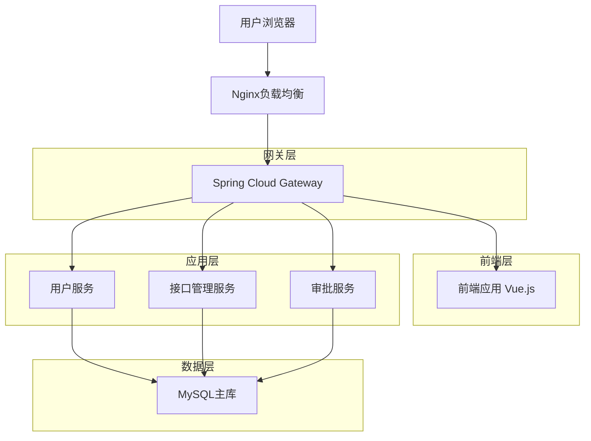
```mermaid
graph TD
    A[用户浏览器] --> B[Nginx负载均衡]
    B --> C[Spring Cloud Gateway]
    C --> D[前端应用 Vue.js]
    C --> E[用户服务]
    C --> F[接口管理服务]
    C --> G[审批服务]
    
    E --> J[MySQL主库]
    F --> J
    G --> J
    
    subgraph "前端层"
        D
    end
    
    subgraph "网关层"
        C
    end
    
    subgraph "应用层"
        E
        F
        G
    end
    
    subgraph "数据层"
        J
    end
```

### 1.2 架构特点

* **微服务架构**：采用Spring Cloud微服务架构，服务间通过HTTP REST API通信

* **前后端分离**：Vue.js前端 + Spring Boot后端，通过RESTful API交互

* **统一网关**：Spring Cloud Gateway作为统一入口，处理路由、认证、限流

* **读写分离**：MySQL主从架构，读写分离提升数据库性能

## 2. 技术栈说明

### 2.1 前端技术栈

* **框架**：Vue.js 3.x + Vue Router + Vuex

* **UI组件库**：Element Plus

* **构建工具**：Vite

* **样式**：SCSS + CSS3

* **HTTP客户端**：Axios

* **图表库**：ECharts

### 2.2 后端技术栈

* **框架**：Spring Boot 2.7.x + Spring Cloud 2021.x

* **网关**：Spring Cloud Gateway

* **服务注册**：Nacos

* **配置中心**：Nacos Config

* **数据库**：MySQL 8.0（主从架构）

* **数据库连接池**：HikariCP连接池

* **ORM框架**：MyBatis Plus

* **安全框架**：Spring Security + JWT

### 2.3 运维技术栈

* **容器化**：Docker + Docker Compose

* **监控**：Prometheus + Grafana

* **日志**：ELK Stack（Elasticsearch + Logstash + Kibana）

* **负载均衡**：Nginx

## 3. 路由定义

### 3.1 前端路由

| 路由路径              | 组件名称            | 功能描述   | 权限要求      |
| --------------------- | ------------------- | ---------- | ------------- |
| /                     | Dashboard           | 首页仪表板 | 已登录        |
| /login                | Login               | 用户登录   | 无            |
| /interface/catalog    | InterfaceCatalog    | 接口目录   | 所有用户      |
| /interface/management | InterfaceManagement | 接口管理   | 技术部/结算部 |
| /interface/detail/:id | InterfaceDetail     | 接口详情   | 所有用户      |
| /application/approval | ApplicationApproval | 申请审批   | 结算部        |
| /user/center          | UserCenter          | 用户中心   | 所有用户      |

### 3.2 后端API路由

| 服务名称          | 路由前缀             | 功能描述     |
| ----------------- | -------------------- | ------------ |
| user-service      | /api/v1/users        | 用户管理服务 |
| interface-service | /api/v1/interfaces   | 接口管理服务 |
| approval-service  | /api/v1/applications | 审批服务     |
| gateway-service   | /api/v1/gateway      | 网关管理服务 |

## 4. 核心业务技术时序图

### 4.1 用户登录认证时序图

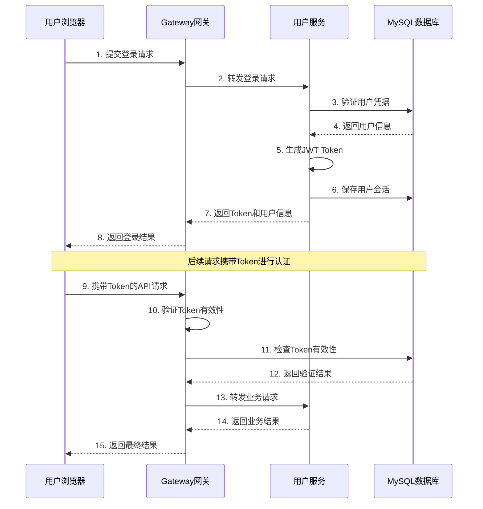
```mermaid
sequenceDiagram
    participant U as 用户浏览器
    participant G as Gateway网关
    participant US as 用户服务
    participant DB as MySQL数据库
    
    U->>G: 1. 提交登录请求
    G->>US: 2. 转发登录请求
    US->>DB: 3. 验证用户凭据
    DB-->>US: 4. 返回用户信息
    US->>US: 5. 生成JWT Token
    US->>DB: 6. 保存用户会话
    US-->>G: 7. 返回Token和用户信息
    G-->>U: 8. 返回登录结果
    
    Note over U,DB: 后续请求携带Token进行认证
    U->>G: 9. 携带Token的API请求
    G->>G: 10. 验证Token有效性
    G->>DB: 11. 检查Token有效性
    DB-->>G: 12. 返回验证结果
    G->>US: 13. 转发业务请求
    US-->>G: 14. 返回业务结果
    G-->>U: 15. 返回最终结果
```

### 4.2 统一接口配置规范实现

#### 4.2.1 接口路径规范化

**路径生成规则**：

```java
@Service
public class InterfacePathGenerator {
    
    private static final String PATH_PREFIX = "/px-phzhb-external-share/dataproduct/";
    
    public String generateInterfacePath(String interfaceName, String businessType) {
        // 根据接口名称和业务类型生成标准路径
        String pathSuffix = generatePathSuffix(interfaceName, businessType);
        return PATH_PREFIX + pathSuffix;
    }
    
    private String generatePathSuffix(String interfaceName, String businessType) {
        // 示例："电网关键断面约束情况" -> "queryKeySectionConstraints"
        // 示例："必开必停机组名单" -> "queryMustOpenOffNameAndCapacity"
        return convertToApiPath(interfaceName);
    }
}
```

#### 4.2.2 标准参数模板

**参数配置模板**：

```java
@Component
public class StandardParameterTemplate {
    
    public List<ParameterDefinition> getStandardParameters() {
        return Arrays.asList(
            ParameterDefinition.builder()
                .paramName("dataTime")
                .paramType("string")
                .description("查询日期，格式：YYYY-MM-DD")
                .required(true)
                .validationRule("date:YYYY-MM-DD,max:yesterday")
                .example("2022-03-17")
                .build(),
            ParameterDefinition.builder()
                .paramName("appId")
                .paramType("string")
                .description("应用ID，用户身份标识")
                .required(true)
                .validationRule("string,length:15-20")
                .example("KzoHypQZH4-F6qM63L")
                .build()
        );
    }
}
```

### 4.3 接口生成完整时序图

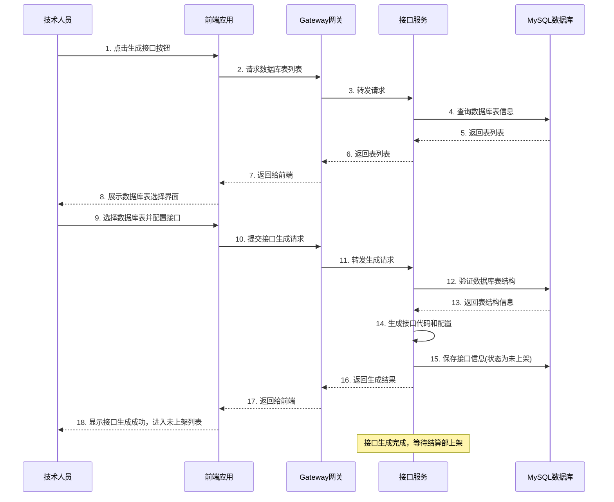
```mermaid
sequenceDiagram
    participant U as 技术人员
    participant F as 前端应用
    participant G as Gateway网关
    participant IS as 接口服务
    participant DB as MySQL数据库
    
    U->>F: 1. 点击生成接口按钮
    F->>G: 2. 请求数据库表列表
    G->>IS: 3. 转发请求
    IS->>DB: 4. 查询数据库表信息
    DB-->>IS: 5. 返回表列表
    IS-->>G: 6. 返回表列表
    G-->>F: 7. 返回给前端
    F-->>U: 8. 展示数据库表选择界面
    
    U->>F: 9. 选择数据库表并配置接口
    F->>G: 10. 提交接口生成请求
    G->>IS: 11. 转发生成请求
    IS->>DB: 12. 验证数据库表结构
    DB-->>IS: 13. 返回表结构信息
    IS->>IS: 14. 生成接口代码和配置
    IS->>DB: 15. 保存接口信息(状态为未上架)
    IS-->>G: 16. 返回生成结果
    G-->>F: 17. 返回给前端
    F-->>U: 18. 显示接口生成成功，进入未上架列表
    
    Note over IS: 接口生成完成，等待结算部上架
```

### 4.4 接口上架操作时序图

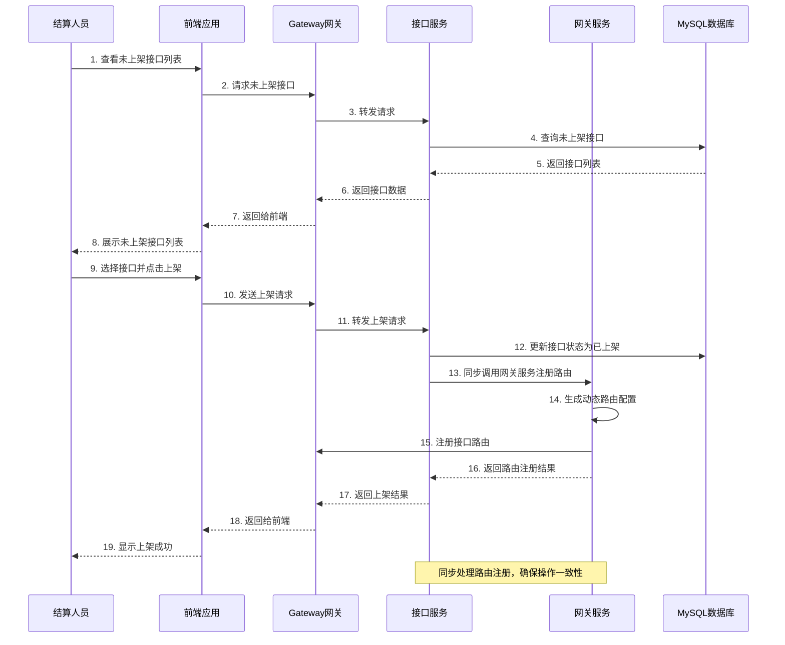
```mermaid
sequenceDiagram
    participant B as 结算人员
    participant F as 前端应用
    participant G as Gateway网关
    participant IS as 接口服务
    participant GS as 网关服务
    participant DB as MySQL数据库
    
    B->>F: 1. 查看未上架接口列表
    F->>G: 2. 请求未上架接口
    G->>IS: 3. 转发请求
    IS->>DB: 4. 查询未上架接口
    DB-->>IS: 5. 返回接口列表
    IS-->>G: 6. 返回接口数据
    G-->>F: 7. 返回给前端
    F-->>B: 8. 展示未上架接口列表
    
    B->>F: 9. 选择接口并点击上架
    F->>G: 10. 发送上架请求
    G->>IS: 11. 转发上架请求
    IS->>DB: 12. 更新接口状态为已上架
    IS->>GS: 13. 同步调用网关服务注册路由
    GS->>GS: 14. 生成动态路由配置
    GS->>G: 15. 注册接口路由
    GS-->>IS: 16. 返回路由注册结果
    IS-->>G: 17. 返回上架结果
    G-->>F: 18. 返回给前端
    F-->>B: 19. 显示上架成功
    
    Note over IS,GS: 同步处理路由注册，确保操作一致性
```

### 4.5 订阅申请审批时序图

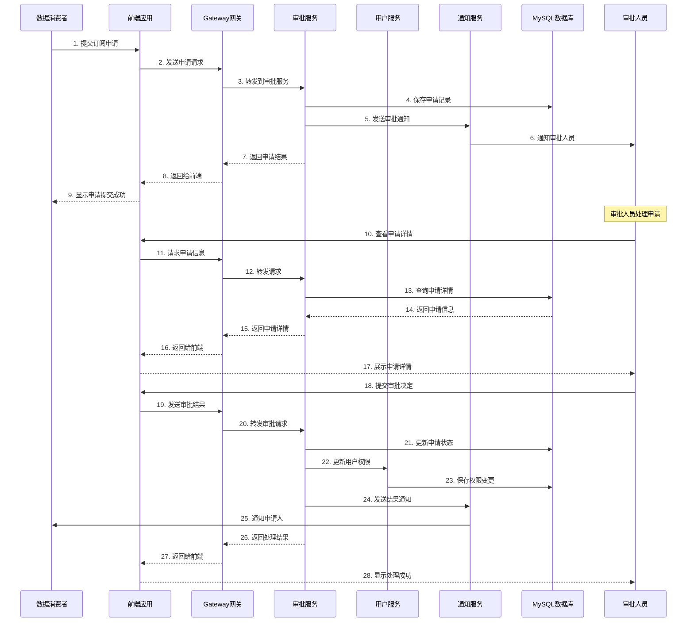
```mermaid
sequenceDiagram
    participant C as 数据消费者
    participant F as 前端应用
    participant G as Gateway网关
    participant AS as 审批服务
    participant US as 用户服务
    participant NS as 通知服务
    participant DB as MySQL数据库
    participant A as 审批人员
    
    C->>F: 1. 提交订阅申请
    F->>G: 2. 发送申请请求
    G->>AS: 3. 转发到审批服务
    AS->>DB: 4. 保存申请记录
    AS->>NS: 5. 发送审批通知
    NS->>A: 6. 通知审批人员
    AS-->>G: 7. 返回申请结果
    G-->>F: 8. 返回给前端
    F-->>C: 9. 显示申请提交成功
    
    Note over A: 审批人员处理申请
    A->>F: 10. 查看申请详情
    F->>G: 11. 请求申请信息
    G->>AS: 12. 转发请求
    AS->>DB: 13. 查询申请详情
    DB-->>AS: 14. 返回申请信息
    AS-->>G: 15. 返回申请详情
    G-->>F: 16. 返回给前端
    F-->>A: 17. 展示申请详情
    
    A->>F: 18. 提交审批决定
    F->>G: 19. 发送审批结果
    G->>AS: 20. 转发审批请求
    AS->>DB: 21. 更新申请状态
    AS->>US: 22. 更新用户权限
    US->>DB: 23. 保存权限变更
    AS->>NS: 24. 发送结果通知
    NS->>C: 25. 通知申请人
    AS-->>G: 26. 返回处理结果
    G-->>F: 27. 返回给前端
    F-->>A: 28. 显示处理成功
```

### 4.6 API调用认证时序图（appId验证）

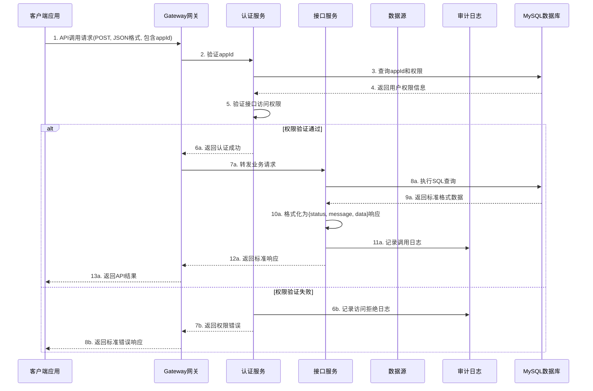
```mermaid
sequenceDiagram
    participant C as 客户端应用
    participant G as Gateway网关
    participant AS as 认证服务
    participant IS as 接口服务
    participant DS as 数据源
    participant AL as 审计日志
    participant DB as MySQL数据库
    
    C->>G: 1. API调用请求(POST, JSON格式, 包含appId)
    G->>AS: 2. 验证appId
    AS->>DB: 3. 查询appId和权限
    DB-->>AS: 4. 返回用户权限信息
    
    AS->>AS: 5. 验证接口访问权限
    alt 权限验证通过
        AS-->>G: 6a. 返回认证成功
        G->>IS: 7a. 转发业务请求
        IS->>DB: 8a. 执行SQL查询
        DB-->>IS: 9a. 返回标准格式数据
        IS->>IS: 10a. 格式化为{status, message, data}响应
        IS->>AL: 11a. 记录调用日志
        IS-->>G: 12a. 返回标准响应
        G-->>C: 13a. 返回API结果
    else 权限验证失败
        AS->>AL: 6b. 记录访问拒绝日志
        AS-->>G: 7b. 返回权限错误
        G-->>C: 8b. 返回标准错误响应
    end
```

### 4.7 原API调用认证时序图

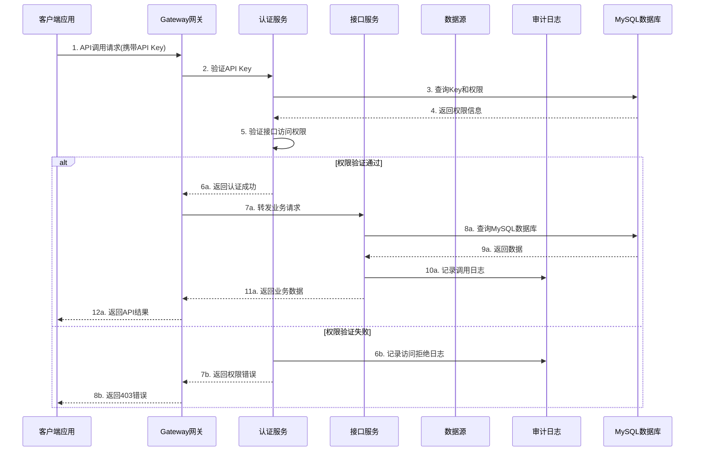
```mermaid
sequenceDiagram
    participant C as 客户端应用
    participant G as Gateway网关
    participant AS as 认证服务
    participant IS as 接口服务
    participant DS as 数据源
    participant AL as 审计日志
    participant DB as MySQL数据库
    
    C->>G: 1. API调用请求(携带API Key)
    G->>AS: 2. 验证API Key
    AS->>DB: 3. 查询Key和权限
    DB-->>AS: 4. 返回权限信息
    
    AS->>AS: 5. 验证接口访问权限
    alt 权限验证通过
        AS-->>G: 6a. 返回认证成功
        G->>IS: 7a. 转发业务请求
        IS->>DB: 8a. 查询MySQL数据库
    DB-->>IS: 9a. 返回数据
        IS->>AL: 10a. 记录调用日志
        IS-->>G: 11a. 返回业务数据
        G-->>C: 12a. 返回API结果
    else 权限验证失败
        AS->>AL: 6b. 记录访问拒绝日志
        AS-->>G: 7b. 返回权限错误
        G-->>C: 8b. 返回403错误
    end
```

## 5. 网关与路由维护策略

### 5.1 Spring Cloud Gateway动态路由架构

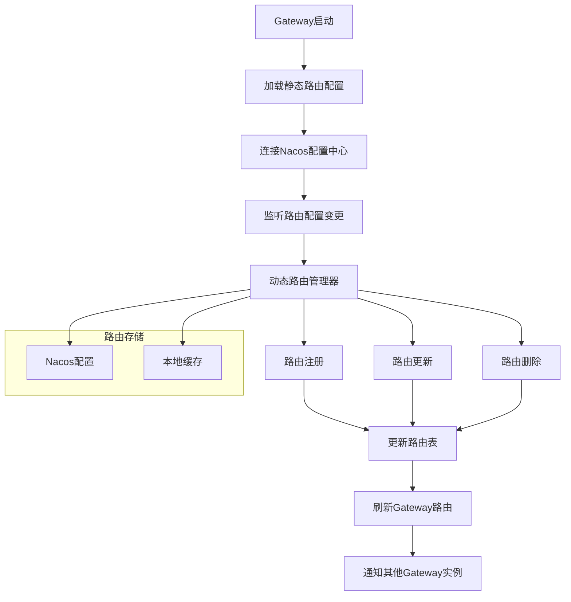
```mermaid
graph TD
    A[Gateway启动] --> B[加载静态路由配置]
    B --> C[连接Nacos配置中心]
    C --> D[监听路由配置变更]
    D --> E[动态路由管理器]
    
    E --> F[路由注册]
    E --> G[路由更新]
    E --> H[路由删除]
    
    F --> I[更新路由表]
    G --> I
    H --> I
    
    I --> J[刷新Gateway路由]
    J --> K[通知其他Gateway实例]
    
    subgraph "路由存储"
        L[Nacos配置]
        N[本地缓存]
    end
    
    E --> L
    E --> N
```

### 5.2 动态路由配置规范

#### 5.2.1 路由配置格式

```yaml
# 接口路由配置示例
spring:
  cloud:
    gateway:
      routes:
        - id: interface-route-{interfaceId}
          uri: lb://interface-service
          predicates:
            - Path=/api/data/{interfaceId}/**
          filters:
            - name: RequestRateLimiter
              args:
                redis-rate-limiter.replenishRate: 100
                redis-rate-limiter.burstCapacity: 200
            - name: AuthFilter
              args:
                required-permissions: interface:read
          metadata:
            interface-id: "{interfaceId}"
            created-by: "system"
            created-time: "2024-01-15T10:30:00Z"
```

#### 5.2.2 路由管理API

```java
@RestController
@RequestMapping("/api/v1/gateway/routes")
public class RouteController {
    
    @PostMapping
    public ResponseEntity<String> addRoute(@RequestBody RouteDefinition route) {
        // 添加动态路由
        routeService.addRoute(route);
        return ResponseEntity.ok("Route added successfully");
    }
    
    @PutMapping("/{routeId}")
    public ResponseEntity<String> updateRoute(
        @PathVariable String routeId, 
        @RequestBody RouteDefinition route) {
        // 更新路由配置
        routeService.updateRoute(routeId, route);
        return ResponseEntity.ok("Route updated successfully");
    }
    
    @DeleteMapping("/{routeId}")
    public ResponseEntity<String> deleteRoute(@PathVariable String routeId) {
        // 删除路由
        routeService.deleteRoute(routeId);
        return ResponseEntity.ok("Route deleted successfully");
    }
}
```

### 5.3 路由热更新机制

#### 5.3.1 配置变更监听

```java
@Component
public class RouteConfigListener {
    
    @NacosConfigListener(dataId = "gateway-routes", groupId = "DEFAULT_GROUP")
    public void onRouteConfigChange(String configInfo) {
        try {
            // 解析新的路由配置
            List<RouteDefinition> newRoutes = parseRouteConfig(configInfo);
            
            // 更新路由表
            routeDefinitionRepository.save(newRoutes);
            
            // 刷新Gateway路由
            applicationEventPublisher.publishEvent(new RefreshRoutesEvent(this));
            
            log.info("Route configuration updated successfully");
        } catch (Exception e) {
            log.error("Failed to update route configuration", e);
        }
    }
}
```

#### 5.3.2 灰度发布策略

```java
@Service
public class GrayReleaseService {
    
    public void enableGrayRelease(String interfaceId, String version, int percentage) {
        // 创建灰度路由规则
        RouteDefinition grayRoute = RouteDefinition.builder()
            .id("gray-" + interfaceId + "-" + version)
            .uri("lb://interface-service-" + version)
            .predicate(predicateDefinition -> {
                predicateDefinition.setName("Path");
                predicateDefinition.addArg("pattern", "/api/data/" + interfaceId + "/**");
            })
            .filter(filterDefinition -> {
                filterDefinition.setName("GrayReleaseFilter");
                filterDefinition.addArg("percentage", String.valueOf(percentage));
            })
            .build();
            
        // 注册灰度路由
        routeDefinitionRepository.save(grayRoute);
        
        // 发布路由刷新事件
        applicationEventPublisher.publishEvent(new RefreshRoutesEvent(this));
    }
}
```

### 5.4 路由监控与告警

#### 5.4.1 路由健康检查

```java
@Component
@Scheduled(fixedRate = 30000) // 每30秒检查一次
public class RouteHealthChecker {
    
    public void checkRouteHealth() {
        List<RouteDefinition> routes = routeDefinitionRepository.getRouteDefinitions();
        
        for (RouteDefinition route : routes) {
            try {
                // 检查路由目标服务健康状态
                boolean isHealthy = checkServiceHealth(route.getUri());
                
                if (!isHealthy) {
                    // 发送告警
                    alertService.sendAlert(
                        "Route Health Check Failed", 
                        "Route " + route.getId() + " target service is unhealthy"
                    );
                    
                    // 可选：自动禁用不健康的路由
                    // routeService.disableRoute(route.getId());
                }
            } catch (Exception e) {
                log.error("Health check failed for route: " + route.getId(), e);
            }
        }
    }
}
```

## 6. 数据模型设计

### 6.1 表级模型 - ER图

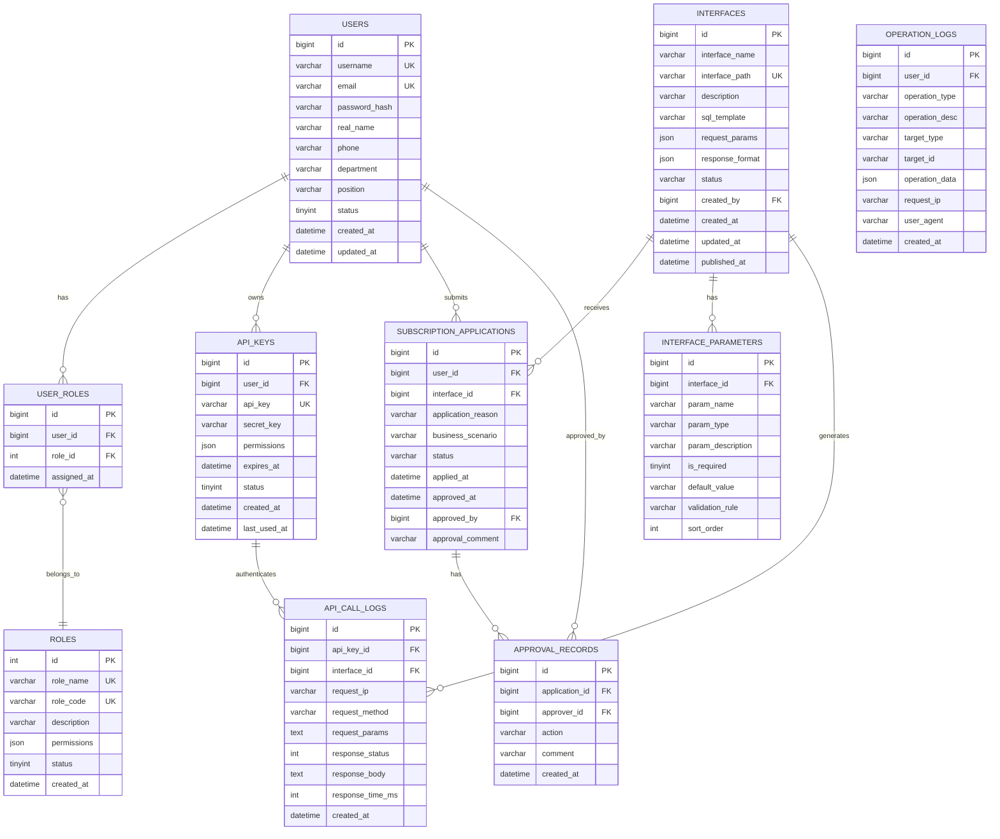
```mermaid
erDiagram
    USERS ||--o{ USER_ROLES : has
    USER_ROLES }o--|| ROLES : belongs_to
    USERS ||--o{ API_KEYS : owns
    USERS ||--o{ SUBSCRIPTION_APPLICATIONS : submits
    
    INTERFACES ||--o{ SUBSCRIPTION_APPLICATIONS : receives

    INTERFACES ||--o{ INTERFACE_PARAMETERS : has
    INTERFACES ||--o{ API_CALL_LOGS : generates
    
    SUBSCRIPTION_APPLICATIONS ||--o{ APPROVAL_RECORDS : has
    APPROVAL_RECORDS }o--|| USERS : approved_by
    
    API_KEYS ||--o{ API_CALL_LOGS : authenticates
    
    USERS {
        bigint id PK
        varchar username UK
        varchar email UK
        varchar password_hash
        varchar real_name
        varchar phone
        varchar department
        varchar position
        tinyint status
        datetime created_at
        datetime updated_at
    }
    
    ROLES {
        int id PK
        varchar role_name UK
        varchar role_code UK
        varchar description
        json permissions
        tinyint status
        datetime created_at
    }
    
    USER_ROLES {
        bigint id PK
        bigint user_id FK
        int role_id FK
        datetime assigned_at
    }
    
    API_KEYS {
        bigint id PK
        bigint user_id FK
        varchar api_key UK
        varchar secret_key
        json permissions
        datetime expires_at
        tinyint status
        datetime created_at
        datetime last_used_at
    }
    

    
    INTERFACES {
        bigint id PK
        varchar interface_name
        varchar interface_path UK
        varchar description

        varchar sql_template
        json request_params
        json response_format
        varchar status
        bigint created_by FK
        datetime created_at
        datetime updated_at
        datetime published_at
    }
    
    INTERFACE_PARAMETERS {
        bigint id PK
        bigint interface_id FK
        varchar param_name
        varchar param_type
        varchar param_description
        tinyint is_required
        varchar default_value
        varchar validation_rule
        int sort_order
    }
    
    SUBSCRIPTION_APPLICATIONS {
        bigint id PK
        bigint user_id FK
        bigint interface_id FK
        varchar application_reason
        varchar business_scenario
        varchar status
        datetime applied_at
        datetime approved_at
        bigint approved_by FK
        varchar approval_comment
    }
    
    APPROVAL_RECORDS {
        bigint id PK
        bigint application_id FK
        bigint approver_id FK
        varchar action
        varchar comment
        datetime created_at
    }
    
    API_CALL_LOGS {
        bigint id PK
        bigint api_key_id FK
        bigint interface_id FK
        varchar request_ip
        varchar request_method
        text request_params
        int response_status
        text response_body
        int response_time_ms
        datetime created_at
    }
    
    OPERATION_LOGS {
        bigint id PK
        bigint user_id FK
        varchar operation_type
        varchar operation_desc
        varchar target_type
        varchar target_id
        json operation_data
        varchar request_ip
        varchar user_agent
        datetime created_at
    }
```

### 6.2 表职责说明

| 表名        | 职责描述         | 核心业务                       |
| ----------- | ---------------- | ------------------------------ |
| users       | 用户基础信息管理 | 存储用户账号、个人信息、状态等 |
| roles       | 角色权限定义     | 定义系统角色和对应权限         |
| user\_roles | 用户角色关联     | 管理用户与角色的多对多关系     |
| api\_keys   | API密钥管理      | 统一API密钥生成、权限控制      |

\| interfaces                 | 接口定义管理   | 存储接口元数据、SQL模板等  |
\| interface\_parameters      | 接口参数定义   | 定义接口请求参数规范      |
\| subscription\_applications | 订阅申请管理   | 处理用户接口订阅申请流程    |
\| approval\_records          | 审批记录     | 记录审批过程和历史       |
\| api\_call\_logs            | API调用日志  | 记录所有API调用详情     |
\| operation\_logs            | 操作审计日志   | 记录平台操作行为审计      |

### 6.3 MySQL数据库连接配置

#### 6.3.1 数据库连接配置

**生产环境配置**：

```yaml
spring:
  datasource:
    type: com.zaxxer.hikari.HikariDataSource
    driver-class-name: com.mysql.cj.jdbc.Driver
    url: jdbc:mysql://mysql-master:3306/power_trading?useUnicode=true&characterEncoding=utf8&serverTimezone=Asia/Shanghai&useSSL=true
    username: ${DB_USERNAME:power_user}
    password: ${DB_PASSWORD:power_password}
    hikari:
      maximum-pool-size: 20
      minimum-idle: 5
      connection-timeout: 30000
      idle-timeout: 600000
      max-lifetime: 1800000
      connection-test-query: SELECT 1
      pool-name: PowerTradingHikariCP
      
  # 读写分离配置
  datasource:
    master:
      url: jdbc:mysql://mysql-master:3306/power_trading
      username: ${DB_MASTER_USERNAME:power_user}
      password: ${DB_MASTER_PASSWORD:power_password}
    slave:
      url: jdbc:mysql://mysql-slave:3306/power_trading
      username: ${DB_SLAVE_USERNAME:power_readonly}
      password: ${DB_SLAVE_PASSWORD:readonly_password}
```

#### 6.3.2 接口数据访问方式

**统一数据访问**：

* 所有接口均基于现有MySQL数据库中的业务表

* 通过SQL模板动态生成查询语句

* 支持参数化查询，确保数据安全

* 统一使用HikariCP连接池管理数据库连接

**数据表访问规范**：

* 接口生成时直接选择MySQL数据库中的业务表

* 支持多表关联查询和复杂业务逻辑

* 自动生成标准化的RESTful API接口

* 统一的数据格式和错误处理机制

### 6.4 字段级数据字典

#### 6.4.1 敏感数据分级标准

| 敏感级别 | 级别描述           | 数据类型示例               | 脱敏策略 |
| -------- | ------------------ | -------------------------- | -------- |
| L1-公开  | 可公开访问的数据   | 用户名、接口名称、公开描述 | 无需脱敏 |
| L2-内部  | 内部使用的业务数据 | 部门信息、接口配置         | 部分脱敏 |
| L3-敏感  | 个人敏感信息       | 手机号、邮箱、真实姓名     | 中间脱敏 |
| L4-机密  | 高度机密数据       | 密码、密钥、数据库连接     | 完全加密 |

#### 6.3.2 核心表字段字典

**users表字段详情**：

| 字段名         | 数据类型 | 长度 | 是否必填 | 敏感级别 | 脱敏规则    | 字段描述                |
| -------------- | -------- | ---- | -------- | -------- | ----------- | ----------------------- |
| id             | bigint   | -    | 是       | L1-公开  | 无          | 用户唯一标识            |
| username       | varchar  | 50   | 是       | L2-内部  | 无          | 用户登录名              |
| email          | varchar  | 100  | 是       | L3-敏感  | 中间4位\*号 | 用户邮箱地址            |
| password\_hash | varchar  | 255  | 是       | L4-机密  | 完全隐藏    | 密码哈希值              |
| real\_name     | varchar  | 50   | 是       | L3-敏感  | 姓氏+\*号   | 用户真实姓名            |
| phone          | varchar  | 20   | 否       | L3-敏感  | 中间4位\*号 | 手机号码                |
| department     | varchar  | 100  | 否       | L2-内部  | 无          | 所属部门                |
| position       | varchar  | 100  | 否       | L2-内部  | 无          | 职位信息                |
| status         | tinyint  | -    | 是       | L1-公开  | 无          | 用户状态(0:禁用,1:启用) |
| created\_at    | datetime | -    | 是       | L1-公开  | 无          | 创建时间                |
| updated\_at    | datetime | -    | 是       | L1-公开  | 无          | 更新时间                |

**interfaces表字段详情**：

| 字段名           | 数据类型 | 长度 | 是否必填 | 敏感级别 | 脱敏规则   | 字段描述     |
| ---------------- | -------- | ---- | -------- | -------- | ---------- | ------------ |
| id               | bigint   | -    | 是       | L1-公开  | 无         | 接口唯一标识 |
| interface\_name  | varchar  | 200  | 是       | L1-公开  | 无         | 接口名称     |
| interface\_path  | varchar  | 500  | 是       | L2-内部  | 无         | 接口访问路径 |
| description      | text     | -    | 否       | L1-公开  | 无         | 接口描述信息 |
| data\_source\_id | int      | -    | 是       | L2-内部  | 无         | 关联数据源ID |
| sql\_template    | text     | -    | 是       | L3-敏感  | 关键字脱敏 | SQL查询模板  |
| request\_params  | json     | -    | 否       | L2-内部  | 无         | 请求参数定义 |
| response\_format | json     | -    | 否       | L2-内部  | 无         | 响应格式定义 |
| status           | varchar  | 20   | 是       | L1-公开  | 无         | 接口状态     |
| created\_by      | bigint   | -    | 是       | L2-内部  | 无         | 创建人ID     |
| created\_at      | datetime | -    | 是       | L1-公开  | 无         | 创建时间     |
| updated\_at      | datetime | -    | 是       | L1-公开  | 无         | 更新时间     |
| published\_at    | datetime | -    | 否       | L1-公开  | 无         | 发布时间     |

**api\_keys表字段详情**：

| 字段名         | 数据类型 | 长度 | 是否必填 | 敏感级别 | 脱敏规则           | 字段描述     |
| -------------- | -------- | ---- | -------- | -------- | ------------------ | ------------ |
| id             | bigint   | -    | 是       | L1-公开  | 无                 | 密钥记录ID   |
| user\_id       | bigint   | -    | 是       | L2-内部  | 无                 | 关联用户ID   |
| api\_key       | varchar  | 64   | 是       | L4-机密  | 前4位+\*\*\*+后4位 | API访问密钥  |
| secret\_key    | varchar  | 128  | 是       | L4-机密  | 完全隐藏           | 密钥签名秘钥 |
| permissions    | json     | -    | 否       | L2-内部  | 无                 | 权限范围定义 |
| expires\_at    | datetime | -    | 否       | L2-内部  | 无                 | 过期时间     |
| status         | tinyint  | -    | 是       | L1-公开  | 无                 | 密钥状态     |
| created\_at    | datetime | -    | 是       | L1-公开  | 无                 | 创建时间     |
| last\_used\_at | datetime | -    | 否       | L2-内部  | 无                 | 最后使用时间 |

#### 6.3.3 脱敏实现策略

```java
@Component
public class DataMaskingService {
    
    /**
     * 手机号脱敏：138****5678
     */
    public String maskPhone(String phone) {
        if (StringUtils.isEmpty(phone) || phone.length() < 7) {
            return phone;
        }
        return phone.substring(0, 3) + "****" + phone.substring(phone.length() - 4);
    }
    
    /**
     * 邮箱脱敏：abc****@example.com
     */
    public String maskEmail(String email) {
        if (StringUtils.isEmpty(email) || !email.contains("@")) {
            return email;
        }
        String[] parts = email.split("@");
        String username = parts[0];
        if (username.length() <= 3) {
            return email;
        }
        return username.substring(0, 3) + "****@" + parts[1];
    }
    
    /**
     * 姓名脱敏：张**
     */
    public String maskName(String name) {
        if (StringUtils.isEmpty(name) || name.length() < 2) {
            return name;
        }
        return name.substring(0, 1) + "*".repeat(name.length() - 1);
    }
    
    /**
     * API密钥脱敏：abcd****wxyz
     */
    public String maskApiKey(String apiKey) {
        if (StringUtils.isEmpty(apiKey) || apiKey.length() < 8) {
            return "****";
        }
        return apiKey.substring(0, 4) + "****" + apiKey.substring(apiKey.length() - 4);
    }
}
```

## 7. 功能模块详细调用设计

### 7.1 接口目录浏览调用链路

#### 7.1.1 前端→网关→后端→数据库调用流程

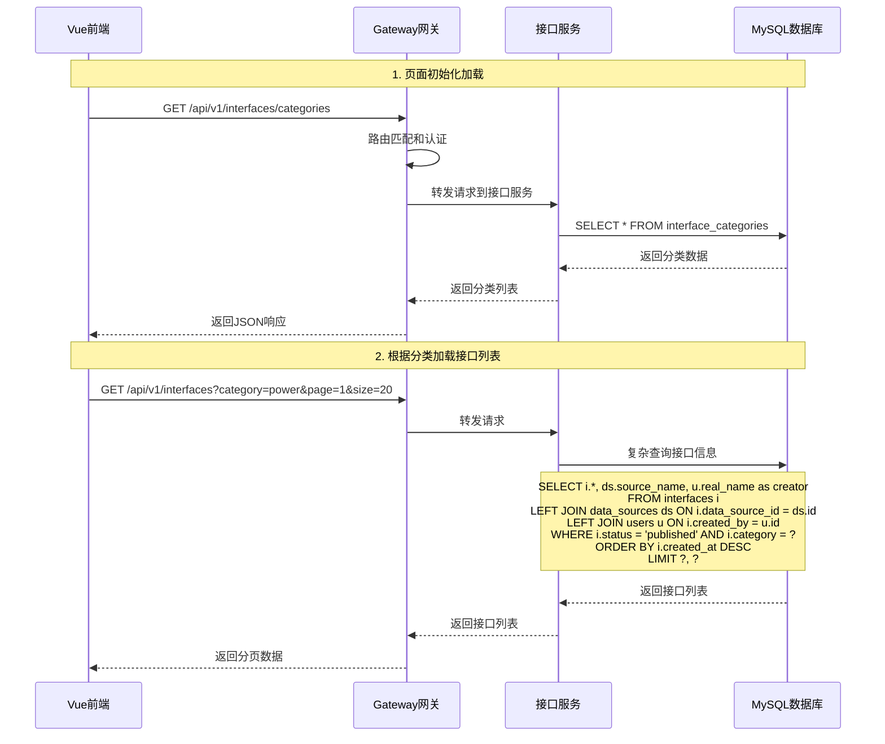
```mermaid
sequenceDiagram
    participant F as Vue前端
    participant G as Gateway网关
    participant IS as 接口服务
    participant DB as MySQL数据库
    
    Note over F,DB: 1. 页面初始化加载
    F->>G: GET /api/v1/interfaces/categories
    G->>G: 路由匹配和认证
    G->>IS: 转发请求到接口服务
    IS->>DB: SELECT * FROM interface_categories
    DB-->>IS: 返回分类数据
    IS-->>G: 返回分类列表
    G-->>F: 返回JSON响应
    
    Note over F,DB: 2. 根据分类加载接口列表
    F->>G: GET /api/v1/interfaces?category=power&page=1&size=20
    G->>IS: 转发请求
    IS->>DB: 复杂查询接口信息
    Note over IS,DB: SELECT i.*, ds.source_name, u.real_name as creator<br/>FROM interfaces i<br/>LEFT JOIN data_sources ds ON i.data_source_id = ds.id<br/>LEFT JOIN users u ON i.created_by = u.id<br/>WHERE i.status = 'published' AND i.category = ?<br/>ORDER BY i.created_at DESC<br/>LIMIT ?, ?
    DB-->>IS: 返回接口列表
    IS-->>G: 返回接口列表
    G-->>F: 返回分页数据
```

#### 7.1.2 数据处理逻辑

**前端数据处理**：

```javascript
// InterfaceCatalog.vue
export default {
  data() {
    return {
      categories: [],
      interfaces: [],
      loading: false,
      pagination: {
        current: 1,
        pageSize: 20,
        total: 0
      }
    }
  },
  
  async mounted() {
    await this.loadCategories()
    await this.loadInterfaces()
  },
  
  methods: {
    async loadCategories() {
      try {
        const response = await this.$http.get('/api/v1/interfaces/categories')
        this.categories = response.data.data
      } catch (error) {
        this.$message.error('加载分类失败')
      }
    },
    
    async loadInterfaces(category = '', page = 1) {
      this.loading = true
      try {
        const params = {
          category,
          page,
          size: this.pagination.pageSize
        }
        const response = await this.$http.get('/api/v1/interfaces', { params })
        this.interfaces = response.data.data.records
        this.pagination.total = response.data.data.total
      } catch (error) {
        this.$message.error('加载接口列表失败')
      } finally {
        this.loading = false
      }
    }
  }
}
```

**后端业务逻辑**：

```java
@RestController
@RequestMapping("/api/v1/interfaces")
public class InterfaceController {
    
    @Autowired
    private InterfaceService interfaceService;
    
    @GetMapping("/categories")
    public ResponseEntity<ApiResponse<List<CategoryVO>>> getCategories() {
        List<CategoryVO> categories = interfaceService.getCategories();
        return ResponseEntity.ok(ApiResponse.success(categories));
    }
    
    @GetMapping
    public ResponseEntity<ApiResponse<PageResult<InterfaceVO>>> getInterfaces(
            @RequestParam(required = false) String category,
            @RequestParam(defaultValue = "1") int page,
            @RequestParam(defaultValue = "20") int size) {
        
        PageRequest pageRequest = PageRequest.of(page - 1, size);
        PageResult<InterfaceVO> result = interfaceService.getInterfaces(category, pageRequest);
        return ResponseEntity.ok(ApiResponse.success(result));
    }
}

@Service
public class InterfaceService {
    
    @Autowired
    private InterfaceMapper interfaceMapper;
    
    public List<CategoryVO> getCategories() {
        return interfaceMapper.selectCategories();
    }
    
    public PageResult<InterfaceVO> getInterfaces(String category, PageRequest pageRequest) {
        // 构建查询条件
        QueryWrapper<Interface> queryWrapper = new QueryWrapper<>();
        queryWrapper.eq("status", "published");
        if (StringUtils.isNotBlank(category)) {
            queryWrapper.eq("category", category);
        }
        queryWrapper.orderByDesc("created_at");
        
        // 分页查询
        Page<Interface> page = new Page<>(pageRequest.getPageNumber() + 1, pageRequest.getPageSize());
        Page<Interface> result = interfaceMapper.selectPage(page, queryWrapper);
        
        // 转换为VO
        List<InterfaceVO> voList = result.getRecords().stream()
            .map(this::convertToVO)
            .collect(Collectors.toList());
            
        return new PageResult<>(voList, result.getTotal(), result.getCurrent(), result.getSize());
    }
}
```

### 7.2 接口生成调用链路

#### 7.2.1 完整调用流程

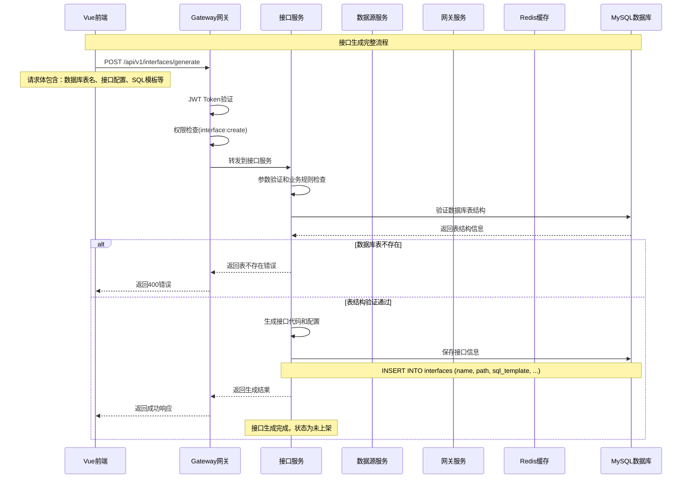
```mermaid
sequenceDiagram
    participant F as Vue前端
    participant G as Gateway网关
    participant IS as 接口服务
    participant DS as 数据源服务
    participant GS as 网关服务
    participant R as Redis缓存
    participant DB as MySQL数据库
    
    Note over F,DB: 接口生成完整流程
    
    F->>G: POST /api/v1/interfaces/generate
    Note over F: 请求体包含：数据库表名、接口配置、SQL模板等
    
    G->>G: JWT Token验证
    G->>G: 权限检查(interface:create)
    G->>IS: 转发到接口服务
    
    IS->>IS: 参数验证和业务规则检查
    IS->>DB: 验证数据库表结构
    DB-->>IS: 返回表结构信息
    
    alt 数据库表不存在
        IS-->>G: 返回表不存在错误
        G-->>F: 返回400错误
    else 表结构验证通过
        IS->>IS: 生成接口代码和配置
        IS->>DB: 保存接口信息
        Note over IS,DB: INSERT INTO interfaces (name, path, sql_template, ...)
        
        IS-->>G: 返回生成结果
        G-->>F: 返回成功响应
        
        Note over IS: 接口生成完成，状态为未上架
    end
```

#### 7.2.2 接口生成核心代码

**前端接口生成组件**：

```javascript
// InterfaceGenerateDialog.vue
export default {
  data() {
    return {
      currentStep: 1,
      formData: {
        dataSourceId: null,
        interfaceName: '',
        interfacePath: '',
        description: '',
        sqlTemplate: '',
        parameters: []
      }
    }
  },
  
  methods: {
    async submitGenerate() {
      try {
        this.loading = true
        const response = await this.$http.post('/api/v1/interfaces/generate', this.formData)
        
        this.$message.success('接口生成成功')
        this.$emit('generated', response.data.data)
        this.closeDialog()
      } catch (error) {
        this.$message.error(error.response?.data?.message || '接口生成失败')
      } finally {
        this.loading = false
      }
    }
  }
}
```

**后端接口生成服务**：

```java
@Service
@Transactional
public class InterfaceGenerateService {
    
    @Autowired
    private InterfaceMapper interfaceMapper;
    
    @Autowired
    private DatabaseTableService databaseTableService;
    
    @Autowired
    private GatewayRouteService gatewayRouteService;
    
    public InterfaceVO generateInterface(InterfaceGenerateRequest request) {
        // 1. 验证数据库表结构
        if (!validateDatabaseTable(request.getTableName())) {
            throw new BusinessException("数据库表不存在或无访问权限");
        }
        
        // 2. 验证SQL模板
        validateSqlTemplate(request.getSqlTemplate());
        
        // 3. 生成接口路径
        String interfacePath = generateInterfacePath(request.getInterfaceName());
        
        // 4. 创建接口记录
        Interface interfaceEntity = new Interface();
        interfaceEntity.setInterfaceName(request.getInterfaceName());
        interfaceEntity.setInterfacePath(interfacePath);
        interfaceEntity.setDescription(request.getDescription());
        interfaceEntity.setSqlTemplate(request.getSqlTemplate());
        interfaceEntity.setStatus("draft");
        interfaceEntity.setCreatedBy(getCurrentUserId());
        interfaceEntity.setCreatedAt(LocalDateTime.now());
        
        interfaceMapper.insert(interfaceEntity);
        
        // 5. 保存接口参数
        saveInterfaceParameters(interfaceEntity.getId(), request.getParameters());
        
        return convertToVO(interfaceEntity);
    }
    
    private void validateSqlTemplate(String sqlTemplate) {
        // SQL注入检查
        if (containsDangerousKeywords(sqlTemplate)) {
            throw new BusinessException("SQL模板包含危险关键字");
        }
        
        // SQL语法检查
        try {
            JSqlParser.parse(sqlTemplate);
        } catch (Exception e) {
            throw new BusinessException("SQL模板语法错误: " + e.getMessage());
        }
    }
}
```

### 7.3 订阅申请审批调用链路

#### 7.3.1 申请提交流程

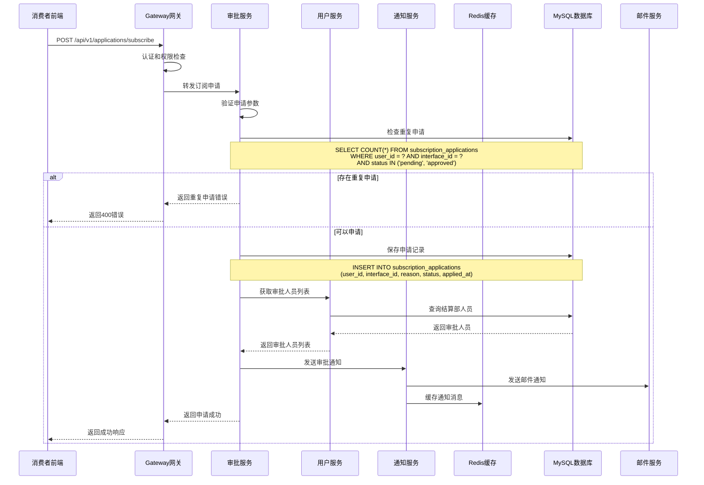
```mermaid
sequenceDiagram
    participant C as 消费者前端
    participant G as Gateway网关
    participant AS as 审批服务
    participant US as 用户服务
    participant NS as 通知服务
    participant R as Redis缓存
    participant DB as MySQL数据库
    participant Email as 邮件服务
    
    C->>G: POST /api/v1/applications/subscribe
    G->>G: 认证和权限检查
    G->>AS: 转发订阅申请
    
    AS->>AS: 验证申请参数
    AS->>DB: 检查重复申请
    Note over AS,DB: SELECT COUNT(*) FROM subscription_applications<br/>WHERE user_id = ? AND interface_id = ?<br/>AND status IN ('pending', 'approved')
    
    alt 存在重复申请
        AS-->>G: 返回重复申请错误
        G-->>C: 返回400错误
    else 可以申请
        AS->>DB: 保存申请记录
        Note over AS,DB: INSERT INTO subscription_applications<br/>(user_id, interface_id, reason, status, applied_at)
        
        AS->>US: 获取审批人员列表
        US->>DB: 查询结算部人员
        DB-->>US: 返回审批人员
        US-->>AS: 返回审批人员列表
        
        AS->>NS: 发送审批通知
        NS->>Email: 发送邮件通知
        NS->>R: 缓存通知消息
        
        AS-->>G: 返回申请成功
        G-->>C: 返回成功响应
    end
```

#### 7.3.2 审批处理流程

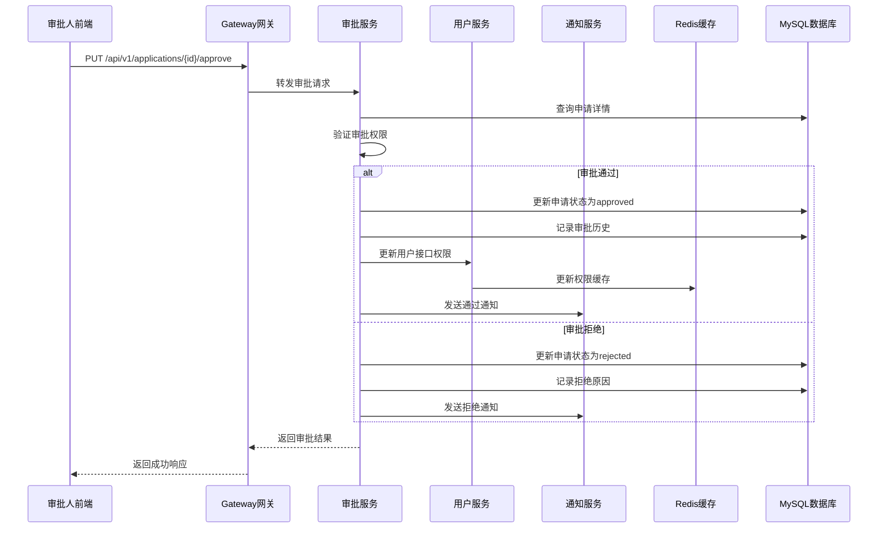
```mermaid
sequenceDiagram
    participant A as 审批人前端
    participant G as Gateway网关
    participant AS as 审批服务
    participant US as 用户服务
    participant NS as 通知服务
    participant R as Redis缓存
    participant DB as MySQL数据库
    
    A->>G: PUT /api/v1/applications/{id}/approve
    G->>AS: 转发审批请求
    
    AS->>DB: 查询申请详情
    AS->>AS: 验证审批权限
    
    alt 审批通过
        AS->>DB: 更新申请状态为approved
        AS->>DB: 记录审批历史
        AS->>US: 更新用户接口权限
        US->>R: 更新权限缓存
        AS->>NS: 发送通过通知
    else 审批拒绝
        AS->>DB: 更新申请状态为rejected
        AS->>DB: 记录拒绝原因
        AS->>NS: 发送拒绝通知
    end
    
    AS-->>G: 返回审批结果
    G-->>A: 返回成功响应
```

### 7.4 API调用认证调用链路

#### 7.4.1 API调用完整流程

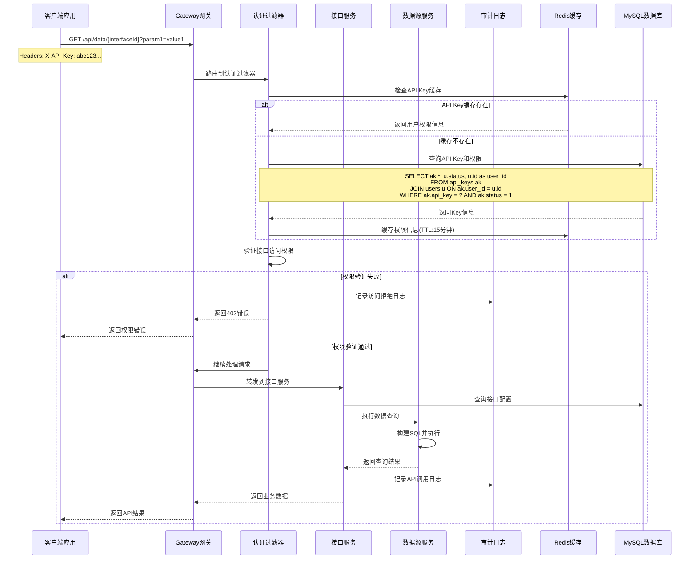
```mermaid
sequenceDiagram
    participant Client as 客户端应用
    participant G as Gateway网关
    participant AF as 认证过滤器
    participant IS as 接口服务
    participant DS as 数据源服务
    participant AL as 审计日志
    participant R as Redis缓存
    participant DB as MySQL数据库
    
    Client->>G: GET /api/data/{interfaceId}?param1=value1
    Note over Client: Headers: X-API-Key: abc123...
    
    G->>AF: 路由到认证过滤器
    AF->>R: 检查API Key缓存
    
    alt API Key缓存存在
        R-->>AF: 返回用户权限信息
    else 缓存不存在
        AF->>DB: 查询API Key和权限
        Note over AF,DB: SELECT ak.*, u.status, u.id as user_id<br/>FROM api_keys ak<br/>JOIN users u ON ak.user_id = u.id<br/>WHERE ak.api_key = ? AND ak.status = 1
        DB-->>AF: 返回Key信息
        AF->>R: 缓存权限信息(TTL:15分钟)
    end
    
    AF->>AF: 验证接口访问权限
    alt 权限验证失败
        AF->>AL: 记录访问拒绝日志
        AF-->>G: 返回403错误
        G-->>Client: 返回权限错误
    else 权限验证通过
        AF->>G: 继续处理请求
        G->>IS: 转发到接口服务
        
        IS->>DB: 查询接口配置
        IS->>DS: 执行数据查询
        DS->>DS: 构建SQL并执行
        DS-->>IS: 返回查询结果
        
        IS->>AL: 记录API调用日志
        IS-->>G: 返回业务数据
        G-->>Client: 返回API结果
    end
```

#### 7.4.2 认证过滤器实现

```java
@Component
public class ApiKeyAuthenticationFilter implements GlobalFilter, Ordered {
    
    @Autowired
    private RedisTemplate<String, Object> redisTemplate;
    
    @Autowired
    private ApiKeyService apiKeyService;
    
    @Override
    public Mono<Void> filter(ServerWebExchange exchange, GatewayFilterChain chain) {
        ServerHttpRequest request = exchange.getRequest();
        
        // 检查是否需要API Key认证
        if (!requiresApiKeyAuth(request.getPath().value())) {
            return chain.filter(exchange);
        }
        
        // 提取API Key
        String apiKey = extractApiKey(request);
        if (StringUtils.isEmpty(apiKey)) {
            return handleAuthError(exchange, "Missing API Key");
        }
        
        // 验证API Key
        return validateApiKey(apiKey)
            .flatMap(userInfo -> {
                // 检查接口权限
                String interfaceId = extractInterfaceId(request.getPath().value());
                if (!hasInterfacePermission(userInfo, interfaceId)) {
                    return handleAuthError(exchange, "Insufficient permissions");
                }
                
                // 添加用户信息到请求头
                ServerHttpRequest mutatedRequest = request.mutate()
                    .header("X-User-Id", userInfo.getUserId().toString())
                    .header("X-User-Role", userInfo.getRole())
                    .build();
                    
                return chain.filter(exchange.mutate().request(mutatedRequest).build());
            })
            .onErrorResume(throwable -> {
                log.error("API Key validation failed", throwable);
                return handleAuthError(exchange, "Invalid API Key");
            });
    }
    
    private Mono<UserInfo> validateApiKey(String apiKey) {
        // 先检查缓存
        String cacheKey = "api_key:" + apiKey;
        UserInfo cachedUserInfo = (UserInfo) redisTemplate.opsForValue().get(cacheKey);
        
        if (cachedUserInfo != null) {
            return Mono.just(cachedUserInfo);
        }
        
        // 缓存未命中，查询数据库
        return apiKeyService.validateApiKey(apiKey)
            .doOnNext(userInfo -> {
                // 缓存用户信息
                redisTemplate.opsForValue().set(cacheKey, userInfo, Duration.ofMinutes(15));
            });
    }
}
```

## 8. API接口定义

### 8.1 用户认证相关API

#### 8.1.1 用户登录

```
POST /api/v1/auth/login
```

**请求参数**：

| 参数名   | 参数类型 | 是否必填 | 描述   |
| -------- | -------- | -------- | ------ |
| username | string   | 是       | 用户名 |
| password | string   | 是       | 密码   |

**请求示例**：

```json
{
  "username": "zhangsan",
  "password": "123456"
}
```

**响应参数**：

| 参数名                    | 参数类型 | 描述        |
| ------------------------- | -------- | ----------- |
| code                      | integer  | 响应码      |
| message                   | string   | 响应消息    |
| data                      | object   | 响应数据    |
| data.token                | string   | JWT访问令牌 |
| data.userInfo             | object   | 用户信息    |
| data.userInfo.id          | integer  | 用户ID      |
| data.userInfo.username    | string   | 用户名      |
| data.userInfo.realName    | string   | 真实姓名    |
| data.userInfo.role        | string   | 用户角色    |
| data.userInfo.permissions | array    | 权限列表    |

**响应示例**：

```json
{
  "code": 200,
  "message": "登录成功",
  "data": {
    "token": "eyJhbGciOiJIUzI1NiIsInR5cCI6IkpXVCJ9...",
    "userInfo": {
      "id": 1001,
      "username": "zhangsan",
      "realName": "张三",
      "role": "tech",
      "permissions": [
        "interface:read",
        "interface:create"
      ]
    }
  },
  "timestamp": "2024-01-15T10:30:00Z"
}
```

#### 8.1.2 用户登出

```
POST /api/v1/auth/logout
```

**请求头**：

| 参数名        | 参数类型 | 是否必填 | 描述           |
| ------------- | -------- | -------- | -------------- |
| Authorization | string   | 是       | Bearer {token} |

**响应示例**：

```json
{
  "code": 200,
  "message": "登出成功",
  "data": null,
  "timestamp": "2024-01-15T10:35:00Z"
}
```

### 8.2 接口管理相关API

#### 8.2.1 获取接口列表

```
GET /api/v1/interfaces
```

**查询参数**：

| 参数名   | 参数类型 | 是否必填 | 描述                                                 |
| -------- | -------- | -------- | ---------------------------------------------------- |
| category | string   | 否       | 接口分类                                             |
| status   | string   | 否       | 接口状态(draft/developed/unlisted/published/offline) |
| keyword  | string   | 否       | 搜索关键词                                           |
| page     | integer  | 否       | 页码，默认1                                          |
| size     | integer  | 否       | 每页大小，默认20                                     |

**响应参数**：

| 参数名       | 参数类型 | 描述     |
| ------------ | -------- | -------- |
| code         | integer  | 响应码   |
| message      | string   | 响应消息 |
| data         | object   | 分页数据 |
| data.records | array    | 接口列表 |
| data.total   | integer  | 总记录数 |
| data.current | integer  | 当前页码 |
| data.size    | integer  | 每页大小 |

#### 8.2.2 生成接口

```
POST /api/v1/interfaces/generate
```

**请求参数**：

| 参数名        | 参数类型 | 是否必填 | 描述        |
| ------------- | -------- | -------- | ----------- |
| dataSourceId  | integer  | 是       | 数据源ID    |
| interfaceName | string   | 是       | 接口名称    |
| interfacePath | string   | 是       | 接口路径    |
| description   | string   | 否       | 接口描述    |
| sqlTemplate   | string   | 是       | SQL查询模板 |
| parameters    | array    | 否       | 参数定义    |

**请求示例**：

```json
{
  "dataSourceId": 1,
  "interfaceName": "电力负荷数据查询",
  "interfacePath": "/power/load",
  "description": "查询指定时间范围的电力负荷数据",
  "sqlTemplate": "SELECT * FROM power_load WHERE date_time BETWEEN #{startTime} AND #{endTime}",
  "parameters": [
    {
      "paramName": "startTime",
      "paramType": "datetime",
      "isRequired": true,
      "description": "开始时间"
    },
    {
      "paramName": "endTime",
      "paramType": "datetime",
      "isRequired": true,
      "description": "结束时间"
    }
  ]
}
```

#### 8.2.3 批量接口操作

```
POST /api/v1/interfaces/batch-operation
```

**请求参数**：

| 参数名       | 参数类型 | 是否必填 | 描述                             |
| ------------ | -------- | -------- | -------------------------------- |
| interfaceIds | array    | 是       | 接口ID列表                       |
| operation    | string   | 是       | 操作类型(publish/offline/reject) |
| reason       | string   | 否       | 操作原因                         |

**请求示例**：

```json
{
  "interfaceIds": [1, 2, 3, 4, 5],
  "operation": "publish",
  "reason": "批量上架电力交易相关接口"
}
```

**响应参数**：

| 参数名     | 参数类型 | 描述                       |
| ---------- | -------- | -------------------------- |
| taskId     | string   | 批量操作任务ID             |
| totalCount | integer  | 总操作数量                 |
| status     | string   | 任务状态(completed/failed) |

#### 8.2.4 批量操作状态查询

```
GET /api/v1/interfaces/batch-operation/{taskId}
```

**路径参数**：

| 参数名 | 参数类型 | 是否必填 | 描述   |
| ------ | -------- | -------- | ------ |
| taskId | string   | 是       | 任务ID |

**响应参数**：

| 参数名   | 参数类型 | 描述                               |
| -------- | -------- | ---------------------------------- |
| taskId   | string   | 任务ID                             |
| status   | string   | 任务状态(running/completed/failed) |
| progress | object   | 进度信息                           |
| results  | array    | 操作结果列表                       |

**响应示例**：

```json
{
  "code": 200,
  "message": "success",
  "data": {
    "taskId": "batch_20240115_001",
    "status": "completed",
    "progress": {
      "total": 5,
      "success": 4,
      "failed": 1,
      "percentage": 100
    },
    "results": [
      {
        "interfaceId": 1,
        "status": "success",
        "message": "接口上架成功"
      },
      {
        "interfaceId": 2,
        "status": "failed",
        "message": "接口状态不符合上架条件"
      }
    ]
  }
}
```

**说明**：批量操作采用同步处理方式，直接返回所有操作结果，无需异步查询任务状态。

#### 8.2.5 重试失败的批量操作

```
POST /api/v1/interfaces/batch-operation/{taskId}/retry
```

**路径参数**：

| 参数名 | 参数类型 | 是否必填 | 描述   |
| ------ | -------- | -------- | ------ |
| taskId | string   | 是       | 任务ID |

**请求参数**：

| 参数名       | 参数类型 | 是否必填 | 描述             |
| ------------ | -------- | -------- | ---------------- |
| interfaceIds | array    | 否       | 指定重试的接口ID |

#### 8.2.6 接口状态变更

```
PUT /api/v1/interfaces/{id}/status
```

**路径参数**：

| 参数名 | 参数类型 | 是否必填 | 描述   |
| ------ | -------- | -------- | ------ |
| id     | integer  | 是       | 接口ID |

**请求参数**：

| 参数名 | 参数类型 | 是否必填 | 描述                                                 |
| ------ | -------- | -------- | ---------------------------------------------------- |
| status | string   | 是       | 接口状态(draft/developed/unlisted/published/offline) |
| reason | string   | 否       | 状态变更原因                                         |

**请求示例**：

```json
{
  "status": "published",
  "reason": "接口测试通过，正式上架"
}
```

### 8.3 订阅申请相关API

#### 8.3.1 提交订阅申请

```
POST /api/v1/applications/subscribe
```

**请求参数**：

| 参数名            | 参数类型 | 是否必填 | 描述     |
| ----------------- | -------- | -------- | -------- |
| interfaceId       | integer  | 是       | 接口ID   |
| applicationReason | string   | 是       | 申请理由 |
| businessScenario  | string   | 是       | 业务场景 |

#### 8.3.2 审批申请

```
PUT /api/v1/applications/{id}/approve
```

**路径参数**：

| 参数名 | 参数类型 | 是否必填 | 描述   |
| ------ | -------- | -------- | ------ |
| id     | integer  | 是       | 申请ID |

**请求参数**：

| 参数名  | 参数类型 | 是否必填 | 描述                     |
| ------- | -------- | -------- | ------------------------ |
| action  | string   | 是       | 审批动作(approve/reject) |
| comment | string   | 否       | 审批意见                 |

### 8.4 通知管理相关API

#### 8.4.1 获取用户通知列表

```
GET /api/v1/notifications
```

**查询参数**：

| 参数名 | 参数类型 | 是否必填 | 描述                                          |
| ------ | -------- | -------- | --------------------------------------------- |
| type   | string   | 否       | 通知类型(interface\_offline/approval\_result) |
| status | string   | 否       | 读取状态(read/unread)                         |
| page   | integer  | 否       | 页码，默认1                                   |
| size   | integer  | 否       | 每页大小，默认20                              |

**响应参数**：

| 参数名       | 参数类型 | 描述     |
| ------------ | -------- | -------- |
| code         | integer  | 响应码   |
| message      | string   | 响应消息 |
| data         | object   | 分页数据 |
| data.records | array    | 通知列表 |
| data.total   | integer  | 总记录数 |

#### 8.4.2 标记通知为已读

```
PUT /api/v1/notifications/{id}/read
```

**路径参数**：

| 参数名 | 参数类型 | 是否必填 | 描述   |
| ------ | -------- | -------- | ------ |
| id     | integer  | 是       | 通知ID |

#### 8.4.3 批量标记通知为已读

```
PUT /api/v1/notifications/batch-read
```

**请求参数**：

| 参数名          | 参数类型 | 是否必填 | 描述       |
| --------------- | -------- | -------- | ---------- |
| notificationIds | array    | 是       | 通知ID列表 |

#### 8.4.4 发送接口下架通知

```
POST /api/v1/notifications/interface-offline
```

**请求参数**：

| 参数名      | 参数类型 | 是否必填 | 描述         |
| ----------- | -------- | -------- | ------------ |
| interfaceId | integer  | 是       | 接口ID       |
| reason      | string   | 是       | 下架原因     |
| userIds     | array    | 否       | 指定通知用户 |

**请求示例**：

```json
{
  "interfaceId": 123,
  "reason": "接口维护升级",
  "userIds": [1, 2, 3]
}
```

### 8.5 数据接口调用API

#### 8.5.1 通用数据接口

```
GET /api/data/{interfaceId}
```

**请求头**：

| 参数名    | 参数类型 | 是否必填 | 描述        |
| --------- | -------- | -------- | ----------- |
| X-API-Key | string   | 是       | API访问密钥 |

**路径参数**：

| 参数名      | 参数类型 | 是否必填 | 描述     |
| ----------- | -------- | -------- | -------- |
| interfaceId | string   | 是       | 接口标识 |

**查询参数**：根据具体接口定义的参数

**响应格式**：

```json
{
  "code": 200,
  "message": "success",
  "data": {
    "records": [...],
    "total": 100,
    "page": 1,
    "size": 20
  },
  "timestamp": "2024-01-15T10:30:00Z"
}
```

## 9. 数据库表结构设计

### 9.1 核心表DDL语句

#### 9.1.1 用户相关表

```sql
-- 用户表
CREATE TABLE users (
    id BIGINT PRIMARY KEY AUTO_INCREMENT COMMENT '用户ID',
    username VARCHAR(50) NOT NULL UNIQUE COMMENT '用户名',
    email VARCHAR(100) NOT NULL UNIQUE COMMENT '邮箱地址',
    password_hash VARCHAR(255) NOT NULL COMMENT '密码哈希',
    real_name VARCHAR(50) NOT NULL COMMENT '真实姓名',
    phone VARCHAR(20) COMMENT '手机号码',
    department VARCHAR(100) COMMENT '部门',
    position VARCHAR(100) COMMENT '职位',
    status TINYINT DEFAULT 1 COMMENT '状态(0:禁用,1:启用)',
    created_at DATETIME DEFAULT CURRENT_TIMESTAMP COMMENT '创建时间',
    updated_at DATETIME DEFAULT CURRENT_TIMESTAMP ON UPDATE CURRENT_TIMESTAMP COMMENT '更新时间',
    INDEX idx_username (username),
    INDEX idx_email (email),
    INDEX idx_status (status)
) ENGINE=InnoDB DEFAULT CHARSET=utf8mb4 COMMENT='用户表';

-- 角色表
CREATE TABLE roles (
    id INT PRIMARY KEY AUTO_INCREMENT COMMENT '角色ID',
    role_name VARCHAR(50) NOT NULL UNIQUE COMMENT '角色名称',
    role_code VARCHAR(50) NOT NULL UNIQUE COMMENT '角色编码',
    description VARCHAR(200) COMMENT '角色描述',
    permissions JSON COMMENT '权限列表',
    status TINYINT DEFAULT 1 COMMENT '状态(0:禁用,1:启用)',
    created_at DATETIME DEFAULT CURRENT_TIMESTAMP COMMENT '创建时间'
) ENGINE=InnoDB DEFAULT CHARSET=utf8mb4 COMMENT='角色表';

-- 用户角色关联表
CREATE TABLE user_roles (
    id BIGINT PRIMARY KEY AUTO_INCREMENT COMMENT '关联ID',
    user_id BIGINT NOT NULL COMMENT '用户ID',
    role_id INT NOT NULL COMMENT '角色ID',
    assigned_at DATETIME DEFAULT CURRENT_TIMESTAMP COMMENT '分配时间',
    FOREIGN KEY (user_id) REFERENCES users(id) ON DELETE CASCADE,
    FOREIGN KEY (role_id) REFERENCES roles(id) ON DELETE CASCADE,
    UNIQUE KEY uk_user_role (user_id, role_id)
) ENGINE=InnoDB DEFAULT CHARSET=utf8mb4 COMMENT='用户角色关联表';
```

#### 9.1.2 接口管理相关表

```sql


-- 接口分类表
CREATE TABLE interface_categories (
    id INT PRIMARY KEY AUTO_INCREMENT COMMENT '分类ID',
    category_name VARCHAR(50) NOT NULL COMMENT '分类名称',
    category_code VARCHAR(50) NOT NULL UNIQUE COMMENT '分类代码',
    description TEXT COMMENT '分类描述',
    color_code VARCHAR(10) COMMENT '颜色标识',
    sort_order INT DEFAULT 0 COMMENT '排序',
    status TINYINT DEFAULT 1 COMMENT '状态(0:禁用,1:启用)',
    created_at DATETIME DEFAULT CURRENT_TIMESTAMP COMMENT '创建时间',
    INDEX idx_category_code (category_code)
) ENGINE=InnoDB DEFAULT CHARSET=utf8mb4 COMMENT='接口分类表';

-- 接口表
CREATE TABLE interfaces (
    id BIGINT PRIMARY KEY AUTO_INCREMENT COMMENT '接口ID',
    interface_name VARCHAR(200) NOT NULL COMMENT '接口名称',
    interface_path VARCHAR(500) NOT NULL UNIQUE COMMENT '接口路径',
    description TEXT COMMENT '接口描述',
    category_id INT COMMENT '分类ID',
    business_rule_ref VARCHAR(100) COMMENT '对应披露规则编号',
    
    sql_template TEXT NOT NULL COMMENT 'SQL查询模板',
    request_params JSON COMMENT '请求参数定义',
    response_format JSON COMMENT '响应格式定义',
    table_type VARCHAR(50) COMMENT '数据表类型(hourly_24,min5_288,device_info)',
    
    status VARCHAR(20) DEFAULT 'draft' COMMENT '接口状态(draft,developed,unpublished,published,offline)',
    created_by BIGINT NOT NULL COMMENT '创建人ID',
    created_at DATETIME DEFAULT CURRENT_TIMESTAMP COMMENT '创建时间',
    updated_at DATETIME DEFAULT CURRENT_TIMESTAMP ON UPDATE CURRENT_TIMESTAMP COMMENT '更新时间',
    published_at DATETIME COMMENT '发布时间',

    FOREIGN KEY (created_by) REFERENCES users(id),
    FOREIGN KEY (category_id) REFERENCES interface_categories(id),
    INDEX idx_interface_path (interface_path),
    INDEX idx_status (status),
    INDEX idx_category_id (category_id),
    INDEX idx_created_by (created_by)
) ENGINE=InnoDB DEFAULT CHARSET=utf8mb4 COMMENT='接口表';

-- 接口参数表
CREATE TABLE interface_parameters (
    id BIGINT PRIMARY KEY AUTO_INCREMENT COMMENT '参数ID',
    interface_id BIGINT NOT NULL COMMENT '接口ID',
    param_name VARCHAR(100) NOT NULL COMMENT '参数名称',
    param_type VARCHAR(50) NOT NULL COMMENT '参数类型',
    param_description VARCHAR(200) COMMENT '参数描述',
    is_required TINYINT DEFAULT 0 COMMENT '是否必填(0:否,1:是)',
    default_value VARCHAR(200) COMMENT '默认值',
    validation_rule VARCHAR(500) COMMENT '验证规则',
    sort_order INT DEFAULT 0 COMMENT '排序',
    FOREIGN KEY (interface_id) REFERENCES interfaces(id) ON DELETE CASCADE,
    INDEX idx_interface_id (interface_id)
) ENGINE=InnoDB DEFAULT CHARSET=utf8mb4 COMMENT='接口参数表';
```

#### 9.1.3 订阅申请相关表

```sql
-- 订阅申请表
CREATE TABLE subscription_applications (
    id BIGINT PRIMARY KEY AUTO_INCREMENT COMMENT '申请ID',
    user_id BIGINT NOT NULL COMMENT '申请用户ID',
    interface_id BIGINT NOT NULL COMMENT '接口ID',
    application_reason TEXT NOT NULL COMMENT '申请理由',
    business_scenario TEXT COMMENT '业务场景',
    status VARCHAR(20) DEFAULT 'pending' COMMENT '申请状态(pending,approved,rejected)',
    applied_at DATETIME DEFAULT CURRENT_TIMESTAMP COMMENT '申请时间',
    approved_at DATETIME COMMENT '审批时间',
    approved_by BIGINT COMMENT '审批人ID',
    approval_comment TEXT COMMENT '审批意见',
    FOREIGN KEY (user_id) REFERENCES users(id),
    FOREIGN KEY (interface_id) REFERENCES interfaces(id),
    FOREIGN KEY (approved_by) REFERENCES users(id),
    INDEX idx_user_id (user_id),
    INDEX idx_interface_id (interface_id),
    INDEX idx_status (status),
    INDEX idx_applied_at (applied_at)
) ENGINE=InnoDB DEFAULT CHARSET=utf8mb4 COMMENT='订阅申请表';

-- 审批记录表
CREATE TABLE approval_records (
    id BIGINT PRIMARY KEY AUTO_INCREMENT COMMENT '记录ID',
    application_id BIGINT NOT NULL COMMENT '申请ID',
    approver_id BIGINT NOT NULL COMMENT '审批人ID',
    action VARCHAR(20) NOT NULL COMMENT '审批动作(approve,reject)',
    comment TEXT COMMENT '审批意见',
    created_at DATETIME DEFAULT CURRENT_TIMESTAMP COMMENT '审批时间',
    FOREIGN KEY (application_id) REFERENCES subscription_applications(id) ON DELETE CASCADE,
    FOREIGN KEY (approver_id) REFERENCES users(id),
    INDEX idx_application_id (application_id),
    INDEX idx_approver_id (approver_id)
) ENGINE=InnoDB DEFAULT CHARSET=utf8mb4 COMMENT='审批记录表';
```

#### 9.1.4 API密钥和日志表

```sql
-- 用户应用ID表（替代API密钥）
CREATE TABLE user_app_ids (
    id BIGINT PRIMARY KEY AUTO_INCREMENT COMMENT 'ID',
    user_id BIGINT NOT NULL COMMENT '用户ID',
    app_id VARCHAR(32) NOT NULL UNIQUE COMMENT '应用ID',
    app_name VARCHAR(100) COMMENT '应用名称',
    permissions JSON COMMENT '权限范围',
    call_limit_per_day INT DEFAULT 10000 COMMENT '每日调用限制',
    status TINYINT DEFAULT 1 COMMENT '状态(0:禁用,1:启用)',
    created_at DATETIME DEFAULT CURRENT_TIMESTAMP COMMENT '创建时间',
    last_used_at DATETIME COMMENT '最后使用时间',
    expires_at DATETIME COMMENT '过期时间',
    FOREIGN KEY (user_id) REFERENCES users(id) ON DELETE CASCADE,
    INDEX idx_app_id (app_id),
    INDEX idx_user_id (user_id),
    INDEX idx_status (status)
) ENGINE=InnoDB DEFAULT CHARSET=utf8mb4 COMMENT='用户应用ID表';

-- API密钥表（保留兼容）
CREATE TABLE api_keys (
    id BIGINT PRIMARY KEY AUTO_INCREMENT COMMENT '密钥ID',
    user_id BIGINT NOT NULL COMMENT '用户ID',
    api_key VARCHAR(64) NOT NULL UNIQUE COMMENT 'API密钥',
    secret_key VARCHAR(128) NOT NULL COMMENT '签名密钥',
    permissions JSON COMMENT '权限范围',
    expires_at DATETIME COMMENT '过期时间',
    status TINYINT DEFAULT 1 COMMENT '状态(0:禁用,1:启用)',
    created_at DATETIME DEFAULT CURRENT_TIMESTAMP COMMENT '创建时间',
    last_used_at DATETIME COMMENT '最后使用时间',
    FOREIGN KEY (user_id) REFERENCES users(id) ON DELETE CASCADE,
    INDEX idx_api_key (api_key),
    INDEX idx_user_id (user_id),
    INDEX idx_status (status)
) ENGINE=InnoDB DEFAULT CHARSET=utf8mb4 COMMENT='API密钥表';

-- API调用日志表
CREATE TABLE api_call_logs (
    id BIGINT PRIMARY KEY AUTO_INCREMENT COMMENT '日志ID',
    app_id VARCHAR(32) COMMENT '应用ID',
    api_key_id BIGINT COMMENT 'API密钥ID（兼容字段）',
    interface_id BIGINT COMMENT '接口ID',
    request_ip VARCHAR(45) COMMENT '请求IP',
    request_method VARCHAR(10) COMMENT '请求方法',
    request_params TEXT COMMENT '请求参数',
    response_status VARCHAR(10) COMMENT '响应状态（0-成功，其他-失败）',
    response_message VARCHAR(200) COMMENT '响应消息',
    response_body TEXT COMMENT '响应内容',
    response_time_ms INT COMMENT '响应时间(毫秒)',
    created_at DATETIME DEFAULT CURRENT_TIMESTAMP COMMENT '调用时间',
    FOREIGN KEY (api_key_id) REFERENCES api_keys(id),
    FOREIGN KEY (interface_id) REFERENCES interfaces(id),
    INDEX idx_app_id (app_id),
    INDEX idx_api_key_id (api_key_id),
    INDEX idx_interface_id (interface_id),
    INDEX idx_created_at (created_at),
    INDEX idx_request_ip (request_ip)
) ENGINE=InnoDB DEFAULT CHARSET=utf8mb4 COMMENT='API调用日志表';

-- 操作日志表
CREATE TABLE operation_logs (
    id BIGINT PRIMARY KEY AUTO_INCREMENT COMMENT '日志ID',
    user_id BIGINT COMMENT '操作用户ID',
    operation_type VARCHAR(50) NOT NULL COMMENT '操作类型',
    operation_desc VARCHAR(200) NOT NULL COMMENT '操作描述',
    target_type VARCHAR(50) COMMENT '目标类型',
    target_id VARCHAR(100) COMMENT '目标ID',
    operation_data JSON COMMENT '操作数据',
    request_ip VARCHAR(45) COMMENT '请求IP',
    user_agent VARCHAR(500) COMMENT '用户代理',
    created_at DATETIME DEFAULT CURRENT_TIMESTAMP COMMENT '操作时间',
    FOREIGN KEY (user_id) REFERENCES users(id),
    INDEX idx_user_id (user_id),
    INDEX idx_operation_type (operation_type),
    INDEX idx_created_at (created_at)
) ENGINE=InnoDB DEFAULT CHARSET=utf8mb4 COMMENT='操作日志表';

-- 批量操作任务表
CREATE TABLE batch_operation_tasks (
    id BIGINT PRIMARY KEY AUTO_INCREMENT COMMENT '任务ID',
    task_id VARCHAR(64) NOT NULL UNIQUE COMMENT '任务标识',
    user_id BIGINT NOT NULL COMMENT '操作用户ID',
    operation_type VARCHAR(50) NOT NULL COMMENT '操作类型(publish/offline/reject)',
    target_type VARCHAR(50) NOT NULL COMMENT '目标类型(interface)',
    total_count INT NOT NULL COMMENT '总操作数量',
    success_count INT DEFAULT 0 COMMENT '成功数量',
    failed_count INT DEFAULT 0 COMMENT '失败数量',
    status VARCHAR(20) DEFAULT 'running' COMMENT '任务状态(running/completed/failed)',
    operation_reason TEXT COMMENT '操作原因',
    started_at DATETIME DEFAULT CURRENT_TIMESTAMP COMMENT '开始时间',
    completed_at DATETIME COMMENT '完成时间',
    FOREIGN KEY (user_id) REFERENCES users(id),
    INDEX idx_task_id (task_id),
    INDEX idx_user_id (user_id),
    INDEX idx_status (status),
    INDEX idx_started_at (started_at)
) ENGINE=InnoDB DEFAULT CHARSET=utf8mb4 COMMENT='批量操作任务表';

-- 批量操作结果表
CREATE TABLE batch_operation_results (
    id BIGINT PRIMARY KEY AUTO_INCREMENT COMMENT '结果ID',
    task_id VARCHAR(64) NOT NULL COMMENT '任务标识',
    target_id BIGINT NOT NULL COMMENT '目标ID',
    status VARCHAR(20) NOT NULL COMMENT '操作状态(success/failed/skipped)',
    message TEXT COMMENT '操作结果消息',
    error_code VARCHAR(50) COMMENT '错误代码',
    executed_at DATETIME DEFAULT CURRENT_TIMESTAMP COMMENT '执行时间',
    FOREIGN KEY (task_id) REFERENCES batch_operation_tasks(task_id) ON DELETE CASCADE,
    INDEX idx_task_id (task_id),
    INDEX idx_target_id (target_id),
    INDEX idx_status (status)
) ENGINE=InnoDB DEFAULT CHARSET=utf8mb4 COMMENT='批量操作结果表';

-- 通知表
CREATE TABLE notifications (
    id BIGINT PRIMARY KEY AUTO_INCREMENT COMMENT '通知ID',
    user_id BIGINT NOT NULL COMMENT '接收用户ID',
    type VARCHAR(50) NOT NULL COMMENT '通知类型(interface_offline/approval_result/system_notice)',
    title VARCHAR(200) NOT NULL COMMENT '通知标题',
    content TEXT NOT NULL COMMENT '通知内容',
    related_type VARCHAR(50) COMMENT '关联类型(interface/application)',
    related_id BIGINT COMMENT '关联ID',
    status VARCHAR(20) DEFAULT 'unread' COMMENT '读取状态(read/unread)',
    send_methods JSON COMMENT '发送方式(site/email/sms)',
    send_status JSON COMMENT '发送状态',
    created_at DATETIME DEFAULT CURRENT_TIMESTAMP COMMENT '创建时间',
    read_at DATETIME COMMENT '读取时间',
    FOREIGN KEY (user_id) REFERENCES users(id) ON DELETE CASCADE,
    INDEX idx_user_id (user_id),
    INDEX idx_type (type),
    INDEX idx_status (status),
    INDEX idx_created_at (created_at)
) ENGINE=InnoDB DEFAULT CHARSET=utf8mb4 COMMENT='通知表';

-- 通知模板表
CREATE TABLE notification_templates (
    id INT PRIMARY KEY AUTO_INCREMENT COMMENT '模板ID',
    template_code VARCHAR(50) NOT NULL UNIQUE COMMENT '模板编码',
    template_name VARCHAR(100) NOT NULL COMMENT '模板名称',
    type VARCHAR(50) NOT NULL COMMENT '通知类型',
    title_template VARCHAR(200) NOT NULL COMMENT '标题模板',
    content_template TEXT NOT NULL COMMENT '内容模板',
    variables JSON COMMENT '变量定义',
    status TINYINT DEFAULT 1 COMMENT '状态(0:禁用,1:启用)',
    created_at DATETIME DEFAULT CURRENT_TIMESTAMP COMMENT '创建时间',
    updated_at DATETIME DEFAULT CURRENT_TIMESTAMP ON UPDATE CURRENT_TIMESTAMP COMMENT '更新时间',
    INDEX idx_template_code (template_code),
    INDEX idx_type (type)
) ENGINE=InnoDB DEFAULT CHARSET=utf8mb4 COMMENT='通知模板表';
```

### 9.2 初始化数据

```sql
-- 初始化接口分类数据
INSERT INTO interface_categories (category_name, category_code, description, color_code, sort_order) VALUES
('日前现货', 'day_ahead_spot', '日前现货市场相关数据接口', '#1890ff', 1),
('预测', 'forecast', '负荷预测、新能源预测等预测类数据接口', '#52c41a', 2),
('辅助服务', 'ancillary_service', '调频、调压、备用等辅助服务数据接口', '#faad14', 3),
('电网运行', 'grid_operation', '电网运行状态、约束情况等运行数据接口', '#f5222d', 4);

-- 初始化角色数据
INSERT INTO roles (role_name, role_code, description, permissions) VALUES
('数据消费者', 'consumer', '数据消费者角色', '["interface:read", "subscription:apply"]'),
('技术部管理员', 'tech', '技术部管理员角色', '["interface:read", "interface:create", "interface:update", "audit:read"]'),
('结算部管理员', 'finance', '结算部管理员角色', '["interface:read", "interface:publish", "application:approve", "audit:read"]'),
('系统管理员', 'admin', '系统管理员角色', '["*"]');

-- 初始化管理员用户
INSERT INTO users (username, email, password_hash, real_name, department, position) VALUES
('admin', 'admin@powertrading.com', '$2a$10$N.zmdr9k7uOCQb376NoUnuTJ8iAt6Z5EHsM8lE9lBaYMk6j8Ej2Gy', '系统管理员', 'IT部', '系统管理员');

-- 分配管理员角色
INSERT INTO user_roles (user_id, role_id) VALUES (1, 4);

-- 初始化管理员appId
INSERT INTO user_app_ids (user_id, app_id, app_name, permissions, call_limit_per_day) VALUES
(1, 'ADMIN-SYS-001-MGMT', '系统管理应用', '["*"]', 100000);

-- 初始化系统配置
INSERT INTO system_config (config_key, config_value, description) VALUES
('database.connection.maxPoolSize', '20', 'MySQL连接池最大连接数'),
('database.connection.timeout', '30000', 'MySQL连接超时时间(毫秒)');

-- 初始化通知模板
INSERT INTO notification_templates (template_code, template_name, type, title_template, content_template, variables) VALUES
('INTERFACE_OFFLINE', '接口下架通知', 'interface_offline', '接口下架通知', 
 '您订阅的接口"{{interfaceName}}"已于{{offlineTime}}下架\n下架原因：{{reason}}\n影响说明：该接口将无法继续调用，请及时调整您的业务系统\n联系方式：如有疑问，请联系客服电话：400-xxx-xxxx\n操作建议：\n1. 请检查您的系统是否依赖此接口\n2. 如需继续使用，请联系相关部门申请替代方案\n3. 建议订阅相关的替代接口', 
 '{"interfaceName": "接口名称", "offlineTime": "下架时间", "reason": "下架原因"}'),
('APPROVAL_RESULT', '订阅申请审批结果', 'approval_result', '订阅申请审批结果通知',
 '您的接口订阅申请已处理完成\n接口名称：{{interfaceName}}\n审批结果：{{result}}\n审批意见：{{comment}}\n处理时间：{{processTime}}',
 '{"interfaceName": "接口名称", "result": "审批结果", "comment": "审批意见", "processTime": "处理时间"}'),
('BATCH_OPERATION_RESULT', '批量操作结果通知', 'system_notice', '批量操作完成通知',
 '您的批量{{operationType}}操作已完成\n操作时间：{{operationTime}}\n总数量：{{totalCount}}\n成功：{{successCount}}\n失败：{{failedCount}}\n如有失败项目，您可以查看详情并重试',
 '{"operationType": "操作类型", "operationTime": "操作时间", "totalCount": "总数量", "successCount": "成功数量", "failedCount": "失败数量"}'),
('APP_ID_GENERATED', 'appId生成通知', 'system_notice', 'appId生成成功通知',
 '您的应用ID已生成成功\nappId：{{appId}}\n应用名称：{{appName}}\n每日调用限制：{{callLimit}}次\n请妥善保管您的appId，调用接口时需要使用',
 '{"appId": "应用ID", "appName": "应用名称", "callLimit": "调用限制"}');

-- 更新接口状态枚举值
ALTER TABLE interfaces MODIFY COLUMN status VARCHAR(20) DEFAULT 'draft' COMMENT '接口状态(draft:草稿,developed:已开发,unlisted:未上架,published:已上架,offline:已下架)';
```

## 10. 部署架构

### 10.1 容器化部署

#### 10.1.1 Docker Compose配置

```yaml
version: '3.8'

services:
  # 前端应用
  frontend:
    build:
      context: ./frontend
      dockerfile: Dockerfile
    ports:
      - "80:80"
    depends_on:
      - gateway
    networks:
      - power-trading-network

  # API网关
  gateway:
    build:
      context: ./gateway
      dockerfile: Dockerfile
    ports:
      - "8080:8080"
    environment:
      - SPRING_PROFILES_ACTIVE=docker
      - NACOS_SERVER_ADDR=nacos:8848
    depends_on:
      - nacos
    networks:
      - power-trading-network

  # 用户服务
  user-service:
    build:
      context: ./user-service
      dockerfile: Dockerfile
    environment:
      - SPRING_PROFILES_ACTIVE=docker
      - NACOS_SERVER_ADDR=nacos:8848
      - MYSQL_HOST=mysql
    depends_on:
      - mysql
      - nacos
    networks:
      - power-trading-network

  # 接口服务
  interface-service:
    build:
      context: ./interface-service
      dockerfile: Dockerfile
    environment:
      - SPRING_PROFILES_ACTIVE=docker
      - NACOS_SERVER_ADDR=nacos:8848
      - MYSQL_HOST=mysql
    depends_on:
      - mysql
      - nacos
    networks:
      - power-trading-network

  # 审批服务
  approval-service:
    build:
      context: ./approval-service
      dockerfile: Dockerfile
    environment:
      - SPRING_PROFILES_ACTIVE=docker
      - NACOS_SERVER_ADDR=nacos:8848
      - MYSQL_HOST=mysql
    depends_on:
      - mysql
      - nacos
    networks:
      - power-trading-network


  # MySQL数据库
  mysql:
    image: mysql:8.0
    environment:
      - MYSQL_ROOT_PASSWORD=root123
      - MYSQL_DATABASE=power_trading
      - MYSQL_USER=power_user
      - MYSQL_PASSWORD=power123
    volumes:
      - mysql_data:/var/lib/mysql
      - ./sql/init.sql:/docker-entrypoint-initdb.d/init.sql
    ports:
      - "3306:3306"
    networks:
      - power-trading-network

  # Nacos注册中心
  nacos:
    image: nacos/nacos-server:v2.2.0
    environment:
      - MODE=standalone
      - SPRING_DATASOURCE_PLATFORM=mysql
      - MYSQL_SERVICE_HOST=mysql
      - MYSQL_SERVICE_DB_NAME=nacos
      - MYSQL_SERVICE_USER=root
      - MYSQL_SERVICE_PASSWORD=root123
    ports:
      - "8848:8848"
    depends_on:
      - mysql
    networks:
      - power-trading-network

volumes:
  mysql_data:

networks:
  power-trading-network:
    driver: bridge
```

### 10.2 生产环境部署

#### 10.2.1 Kubernetes部署配置

```yaml
# namespace.yaml
apiVersion: v1
kind: Namespace
metadata:
  name: power-trading

---
# configmap.yaml
apiVersion: v1
kind: ConfigMap
metadata:
  name: app-config
  namespace: power-trading
data:
  application.yml: |
    spring:
      profiles:
        active: k8s
      cloud:
        nacos:
          discovery:
            server-addr: nacos-service:8848
          config:
            server-addr: nacos-service:8848
      datasource:
        url: jdbc:mysql://mysql-service:3306/power_trading
        username: power_user
        password: power123

---
# gateway-deployment.yaml
apiVersion: apps/v1
kind: Deployment
metadata:
  name: gateway-deployment
  namespace: power-trading
spec:
  replicas: 2
  selector:
    matchLabels:
      app: gateway
  template:
    metadata:
      labels:
        app: gateway
    spec:
      containers:
      - name: gateway
        image: power-trading/gateway:v1.0
        ports:
        - containerPort: 8080
        env:
        - name: SPRING_PROFILES_ACTIVE
          value: "k8s"
        volumeMounts:
        - name: config-volume
          mountPath: /app/config
        resources:
          requests:
            memory: "512Mi"
            cpu: "500m"
          limits:
            memory: "1Gi"
            cpu: "1000m"
      volumes:
      - name: config-volume
        configMap:
          name: app-config

---
# gateway-service.yaml
apiVersion: v1
kind: Service
metadata:
  name: gateway-service
  namespace: power-trading
spec:
  selector:
    app: gateway
  ports:
  - protocol: TCP
    port: 8080
    targetPort: 8080
  type: LoadBalancer
```

## 11. 监控与运维

### 11.1 应用监控

#### 11.1.1 Prometheus监控配置

```yaml
# prometheus.yml
global:
  scrape_interval: 15s
  evaluation_interval: 15s

rule_files:
  - "power_trading_rules.yml"

scrape_configs:
  - job_name: 'power-trading-gateway'
    static_configs:
      - targets: ['gateway:8080']
    metrics_path: '/actuator/prometheus'
    scrape_interval: 10s

  - job_name: 'power-trading-services'
    static_configs:
      - targets: 
        - 'user-service:8081'
        - 'interface-service:8082'
        - 'approval-service:8083'
        - 'audit-service:8084'
    metrics_path: '/actuator/prometheus'
    scrape_interval: 15s

  - job_name: 'mysql-exporter'
    static_configs:
      - targets: ['mysql-exporter:9104']

alerting:
  alertmanagers:
    - static_configs:
        - targets:
          - alertmanager:9093
```

#### 11.1.2 告警规则配置

```yaml
# power_trading_rules.yml
groups:
- name: power_trading_alerts
  rules:
  - alert: HighErrorRate
    expr: rate(http_requests_total{status=~"5.."}[5m]) > 0.1
    for: 2m
    labels:
      severity: critical
    annotations:
      summary: "High error rate detected"
      description: "Error rate is {{ $value }} errors per second"

  - alert: HighResponseTime
    expr: histogram_quantile(0.95, rate(http_request_duration_seconds_bucket[5m])) > 2
    for: 5m
    labels:
      severity: warning
    annotations:
      summary: "High response time detected"
      description: "95th percentile response time is {{ $value }} seconds"

  - alert: DatabaseConnectionHigh
    expr: mysql_global_status_threads_connected / mysql_global_variables_max_connections > 0.8
    for: 2m
    labels:
      severity: warning
    annotations:
      summary: "Database connection usage high"
      description: "Database connection usage is {{ $value | humanizePercentage }}"
```

### 11.2 日志管理

#### 11.2.1 ELK Stack配置

```yaml
# logstash.conf
input {
  beats {
    port => 5044
  }
}

filter {
  if [fields][service] == "power-trading" {
    grok {
      match => { "message" => "%{TIMESTAMP_ISO8601:timestamp} %{LOGLEVEL:level} %{DATA:thread} %{DATA:logger} - %{GREEDYDATA:message}" }
    }
    
    date {
      match => [ "timestamp", "yyyy-MM-dd HH:mm:ss.SSS" ]
    }
    
    if [level] == "ERROR" {
      mutate {
        add_tag => [ "error" ]
      }
    }
  }
}

output {
  elasticsearch {
    hosts => ["elasticsearch:9200"]
    index => "power-trading-logs-%{+YYYY.MM.dd}"
  }
}
```

## 12. 安全架构

### 12.1 认证授权机制

#### 12.1.1 JWT Token配置

```java
@Configuration
@EnableWebSecurity
public class SecurityConfig {
    
    @Bean
    public JwtAuthenticationEntryPoint jwtAuthenticationEntryPoint() {
        return new JwtAuthenticationEntryPoint();
    }
    
    @Bean
    public JwtRequestFilter jwtRequestFilter() {
        return new JwtRequestFilter();
    }
    
    @Bean
    public PasswordEncoder passwordEncoder() {
        return new BCryptPasswordEncoder();
    }
    
    @Bean
    public JwtTokenUtil jwtTokenUtil() {
        return new JwtTokenUtil();
    }
    
    @Override
    protected void configure(HttpSecurity http) throws Exception {
        http.csrf().disable()
            .authorizeRequests()
            .antMatchers("/api/v1/auth/**").permitAll()
            .antMatchers("/api/v1/interfaces/catalog").hasAnyRole("CONSUMER", "TECH", "FINANCE", "ADMIN")
            .antMatchers("/api/v1/interfaces/generate").hasAnyRole("TECH", "ADMIN")
            .antMatchers("/api/v1/applications/approve").hasAnyRole("FINANCE", "ADMIN")
            .anyRequest().authenticated()
            .and()
            .exceptionHandling().authenticationEntryPoint(jwtAuthenticationEntryPoint)
            .and()
            .sessionManagement().sessionCreationPolicy(SessionCreationPolicy.STATELESS);
            
        http.addFilterBefore(jwtRequestFilter, UsernamePasswordAuthenticationFilter.class);
    }
}
```

### 12.2 数据加密

#### 12.2.1 敏感数据加密工具

```java
@Component
public class EncryptionService {
    
    private static final String ALGORITHM = "AES/GCB/PKCS5Padding";
    private static final String KEY_ALGORITHM = "AES";
    
    @Value("${app.encryption.secret-key}")
    private String secretKey;
    
    public String encrypt(String plainText) {
        try {
            Cipher cipher = Cipher.getInstance(ALGORITHM);
            SecretKeySpec keySpec = new SecretKeySpec(secretKey.getBytes(), KEY_ALGORITHM);
            cipher.init(Cipher.ENCRYPT_MODE, keySpec);
            
            byte[] encrypted = cipher.doFinal(plainText.getBytes());
            return Base64.getEncoder().encodeToString(encrypted);
        } catch (Exception e) {
            throw new RuntimeException("Encryption failed", e);
        }
    }
    
    public String decrypt(String encryptedText) {
        try {
            Cipher cipher = Cipher.getInstance(ALGORITHM);
            SecretKeySpec keySpec = new SecretKeySpec(secretKey.getBytes(), KEY_ALGORITHM);
            cipher.init(Cipher.DECRYPT_MODE, keySpec);
            
            byte[] decrypted = cipher.doFinal(Base64.getDecoder().decode(encryptedText));
            return new String(decrypted);
        } catch (Exception e) {
            throw new RuntimeException("Decryption failed", e);
        }
    }
}
```

***

## 文档维护信息

**文档版本**：v1.0\
**最后更新**：2024-01-15\
**维护人员**：技术团队\
**审核状态**：待审核

**变更记录**：

* v1.0：初始技术架构设计，对应PRD v1.0功能需求

* 包含完整的微服务架构、数据库设计、API定义和部署方案

* 移除接口监控相关技术实现（计划v2.0版本）

* 移除日志审计相关技术实现（计划v2.0版本）

* 移除计费管理相关技术架构（暂不实现）