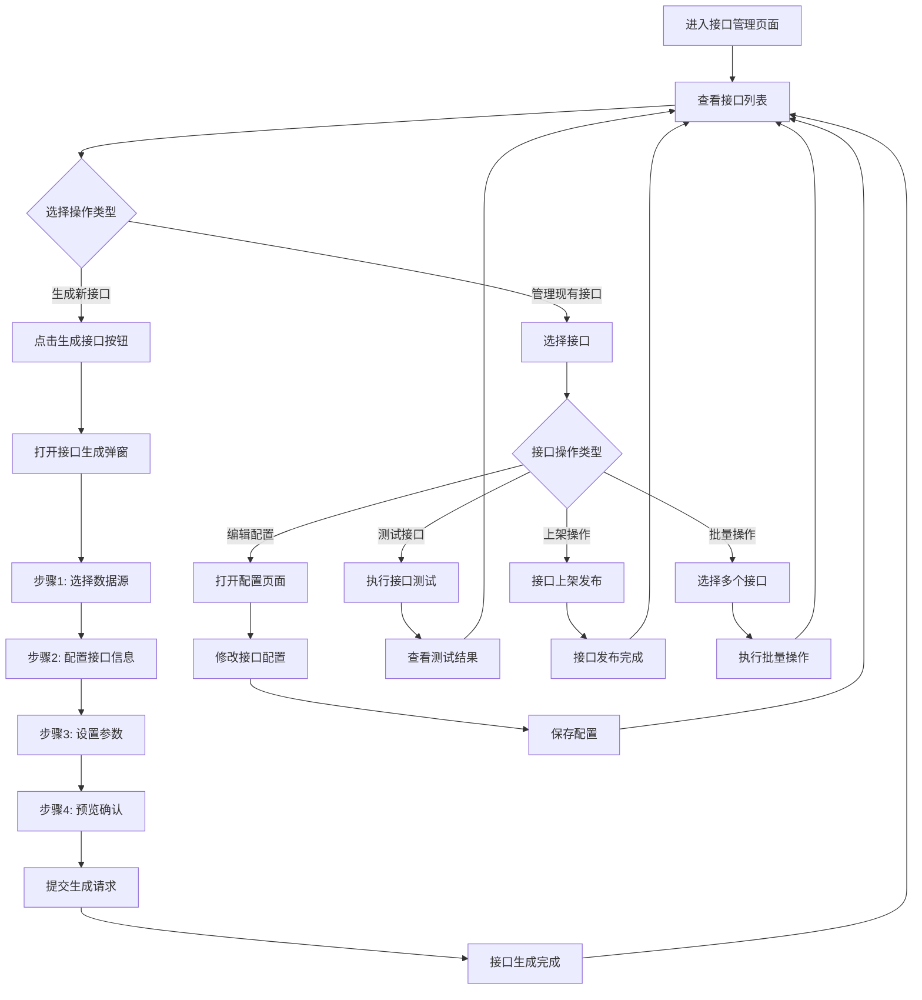

# 电力交易中心接口服务平台产品需求文档 v1.0

## 版本信息

| 版本号 | 发布日期   | 更新内容                       | 维护人员 |
| ------ | ---------- | ------------------------------ | -------- |
| v1.0   | 2024-01-15 | 初始版本，包含核心接口管理功能 | 产品团队 |

## 版本规划说明

**当前版本（v1.0）功能范围：**

* ✅ 接口目录浏览与订阅

* ✅ 接口生成与管理

* ✅ 订阅申请审批

* ✅ 用户中心管理

**后续版本规划：**

* 📋 v2.0：接口监控功能（调用统计、性能监控、热度分析）、日志审计功能（操作日志、API调用日志、系统审计）

* 🚫 计费管理功能：暂不纳入开发计划

***

## 1. 产品概览

电力交易中心接口服务平台是一个专业的数据接口管理和服务平台，为电力交易参与者提供标准化的数据接口服务。平台整合电力交易核心数据（检修计划、机组状态、系统负荷等），通过RESTful API对外提供统一的数据服务。

* 解决电力交易数据分散、接口标准不统一的问题，构建一站式数据服务入口

* 目标是建立电力行业标准化的数据接口生态，提升数据流通效率和交易透明度

## 2. 核心功能

### 2.1 用户角色

| 角色               | 注册方式       | 核心权限                                 |
| ------------------ | -------------- | ---------------------------------------- |
| 数据消费者         | 企业认证注册   | 浏览接口目录、订阅接口、调用已授权接口   |
| 接口管理员(技术部) | 内部分配账号   | 接口生成、配置、测试、提交上架申请       |
| 接口管理员(结算部) | 内部分配账号   | 接口上架下架、订阅审批                   |
| 系统管理员         | 超级管理员分配 | 拥有平台所有权限，包括用户管理、系统配置 |

### 2.2 功能模块

平台核心功能包含以下主要页面：

1. **接口目录页面**：分类展示、接口搜索、批量订阅
2. **接口管理页面**：接口生成、配置、上架下架管理
3. **接口审批页面**：订阅申请审批、审批流程管理
4. **用户中心页面**：个人信息、API密钥、订阅管理

### 2.3 接口分类标签体系

平台采用四大业务板块进行接口分类管理：

| 分类标签 | 分类代码           | 描述                                 | 颜色标识 |
| -------- | ------------------ | ------------------------------------ | -------- |
| 日前现货 | day\_ahead\_spot   | 日前现货市场相关数据接口             | #1890ff  |
| 预测     | forecast           | 负荷预测、新能源预测等预测类数据接口 | #52c41a  |
| 辅助服务 | ancillary\_service | 调频、调压、备用等辅助服务数据接口   | #faad14  |
| 电网运行 | grid\_operation    | 电网运行状态、约束情况等运行数据接口 | #f5222d  |

### 2.4 模块关系图


### 2.5 页面详情

| 页面名称     | 模块名称         | 功能描述                                                     |
| ------------ | ---------------- | ------------------------------------------------------------ |
| 接口目录页面 | 分类树管理       | 左侧树形结构展示业务领域分类，支持展开折叠和搜索             |
| 接口目录页面 | 接口列表         | 右侧展示接口详细信息，包括名称、描述、参数说明               |
| 接口目录页面 | 批量订阅         | 支持接口多选、购物车功能、一键批量订阅                       |
| 接口管理页面 | 顶部操作区       | 接口生成按钮（技术部）、接口上架按钮（结算部）、接口下架按钮（结算部） |
| 接口管理页面 | 接口生成弹窗     | 步骤式向导弹窗，包含数据源选择、接口配置、参数设置、预览确认四个步骤 |
| 接口管理页面 | 接口配置         | 配置接口基本信息、请求参数、响应格式等                       |
| 接口管理页面 | 接口列表展示     | 显示接口ID、名称、状态、创建时间等信息，支持多选和批量操作   |
| 接口管理页面 | 接口生命周期管理 | 管理接口状态流转：草稿→已开发→未上架→已上架→已下架           |
| 接口审批页面 | 申请管理         | 展示订阅申请列表，支持批量审批和单个处理                     |
| 接口审批页面 | 审批流程         | 展示审批状态流程，支持审批意见和历史记录                     |
| 用户中心页面 | 个人信息管理     | 编辑基本信息（姓名、邮箱、手机、部门、职位）、密码修改       |
| 用户中心页面 | API密钥管理      | 统一密钥展示、一键复制、权限查看、使用统计、安全操作（刷新/禁用） |
| 用户中心页面 | 订阅管理         | 已订阅接口列表、订阅状态管理、申请历史                       |
| 用户中心页面 | 使用统计         | 调用次数统计、趋势图表、热门接口排行                         |

## 3. 核心流程

### 3.1 数据消费者使用流程

用户登录 → 浏览接口目录 → 查看接口详情 → 提交订阅申请 → 等待审批通过 → 获得统一API密钥 → 调用所有已订阅接口获取数据


### 3.2 接口管理员(技术部)工作流程

选择数据源 → 生成接口 → 配置接口参数 → 测试接口功能 → 接口自动进入未上架列表


### 3.3 接口管理员(结算部)工作流程

审批用户订阅申请 → 评估未上架接口业务需求 → 执行接口上架操作 → 处理接口维护


### 3.4 接口全生命周期流程


## 4. 页面功能详细设计

### 4.1 接口目录页面

#### 4.1.1 页面布局

* **左侧分类树**：展示业务领域分类（电力交易、系统运行、市场信息等）

* **右侧接口列表**：展示当前分类下的接口信息

* **顶部搜索栏**：支持接口名称、描述关键词搜索

* **底部分页器**：支持分页浏览

#### 4.1.2 用户操作流程图


#### 4.1.3 核心功能

**分类浏览功能**：

* 树形结构展示业务分类

* 支持分类展开/折叠

* 点击分类自动筛选接口

**接口搜索功能**：

* 实时搜索接口名称和描述

* 支持模糊匹配

* 搜索结果高亮显示

**批量订阅功能**：

* 接口多选功能：支持在浏览过程中选择多个感兴趣的接口

* 购物车式管理：点击订阅按钮直接加入购物车，无需填写申请信息

* 一键批量提交订阅申请：在购物车中统一管理所有选中的接口，支持批量提交订阅

### 4.2 接口管理页面

#### 4.2.1 页面布局

* **顶部操作区**：生成接口、批量上架、批量下架按钮

* **筛选区域**：状态筛选、分类筛选、关键词搜索

* **接口列表**：表格形式展示接口信息，支持多选

* **分页区域**：分页导航和每页条数设置

**接口状态说明**：

* 技术部生成接口后，接口自动进入"未上架接口列表"

* 结算部需根据实际业务需求评估接口，决定是否进行上架操作

* 结算部点击"接口上架"后，该接口正式发布至接口目录，供用户查看和使用

#### 4.2.2 接口管理流程图



### 4.3 接口开发完成到上架的具体流程

#### 4.3.1 技术部接口开发完成流程

* 技术部完成接口开发和测试后，接口状态自动从"已开发"变更为"未上架"

* 系统自动将接口添加到"待上架接口列表"

* 系统向结算部发送待上架接口通知

#### 4.3.2 结算部在接口管理中的操作权限

* **查看权限**：查看所有接口的详细信息（接口名称、描述、参数、创建人、创建时间）

* **配置管理权限**：自主勾选和配置可用于上架操作的接口

* **上架权限**：直接执行接口上架操作，无需额外审批

* **批量操作权限**：支持批量上架操作

#### 4.3.3 结算部操作步骤

1. 登录系统，进入接口管理页面
2. 在接口列表中直接选择需要上架的接口
3. 点击"上架"按钮或"批量上架"按钮，系统立即执行上架操作

### 4.4 批量上架/下架操作的事务处理和回滚机制

#### 4.4.1 批量操作事务处理流程

* **预检查阶段**：

  * 验证所有选中接口的状态是否符合操作条件

  * 检查用户权限是否足够

  * 验证接口依赖关系和冲突

  * 预估操作时间和资源消耗

* **执行阶段**：

  * 创建批量操作任务记录

  * 按顺序逐个处理接口，每个接口作为独立事务

  * 实时更新操作进度和状态

  * 记录每个接口的操作结果（成功/失败/跳过）

* **结果处理阶段**：

  * 统计操作结果：成功数量、失败数量、跳过数量

  * 生成操作报告

  * 发送操作结果通知

#### 4.4.2 失败回滚机制

* **部分失败策略**：继续处理剩余接口，不回滚已成功的操作

* **失败重试机制**：

  * 自动重试：网络超时、临时性错误自动重试3次

  * 手动重试：用户可以对失败的接口进行手动重试

  * 跳过失败：用户可以选择跳过失败的接口，继续处理其他接口

* **持续操作直到上架**：

  * 提供"重试失败项"功能，用户可以重新执行失败的接口操作

  * 支持"增量上架"，只处理尚未成功上架的接口

  * 操作历史记录，用户可以查看每次批量操作的详细结果

#### 4.4.3 事务日志记录

* 记录批量操作的完整过程

* 包含操作人、操作时间、操作接口列表、执行结果

* 支持操作审计和问题追溯

### 4.5 接口配置管理

#### 4.5.1 接口配置管理界面

结算部具备完整的接口配置管理权限：

**配置管理功能**：

* 查看所有接口的详细配置信息

* 自主勾选可用于上架操作的接口

* 直接管理接口的上架状态

**操作特点**：

* 所有上架操作无需额外审批或确认步骤

* 支持单个接口和批量接口的快速上架

* 提供简洁直观的接口列表管理界面

#### 4.2.3 接口生成弹窗详细设计

**步骤1：数据源选择（增强表类型识别）**

* 展示可用数据源列表

* 支持数据源搜索和筛选

* 显示数据源连接状态

* **自动识别表类型**：

  * 24小时时间点表（value1-value24字段）

  * 288个5分钟时间点表（P1-P288字段）

  * 设备信息表（devname、devType等字段）

* **推荐接口模板**：根据表类型自动推荐合适的接口模板

**步骤2：接口配置（业务分类选择）**

* 接口名称和描述设置

* **业务分类选择**：四大业务板块标签选择

* **接口路径配置**：统一前缀格式 `/px-phzhb-external-share/dataproduct/`

* **请求方法**：统一使用POST方法

* **内容类型**：统一使用application/json

**步骤3：参数设置（预设模板）**

* **标准参数模板**：

  * dataTime（必需）：查询日期，格式YYYY-MM-DD

  * appId（必需）：应用ID，用户身份标识

* **业务参数模板**：

  * caseType（可选）：案例类型（220-日前，200-实时）

  * extType（可选）：发布类型（1-预发布，2-终发布，3-出清结果）

* **响应格式配置**：统一标准格式{status, message, data}

**步骤4：预览确认**

* 接口配置信息预览

* 生成的API文档预览（符合现有接口风格）

* SQL模板预览和安全性检查

* 确认生成按钮

#### 4.2.4 统一接口配置规范

**接口路径规范**：

* 统一前缀：`/px-phzhb-external-share/dataproduct/`

* 命名规则：动词+业务对象，如`queryKeySectionConstraints`

* 路径示例：`/px-phzhb-external-share/dataproduct/queryMustOpenOffNameAndCapacity`

**请求规范**：

* 请求方法：统一使用POST

* 内容类型：application/json

* 参数位置：请求体（body）

**响应格式规范**：

```json
{
  "status": "0",        // 0-成功，其他-失败
  "message": "Success",  // 响应消息
  "data": []             // 数据内容数组
}
```

**参数校验规范**：

* 日期格式：YYYY-MM-DD

* 必需参数：dataTime、appId

* 可选参数：caseType、extType

* 参数验证：格式校验、范围校验、权限校验

#### 4.2.5 接口状态管理

**状态流转规则**：

* 草稿 → 已开发（技术部完成开发）

* 已开发 → 未上架（接口生成完成，等待结算部评估）

* 未上架 → 已上架（结算部评估通过并上架）

* 已上架 → 已下架（结算部执行下架）

* 已下架 → 已上架（重新上架）

### 4.3 接口审批页面

#### 4.3.1 页面布局

* **顶部统计区**：待审批数量、今日处理数量等统计信息

* **筛选区域**：申请类型、状态、时间范围筛选

* **申请列表**：表格展示申请信息，支持批量操作

* **审批详情**：右侧抽屉展示申请详细信息

#### 4.3.2 审批流程图


#### 4.4.4 核心功能

**个人信息管理**：

* 基本信息编辑（姓名、邮箱、手机、部门、职位）

* 企业信息管理（企业名称、统一社会信用代码）

* 密码修改和安全设置

**appId管理**：

* appId展示和复制功能

* appId重新生成（安全操作）

* 使用统计和调用记录

* 权限范围查看

**订阅管理**：

* 已订阅接口列表展示

* 订阅状态管理（有效、过期、暂停）

* 申请历史记录查看

* 续订和取消订阅操作

**使用统计**：

* API调用次数统计

* 调用趋势图表展示

* 热门接口排行

* 错误率和响应时间统计

### 4.4 用户中心页面

#### 4.4.1 页面布局

* **左侧导航菜单**：个人信息、API密钥、订阅管理、使用统计、安全中心

* **右侧内容区域**：对应功能模块的详细内容

* **顶部面包屑**：当前位置导航

#### 4.4.2 用户ID集成方案

**appId管理机制**：

* **生成规则**：用户注册后自动生成唯一的appId（15-20位字符）

* **格式示例**：`KzoHypQZH4-F6qM63L`

* **用途说明**：作为API调用时的用户身份标识，替代传统的API Key

* **权限绑定**：appId与用户的接口订阅权限直接关联

**appId使用流程**：

1. 用户完成企业认证注册后，系统自动分配唯一appId
2. 用户在用户中心查看和管理自己的appId
3. 调用接口时，在请求参数中传入appId进行身份验证
4. 系统根据appId验证用户权限和接口访问权限

**安全机制**：

* appId与用户账号绑定，不可转让

* 支持appId重新生成（旧appId立即失效）

* 调用频率限制和异常监控

* 详细的API调用日志记录

#### 4.4.3 用户中心操作流程图


#### 4.4.3 用户中心功能

**个人信息管理**：

* 基本信息编辑（姓名、邮箱、手机、部门、职位）

* 密码修改功能

* 头像上传（v2.0版本）

**API密钥管理**：

* 统一密钥展示

* 一键复制功能

* 权限范围查看

* 使用统计信息

* 安全操作（刷新/禁用）

**订阅管理**：

* 已订阅接口列表

* 订阅状态管理

* 申请历史查看

* 续订申请处理

**使用统计**：

* 调用次数统计

* 趋势图表展示

* 热门接口排行

* 使用报告生成（v2.0版本）

**安全中心**：

* 登录日志记录

* 异常告警信息

* 登录设备管理

* 操作审计记录

## 5. 用户界面设计

### 5.1 设计风格

* **主色调**：深蓝色(#1890FF)为主色，浅灰色(#F5F5F5)为背景色

* **按钮样式**：圆角矩形按钮，主要按钮使用蓝色渐变效果

* **字体**：中文使用微软雅黑，英文使用Roboto，主要字号14px-16px

* **布局风格**：左右分栏布局，顶部导航栏，卡片式内容展示

* **图标风格**：使用Element UI图标库，简洁现代的线性图标

### 5.2 页面设计概览

| 页面名称     | 模块名称     | UI元素                                       |
| ------------ | ------------ | -------------------------------------------- |
| 接口目录页面 | 分类树管理   | 左侧树形组件，蓝色选中状态，灰色展开图标     |
| 接口目录页面 | 接口列表     | 卡片式布局，白色背景，蓝色标题，灰色描述文字 |
| 接口目录页面 | 批量订阅     | 橙色购物车图标，蓝色订阅按钮，数量徽章       |
| 接口管理页面 | 顶部操作区   | 蓝色主按钮，灰色次要按钮，16px字体           |
| 接口管理页面 | 接口生成弹窗 | 白色背景弹窗，步骤导航条，蓝色进度指示       |
| 接口管理页面 | 接口列表     | 表格布局，斑马纹背景，状态标签彩色显示       |
| 接口审批页面 | 申请管理     | 列表卡片，待审批橙色标签，已通过绿色标签     |
| 接口审批页面 | 审批详情     | 右侧抽屉组件，表单布局，操作按钮底部固定     |
| 日志审计页面 | 统计图表     | 蓝色折线图，柱状图，圆环图，响应式布局       |
| 日志审计页面 | 日志列表     | 表格组件，时间列蓝色显示，状态列彩色标签     |
| 用户中心页面 | 导航菜单     | 左侧垂直菜单，蓝色选中状态，图标+文字布局    |
| 用户中心页面 | 内容区域     | 白色卡片背景，表单组件，统计数字大号显示     |

### 5.3 响应式设计

平台采用桌面优先的响应式设计，支持1920px、1366px、1024px等主流分辨率，确保在不同设备上的良好显示效果。

## 6. 数据接口规范

### 6.1 RESTful API设计规范

**URL设计规范**：

* 使用名词复数形式：`/api/interfaces`、`/api/applications`

* 使用连字符分隔：`/api/interface-categories`

* 版本控制：`/api/v1/interfaces`

**HTTP方法规范**：

* GET：查询数据

* POST：创建数据

* PUT：更新数据

* DELETE：删除数据

**响应格式规范**：

```json
{
  "code": 200,
  "message": "success",
  "data": {},
  "timestamp": "2024-01-15T10:30:00Z"
}
```

### 6.2 数据格式标准

**时间格式**：ISO 8601标准（YYYY-MM-DDTHH:mm:ssZ）
**字符编码**：UTF-8
**数字格式**：JSON Number类型
**布尔值**：true/false

## 7. 安全与权限控制

### 7.1 权限控制矩阵

| 功能模块     | 数据消费者 | 技术部 | 结算部 | 系统管理员 |
| ------------ | ---------- | ------ | ------ | ---------- |
| 接口目录浏览 | ✅          | ✅      | ✅      | ✅          |
| 接口订阅申请 | ✅          | ❌      | ❌      | ✅          |
| 接口生成     | ❌          | ✅      | ❌      | ✅          |
| 接口配置     | ❌          | ✅      | ❌      | ✅          |
| 接口上架     | ❌          | ❌      | ✅      | ✅          |
| 接口下架     | ❌          | ❌      | ✅      | ✅          |
| 订阅审批     | ❌          | ❌      | ✅      | ✅          |
| 用户管理     | ❌          | ❌      | ❌      | ✅          |
| 系统配置     | ❌          | ❌      | ❌      | ✅          |

### 7.2 数据安全

**API密钥管理**：

* 统一密钥生成和管理

* 密钥定期轮换机制

* 密钥权限动态调整

**数据传输安全**：

* HTTPS加密传输

* API请求签名验证

* 请求频率限制

**访问控制**：

* 基于角色的权限控制（RBAC）

* 接口级别的访问控制

* 操作日志记录

## 8. 性能要求

### 8.1 响应时间要求

* 页面加载时间：< 3秒

* API响应时间：< 1秒

* 接口生成时间：< 30秒

* 大数据量查询：< 10秒

### 8.2 并发性能要求

* 支持1000个并发用户

* API调用峰值：10000次/分钟

* 系统可用性：99.9%

## 9. 验收标准

### 9.1 功能验收标准

**接口目录功能**：

* ✅ 分类树正确展示所有业务分类

* ✅ 接口搜索功能正常工作

* ✅ 批量订阅功能完整可用

* ✅ 接口详情页面信息完整

**接口管理功能**：

* ✅ 接口生成弹窗四步骤流程完整

* ✅ 接口状态流转规则正确执行

* ✅ 权限控制按角色正确限制

* ✅ 批量操作功能正常工作

**接口审批功能**：

* ✅ 申请列表正确展示待审批项目

* ✅ 审批流程完整，状态更新及时

* ✅ 批量审批功能正常工作

* ✅ 审批通知正确发送

**用户中心功能**：

* ✅ 个人信息管理功能完整

* ✅ API密钥管理功能正常

* ✅ 订阅管理功能完整

* ✅ 使用统计数据准确

### 9.2 性能验收标准

* ✅ 页面加载时间符合要求（< 3秒）

* ✅ API响应时间符合要求（< 1秒）

* ✅ 并发用户数达到要求（1000用户）

* ✅ 系统稳定性达到要求（99.9%可用性）

### 9.3 安全验收标准

* ✅ 权限控制矩阵正确实施

* ✅ API密钥安全管理

* ✅ 数据传输加密

* ✅ 操作审计完整

***

## 文档维护信息

**文档版本**：v1.0\
**最后更新**：2024-01-15\
**维护人员**：产品团队\
**审核状态**：待审核

**变更记录**：

* v1.0：初始版本发布，包含核心功能模块设计

* 移除功能：接口监控模块（计划v2.0实现）、日志审计功能（计划v2.0实现）、计费管理功能（暂不实现）

* 新增内容：每个页面详细流程图、版本规划说明